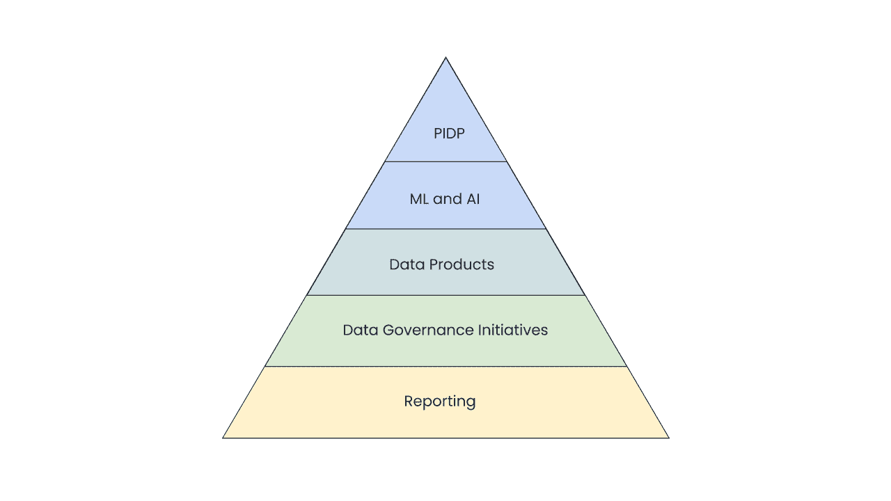
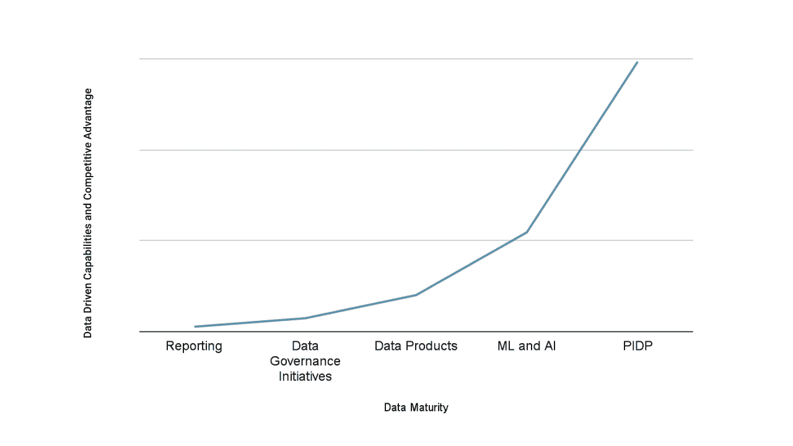
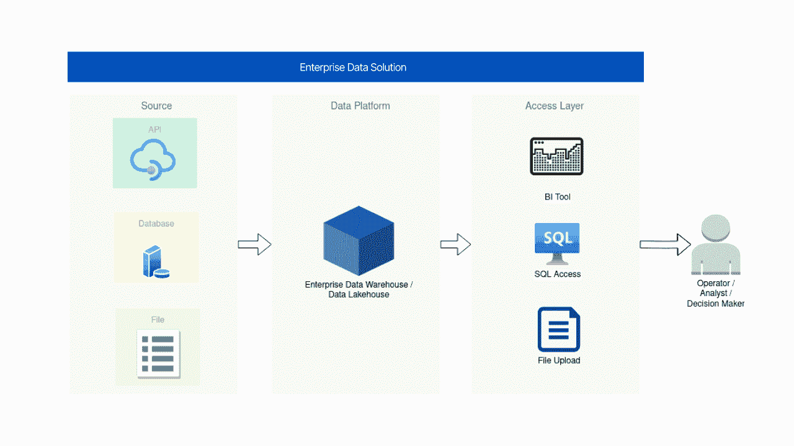
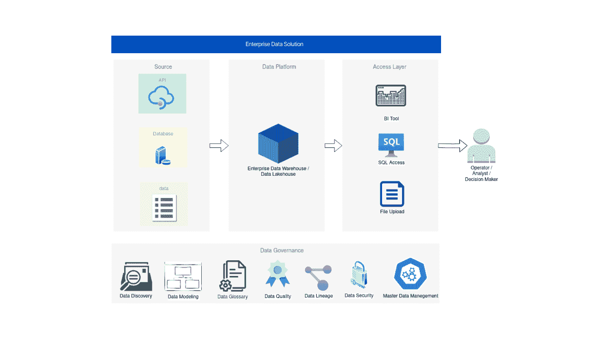
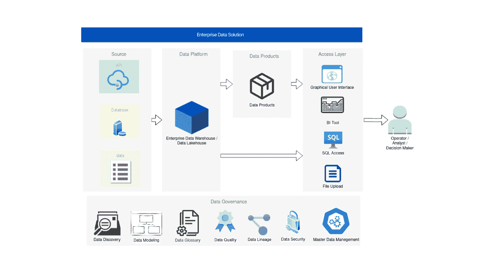
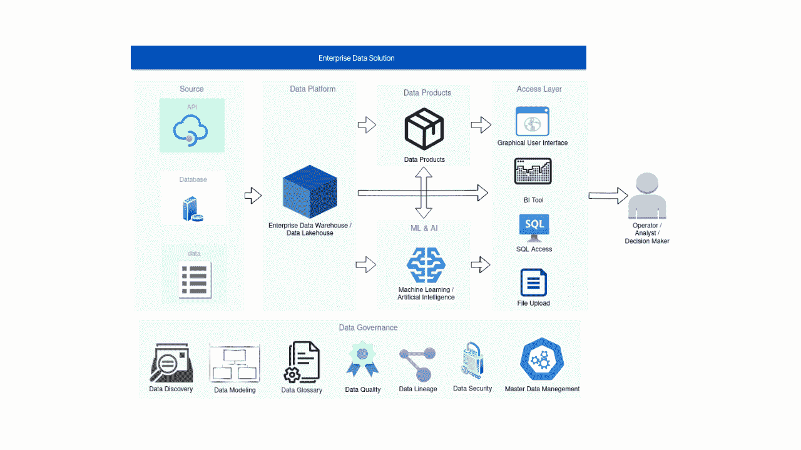

# 数据成熟度金字塔：从报告到主动智能数据平台

> 译文：[`www.kdnuggets.com/the-data-maturity-pyramid-from-reporting-to-a-proactive-intelligent-data-platform`](https://www.kdnuggets.com/the-data-maturity-pyramid-from-reporting-to-a-proactive-intelligent-data-platform)

如今，组织比以往任何时候都更加依赖数据来做出明智的决策并获得竞争优势。成为数据驱动型组织的过程包括逐步提升数据能力，利用人工智能和机器学习技术，并采用健全的数据治理实践。

本文详细探讨了这些步骤——从报告和数据治理，到作为人工智能/机器学习基础的数据产品以及主动智能数据平台（PIDP）。我们还深入了解了数据工程师在这一过程中的角色。

* * *

## 我们的前三大课程推荐

 1\. [谷歌网络安全证书](https://www.kdnuggets.com/google-cybersecurity) - 快速进入网络安全职业道路。

 2\. [谷歌数据分析专业证书](https://www.kdnuggets.com/google-data-analytics) - 提升您的数据分析能力

 3\. [谷歌 IT 支持专业证书](https://www.kdnuggets.com/google-itsupport) - 支持您组织的 IT

* * *

# 企业环境中的数据成熟度

在企业环境中，可以区分多个数据成熟度层级，表示公司在利用数据资产方面的不同进展程度。在这种背景下，数据成熟度模型的概念自然地以一个由不同层级组成的分层金字塔形式出现。此外，朝着更高数据成熟度的过程是一个不断改进的周期，不仅旨在达到越来越高级别，还要完善和优化已达到的能力。

金字塔让我们可以同时展示两个特征：

1.  每个后续层级都位于前一个层级之上；

1.  下一个层级的扩展不可避免地导致下层级的扩展。

这意味着随着数据产品在组织中的演变，数据管理中的方法和技术也会得到改善。数据的信任度、可发现性、安全性、一致性和其他特征可能会逐步提升，从而在每个层级上实现改进。

让我们描述一个公司在采用和实施人工智能和机器学习的过程中。

我们有一家电信公司：

+   对来自各种来源的企业数据有深入理解；

+   维护可靠且一致的企业级报告；

+   使用依赖于实时数据的营销活动管理系统。

公司决定实施一个先进的 AI/ML 驱动系统，以为客户提供最佳的下一个计划。这一举措解锁了数据利用的新层级，同时也改进了金字塔的所有前置层级：它带来了用于报告的新数据，引入了有关数据安全和合规性的全新挑战，并提供了有关营销的宝贵洞察。

请考虑任何数据计划不一定需要从底部开始——一旦你的组织在某一层级上变得足够熟练，你就可以进入下一层级。然而，金字塔中的一些层级可能处于完全不同的数据转型阶段。例如，你的组织可能决定从 AI 领域开始数据转型，因为从商业角度看这似乎是最大的机会。

假设你的组织希望利用 AI 和 ML 快速找到最便宜的机票，同时考虑到火车和巴士转乘以及其他旅行细节。解决这个问题需要一个相当具体且有限的数据集。然而，组织中的报告或数据管理水平可能还未发展到能够支持这个功能。此时，你并不是在处理数据金字塔，因为前两层不能作为 AI/ML 的基础——你的 AI/ML 层是漂浮的。建立“漂浮”的分析系统极其困难，但作为加速市场时间并迅速测试特定 AI 用例的手段是可能的。基础金字塔层的高级开发可能会被延迟，但系统最终会达到其最终且可持续的金字塔形态。

# 数据驱动能力与竞争优势

讨论提高数据成熟度的好处时，重要的是要注意到，你提高数据成熟度的程度越高，获得的回报也会越大。简单来说，你当前的数据成熟度水平越高，即使是下一步的小改进也会带来更多的价值。这种收益的快速增长类似于所描述的“[指数函数](https://en.m.wikipedia.org/wiki/Exponential_function)”，其增长率与当前测量的状态相关。

在分析系统中，这种关系很容易察觉。每个后续层级可以并且应该建立在前一个层级之上，同时解锁完全新的好处和功能，这些在早期阶段是无法获得的。

*图 2*。数据驱动能力与数据成熟度各级别间的竞争优势相关性

为了演示这个过程，我们假设你的组织开发了一个新的数据产品——一个用于电子商务平台的客户推荐引擎。该引擎处理历史客户行为数据，为用户提供个性化的产品推荐。最初，系统是基于规则的，依赖于预定义的启发式方法来进行推荐。

在过渡到 AI/ML 级别时，团队决定实施一个机器学习模型。例如，一个协同过滤模型，或一个基于深度学习的推荐系统。该模型可以分析大量数据，识别数据中的复杂模式，并为每个用户提供准确且个性化的产品推荐。

随着推荐系统的部署，它继续从用户互动中收集更多数据。用户与平台的互动越多，系统积累的数据也就越多。这种数据增长使得机器学习模型可以不断学习和完善其推荐，从而使推荐引擎的准确性和效果不断提高。

**注意：** 这些过渡中的每一个将在后面更详细地讨论。在这一阶段，请记住，每次过渡到新的成熟度水平都会带来系统复杂性的整体增长。这种增长意味着使用新工具、获得新团队技能、在系统和团队之间建立额外的连接（同时避免孤岛效应），最重要的是，获得竞争优势。你的组织在每个级别上获得更多的好处，而你的竞争对手则落后。

复杂系统的开发难度本质上高于简单系统。此外，并不是所有公司都有资源来管理从构思到实施，再到大规模采纳和支持的整个开发过程。

想象一个供应链管理公司，它实施了几个机器学习模型来预测需求、优化库存和识别物流中的低效。拥有这样一个利用先进分析和预测洞察的数据和 AI/ML 驱动的解决方案是一个巨大的竞争优势。

现在，我们假设公司希望向具有生成性 AI 能力的主动智能数据平台（PIDP）迈进一步。这样的系统将从识别数据中的风险和机会，演变为根据这些数据主动生成可操作的计划，利用[大型语言模型（LLMs）](https://provectus.com/blog/comparison-large-language-models-biomedical-domain/)。现在，系统不仅仅是通知利益相关者潜在问题或提供洞察，而是为他们提供智能、精心制定的行动计划。生成性 AI 可以用来启动流程、调用内部或第三方 API，甚至自主执行生成的计划。

在我们的供应链管理系统的情况下，这种转变不仅可以使其预测潜在的库存短缺，还可以主动与供应商互动、下订单并协调物流，所有这些都能实时完成，无需人工干预。这样的系统可以评估结果，从中学习，并优化其下一步行动。人类反馈仍然至关重要，确保与战略目标对齐，并确保持续改进。

将生成式 AI 纳入主动智能数据平台不仅仅是技术上的飞跃——它是战略性的转型。在供应链领域，这可能意味着缩短交货时间、减少缺货情况和最大化资产利用率，这些都转化为实际的商业价值。

当竞争对手在处理规则驱动系统或传统机器学习算法时，一家在 PIDP 水平运营的公司正以其灵活性和前瞻性应对现代供应链的复杂性，这使其与众不同。

让我们更详细地探讨数据金字塔的每个层级，以了解其在从报告到 PIDP 的旅程中的角色。

# 第 1 层 - 报告

报告是数据工程师的重要领域。它涉及设计和构建可以作为分析和其他数据驱动子系统和解决方案基础的数据平台。数据工程师负责建立强大的数据管道和基础设施，这些管道和基础设施可以高效、安全地收集、存储和处理数据。这些基础数据平台使数据工程师能够确保企业的数据易于访问、组织良好，并为进一步的分析和报告做好准备。

为了增加一些历史背景，考虑到仅仅五年前，使用实时工具表明数据平台更成熟，相比于批处理平台。今天，除了一些例外，界限变得更加模糊。批处理和流处理的复杂性差别不大；唯一的例外是数据血缘、安全性和发现——通常在我们所说的数据治理中。在这些领域，由于实时处理发生了许多变化，并期望在不久的将来有更多改进。

尽管如此，从几乎所有来源实现接近实时的数据集成是可能的，事件网关是保持数据一致性吸收的合适选择。对于在组织中数据量显著大于其他数据源的少数数据源，可能更倾向于批量处理。例如，对于一家中型在线公司，Google Analytics 的原始数据可能占到所有处理数据的一半。是否值得以与事务系统数据相同的速度处理这些数据，可能会带来高昂的成本，这是值得讨论的。然而，随着技术的进步，批处理和实时处理之间的选择需求可能会减少。

与批处理相比，实时数据产品在数据治理能力和实时数据处理的维护开销方面仍存在显著差距。因此，建议仅在有限的使用场景中依赖实时数据处理，例如广告竞价或欺诈检测，其中数据的新鲜度比[数据质量](https://provectus.com/data-quality-assurance/)更为重要。

一些产品比起速度，更从较高水平的透明度和质量中获益。它们可以依靠微批次的数据处理，或采用传统的批处理模式（例如财务报告）。欲了解更多信息，请阅读[Dan Taylor 在 LinkedIn 上的文章](https://www.linkedin.com/posts/danwtaylor_data-platform-strategy-activity-7005887490276392960-CfcJ/)。

# 第二级 - 数据治理倡议

数据治理是一个广泛的术语，定义各异。但如果我们尝试大致描述数据治理倡议，我们最终会涉及其组件、特性和实践，例如：数据发现、数据建模、数据词汇表、数据质量、数据溯源、数据安全以及[主数据管理（MDM）](https://www.gartner.com/en/information-technology/glossary/master-data-management-mdm)。

过渡到有意识和系统的数据治理实践可以带来惊人的数据素养、速度、可靠性和安全性提升。这些只是从简单报告转向企业数据管理系统时实现的好处的一部分。

对数据民主化的需求不可避免地增加了对更高效数据访问管理的要求。在公司层面统一度量标准导致了需要创建词汇表、统一报告、管理数据碎片和重复等，这些都帮助节省了在特定用例中处理和使用数据的时间。这些数据解决方案和产品推动了数据发现的需求，以及更详细的目录和数据使用。

在数据治理层面，数据工程师通常与软件开发团队紧密合作，以构建和维护像参考数据管理工具这样的系统。数据可观测性工具如[OpenLineage](https://openlineage.io/)也是如此。理想情况下，它应成为所有类型的数据治理计划的统一平台，例如，[开放数据发现平台](https://opendatadiscovery.org/)旨在成为的那样。

# Level 3 - 数据产品

基本数据产品不涉及任何 AI/ML 技术和用例。它们通常也不需要高级分析。因为广泛的问题和任务可以仅通过使用存储在企业数据平台中的合并数据来解决。这些包括：

+   几乎所有对历史数据的操作；

+   交易系统通过移除数据负载来支持这一点；

+   在大量数据上进行高速度、大规模的计算。

举一些更具体的例子，这些是用于销售与市场系统、A/B 测试、计费系统等的系统和工具。

在数据产品阶段，软件和应用开发团队也发挥着重要作用。在考虑业务目标的同时，与他们沟通数据产品的技术方面是成功利用数据进行任何用例的关键。

请注意，API 或端到端解决方案的开发应始终作为企业开发的一部分。跨职能开发团队可以带来最大的利益，并且在数据相关的方面，讨论[Data Mesh](https://www.datamesh-architecture.com/)的概念是有意义的。

Data Mesh 革新了组织管理数据的方式。Data Mesh 鼓励组织将数据视为一种产品，而不是将其看作一个整体实体。通过这种方式，它分散了数据所有权，并帮助团队开发和维护自己的数据产品，从而减少了瓶颈和对集中数据团队的依赖。

# Level 4 - AI 和 ML 解决方案

AI 是新电力。但我们仍处于过渡时期：AI 的潜力是显而易见的，但并不是所有公司都已*足够*彻底地改革其商业模式，以便全方位、大规模地利用 AI。

正如[斯蒂芬·布罗布斯特的演讲](https://www.linkedin.com/posts/teradata_the-disruptive-economics-of-ai-activity-7082674552555659265-Ud8S?utm_source=share&utm_medium=member_desktop)中所完美描述的那样，AI 的主要价值将在 AI 无处不在时实现。到目前为止，最终受益者并没有关注到普遍性因素，常常试图解决无法带入现实世界的用例。

从数据工程的角度来看，AI 由数据驱动。这就是为什么我们应该始终记住 [特征存储和 ML 模型运营化](https://www.linkedin.com/posts/pau-labarta-bajo-4432074b_machinelearning-mlops-realworldml-activity-7100041296811089921-4UM8?utm_source=share&utm_medium=member_desktop) —— 这些组件有助于持续不断地将数据转化为生产中的 AI/ML 解决方案。更详细地说，这些组件及相关角色在 Databricks 的 [《MLOps 大全》](https://www.databricks.com/resources/ebook/the-big-book-of-mlops) 中进行了描述。这本全面的指南详细阐述了五个关键角色——数据工程师、数据科学家、ML 工程师、业务利益相关者、数据治理官——及其在七个关键流程中的相互作用——数据准备、探索性数据分析（EDA）、特征工程、模型训练、模型验证、部署和监控。

还值得记住的是，AI 的全部潜力只有在其模块与公司的整体基础设施、流程甚至文化相整合时才能真正实现。当各种系统和个人无缝地协作成为一个统一的整体时，这时向主动智能数据平台的过渡才开始在整个组织中变得有意义。

# 第五级 - 主动智能数据平台（PIDP）

主动智能数据平台（PIDP）是数据成熟度金字塔的顶层。其核心涉及将 AI/ML 技术和高级分析无缝集成到业务常规（BAU）流程中，遍及整个组织。

让我们在最近出现的 AI 细分领域之一——生成式 AI 的背景下，仔细看看 PIDP。具体来说，我们将探讨三个领域——数字双胞胎、控制塔和指挥中心——其中 [生成式 AI 的变革潜力](https://provectus.com/the-cxo-guide-to-generative-ai-threats-and-opportunities/) 最为明显。

考虑到大型工厂开发其设施的数字双胞胎以提高运营效率。在这样的先进设置中，尽管操作员拥有所有必需的控制，但面临着持续决策的巨大挑战。引入一个可以通过自然语言与数字双胞胎进行沟通的生成式 AI 代理，可以简化和自动化例行任务、风险评估、机会分析，并帮助做出明智的决策。

类似地，在电信行业，[控制塔](https://www.ibm.com/topics/control-towers)适应了全球运营商在优化、及时问题检测和事故预防方面的投资趋势。这些中心接收来自不同权威层级的大量数据。人工操作员承担着高技能和信息充足的责任，以便有效管理任务。将生成式人工智能纳入其中，可以减轻他们操作中的常规和复杂方面。

现在，考虑指挥中心，尤其是在供应链领域。这里的运营决策通常需要多部门协作，例如供应链部门、财务和法律部门等。这些团队具有不同的专业知识和部分见解，应当共同决定其行动。在这种背景下，生成式人工智能作为统一企业管理平台的一部分的效用变得显而易见。这些生成式 AI 模型可以识别风险和机会，评估其全企业范围的影响，分析潜在解决方案等等。

数据在这些领域中扮演着关键角色。它是缠绕整个组织的皇冠，使其像钟表一样顺利运作。

PIDP 是一个强大的工具，使组织能够主动应对挑战，做出数据驱动的决策，并保持竞争优势。

在这个阶段，数据工程师的角色是最重要的，同时也可能不那么显眼。由于公司已经从数据驱动的产品中获得主要好处，将人工智能无缝地集成到决策过程中，从简单的分析仪表板到公司各部门之间的协调互动，是关键。组织从依赖数据的原始实用应用演变为能够在非专业、非技术环境中顺利推动商业价值的易用应用。

然而，重要的是要理解，在这个阶段，几乎每个节点中的链接都是数据，它的管理和处理。这当然是数据工程师工作的主要优点。

# 结论

实现主动智能数据平台的旅程具有挑战性，但对于寻求在数据和人工智能驱动的世界中蓬勃发展的现代组织来说至关重要。通过逐步提升数据成熟度水平、拥抱数据驱动的能力、建立强大的数据治理举措以及利用人工智能和机器学习的潜力，组织可以解锁一系列关键的竞争优势，保持领先地位。

主动智能数据平台代表了这一旅程的顶点，也是数据成熟度金字塔的最终层级。它可以赋能组织在快速变化的商业环境中引领、创新和成功。

**[拉曼·达马耶乌](https://www.linkedin.com/in/ramandamayeu/?locale=en_US)** 擅长传统数据仓库和最新的云解决方案。作为数据治理的热情倡导者，拉曼对类似于开放数据发现的平台情有独钟。在 Provectus，他不断推动数据驱动的项目向前发展，帮助行业迈向数据处理的下一个水平。

### 了解更多相关主题

+   [数据成熟度：AI 驱动创新的基石](https://www.kdnuggets.com/data-maturity-the-cornerstone-of-ai-enabled-innovation)

+   [让智能文档处理更智能：第一部分](https://www.kdnuggets.com/2023/02/making-intelligent-document-processing-smarter-part-1.html)

+   [人工智能伦理：导航智能机器的未来](https://www.kdnuggets.com/2023/04/ethics-ai-navigating-future-intelligent-machines.html)

+   [KDnuggets 新闻，5 月 18 日：5 个免费机器学习托管平台](https://www.kdnuggets.com/2022/n20.html)

+   [数据共享平台的 5 个关键组件](https://www.kdnuggets.com/2022/05/5-key-components-data-sharing-platform.html)

+   [Qdrant：具有托管云平台的开源向量搜索引擎](https://www.kdnuggets.com/2023/02/qdrant-open-source-vector-search-engine-managed-cloud-platform.html)
