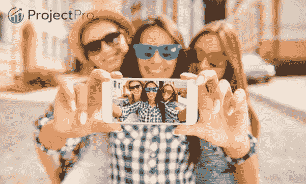
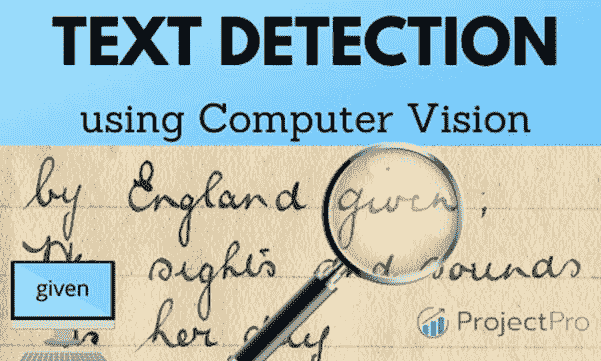
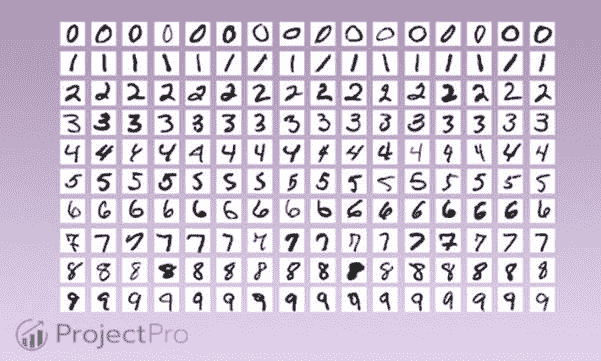
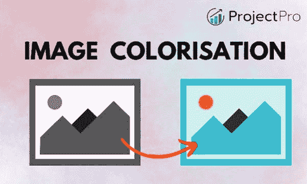
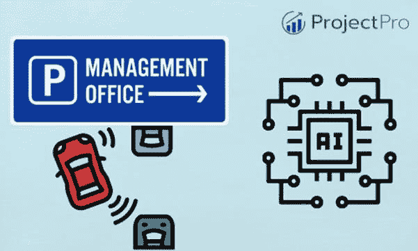
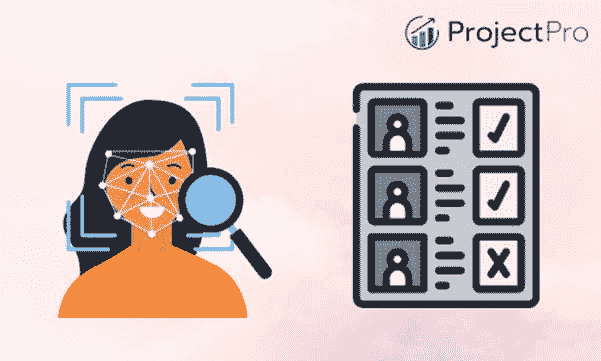

# 10 个计算机视觉 AI 项目创意

> 原文：[`www.kdnuggets.com/2021/11/10-ai-project-ideas-computer-vision.html`](https://www.kdnuggets.com/2021/11/10-ai-project-ideas-computer-vision.html)

评论

**作者：[Manika Nagpal](https://www.projectpro.io/projects)，ProjectPro 技术内容分析师**。

> * * *
> 
> ## 我们的前三名课程推荐
> ## 
>  1\. [Google 网络安全证书](https://www.kdnuggets.com/google-cybersecurity) - 快速进入网络安全职业生涯。
> 
>  2\. [Google 数据分析专业证书](https://www.kdnuggets.com/google-data-analytics) - 提升你的数据分析技能
> 
>  3\. [Google IT 支持专业证书](https://www.kdnuggets.com/google-itsupport) - 支持你所在组织的 IT 工作
> 
> * * *
> 
> *“人工智能是让机器做那些人类做起来需要智慧的事情的科学。” -- 马文·明斯基，麻省理工学院人工智能实验室的共同创始人。*

上面的引用很好地总结了人工智能（AI）的美妙之处。使用 AI 自动化简单任务，使人类能够投入解决更具挑战性的问题。这就是为什么尽管技术仍处于起步阶段，我们都看到 AI 获得了广泛关注。通过查看 Gartner 最近的调查可以很容易地确认这一点，该调查显示 [到 2024 年底，75% 的组织将从试点阶段转向 AI 的实际应用。](https://www.gartner.com/en/newsroom/press-releases/2020-06-22-gartner-identifies-top-10-data-and-analytics-technolo)

人工智能技术，如机器学习、深度学习、自然语言处理等，允许用户从数据中得出有见地的结论，这些结论是以往无法揭示的。它们还使个人能够对特定参数做出预测，从而为未来做好准备。而且，请不要把数据集仅仅看作是一组数字。过去那样的日子已经一去不复返。随着 AI 技术的进步，从图像和文本中提取信息已经变得可能。

处理利用数据图像和视频潜力的 AI 分支称为计算机视觉。计算机视觉（CV）有许多令人兴奋的应用，在这篇博客中，我们将列出 [CV 爱好者可以从事的 AI 项目创意](https://bit.ly/3ChPXgS)。这些项目创意已根据经验水平分为不同类别，方便你根据行业经验进行浏览。

+   适合初学者的计算机视觉 AI 项目

+   适合中级专业人士的计算机视觉 AI 项目

+   挑战性的计算机视觉 AI 项目，适合专家

## 适合初学者的计算机视觉 AI 项目

### 1) 人脸识别应用

面部识别是一个有趣的计算机视觉应用，大多数初学者喜欢构建它。想象一下，一个能够查看你的照片并用你的名字识别你应用程序，听起来很酷，对吧？有了如此多的计算机视觉库，创建这样的应用程序并不像你想象的那么困难。

**解决方案方法：** 使用 Haar Cascade 分类器在 Python 中构建面部识别系统是相当简单的。这是一个经过预训练的模型，可以检测给定图像中是否存在面孔。你可以使用该模型在图像中定位面孔，然后使用 KNN 机器学习算法来估计它与另一张面孔的相似度。

**数据集：** 使用[耶鲁面部数据库](http://vision.ucsd.edu/content/yale-face-database)进行此项目，该数据库包含 15 个人的 165 张灰度图像。

**用例：** 面部识别被广泛用作安全功能，例如在手机锁屏上，以防止随机人员解锁。

### 2) 口罩检测

随着中国[再次关闭学校并取消航班以应对最近的冠状病毒病例激增](https://medicalxpress.com/news/2021-10-flights-cancelled-schools-china-virus.html)，全球公民感到担忧。我们现在都知道，保持至少 2 米的物理距离和佩戴口罩是控制病毒传播的两个主要步骤。然而，我们仍然看到很多人在公共场所没有佩戴口罩。解决这个问题的一种方法是使用计算机视觉（CV）构建一个能够检测未佩戴口罩人员的系统。

**解决方案方法：** 使用像 ImageNet 这样的 CNN 模型并训练它学习带口罩的面孔和不带口罩的面孔之间的区别。达到一定准确度后，下一步是检测给定图像中的面部特征。最后，应用该模型测试是否佩戴了口罩。

**数据集：** 你可以使用 Prajna Bhandary 提供的[COVID-19 图像数据集](https://github.com/prajnasb/observations)进行此项目，该数据集包含 690 张佩戴口罩的人员图像和 686 张未佩戴口罩的人员图像。

**用例：** 这个模型可以部署在公共场所，以确保未佩戴口罩的人被罚款。

### 3) 狗与猫分类项目

这个项目的目标是学习使用计算机视觉进行图像分类。这是一个有趣的计算机视觉项目创意，适合初学者，他们将训练一个[深度学习算法](https://bit.ly/3vL8wHv)来区分狗和猫的图像。

**解决方案方法：** 对于这个问题，你可以使用 TensorFlow 和 Keras 在 Python 中从头构建一个简单的 CNN 模型，并训练它学习猫和狗的特征。作为替代方案，你也可以使用像 VGG-16 这样的简单 CNN 模型自动区分这两种动物。

**数据集：** [Kaggle 上的狗与猫数据集](https://www.kaggle.com/c/dogs-vs-cats/data)

**用例：** 这个项目的最佳学习方式是了解如何使用 TensorFlow 和 Keras 库在 Python 中从零开始构建卷积神经网络（CNN）模型。

### 4) 点击自拍！系统

自拍现在已成为 Z 世代的爱好！他们学习的速度更快，因为他们属于从出生起就见证了智能手机无处不在的那一代。而且，他们中的大多数人不犹豫地与朋友分享他们在社交媒体上学到的东西。因此，我们为我们的 Z 世代提出了一个出色的计算机视觉项目创意，制作一个自动自拍系统，当人看向镜头并微笑时自动拍照。

**解决方案方法：** 对于这个项目，你可以使用像 VGG-16 这样的卷积神经网络模型，训练它以区分微笑脸和非微笑脸。一旦你获得了较好的准确率，就可以用你的图像测试模型。之后，你可以使用 OpenCV 库在每一帧实时摄像机画面上实现该模型，并在检测到微笑脸时触发摄像机拍摄画面。确保在每次测试和训练模型之前进行人脸检测。

**数据集：** [Kaggle 上的笑脸检测数据集](https://www.kaggle.com/ghousethanedar/smiledetection)

**用例：** Z 世代不仅可以用它来拍摄自拍照，许多进行活动的数字营销团队（例如，如果用户在社交媒体上分享评论便赠送免费样品的活动）也可以从中受益。

## 适用于中级专业人士的计算机视觉 AI 项目

### 5) 文本识别系统

访问一个语言与你不同的外国可以是挑战性的。但这不应该阻止你探索这些地方并体验那些国家可能提供的文化。幸运的是，借助计算机视觉技术，旅行体验已经大大改善。其原因之一就是其在文本识别系统中的应用，这些系统可以读取任何语言并将其翻译为用户指定的语言。

**解决方案方法：** 对于这个项目，主要任务是光学字符识别（OCR），你可以使用谷歌的 Tesseract 以及像 YOLO v4 这样的目标检测模型。你可以下载预训练的 YOLO 权重，然后用它创建自定义目标检测模型。之后，使用 LabelImg 对图像进行注释以供训练。接下来，使用注释图像训练 YOLO 模型。此外，使用 Pytessaract 库从测试图像中提取文本，然后预测文本。

**数据集：** [Kaggle 上的文本-图像-OCR 数据集](https://www.kaggle.com/eabdul/textimageocr)

**用例：** 实现这个项目用于语言翻译应用。

### 6) 使用 MNIST 的数字识别器

MNIST 数据集在数据科学社区中非常受欢迎。它包含手写数字的图像，并通过 NIST 重新采样创建。MNIST 数据集大约有 70,000 张 28 x 28 像素的黑白图像。在这个项目中，可以使用这个数据集构建一个数字识别系统。

**解决方案：** 这个项目的首要任务是正确分析 MNIST 数据集。这将帮助我们理解数据在应用任何算法之前需要如何预处理。一旦分析和预处理完成，就可以设计一个用于分类数字的 CNN 模型（在 Python 中）。在达到一定准确度后，可以用测试图像来测试模型。可以使用混淆矩阵来深入可视化模型的性能。

**数据集：** [Yann LeCun、Corinna Cortes 和 Chris Burges 的 MNIST 手写数字数据库](http://yann.lecun.com/exdb/mnist/)

**使用案例：** 这个项目可以扩展到构建一个读取不同语言手写文本并将其转换为数字信息的应用程序。然后，可以应用语言翻译技术将其转换为所需语言。

### 7) 图像着色

看着那些旧的灰度图像，我们中的许多人很难想象当时捕捉到的颜色。为了减轻我们的痛苦，计算机视觉技术提供了完美的解决方案，因为可以利用它来创建智能图像着色系统。

**解决方案：** 实现这个项目想法时，可以使用 VGG-16 模型。在初始化模型参数后，使用*ImageDataGenerator*来重新缩放图像。接下来，将 RGB 格式转换为 LAB 格式。然后，使用 Keras 创建一个用于自动编码器的顺序模型，并用测试图像测试其性能。

**数据集：** [Kaggle 上的风景图片](https://www.kaggle.com/arnaud58/landscape-pictures)

**使用案例：** 这个项目可以用来为旧的历史图像上色，以获取更多信息。

## 挑战性 AI 计算机视觉项目（专家篇）

### 8) 社交距离追踪器

社交距离，即人与人之间保持两米的物理距离，是对抗冠状病毒的最佳预防措施之一。该病毒致命，如果市民希望未来不再出现偶尔的封锁，必须遵守社交距离规范。计算机视觉技术可以提供很大帮助，因为可以用来构建一个系统，以估算给定画面中任何两个个体之间的距离。

**解决方案：** 这个项目的第一步将是使用目标检测模型如 Faster RCNN，并训练它识别画面中的人。一旦完成，你需要设置像素的比例，并使用该比例将像素距离转换为实际距离。如果距离小于 2 米，屏幕上应弹出警告信息。

**数据集：** [社交距离数据集](https://pavisdata.iit.it/data/datasets/social_distancing/social_distancing_dataset.zip)

**用例：** 这个项目可以在机场、公交车站、市场等公共场所部署，以确保社交距离。

### 9) 停车管理系统

我们许多人不喜欢在长队中等待停车位的分配。但现在我们拥有计算机视觉技术，预计长队很快就会消失。这主要是因为我们可以利用人工智能技术创建一个自动停车系统，在该系统中，汽车会自动停放。

**解决方案：** 该项目将包括几个小项目，如车牌识别、车辆识别、路径识别和自动扣费系统。对于前三个项目，你可以使用目标检测模型并训练它识别车辆车牌及其型号。之后，利用计算机视觉来导航车辆的路径。下一步是扫描记录。

**数据集：** 我们建议你花时间构建自己的数据集，特别是针对这个项目。对于试验方法，你可以使用[斯坦福汽车数据集](https://www.kaggle.com/jessicali9530/stanford-cars-dataset)和[汽车车牌检测](https://www.kaggle.com/andrewmvd/car-plate-detection)，这两个数据集在 Kaggle 上可以找到。

**用例：** 这个项目可以在商场、地铁站等地方实施，以加快停车过程。

### 10) 自动考勤系统

在机构中维护员工/学生的实体记录有时会因为所需空间而变得困难。多亏了 IT 行业的发展，基于软件的考勤系统现在变得易于获取。这些系统使得信息可以数字化存储，这比登记册方便高效得多。然而，AI 专家希望通过计算机视觉使考勤系统更顺畅和自动化。这样的系统将捕捉个人的面部，并扫描先前存储的记录来识别该人。一旦面部与记录中的某个匹配，它将自动标记该人出勤。

**解决方案方法：** 第一步是让 CNN 模型学习识别必须打卡的人员。之后，通过提交某个人的图像并对其进行人脸检测来测试系统的性能。接下来，使用训练好的 CNN 模型来识别该人员。一旦识别出一个人，更新其记录，将其标记为数据库中的“出席”。

**数据集：** 为这个项目创建一个自己的数据集会更有趣。否则，你可以使用[CelebA 数据集](http://mmlab.ie.cuhk.edu.hk/projects/CelebA.html)。

**用例：** 各种公司可以利用这个项目来自动化他们的考勤系统。

如果你对探索人工智能的激动人心的领域感兴趣，我们建议你尝试一些项目。如果你不知道从哪里开始，可以查看这些[带有源代码的解决过的端到端数据科学和机器学习项目](https://bit.ly/2ZnGV3I)，以开启你的学习之旅。

**相关内容：**

+   [农业中的计算机视觉](https://www.kdnuggets.com/2021/09/computer-vision-agriculture.html)

+   [计算机视觉的开源数据集](https://www.kdnuggets.com/2021/08/open-source-datasets-computer-vision.html)

+   [基于深度学习的实时视频处理](https://www.kdnuggets.com/2021/02/deep-learning-based-real-time-video-processing.html)

### 更多相关话题

+   [计算机视觉中的 TensorFlow - 轻松实现迁移学习](https://www.kdnuggets.com/2022/01/tensorflow-computer-vision-transfer-learning-made-easy.html)

+   [探索计算机视觉的世界：介绍 MLM 最新的……](https://www.kdnuggets.com/2024/01/mlm-discover-the-world-of-computer-vision-ebook)

+   [计算机视觉的 5 种应用](https://www.kdnuggets.com/2022/03/5-applications-computer-vision.html)

+   [你需要了解的 6 件数据管理相关的事情及其重要性……](https://www.kdnuggets.com/2022/05/6-things-need-know-data-management-matters-computer-vision.html)

+   [KDnuggets 新闻 2022 年 3 月 9 日：在 5 天内构建机器学习 Web 应用程序……](https://www.kdnuggets.com/2022/n10.html)

+   [DINOv2：Meta AI 的自监督计算机视觉模型](https://www.kdnuggets.com/2023/05/dinov2-selfsupervised-computer-vision-models-meta-ai.html)
