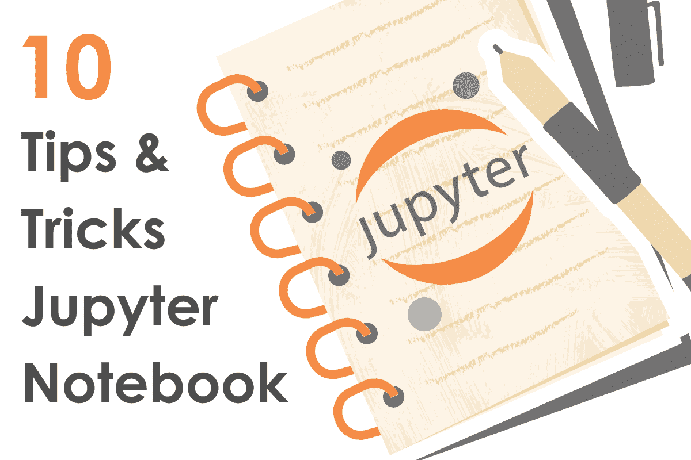
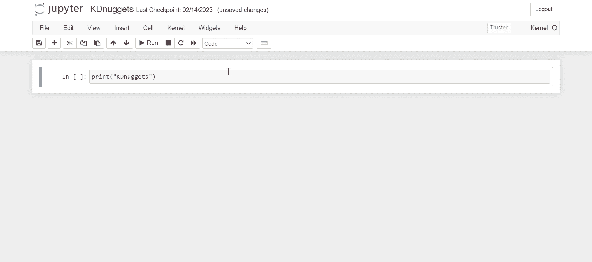
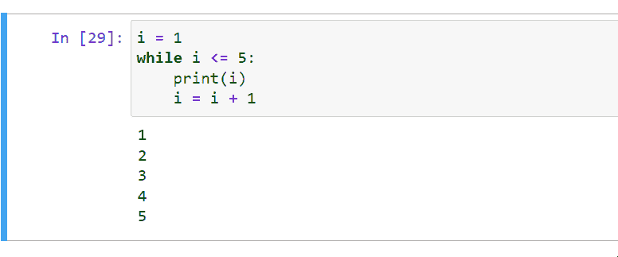

# 10 个 Jupyter Notebook 小技巧和窍门

> 原文：[`www.kdnuggets.com/2023/06/10-jupyter-notebook-tips-tricks-data-scientists.html`](https://www.kdnuggets.com/2023/06/10-jupyter-notebook-tips-tricks-data-scientists.html)



图片由作者提供

无论你是初学者还是数据专业人士，你一定使用过 Jupyter Notebook，并发现运行 Python 代码并以报告格式可视化输出是多么简单。

* * *

## 我们的前三大课程推荐

 1\. [Google 网络安全证书](https://www.kdnuggets.com/google-cybersecurity) - 快速进入网络安全职业生涯。

 2\. [Google 数据分析专业证书](https://www.kdnuggets.com/google-data-analytics) - 提升你的数据分析技能

 3\. [Google IT 支持专业证书](https://www.kdnuggets.com/google-itsupport) - 支持你的组织的 IT

* * *

但是，如果我告诉你可以提升你的 Jupyter 开发体验呢？在这篇文章中，我们将学习 10 个 Jupyter Notebook 小技巧，以提升数据专业人员的生产力和性能。

# 1\. 键盘快捷键

键盘快捷键对于执行重复任务和节省时间非常重要。你可以通过**帮助 > 键盘快捷键**或按**H**键了解所有默认的键盘快捷键。

访问命令的最简单和最流行的方法是类似于 VSCode 的命令面板。你可以按**Ctrl + Shift + P** 调出命令面板。它允许你搜索和执行命令，或滚动浏览所有命令以发现你想运行的命令。



动图由作者提供

# 2\. IPython 魔法命令

你可以在 Jupyter Notebook 中访问所有 IPython 魔法命令。这些命令为你执行代码提供了额外的功能。

例如，你可以使用`%%time` 魔法命令来显示单元格的执行时间。在我们的例子中，代码运行了 1000 次需要 1.09 秒。

```py
%%time

import time
for i in range(1_000):
    time.sleep(0.001)
```

```py
CPU times: user 10.2 ms, sys: 1.68 ms, total: 11.9 ms
Wall time: 1.09 s
```

你可以通过运行`%lsmagic`命令或查看[内置魔法命令](https://ipython.readthedocs.io/en/stable/interactive/magics.html)来了解所有可用的魔法命令。

常用命令列表：

+   **%env** 用于设置环境变量。

+   **%run** 用于执行 Python 代码。

+   **%store** 用于在多个笔记本之间访问变量。

+   **%%time** 显示单元格的执行时间。

+   **%%writefile** 将单元格的内容保存到一个文件中。

+   **%pycat** 显示外部文件的内容。

+   **%pdb** 用于调试。

+   **%matplotlib inline** 用于抑制函数在最后一行的输出。

# 3\. 执行 Shell 命令

你可以在 Jupyter Notebook 单元格中使用 `!` 运行 Shell 和 Bash 命令，如下所示。这为你提供了额外的能力来运行 Unix 或 Linux 基于的命令和工具。

```py
!git push origin
```

此命令最常见的用途是即时安装 Python 包。

```py
!pip install numpy
```

你还可以使用 Magic 命令 `%pip` 安装 Python 包

```py
%pip install numpy
```

# 4\. 使用 LaTeX 公式

在创建数据分析报告时，你需要提供统计或数学方程式，Jupyter Notebook 允许你使用 Latex 公式呈现复杂的方程。

只需创建一个 Markdown 单元格，并用美元符号 $ 包围你的 Latex 公式，如下所示。

```py
$\int \frac{1}{x} dx = \ln \left| x \right| + C$
```

**输出：**


# 5\. 为 Jupyter Notebook 安装其他内核

我们都知道 Python 内核，但你也可以安装其他内核，并用任何语言运行代码。

例如，如果你想在 Jupyter Notebook 中运行 R 编程语言，你需要安装 R 并在 R 环境中安装 IRkernel。

```py
install.packages('IRkernel')
IRkernel::installspec()
```

或者，如果你已经安装了 Anaconda，你可以在终端中运行下面的命令来为 Jupyter Notebook 设置 R。

```py
conda install -c r r-essentials
```

对于 Julia 语言爱好者，我创建了一个简单的指南 如何在 Jupyter Notebook 中设置 Julia。

# 6\. 从不同内核运行代码

你还可以通过使用 Magic 命令在 Python Jupyter Notebook 中从多个内核运行代码，例如：

+   %%bash

+   %%html

+   %%javascript

+   %%perl

+   %%python3

+   %%ruby

在这个例子中，我们将尝试使用 `%%HTML` Magic 命令在 Python 内核中运行 HTML 代码。

```py
%%HTML

<html>

<body>

<h1>Hello World</h1>

<p>Welcome to my website</p>

</body>

</html>
```

**输出：**


类似于 `!`，你可以使用 `%%script` 运行 Shell 脚本，这允许你运行安装在机器上的所有内核。例如，你可以运行 R 脚本。

```py
%%script R --no-save
print("KDnuggets")
```

**输出：**

```py
> print("KDnuggets")
[1] "KDnuggets"
>
```

# 7\. 多光标支持

你可以使用多个光标来编辑多个变量和语法或添加多行代码。要创建多个光标，你需要在按住 **Alt** 键的同时点击并拖动鼠标。



作者提供的 GIF

# 8\. 输出图像、视频和音频

你可以在不安装额外的 Python 包的情况下显示图像、视频和音频。

你只需导入 `IPython.display` 即可获取图像、视频和音频功能。这在处理非结构化数据集和机器学习应用时非常有用。


作者提供的图片

# 9\. 处理大型数据

你可以通过使用 [IPython Parallel](https://github.com/ipython/ipyparallel) 库处理和查询大型数据集。它是用于控制 IPython 进程集群的 CLI 脚本集合，基于 Jupyter 协议构建。

此外，你还可以使用 [sparkmagic](https://github.com/jupyter-incubator/sparkmagic) 命令来使用 PySpark 会话。

查看 sparkmagic 仓库中的示例。

```py
%%spark -c sql -o df_employee--maxrows 5
SELECT * FROM employee
```

**输出：**

```py
 age	name
0	40.0	abid
1	20.0	Matt
2	36.0	Chris
```

# 10\. 分享笔记本

分享报告或代码源及其输出非常重要，你可以通过多种方式实现：

1.  使用 **文件 > 另存为 > HTML** 将笔记本转换为 HTML 文件。

1.  使用 **文件 > 另存为 > PDF** 将笔记本保存为 PDF 文件。

1.  将笔记本保存为 Markdown **文件 > 另存为 > Markdown**。

1.  使用 [Pelican](https://www.dataquest.io/blog/how-to-setup-a-data-science-blog/) 创建博客。

1.  将 .ipynb 文件上传到 [Google Colab](https://colab.research.google.com/) 并在同事之间分享。

1.  使用 [GitHub Gits](https://gist.github.com/) 与公众分享笔记本文件。

1.  将你的文件托管在云端或外部服务器上，并使用 [nbviewer](https://nbviewer.org/) 渲染笔记本。

希望你觉得我列出的 10 个 Jupyter Notebook 技巧对你有帮助。如果你有任何额外的建议或技巧想要分享，请在下方评论中告诉我。感谢阅读。

**[Abid Ali Awan](https://www.polywork.com/kingabzpro)** ([@1abidaliawan](https://twitter.com/1abidaliawan)) 是一位认证数据科学专业人士，热衷于构建机器学习模型。目前，他专注于内容创作，并撰写有关机器学习和数据科学技术的技术博客。Abid 拥有技术管理硕士学位和电信工程学士学位。他的愿景是利用图神经网络构建一个 AI 产品，帮助面临心理健康问题的学生。

### 相关主题

+   [金融中的 Python：Jupyter Notebook 内的实时数据流](https://www.kdnuggets.com/python-in-finance-real-time-data-streaming-within-jupyter-notebook)

+   [5 个 Jupyter Notebook 数据科学项目的免费模板](https://www.kdnuggets.com/5-free-templates-for-data-science-projects-on-jupyter-notebook)

+   [如何在 Jupyter Notebook 上设置 Julia](https://www.kdnuggets.com/2022/11/setup-julia-jupyter-notebook.html)

+   [Jupyter Notebook 魔法方法速查表](https://www.kdnuggets.com/jupyter-notebook-magic-methods-cheat-sheet)

+   [快速数据科学技巧和窍门来学习 SAS](https://www.kdnuggets.com/2022/05/sas-quick-data-science-tips-tricks-learn.html)

+   [12 个用于 Python 开发的 VSCode 技巧和窍门](https://www.kdnuggets.com/2023/05/12-vscode-tips-tricks-python-development.html)
