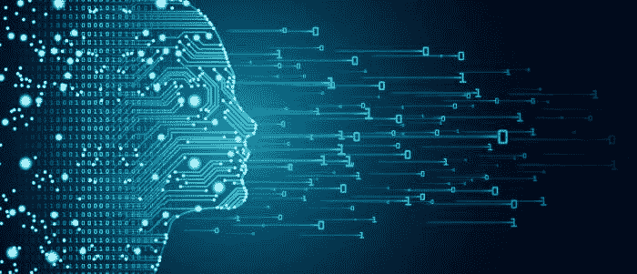
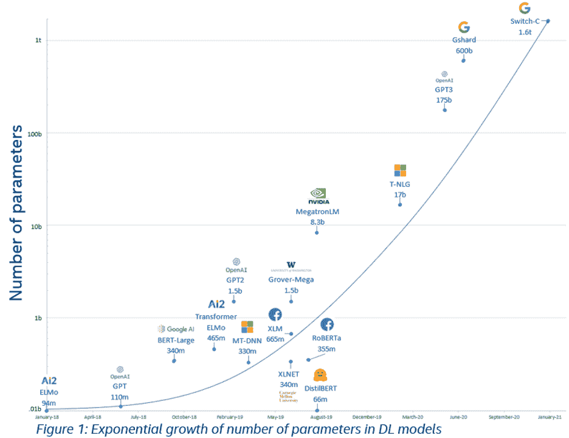

# 2022 年及以后 10 个关键 AI 与数据分析趋势

> 原文：[`www.kdnuggets.com/2021/12/10-key-ai-trends-for-2022.html`](https://www.kdnuggets.com/2021/12/10-key-ai-trends-for-2022.html)

评论

**作者：[David Pool](https://www.smarter.ai/)，[Smarter.ai](https://www.smarter.ai/) 的联合创始人及 CAIO**

* * *

## 我们的前三个课程推荐

 1\. [Google 网络安全证书](https://www.kdnuggets.com/google-cybersecurity) - 快速开启网络安全职业生涯。

 2\. [Google 数据分析专业证书](https://www.kdnuggets.com/google-data-analytics) - 提升你的数据分析技能

 3\. [Google IT 支持专业证书](https://www.kdnuggets.com/google-itsupport) - 支持你所在组织的 IT

* * *

全球大流行改变了我们的交易方式。随着世界大部分地区转向在线，电子商务、云计算和增强的网络安全措施只是评估当前数据分析趋势的冰山一角。

管理风险和控制成本一直是企业的重要考虑因素。然而，能够有效分析数据的正确机器学习技术正在成为任何希望获得竞争优势的公司至关重要的条件。

**为什么趋势对模型创作者重要？**

我们对 2022 年及以后数据分析趋势的总结应该能给创作者一个关于行业发展方向的良好概念。

通过保持对数据科学趋势的关注，并调整他们的模型以符合当前标准，创作者可以使他们的工作真正变得不可或缺。无论这些数据分析趋势是否激励你构思新的模型，还是更新你工具箱中的现有模型，完全取决于你自己。

### 创作者经济进入 AI 领域：想象一下类似于 Airbnb 的 AI 工具市场

随着计算机游戏领域的趋势，用户生成内容（UGC）作为游戏平台的重要组成部分实现了货币化，我们也看到了类似的货币化发生在数据科学领域。这从简单的模型开始，如分类、回归和聚类模型，这些模型都被重新利用并上传到专门的平台。这些模型随后会提供给希望自动化日常业务数据和流程的全球商业用户市场。

这将很快被深度模型工件所取代，如卷积网络、GAN 和自编码器，这些模型经过调整并应用于解决商业问题。这些模型旨在由商业分析师而非数据科学家团队安全使用。

数据科学家以咨询工作形式出售他们的技能和经验，或将模型上传到代码库，这并不新鲜。然而，2022 年将通过双面市场实现这些技能的货币化，使得单个模型可以进入全球市场。

想象一下 AI 版的 Airbnb。

### 环境 AI 成为关注焦点

尽管大多数研究无可厚非地集中在推动复杂性边界上，但现实是，训练和运行复杂模型对环境的影响可能很大。

预测到 2040 年，数据中心将占全球 CO2 排放量的 15%，而 2019 年的一项研究论文《深度学习的能源考虑》发现，训练一个自然语言翻译模型的 CO2 排放量相当于四辆家庭轿车在其生命周期内的排放量。显然，训练越多，CO2 释放越多。

随着对环境影响理解的加深，组织们正在探索减少碳足迹的方法。虽然我们现在可以利用 AI 提高数据中心的效率，但世界应当期待看到更多对简单模型的关注，这些简单模型在解决特定问题时能与复杂模型一样表现出色。

实际上，当一个简单的贝叶斯模型使用的数据、训练和计算能力远远少于 10 层卷积神经网络却表现同样良好时，我们为何还要使用复杂的 10 层卷积神经网络？“模型效率”将成为环境 AI 的代名词，因为创作者们专注于构建简单、高效且易用的模型，而这些模型不会对地球造成巨大负担。

### 超参数化模型成为大型科技公司的超级游艇

不同于穆斯克和贝索斯的太空科技竞赛，大型科技公司也有他们自己令人兴奋的竞赛：**谁拥有最大的深度学习模型**？

在过去 3 年中，最大模型的参数数量从 2018 年的 9400 万增长到了 2021 年的惊人 1.6 万亿，谷歌、Facebook、微软、OpenAI 等公司不断推升复杂性边界。

如今，这些数万亿的参数是基于语言的，允许数据科学家构建能够详细理解语言的模型，使模型能够撰写人类水平的文章、报告和翻译。它们甚至能编写代码、开发食谱，并理解上下文中的讽刺和讽刺。

从 2021 年开始，我们可以期待视觉模型在无需庞大数据集的情况下实现类似的人类水平表现。例如，你可以只给幼儿展示一次巧克力，他们每次看到巧克力时都会认识它，而无需重新训练！

创作者们已经开始将这些模型应用于具体的机会。其中一个最为显著的例子来自游戏开发者 Dungeon.AI，他们基于 1970 年代的风靡游戏《龙与地下城》开发了一系列幻想游戏。这些逼真的世界基于 1750 亿参数的模型 GPT-3。我们预计创作者们会在特定领域看到更多这种活动，比如理解法律文本、撰写广告文案或将图像或视频分类到特定组中。

### 数字协作工人的增强型工作队伍

随着认知技术和机器学习模型在全球范围内被企业越来越多地采用，机械化的行政工作和将琐碎任务分配给人工劳动力的时代正逐渐消失。

取而代之的是，企业选择了一种增强型劳动力模型，使人类和机器人并肩工作。这一技术进步使工作具有可扩展性和优先级，赋予人类以消费者为首要任务的能力。

尽管创建增强型劳动力无疑是创作者需要关注的数据分析趋势之一，但部署正确的人工智能并解决自动化带来的任何初期问题是一个重大挑战。此外，面对统计数据称到 2025 年每三份工作中就有一份将被机器人取代，员工们自然对这一趋势不太热衷。[1]

这些担忧在某种程度上是有效的，但也有一种有根据的信念认为，机器学习和自动化将仅仅提升员工的生活，使他们能够更快、更无不确定性地做出关键决策。尽管存在潜在缺点，增强型劳动力使个人可以花更多时间进行质量保证和客户服务，同时在复杂的业务问题出现时解决它们。[2]

随着众多公司热衷于将机器人流程自动化（RPA）、机器学习和认知增强作为未来建模的一部分，这也是所有有志数据分析师应了解的人工智能趋势之一。

### 改善网络安全

随着大多数企业在疫情期间被迫投资于增加在线存在感，提高网络安全已成为 2021 年最重要的数据分析趋势之一。

单次网络攻击可以完全扰乱一个企业，但企业如何在没有巨大的成本和时间投入的情况下追踪潜在的失败点？这个燃眉之急的答案在于优秀的建模和对风险的理解。人工智能快速且准确的数据分析能力意味着可以进行更深入的风险建模和威胁感知。

与人类不同，机器学习模型能够以快速的速度处理数据，提供保持威胁控制的洞察而无需太多外部输入。根据 IBM 对网络安全的人工智能分析，这项技术可以收集从恶意文件到不利 IP 地址的所有信息，使企业能够比以前快多达 60 倍地应对威胁。[3] 由于遏制一次数据泄露的平均成本为 11.2 亿美元，投资优秀的网络安全建模是企业不应忽视的事情。[4]

总之，通过保持网络安全以应对这一数据分析趋势，企业可以更好地保护其底线。

### 低代码和无代码人工智能

由于全球范围内可用的数据科学家如此稀缺，使非专家能够从预定义的组件中创建可操作的应用程序，使低代码和无代码人工智能成为近年来在行业中出现的最具民主性的趋势之一。

实质上，这种人工智能方法几乎不需要编程，允许任何人“使用简单的构建块来根据需求定制应用程序。”[5]

最近的趋势表明，数据科学家和工程师的就业市场极为积极，LinkedIn 的就业报告称，在未来 5 年内，大约[全球将创造 1.5 亿个技术职位](https://business.linkedin.com/talent-solutions/resources/talent-acquisition/jobs-on-the-rise-us#digital)。考虑到超过 83%的企业现在将人工智能视为保持相关性的关键因素，这也就不足为奇了。

然而，在当前的环境下，对人工智能相关服务的强烈需求根本无法得到满足。更重要的是，超过 60%的人工智能顶尖人才被科技和金融行业抢走，导致其他行业几乎没有潜在的员工可供使用。[6]

因此，创建低代码和无代码人工智能解决方案，使企业能够在没有数据专家的情况下进行竞争，是保持行业开放和具有竞争力的关键。

### 云计算的崛起

疫情使得云计算的转型成为近年来出现的最不可避免的数据分析趋势之一。面对比以往更多的数据，通过云端共享和管理数字服务已经被全球的企业迅速采纳。

机器学习平台将数据带宽需求提升到一个新水平，但云计算的崛起使得完成工作更快，并具有公司级别的可见性。鉴于 94%的企业已经使用云服务，并且公共云基础设施预计到 2021 年底将增长 35%，未能利用云计算的公司将会被甩在后面。[7]

云计算能够保持数据安全、保护企业免受网络攻击并提升可扩展性，其好处多于坏处，使其成为创作者在未来几年需要关注的关键数据分析趋势之一。

### 小数据与可扩展人工智能

随着全球越来越多地转向线上，能够创建响应更广泛数据集的可扩展人工智能比以往任何时候都更为重要。虽然快速到达的大数据仍然对创建有效的人工智能模型至关重要，但真正为客户分析增值的是小数据。这并不是说大数据没有价值，而是从如此庞大的数据集中提取有意义的趋势几乎是不可能的。

如你所料，小数据由少量数据类型组成，这些数据类型包含足够的信息来测量模式，但不会让公司感到 overwhelmed。通过从具体案例中提取见解，营销人员可以更有效地建模消费者行为，并通过个性化将其发现转化为销售增长。[8]

### 改进的数据来源

由 Boris Glavic 定义为“关于数据的来源和创建过程的信息，”[9] 数据来源是保持工业生产数据可靠的数据科学趋势之一。

为了保持盈利，企业需要能够信任用于营销和广告目的的数据。虽然有大量数据是好的，但只有在正确分析的情况下才有用。不准确的预测和糟糕的数据管理会严重影响企业，但随着时间的推移，机器学习模型的改进已使这一问题减少。

现在能够使用针对性的算法，这些模型可以确定哪些数据集应被使用，哪些应被丢弃。对于数据分析师来说，跟踪智能特性并保持所有文件的最新状态应该使相关数据更容易被筛选出来。

### 迁移到 Python 和工具

Python 通过其简单的语言和语法提供更用户友好的编码方式，是一种引领科技行业的高级编程语言。

尽管 R 不太可能在数据科学领域消失，[Python 被全球企业视为更易获取的工具](https://towardsdatascience.com/python-vs-r-whats-best-for-machine-learning-93432084b480)，因为它优先考虑逻辑代码和可读性。与主要用于统计计算和图形的 R 不同，Python 可以轻松用于机器学习，因为它比其前身更深入地收集和分析数据。

使用 Python 在可扩展的生产环境中，能给数据分析师带来优势，这是数据科学中的一种趋势，新兴创作者不应忽视。

### 深度学习和自动化

深度学习与机器学习相关，但其算法受人脑神经通路的启发。对于企业而言，使用这种技术确保了准确的预测和易于理解的有用模型。[10]

虽然深度学习并不适用于每个行业，但该机器学习子领域中使用的神经网络改进了自动化，使企业能够在较少人工干预的情况下进行高度分析。

从数字助手到[壳牌在墨西哥湾现代化的智能传感器](https://blogs.edf.org/energyexchange/2017/08/09/shell-becomes-latest-oil-and-gas-company-to-test-smart-methane-sensors/)，深度学习和自动化的应用是将高质量数据转化为保证的顶线增长的 AI 趋势之一。

### 实时数据

能够实时评估数据是近年来最令人兴奋的数据分析趋势之一。[情感分析和实时自动化测试](https://www.smarter.ai/blog/sentiment_evaluation) 在 2021 年变得越来越受企业欢迎，公司利用数据进展实时评估消费者行为。实时分析允许在问题出现时立即进行调整和更改，使企业更加主动。

根据研究和咨询公司 Gartner 的数据，到 2022 年，将有超过 50% 的新业务系统使用实时数据来改善决策。[11] 这不仅会改善客户体验，提高企业利润率，而且实时数据还是消除与历史、本地数据报告相关成本的数据分析趋势之一。

### 从 DataOps 转向 XOps

在现代世界中，企业拥有如此多的数据，手动处理显然是不切实际的。

尽管 DataOps 在数据收集和评估方面效率很高，但向更复杂的 XOps 转变被证明是明年的顶级数据分析趋势之一。为了进一步支持这一观点，Gartner 确认了 XOps 的重要性，称其是[将数据处理过程结合起来以获得更前沿的数据科学方法](https://www.gartner.com/smarterwithgartner/gartner-top-10-data-and-analytics-trends-for-2021)的有效方式。

你可能已经熟悉 DataOps，但如果你对一个新术语感到困惑，让我们来为你解答。

根据 Salt Project 的数据管理专家，XOps 是一个“涵盖所有 IT 学科和责任的总称，描述了所有 IT 操作的通用术语。”[12] 它包括 DataOps、MLOps、ModelOps、AIOps 和 PlatformOps，采用多方面的方法来提高效率，实现自动化，并缩短多个行业的开发周期。

通过整合这些程序，企业可以利用最新的 IT 软件，使数据调查变得无缝，从而节省时间、精力和金钱。

### 未来的数据分析趋势：关键要点是什么？

2021 年的数据科学趋势极为进步，证明准确且易于消化的数据对企业来说比以往任何时候都更有价值。

然而，数据分析趋势永远不会静止，因为可供企业使用的数据量不断增长。这使得找到对所有企业都有效的数据处理方法成为一个持续的挑战。

随着可访问性、民主化和自动化成为数据行业未来的关键优先事项，创作者应当致力于保持其模型易于理解，并且在可能的情况下做到未来-proof。

[1]  Joshua Barajas，《Gartner 称智能机器人将在 2025 年前占据三分之一的工作岗位》，PBS，最后修改于 2014 年 10 月 7 日，https://www.pbs.org/newshour/economy/smart-robots-will-take-third-jobs-2025-gartner-says

[2]  Bill Cline, Maureen Brady, David Montes, Chris Foster, Catia Davim, KPMG，《增强型劳动力》，https://home.kpmg/xx/en/home/insights/2018/06/augmented-workforce-fs.html

[3]  IBM，《更智能的网络安全中的人工智能》，最后修改于 2021 年 10 月 4 日，https://www.ibm.com/uk-en/security/artificial-intelligence

[4]  IBM 公司，《超越炒作：你 SOC 中的人工智能》，2020 年 7 月，https://www.ibm.com/downloads/cas/9EDONM6M

[5]  Anton Vaisbud，《企业中的低代码人工智能》，最后修改于 2021 年 2 月 26 日，https://towardsdatascience.com/low-code-ai-in-enterprise-benefits-and-use-cases-b9692ee13168

[6]  David Kelnar，《人工智能现状：2019 年的分歧》，MMC Ventures，最后修改于 2019 年 3 月 5 日， [`www.stateofai2019.com/introduction`](https://www.stateofai2019.com/introduction)

[7]  Nick Galov，《2021 年云计算采纳统计数据》，最后修改于 2021 年 8 月 1 日，https://hostingtribunal.com/blog/cloud-adoption-statistics/

[8]  Shane Hill，《忘记“大数据”吧：真正创造价值的是小数据》，最后修改于 2020 年 10 月 13 日，https://techmonitor.ai/ai/small-data-not-big-data

[9]  Boris Glavic，《大数据溯源：挑战与基准测试的影响》，《指定大数据基准》，2014 年，第 8163 卷，摘要

[10]  IBM 云教育，《深度学习》，最后修改于 2020 年 5 月 1 日，https://www.ibm.com/cloud/learn/deep-learning

[11]  Susan Moore，《2019 年 Gartner 十大数据与分析趋势》，最后修改于 2019 年 11 月 5 日，https://www.gartner.com/smarterwithgartner/gartner-top-10-data-analytics-trends

[12]  Rhett Glauser，《什么是 XOps？》，最后修改于 2020 年 5 月 6 日，https://saltproject.io/what-is-xops/

[原文](https://www.smarter.ai/blog/key-data-analysis-trends-for-2022-and-beyond)。经许可转载。

**个人简介：** [David Pool](https://www.linkedin.com/in/david-pool-93758571/) 是一位商业导向的经验丰富的企业家，专注于人工智能、机器学习、数据分析和商业智能。

**相关：**

+   [云机器学习透视：2021 年的惊喜与 2022 年的预测](https://www.kdnuggets.com/2021/12/cloud-ml-perspective-surprises-2021-projections-2022.html)

+   [数据科学与分析行业 2021 年主要发展及 2022 年关键趋势](https://www.kdnuggets.com/2021/12/developments-predictions-data-science-analytics-industry.html)

+   [2021 年主要发展与 2022 年人工智能、数据科学、机器学习技术的关键趋势](https://www.kdnuggets.com/2021/12/trends-ai-data-science-ml-technology.html)

### 更多相关主题

+   [人工智能、分析、机器学习、数据科学、深度学习……](https://www.kdnuggets.com/2021/12/developments-predictions-ai-machine-learning-data-science-research.html)

+   [2021 年数据科学与分析行业主要发展及关键…](https://www.kdnuggets.com/2021/12/developments-predictions-data-science-analytics-industry.html)

+   [2021 年主要发展及 2022 年人工智能、数据科学的关键趋势](https://www.kdnuggets.com/2021/12/trends-ai-data-science-ml-technology.html)

+   [5 个关键数据科学趋势及分析趋势](https://www.kdnuggets.com/2022/08/5-key-data-science-trends-analytics-trends.html)

+   [2022 年及以后顶尖的人工智能与数据科学工具和技术](https://www.kdnuggets.com/2022/03/nvidia-0317-top-ai-data-science-tools-techniques-2022-beyond.html)

+   [2022 年数据科学、机器学习、人工智能及分析领域的重要发展](https://www.kdnuggets.com/2022/12/key-data-science-machine-learning-ai-analytics-developments-2022.html)
