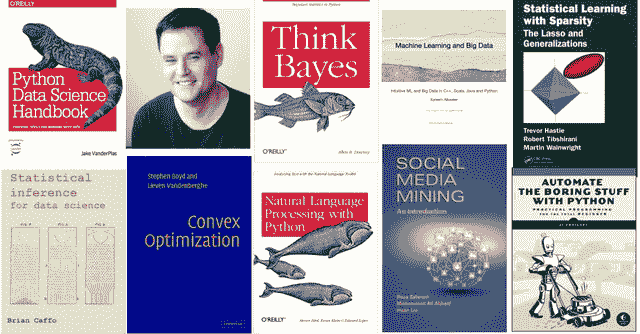

# 10 本更多必读的免费机器学习和数据科学书籍

> 原文：[`www.kdnuggets.com/2018/05/10-more-free-must-read-books-for-machine-learning-and-data-science.html`](https://www.kdnuggets.com/2018/05/10-more-free-must-read-books-for-machine-learning-and-data-science.html)

 评论

现在是时候开始另一个免费的机器学习和数据科学书籍的合集，来启动你的夏季学习季节了。因为这确实是个趋势，对吧？

如果在阅读完这个列表后，你发现自己还想要更多免费的优质精选书籍，请查看本系列的前一版或下面的相关帖子。

* * *

## 我们的前三大课程推荐

 1\. [谷歌网络安全证书](https://www.kdnuggets.com/google-cybersecurity) - 快速入门网络安全职业。

 2\. [谷歌数据分析专业证书](https://www.kdnuggets.com/google-data-analytics) - 提升你的数据分析能力

 3\. [谷歌 IT 支持专业证书](https://www.kdnuggets.com/google-itsupport) - 支持你的组织的 IT 工作

* * *

**1\. [Python 数据科学手册](https://github.com/jakevdp/PythonDataScienceHandbook)**

作者：Jake VanderPlas

> 这本书介绍了在 Python 中处理数据所需的核心库：特别是 IPython、NumPy、Pandas、Matplotlib、Scikit-Learn 及相关包。假设你对 Python 语言有所了解；如果你需要快速了解语言本身，请参阅免费的伴随项目，[Python 速览](https://github.com/jakevdp/WhirlwindTourOfPython)：这是一个快速介绍 Python 语言的项目，旨在面向研究人员和科学家。

**2\. [神经网络与深度学习](http://neuralnetworksanddeeplearning.com/)**

作者：Michael Nielsen

> *《神经网络与深度学习》* 是一本免费的在线书籍。该书将教你关于：
> 
> +   神经网络，一种美丽的生物启发编程范式，使计算机能够从观察数据中学习
> +   
> +   深度学习，一套强大的技术，用于神经网络中的学习
> +   
> 神经网络和深度学习目前为许多图像识别、语音识别和自然语言处理问题提供了最佳解决方案。这本书将教你许多神经网络和深度学习背后的核心概念。

**3\. [Think Bayes](http://greenteapress.com/wp/think-bayes/)**

作者：Allen B. Downey

> *Think Bayes* 是一本使用计算方法介绍贝叶斯统计的书籍。
> 
> 本书以及*Think X*系列的其他书籍的前提是，如果你知道如何编程，你可以利用这个技能学习其他主题。
> 
> 大多数关于贝叶斯统计的书籍使用数学符号，并通过微积分等数学概念来呈现思想。本书则使用 Python 代码而非数学，并用离散近似代替连续数学。因此，本书中原本在数学书中是积分的内容变成了求和，而对概率分布的大部分操作则是简单的循环。

**4\. [机器学习与大数据](http://www.kareemalkaseer.com/books/ml)**

作者：Kareem Alkaseer

> 这是一个进行中的项目，我会在时间允许的情况下进行更新。其目的是在理论与实现之间取得平衡，使软件工程师能够舒适地实现机器学习模型，而不必过于依赖库。大多数时候，一个模型或技术的概念是简单或直观的，但常常在细节或术语中被迷失。此外，大多数现有库能够解决当前问题，但它们被视为黑箱，并且它们通常具有自己的抽象和架构，这些隐藏了基本概念。本书的尝试是使这些基本概念更加清晰。

**5\. [稀疏统计学习：套索与推广](https://web.stanford.edu/~hastie/StatLearnSparsity/)**

作者：Trevor Hastie, Robert Tibshirani, Martin Wainwright

> 在过去的十年中，计算和信息技术经历了爆炸性增长。随之而来的是大量的数据，涉及医学、生物学、金融和市场营销等各个领域。本书描述了这些领域中的重要思想，采用了一个共同的概念框架。

**6\. [数据科学的统计推断](https://leanpub.com/LittleInferenceBook)**

作者：Brian Caffo

> 本书作为 [统计推断](https://www.coursera.org/course/statinference) Coursera 课程的配套书籍，同时也是 [数据科学专业化](https://www.coursera.org/specialization/jhudatascience/1?utm_medium=courseDescripTop) 的一部分。然而，即使你没有参加课程，本书也基本可以独立使用。本书的一个有用组成部分是由 YouTube 视频组成的 Coursera 课程。
> 
> 本书旨在为统计推断这一重要领域提供一种低成本的入门介绍。目标读者是那些在数值和计算方面有一定基础的学生，他们希望将这些技能应用于数据科学或统计学。本书作为一系列 markdown 文档在 github 上免费提供，并以更便捷的格式（epub, mobi）在 LeanPub 和零售商店销售。

**7\. [凸优化](http://stanford.edu/~boyd/cvxbook/)**

作者：Stephen Boyd 和 Lieven Vandenberghe

> 本书涉及凸优化，这是一类特殊的数学优化问题，包括最小二乘法和线性规划问题。众所周知，最小二乘法和线性规划问题具有相当完整的理论，出现在各种应用中，并且可以非常高效地进行数值求解。本书的基本观点是，对于更大的凸优化问题类，也是如此。

**8\. [用 Python 进行自然语言处理](https://www.nltk.org/book/)**

作者：斯蒂文·伯德、伊万·克莱因和爱德华·洛珀

> 这是一本关于自然语言处理的书。所谓“自然语言”，是指人类用于日常交流的语言；例如英语、印地语或葡萄牙语。与编程语言和数学符号等人工语言相比，自然语言随着代际传承而演变，并且难以用明确的规则来界定。我们将自然语言处理——或简称 NLP——广泛理解为对自然语言的任何计算机操作。
> 
> ...
> 
> 本书基于 Python 编程语言，并结合了一个名为*自然语言工具包（NLTK）*的开源库。

**9\. [用 Python 自动化无聊的工作](https://automatetheboringstuff.com/)**

作者：阿尔·斯维加特

> 如果你曾花费几个小时来重命名文件或更新数百个电子表格单元格，你知道这类任务是多么乏味。但如果你可以让你的计算机为你完成这些任务呢？
> 
> 在《用 Python 自动化无聊的工作》中，你将学习如何使用 Python 编写程序，在几分钟内完成手动操作需要几个小时的任务——无需先前的编程经验。一旦你掌握了编程基础，你将能够创建 Python 程序，轻松实现有用且令人印象深刻的自动化功能。

**10\. [社交媒体挖掘：导论](http://dmml.asu.edu/smm/)**

作者：雷扎·扎法拉尼、穆罕默德·阿里·阿巴西和刘欢

> 在过去十年中，社交媒体的增长彻底改变了个人互动和行业运营的方式。个人通过社交媒体互动、分享和消费内容，以前所未有的速度生成数据。理解和处理这种新类型的数据，以提取可操作的模式，给跨学科研究、创新算法和工具开发带来了挑战和机遇。《社交媒体挖掘》将社交媒体、社交网络分析和数据挖掘整合在一起，为学生、从业者、研究人员和项目经理提供了一个方便而连贯的平台，以理解社交媒体挖掘的基础和潜力。

**相关**：

+   10 本免费必读的机器学习和数据科学书籍

+   数据爱好者的十大必备书籍

+   在进入机器学习职业之前需要阅读的 5 本电子书

### 更多相关话题

+   [建立一个强大的数据团队](https://www.kdnuggets.com/2021/12/build-solid-data-team.html)

+   [使用管道编写干净的 Python 代码](https://www.kdnuggets.com/2021/12/write-clean-python-code-pipes.html)

+   [停止学习数据科学以寻找目标，并寻找目标去…](https://www.kdnuggets.com/2021/12/stop-learning-data-science-find-purpose.html)

+   [学习数据科学所需的顶级统计资源](https://www.kdnuggets.com/2021/12/springboard-top-resources-learn-data-science-statistics.html)

+   [成功数据科学家的 5 个特征](https://www.kdnuggets.com/2021/12/5-characteristics-successful-data-scientist.html)

+   [成为优秀数据科学家所需的 5 项关键技能](https://www.kdnuggets.com/2021/12/5-key-skills-needed-become-great-data-scientist.html)
