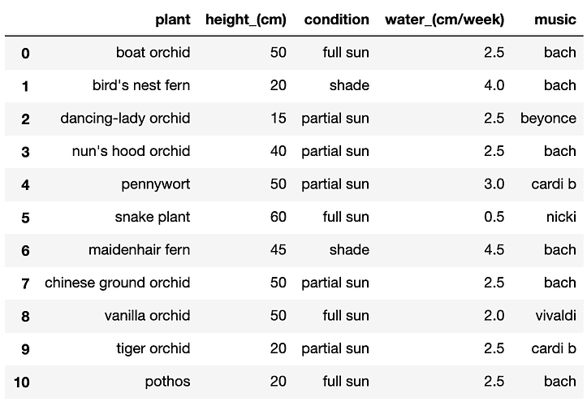
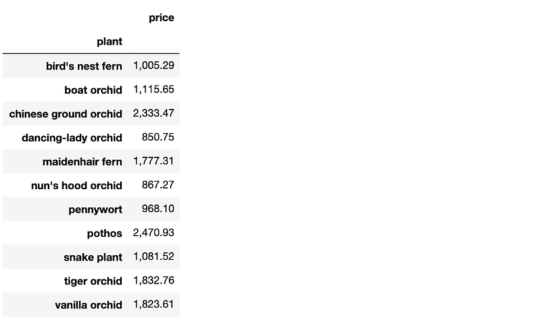
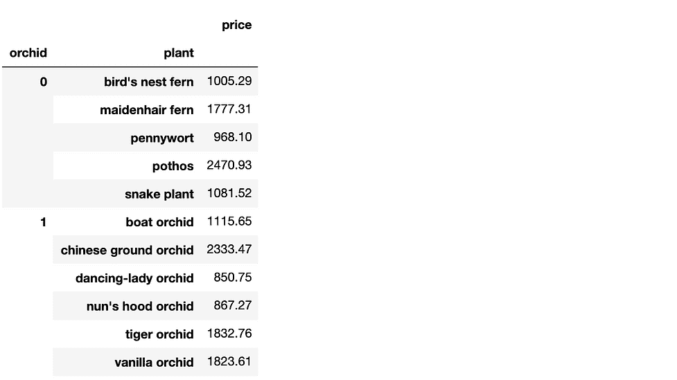
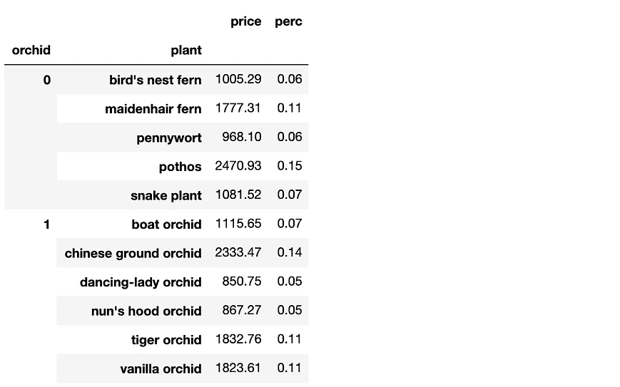

# 10 个 Python 初学者技能

> 原文：[`www.kdnuggets.com/2020/12/10-python-skills-beginners.html`](https://www.kdnuggets.com/2020/12/10-python-skills-beginners.html)

评论

**由[Nicole Janeway Bills](https://twitter.com/Nicole_Janeway)，Atlas Research 的数据科学家**


图片来源：[Shelby Miller](https://unsplash.com/@shebster_07?utm_source=medium&utm_medium=referral) 于[Unsplash](https://unsplash.com/?utm_source=medium&utm_medium=referral)

* * *

## 我们的三大课程推荐

 1\. [Google 网络安全证书](https://www.kdnuggets.com/google-cybersecurity) - 快速进入网络安全职业道路。

 2\. [Google 数据分析专业证书](https://www.kdnuggets.com/google-data-analytics) - 提升你的数据分析能力

 3\. [Google IT 支持专业证书](https://www.kdnuggets.com/google-itsupport) - 支持你在 IT 领域的组织

* * *

借助 Python 直观、人性化的语法，任何人都可以利用科学计算的强大功能。Python 已成为数据科学和机器学习的标准语言，并且在[Stack Overflow 的 2020 开发者调查](https://insights.stackoverflow.com/survey/2020#most-loved-dreaded-and-wanted)中被评为**最受喜爱的前三种**语言。

如果你是这个备受喜爱的编程语言的*新手*，这里有十个技巧可以促进你的 Python 技能发展。你可以在这个[**Google Colab** **笔记本**](https://colab.research.google.com/drive/1K2oWzxzYbura4VqrntsZimnWqQex_c38?usp=sharing)中跟随（此外，[一个 Google Colab 的简短视频介绍](https://youtu.be/aaebOpi1kik?t=24)）。

### #10 — 列表推导

列表推导是一种简单的单行语法，用于处理列表，它允许你访问并对列表中的单个元素执行操作。

语法由包含如`print(plant)`的表达式的括号组成，后跟一个`for`和/或`if`子句。

将打印：

```py
boat orchid
dancing-lady orchid
nun's hood orchid
chinese ground orchid
vanilla orchid
tiger orchid
```

（注：列表推导末尾的分号将抑制打印 Jupyter Notebook 单元格最后一行的输出。这样，Jupyter Notebook 不会打印`None`列表。）

### #9 — 单行 if 语句

除了前面的技巧，单行 if 可以帮助你使代码更简洁。

假设我们决定我们有兴趣识别植物是否为兰花。使用单行 if，我们从测试条件为真时我们希望输出的值开始。

这段代码将单行 if 与列表推导结合，用于在植物是兰花时输出 1，否则输出 0。

```py
[1 if 'orchid' in plant else 0 for plant in greenhouse]
```

将输出：

```py
[1, 0, 1, 1, 0, 0, 0, 1, 1, 1, 0]
```

这个列表本身可能不那么有趣，但与下一个提示结合使用时，我们将看到单行 if 的实际应用。

### #8 — 将 lambda 应用到数据框列

Pandas 数据框是一个可以存储表格数据的结构，类似于 Python 中的 Excel。 `[lambda](https://pandas.pydata.org/pandas-docs/stable/reference/api/pandas.DataFrame.apply.html)` 是一个关键字，它提供了对表格中值执行操作的快捷方式。

假设我们有一个关于我们温室植物的信息表：

打印这个数据框将显示如下内容：



假设我们想知道某种植物是否喜欢某位德国古典作曲家。

```py
data[‘music’].apply(lambda x: 1 if x == ‘bach’ else 0)
```

将输出：


其中第一列是数据框索引，第二列是表示单行 if 输出的系列。

`lambda` 代表一个 “[匿名函数](https://pandas.pydata.org/pandas-docs/stable/reference/api/pandas.DataFrame.apply.html)” 。它允许我们在数据框中的值上执行操作，而无需创建正式的函数——即，包含 `def` 和 `return` 语句的函数，稍后我们将看到。

### #7— 将条件应用于多个列

假设我们想要识别哪些喜欢巴赫的植物也需要充足的阳光，这样我们可以将它们一起安排在温室中。

首先，我们使用 `def` 关键字创建一个函数，并给它一个用下划线连接单词的名称（例如 sunny_shelf）。恰当地，这种命名约定被称为 [蛇形命名法](https://www.python.org/dev/peps/pep-0008/#function-and-variable-names) ????

函数 sunny_shelf 接受两个参数作为输入——检查“充足阳光”的列和检查“巴赫”的列。该函数输出这两个条件是否都为真。

在第 4 行，我们对数据框应用了 [.apply()](https://chrisalbon.com/python/data_wrangling/pandas_apply_operations_to_dataframes/) 函数，并指定了应作为参数传递的列。 `axis=1` 告诉 pandas 应该在列上评估该函数（而不是 `axis=0`，它在行上进行评估）。我们将 .apply() 函数的输出分配给一个名为‘new_shelf’的新数据框列。

或者，我们可以使用 [np.where()](https://numpy.org/doc/stable/reference/generated/numpy.where.html) 函数达到相同的目的：

这个 [来自 numpy 库的函数](https://numpy.org/doc/stable/reference/generated/numpy.where.html) 检查上述指定的两个条件（即植物是否喜欢充足的阳光和德式古典音乐），并将结果分配给‘new_shelf’列。

*有关*[*.apply()*](https://chrisalbon.com/python/data_wrangling/pandas_apply_operations_to_dataframes/)*、*[*np.where()*](https://chrisalbon.com/python/data_wrangling/pandas_create_column_using_conditional/)*以及其他极其有用的代码片段，请查看*[*Chris Albon 的博客*](https://chrisalbon.com/)*。*

### #6— 拆分长代码行

顺便说一下，你可以将括号、方括号或大括号内的任何语句拆分到多行，以避免单行过长。我们在初始化温室列表、创建植物数据框和使用 np.where()函数时见过这种情况。

根据[PEP8](https://www.python.org/dev/peps/pep-0008/#maximum-line-length) Python 风格指南：

> 包装长行的首选方式是使用 Python 在括号、方括号和大括号中的隐式行续接。

### #5 — 读取.csv 并设置索引

现在让我们扩展温室，以便有更多实际数据可用。我们将通过导入一个包含植物数据的.csv 来实现。[通过访问此数据集进行跟踪](https://docs.google.com/spreadsheets/d/14DTM1iEJtRBNDpayc3P-qUY0Bo2O1SVxxdi96dJmaXk/edit?usp=sharing)。

假设表中包含一个唯一的植物标识符，我们希望将其用作 DataFrame 中的索引。我们可以使用 index_col 参数来设置。

```py
data = pd.read_csv('greenhouse.csv', index_col='plant_id')
```


*有关探索性数据分析（EDA）的基础知识及其他 9 个有用的 Python 技巧，请查看这篇文章：*

[**10 个被低估的 Python 技能**](https://towardsdatascience.com/10-underrated-python-skills-dfdff5741fdf)

提升你的数据科学技能，运用这些技巧改进 Python 编码，提升 EDA、目标分析、特征…

### #4— 格式化为货币

我们到底在这些植物上花了多少钱？让我们将此计算的输出格式化为货币。

```py
‘${:,.2f}’.format(data[‘price’].sum())
```

将输出：

```py
'$15,883.66'
```

逗号分隔符使我们能够轻松查看到目前为止花费了多少现金。

### #3 — 创建透视表

接下来，假设我们想查看每种植物的花费。我们可以使用[pd.pivot_table()](https://pandas.pydata.org/pandas-docs/stable/reference/api/pandas.pivot_table.html)或[.groupby()](https://pandas.pydata.org/pandas-docs/stable/reference/api/pandas.DataFrame.groupby.html)进行聚合透视。

```py
pd.pivot_table(data, index=’plant’, values=’price’, aggfunc=np.sum)
```

或

```py
data[[‘plant’,’price’]].groupby(by=’plant’).sum()
```

无论哪种方法都将输出以下内容：



我们还可以使用任何方法指定多级透视表。

检查`piv.equals(piv0)`会返回 True。

结果 DataFrame 如下所示：



### #2— 计算总百分比

想知道每种植物对温室总成本的贡献吗？将每个值除以所有行的总和，并将该结果分配给一个名为‘perc’的新列：

```py
piv['perc'] = piv['price'].div(piv['price'].sum(axis=0))
```



### #1 — 按多个列排序

最后，让我们对 DataFrame 进行排序，使兰花排在顶部，植物按价格降序排列。

```py
piv.sort_values([‘orchid’,’price’], ascending=False)
```


### 摘要

在这篇文章中，我们介绍了 10 种对初学者数据科学家可能有用的 Python 技能。这些技巧包括：

+   [列表推导 (#10)](https://towardsdatascience.com/10-python-skills-beginners-3066305f0d3c#f070)

+   [单行 if 语句 (#9)](https://towardsdatascience.com/10-python-skills-beginners-3066305f0d3c#e7ec)

+   [对 DataFrame 列应用 lambda (#8)](https://towardsdatascience.com/10-python-skills-beginners-3066305f0d3c#8169)

+   [对多个列应用条件 (#7)](https://towardsdatascience.com/10-python-skills-beginners-3066305f0d3c#52d6)

+   [拆分长代码行 (#6)](https://towardsdatascience.com/10-python-skills-beginners-3066305f0d3c#2f45)

+   [读取.csv 并设置索引 (#5)](https://towardsdatascience.com/10-python-skills-beginners-3066305f0d3c#cad2)

+   [格式化为货币 (#4)](https://towardsdatascience.com/10-python-skills-beginners-3066305f0d3c#12e9)

+   [创建透视表 (#3)](https://towardsdatascience.com/10-python-skills-beginners-3066305f0d3c#727c)

+   [计算总数的百分比 (#2)](https://towardsdatascience.com/10-python-skills-beginners-3066305f0d3c#d991)

+   [按多个列排序](https://towardsdatascience.com/10-python-skills-beginners-3066305f0d3c#69c2) (#1)

[在这里访问 **Colab 笔记本**](https://colab.research.google.com/drive/1K2oWzxzYbura4VqrntsZimnWqQex_c38?usp=sharing)，并 [在这里访问 **温室数据集**](https://docs.google.com/spreadsheets/d/14DTM1iEJtRBNDpayc3P-qUY0Bo2O1SVxxdi96dJmaXk/edit?usp=sharing)。

我希望这篇文章能帮助你作为新数据科学家提升技能。感谢让我在一篇文章中分享我最喜欢的两个事物——Python 和园艺。

**如果你喜欢这个故事**，请查看 [**10 个被低估的 Python 技能**](https://towardsdatascience.com/10-underrated-python-skills-dfdff5741fdf) 和 [**10 个在培训班上未教的 Python 技能**](https://towardsdatascience.com/10-python-skills-419e5e4c4d66)。关注我在 [Medium](https://medium.com/@nicolejaneway)， [LinkedIn](http://www.linkedin.com/in/nicole-janeway-bills)， [YouTube](https://www.youtube.com/channel/UCO6JE24WY82TKabcGI8mA0Q?view_as=subscriber) 和 [Twitter](https://twitter.com/Nicole_Janeway)上的更多数据科学技能提升创意。

### 更多数据科学家的优秀资源

[**你从未听说过的最佳数据科学认证**](https://towardsdatascience.com/best-data-science-certification-4f221ac3dbe3)

实用的数据策略培训指南。

[**5 篇必读的数据科学论文（及其使用方法）**](https://towardsdatascience.com/must-read-data-science-papers-487cce9a2020)

基础思想，帮助你在数据科学领域保持领先。

[**数据分析师、数据科学家和机器学习工程师之间的区别是什么？**](https://towardsdatascience.com/data-analyst-vs-data-scientist-2534fc1057c3)

通过赛跑比赛的类比来探讨这些常见职位名称之间的区别。

[**如何让你的数据科学项目具备未来适应性**](https://towardsdatascience.com/model-selection-and-deployment-cf754459f7ca)

机器学习模型选择与部署的 5 个关键要素

[**你的机器学习模型可能会失败吗？**](https://towardsdatascience.com/data-science-planning-c0649c52f867)

规划过程中需要避免的 5 个失误

**个人简介： [妮可·贾纳威·比尔斯](http://www.linkedin.com/in/nicole-janeway-bills)** 是一名拥有商业和联邦咨询经验的机器学习工程师。妮可精通 Python、SQL 和 Tableau，在自然语言处理（NLP）、云计算、统计测试、定价分析和 ETL 过程方面有业务经验，旨在利用这些背景将数据与业务成果连接起来，并继续发展技术技能。

[原文](https://towardsdatascience.com/10-python-skills-beginners-3066305f0d3c)。经许可转载。

**相关内容：**

+   10 个被低估的 Python 技能

+   6 个月数据科学家的 6 条经验教训

+   fastcore：一个被低估的 Python 库

### 更多相关主题

+   [7 个 Python 初学者的技巧](https://www.kdnuggets.com/2022/09/7-tips-python-beginners.html)

+   [7 个适合初学者的 Python 项目](https://www.kdnuggets.com/2022/11/7-python-projects-beginners.html)

+   [如何编写高效的 Python 代码：初学者教程](https://www.kdnuggets.com/how-to-write-efficient-python-code-a-tutorial-for-beginners)

+   [将 Python 字典转换为 JSON：初学者教程](https://www.kdnuggets.com/convert-python-dict-to-json-a-tutorial-for-beginners)

+   [5 个适合数据科学初学者的免费 Python 课程](https://www.kdnuggets.com/5-free-python-courses-for-data-science-beginners)

+   [将字节转换为字符串的 Python 教程：初学者指南](https://www.kdnuggets.com/convert-bytes-to-string-in-python-a-tutorial-for-beginners)
