# 10 个被低估的机器学习 Python 包

> 原文：[`www.kdnuggets.com/2021/01/10-underappreciated-python-packages-machine-learning-practitioners.html`](https://www.kdnuggets.com/2021/01/10-underappreciated-python-packages-machine-learning-practitioners.html)

comments

**由[Vinay Uday Prabhu](https://vinayprabhu.github.io/)，UnifyID Inc.首席科学家**

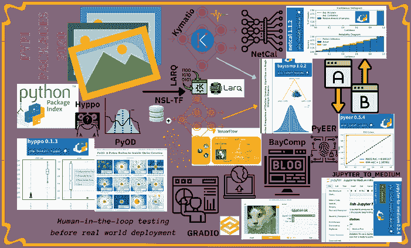

这里列出的所有 PyPi 包的汇编

* * *

## 我们的前三名课程推荐

 1\. [Google 网络安全证书](https://www.kdnuggets.com/google-cybersecurity) - 快速进入网络安全职业

 2\. [Google 数据分析专业证书](https://www.kdnuggets.com/google-data-analytics) - 提升数据分析技能

 3\. [Google IT 支持专业证书](https://www.kdnuggets.com/google-itsupport) - 支持您组织的 IT

* * *

> TL-DR: 精心策划的资源：
> 
> ????????: [Github Repo](https://github.com/vinayprabhu/Favorite_PyPi_2020) 其中包含所有图像、代码和图表
> 
> ???????? : [带有可点击链接的 PDF 汇编](https://github.com/vinayprabhu/Favorite_PyPi_2020/blob/main/PyPi_2020_collage.pdf)
> 
> ????????: [Colab 笔记本](https://github.com/vinayprabhu/Favorite_PyPi_2020/blob/main/Colab_Pypi_Top10.ipynb)
> 
> ????????: [HTML 文档](https://github.com/vinayprabhu/Favorite_PyPi_2020/blob/main/Top_Pypi_2020.html)
> 
> ????????: [PDF 格式的笔记本](https://github.com/vinayprabhu/Favorite_PyPi_2020/blob/main/Top_Pypi_2020.pdf)

### 引言

> *“开源的力量就是人民的力量。人民统治”：****Philippe Kahn***

自从我的博士研究主要涉及在**R**（以及坦白说**Octave/MATLAB**）中进行统计分析以来，我就坚定地拥抱了 Python 作为机器学习者/数据科学家/ *插入最新职业热词*的通用语言。

我的日常工作流程涉及*快速* *响应*混乱现实数据的变化，尽管这些数据常常打破了天真的假设。对我而言，研究生院与工业界之间的一个主要区别是征服内心那个驱使你从零开始实现算法的自我。 一旦过了*白板/假设建立阶段*，我会迅速浏览[PyPi 仓库](https://pypi.org/)检查是否已经有相关模块。这通常接着是

**>>* pip install *PACKAGE_NAME****仪式，结果，我发现自己站在开源巨人的肩膀上，利用他们的精心工作来扩展[DIKW 金字塔](https://en.wikipedia.org/wiki/DIKW_pyramid)。

我撰写了这篇博客文章，以*认可、庆祝并且是，宣传*，一些令人惊叹和*被低估的* PyPi 包，这些包是我过去一年使用的；我强烈认为它们值得我们社区更多的关注和喜爱。这也是我对开源学者的汗水贡献的一次谦逊致敬，这些贡献常常被埋没在*pip install*命令中。

关于子领域偏差的警告：*这篇文章专注于涉及****神经网络/深度学习****的机器学习管道。我计划在不久的将来撰写类似专题的博客文章，如时间序列分析和人体运动学分析。*✌️

接下来是涵盖的 10 个 PyPi 包的基本介绍：

a) **神经网络架构规范和训练**：*NSL-tf*、*Kymatio* 和 *LARQ*

b) **训练后校准和性能基准测试**：*NetCal*、*PyEER* 和 *Baycomp*。

c) **实际部署前的压力测试**：*PyOD*、*HyPPO* 和 *Gradio* d) **文档/传播**：*Jupyter_to_medium*

### 0: 安装上述提到的包 :)

```py
!pip install --quiet neural-structured-learning
!pip install --quiet larq larq-zoo 
!pip install --quiet kymatio
!pip install --quiet netcal
!pip install --quiet baycomp
!pip install --quiet pyeer
!pip install --quiet pyod
!pip install --quiet hyppo
!pip install --quiet gradio
!pip install --quiet jupyter_to_medium
```

### A) 神经网络架构规范和训练：*NSL-tf*、*Kymatio* 和 *LARQ*

### 1: [神经结构学习 - Tensorflow](https://www.tensorflow.org/neural_structured_learning):

大多数现成的机器学习分类算法的核心存在***i.i.d. 谬论***。简而言之，算法设计基于样本在训练集（以及测试集）中是独立且同分布的假设。然而，实际上这很少成立，样本之间存在可以利用的相关性，以实现更好的准确性和解释性。在广泛的应用场景中（见图-1），这些相关性通过一个底层图（G(V,E)）被捕获，该图可以是共同挖掘的或统计推断的。例如，如果你正在执行文本推文的情感检测，底层的关注者-被关注者社交图提供了建模*社交* *背景*的关键线索，这些背景是推文发布的背景信息。这种社交邻域信息可以被用来执行网络辅助分类，这对防范文本唯一的缺陷如讽刺误检和话题标签劫持至关重要。

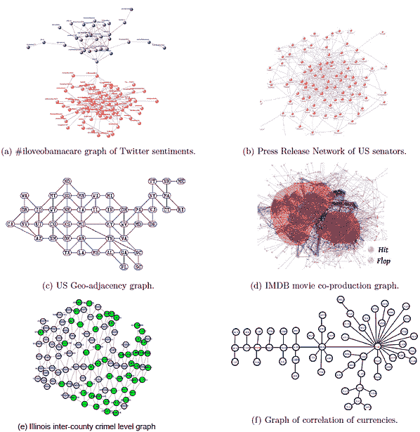

图-1：在线信息图示例

我的[**博士论文**](https://kilthub.cmu.edu/articles/thesis/Network_Aided_Classification_and_Detection_of_Data/7430012/1)题为“网络辅助的数据分类与检测”字面上探讨了这种图增强机器学习的科学和*算法*，看到 Tensorflow 发布了[**神经结构学习**](https://www.tensorflow.org/neural_structured_learning)框架，以及一系列精心制作的教程（YouTube [播放列表](https://www.youtube.com/watch?v=N_IS3x5wFNI&list=PLS6Lwe0CFTqbS8WxxPmil0mCjAHZ0rD1x&ab_channel=TensorFlow)），还有一个易于跟随的[**NSL 示例 colab-notebook**](https://colab.research.google.com/drive/1yidXh-kM6fMi5c0yEXonvG4GFdcDO0-d#scrollTo=gRfU8T3BTYep&line=2&uniqifier=1)，让我感到非常振奋。

在下面的示例单元格中，我们在对抗性环境中训练一个 NSL 增强的神经网络用于标准 MNIST 数据集。

```py
import tensorflow as tf
import neural_structured_learning as nsl
import numpy as np
import matplotlib.pyplot as plt

# Prepare data.
(x_train, y_train), (x_test, y_test) = tf.keras.datasets.mnist.load_data()
x_train, x_test = x_train / 255.0, x_test / 255.0

# Create a base model -- sequential, functional, or subclass.
model = tf.keras.Sequential([
    tf.keras.Input((28, 28), name='feature'),
    tf.keras.layers.Flatten(),
    tf.keras.layers.Dense(128, activation=tf.nn.relu),
    tf.keras.layers.Dense(10, activation=tf.nn.softmax)
])

# Wrap the model with adversarial regularization.
adv_config = nsl.configs.make_adv_reg_config(multiplier=0.2, adv_step_size=0.05)
adv_model = nsl.keras.AdversarialRegularization(model, adv_config=adv_config)

# Compile, train, and evaluate.
adv_model.compile(optimizer='adam',
                  loss='sparse_categorical_crossentropy',
                  metrics=['accuracy'])
adv_model.fit({'feature': x_train, 'label': y_train}, batch_size=32, epochs=5)
adv_model.evaluate({'feature': x_test, 'label': y_test})Epoch 1/5

1875/1875 [==============================] - 39s 2ms/step - loss: 0.5215 - sparse_categorical_crossentropy: 0.4292 - sparse_categorical_accuracy: 0.8781 - scaled_adversarial_loss: 0.0924
Epoch 2/5
1875/1875 [==============================] - 4s 2ms/step - loss: 0.1447 - sparse_categorical_crossentropy: 0.1171 - sparse_categorical_accuracy: 0.9663 - scaled_adversarial_loss: 0.0276
Epoch 3/5
1875/1875 [==============================] - 4s 2ms/step - loss: 0.0944 - sparse_categorical_crossentropy: 0.0758 - sparse_categorical_accuracy: 0.9770 - scaled_adversarial_loss: 0.0186
Epoch 4/5
1875/1875 [==============================] - 4s 2ms/step - loss: 0.0672 - sparse_categorical_crossentropy: 0.0536 - sparse_categorical_accuracy: 0.9840 - scaled_adversarial_loss: 0.0137
Epoch 5/5
1875/1875 [==============================] - 4s 2ms/step - loss: 0.0532 - sparse_categorical_crossentropy: 0.0421 - sparse_categorical_accuracy: 0.9876 - scaled_adversarial_loss: 0.0111

313/313 [==============================] - 1s 2ms/step - loss: 0.0940 - sparse_categorical_crossentropy: 0.0751 - sparse_categorical_accuracy: 0.9761 - scaled_adversarial_loss: 0.0189

***[0.09399436414241791,
 0.07509651780128479,
 0.9761000275611877,
 0.018897896632552147]***Y_pred_test=adv_model.predict({'feature': x_test, 'label': y_test})
Y_pred_test.shape***(10000, 10)***
```

### 2: Kymatio: Python 中的小波散射

这是机器学习中最好的（或最糟糕的？）秘密之一：***很多简单的数据集（如 x-mnist 家族 / cats-v-dogs / Hot-Dog 分类）不需要反向传播/SGD 训练技巧***。

这些类别足够可分，且架构引导的区分能力足够高，通过使用[**Grassmannian 码本**](https://arxiv.org/pdf/1911.07418.pdf)或小波滤波器进行仔细初始化，然后进行“最后一层”超平面学习（使用标准回归技术）应该足以获得一个高准确率的分类器。

在这方面，[**Kymatio**](https://www.kymat.io/)在小波滤波器领域发挥了类似凯撒的角色，将所有以前孤立的项目如 `ScatNet`、`scattering.m`、`PyScatWave`、`WaveletScattering.jl` 和 `PyScatHarm` 整合成一个易于使用的整体便携框架，能够无缝地在六对前端-后端中工作：NumPy (CPU)、scikit-learn (CPU)、纯 PyTorch (CPU 和 GPU)、PyTorch+scikit-cuda (GPU)、TensorFlow (CPU 和 GPU) 以及 Keras (CPU 和 GPU)。

在下面的示例单元格中，我们使用内建的 Scattering2D 类来训练另一个 MNIST 神经网络，该网络在 15 个训练周期中达到了 92.84% 的准确率。这个软件包文档非常完善，包含了大量有趣的示例，如使用 1D 变换的[**口语数字录音分类**](https://www.kymat.io/gallery_1d/plot_classif_torch.html#sphx-glr-gallery-1d-plot-classif-torch-py)和[**3D 变换量子化学回归**](https://www.kymat.io/gallery_3d/scattering3d_qm7_torch.html#sphx-glr-gallery-3d-scattering3d-qm7-torch-py)。

```py
# 1: Importsfrom tensorflow.keras.models import Model
from tensorflow.keras.layers import Input, Flatten, Dense
from kymatio.keras import Scattering2D
# Above, we import the Scattering2D class from the kymatio.keras package.# 2: Model definitioninputs = Input(shape=(28, 28))
x = Scattering2D(J=3, L=8)(inputs)
x = Flatten()(x)
x_out = Dense(10, activation='softmax')(x)
model_kymatio = Model(inputs, x_out)
print(model_kymatio.summary())# 3: Compile and trainmodel_kymatio.compile(optimizer='adam',
              loss='sparse_categorical_crossentropy',
              metrics=['accuracy'])# We then train the model_kymatio using model_kymatio.fit on a subset of the MNIST data.
model_kymatio.fit(x_train[:10000], y_train[:10000], epochs=15,
          batch_size=64, validation_split=0.2)
# Finally, we evaluate the model_kymatio on the held-out test data.model_kymatio.evaluate(x_test, y_test)Model: "model"
_________________________________________________________________
Layer (type)                 Output Shape              Param #   
=================================================================
input_1 (InputLayer)         [(None, 28, 28)]          0         
_________________________________________________________________
scattering2d (Scattering2D)  (None, 217, 3, 3)         0         
_________________________________________________________________
flatten_1 (Flatten)          (None, 1953)              0         
_________________________________________________________________
dense_2 (Dense)              (None, 10)                19540     
=================================================================
Total params: 19,540
Trainable params: 19,540
Non-trainable params: 0
_________________________________________________________________

313/313 [==============================] - 36s 114ms/step - loss: 0.6448 - accuracy: 0.9285***[0.6448228359222412, 0.9284999966621399]***
```

### [3: LARQ](https://docs.larq.dev/zoo/tutorials/)

去年十二月，在温哥华的 NEURIPS-2019 上，我遇到了 LARQ 的开发者，他们展示了他们的新开源 Python 库，用于训练二值化神经网络 (BNNs)，同时展示了他们的论文海报，论文标题为[*潜在权重不存在：重新思考二值化*](https://papers.nips.cc/paper/2019/file/9ca8c9b0996bbf05ae7753d34667a6fd-Paper.pdf)。

神经网络优化。虽然对于资源受限的设备部署模型压缩似乎有很多兴趣（[这里有 42 个](https://awesomeopensource.com/projects/model-compression)！），但从零开始训练快速且简约的二值神经网络似乎是一个许多人在一开始就忽略的选项。

LARQ 包应有助于改变这一情况，考虑到其易用性、快速推断（卷积操作转变为使用二值权重的 xor/位移）、出色的文档和大量的架构示例，用户可以通过完整的模型*[zoo](https://docs.larq.dev/zoo/)*进行修改。今年，我个人使用 LARQ 发布了关于*[风格迁移](https://matthewmcateer.me/posts/bnn-nst/)*和一个*[40 kB BiPedalNet 模型](https://pml4dc.github.io/iclr2020/papers/PML4DC2020_32.pdf)*的工作，使用这个工具包总是非常顺利。除了*[Zoo](https://docs.larq.dev/zoo/)*，该包还配备了一个高度优化的*[计算引擎](https://docs.larq.dev/compute-engine/)*，*目前支持各种移动平台，已在 Pixel 1 手机和 Raspberry Pi 上进行基准测试，还提供了一个为支持的指令集开发的手工优化的 TensorFlow Lite 自定义操作集合，这些操作是用内联汇编或 C++通过编译器内建函数开发的。*

在下面的示例代码单元中，我们训练了一个 13.19 KB 的 BNN，它在 MNIST 数据集上经过 6 个周期达到了 98.31%，并演示了如何轻松地从 LARQ-zoo 中提取一个 SOTA 预训练的*QuickNet*模型并进行推断。

```py
import larq as lq
# MODEL DEFINITION (All quantized layers except the first will use the same options)kwargs = dict(input_quantizer="ste_sign",
              kernel_quantizer="ste_sign",
              kernel_constraint="weight_clip")model_bnn = tf.keras.models.Sequential()# In the first layer we only quantize the weights and not the input
model_bnn.add(lq.layers.QuantConv2D(32, (3, 3),
                                kernel_quantizer="ste_sign",
                                kernel_constraint="weight_clip",
                                use_bias=False,
                                input_shape=(28, 28, 1)))
model_bnn.add(tf.keras.layers.MaxPooling2D((2, 2)))
model_bnn.add(tf.keras.layers.BatchNormalization(scale=False))model_bnn.add(lq.layers.QuantConv2D(64, (3, 3), use_bias=False, **kwargs))
model_bnn.add(tf.keras.layers.MaxPooling2D((2, 2)))
model_bnn.add(tf.keras.layers.BatchNormalization(scale=False))model_bnn.add(lq.layers.QuantConv2D(64, (3, 3), use_bias=False, **kwargs))
model_bnn.add(tf.keras.layers.BatchNormalization(scale=False))
model_bnn.add(tf.keras.layers.Flatten())model_bnn.add(lq.layers.QuantDense(64, use_bias=False, **kwargs))
model_bnn.add(tf.keras.layers.BatchNormalization(scale=False))
model_bnn.add(lq.layers.QuantDense(10, use_bias=False, **kwargs))
model_bnn.add(tf.keras.layers.BatchNormalization(scale=False))
model_bnn.add(tf.keras.layers.Activation("softmax"))# MODEL DEFINITON AND TRAINING print(lq.models.summary(model_bnn))
model_bnn.compile(optimizer='adam',
              loss='sparse_categorical_crossentropy',
              metrics=['accuracy'])x_train_bnn = x_train.reshape((60000, 28, 28, 1))
x_test_bnn = x_test.reshape((10000, 28, 28, 1))
model_bnn.fit(x_train_bnn,y_train, batch_size=64, epochs=6)test_loss, test_acc = model_bnn.evaluate(x_test_bnn, y_test)
print(f"Test accuracy {test_acc * 100:.2f} %")
+sequential_1 summary--------------------------+
| Total params                      93.6 k     |
| Trainable params                  93.1 k     |
| Non-trainable params              468        |
| Model size                        13.19 KiB  |
| Model size (8-bit FP weights)     11.82 KiB  |
| Float-32 Equivalent               365.45 KiB |
| Compression Ratio of Memory       0.04       |
| Number of MACs                    2.79 M     |
| Ratio of MACs that are binarized  0.9303     |
+----------------------------------------------+
***None
313/313 [==============================] - 1s 2ms/step - loss: 0.3632 - accuracy: 0.9831
Test accuracy 98.31 %***Y_pred_bnn = model_bnn.predict(x_test_bnn)
y_pred_bnn=np.argmax(Y_pred_bnn,axis=1)
(y_pred_bnn==y_test).mean()***0.9831***import tensorflow_datasets as tfds
import larq_zoo as lqz
from urllib.request import urlopen
from PIL import Image
#####################################img_path = "https://raw.githubusercontent.com/larq/zoo/master/tests/fixtures/elephant.jpg"with urlopen(img_path) as f:
    img = Image.open(f).resize((224, 224))x = tf.keras.preprocessing.image.img_to_array(img)
x = lqz.preprocess_input(x)
x = np.expand_dims(x, axis=0)
model = lqz.sota.QuickNet(weights="imagenet")
preds = model.predict(x)
pred_dec=lqz.decode_predictions(preds, top=5)[0]
print(f'Top-5 predictions: {pred_dec}')#####################################pred_dec=lqz.decode_predictions(preds, top=5)[0]
plt.imshow(img)
plt.title(f'Top prediction:\n {pred_dec[0]}');***Top-5 predictions: [('n02504458', 'African_elephant', 0.7053231), ('n01871265', 'tusker', 0.2933379), ('n02504013', 'Indian_elephant', 0.001338586), ('n02408429', 'water_buffalo', 7.938418e-08), ('n01704323', 'triceratops', 7.2361296e-08)]***
```


### B) 训练后校准和性能基准测试：NetCal、PyEER 和 BayComp

在本节中，我们将查看在训练后、部署前场景中有用的包，其中从业者的目标是校准预训练模型的输出，并严格基准测试多个适合部署的模型的性能。

### [1: Netcal](https://pypi.org/project/netcal/)：


图-2：缩放与分箱与缩放-分箱。‘B’表示模型的不同概率数

输出。来源：[`arxiv.org/pdf/1909.10155.pdf`](https://arxiv.org/pdf/1909.10155.pdf)

我常常看到机器学习从业者误认为输出的*softmax*值和概率是等同的。它们远非如此！它们在（0,1]空间中的共存使它们伪装成概率，但‘原始’softmax 值，嗯，可以说是‘[未校准](https://arxiv.org/pdf/1706.04599.pdf)’。因此，训练后校准是深度学习中快速增长的工作领域，这里提出的技术大致分为三类（见图-2）：

+   分箱（例如：直方图分箱、等距回归、贝叶斯分箱到分位数（BBQ）、近似等距回归集成（ENIR））

+   缩放（例如: Logistic 校准/Platt 缩放，温度缩放，Beta 校准）

+   [混合缩放-分箱](https://arxiv.org/pdf/1909.10155.pdf) (Python 库: [`pypi.org/project/uncertainty-calibration`](https://pypi.org/project/uncertainty-calibration))

关于上述所有分箱和缩放技术，具有极好编写文档的实现可以在 NetCal 中找到。该包还包括生成可靠性图和估计校准误差指标（如期望/最大/平均校准误差）的原语。

在下面的单元格中，我们使用从上述 NSL 训练模型获得的 MNIST 测试集上的 softmax 值来演示温度缩放校准和可靠性图生成例程的使用。

```py
# In case you also want to try the scaling-binning calibration: #!pip3 install git+https://github.com/p-lambda/verified_calibration.git # PyPi--> Kaputfrom netcal.scaling import TemperatureScaling
import matplotlib.pyplot as plt

### Initialize and transform

temperature = TemperatureScaling()
temperature.fit(Y_pred_test, y_test)
calibrated = temperature.transform(Y_pred_test)
### Visualization

fig, axes = plt.subplots(nrows=1, ncols=2,figsize=(10,4))
axes[0].matshow(Y_pred_test.T,aspect='auto', cmap='jet')
axes[0].set_title("Original Uncalibrated softmax")
axes[0].set_xlabel("Test image index (10k images)")
axes[0].set_ylabel("Class index")
# axes[0].set_xticks([])
axes[1].matshow(calibrated.T,aspect='auto', cmap='jet')
axes[1].set_title("T-scaled softmax")
axes[1].set_xlabel("Test image index (10k images)")
# axes[1].set_xticks([])
plt.tight_layout()
plt.show()
```

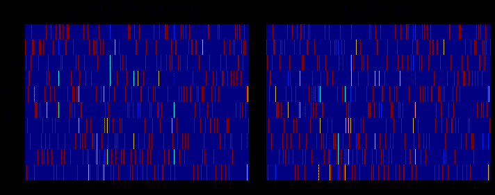

```py
y_pred_nsl=np.argmax(Y_pred_test,axis=1)
ind_correct=np.where(y_pred_nsl==y_test)[0]
ind_wrong=np.where(y_pred_nsl!=y_test)[0]plt.figure(figsize=(10,4))
for i in range(5):
  plt.subplot(1,5,i+1)
  ind_i=ind_correct[i]
  plt.imshow(x_test[ind_i],cmap='gray_r')
  class_pred_i=np.argmax(Y_pred_test[ind_i,:])
  softmax_uncalib_i=str(np.round(Y_pred_test[ind_i,class_pred_i],3))
  softmax_calib_i=str(np.round(calibrated[ind_i,class_pred_i],3))
  plt.title(f'{class_pred_i} | {softmax_uncalib_i} | {softmax_calib_i}')
plt.tight_layout()
plt.suptitle('Correct predictions \n Class | Uncalibrated |  Calibrated');
#############################################
plt.figure(figsize=(10,4))
for i in range(5):
  plt.subplot(1,5,i+1)
  ind_i=ind_wrong[i]
  plt.imshow(x_test[ind_i],cmap='gray_r')
  class_pred_i=np.argmax(Y_pred_test[ind_i,:])
  softmax_uncalib_i=str(np.round(Y_pred_test[ind_i,class_pred_i],3))
  softmax_calib_i=str(np.round(calibrated[ind_i,class_pred_i],3))
  plt.title(f'{class_pred_i} | {softmax_uncalib_i} | {softmax_calib_i}')
plt.tight_layout()
plt.suptitle('Wrong predictions \n Class | Uncalibrated |  Calibrated');
```


```py
from netcal.presentation import ReliabilityDiagram
n_bins = 10
diagram = ReliabilityDiagram(n_bins)
diagram.plot(Y_pred_test, y_test)  # visualize miscalibration of uncalibrated
```

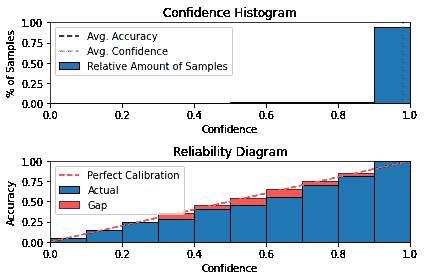

### [2: Baycomp](https://baycomp.readthedocs.io/): 你认为你有一个更好的分类器吗？

一个被低估的难题是，机器学习从业者以及在某些方面，研究论文审稿人，如何严格确定一个分类器模型相对于其他模型的预测优势。像 [Papers with code](https://paperswithcode.com/) 这样的平台通过错误地将 top-1 准确度指标（见下图）作为决定性度量，进一步传播了这种模型排名的误区。


来源: [`paperswithcode.com/sota/image-classification-on-inaturalist-2018`](https://paperswithcode.com/sota/image-classification-on-inaturalist-2018)

那么，考虑到两个具有类似工程开销的分类模型，你如何选择其中一个而不是另一个？通常，我们有一个标准基准数据集（或一组数据集），作为分类器竞争的测试平台。在获得‘*该数据集空间的原始准确度指标*’后，统计思维的机器学习者可能会倾向于使用来自频率学派零假设显著性测试（NHST）框架的工具来确定哪个分类器‘更好’。然而，如 [这里](https://www.jmlr.org/papers/volume18/16-305/16-305.pdf) 所述，“*许多科学领域意识到频率学推理的局限性，在最激进的情况下甚至禁止在出版物中使用它*”。

Baycomp 在这种背景下出现，提供了一个 ***用于比较分类器的贝叶斯框架***。该库帮助计算三个概率：

+   P_left: 第一个分类器比第二个分类器具有更高准确度得分的概率。

+   P_rope: 差异在实际等效区域（rope）内的概率

+   P_right: 第二个分类器具有更高得分的概率。

**实用等效区域**（rope）由机器学习者指定，该学习者对在部署领域中可以安全假设为*等效*的内容非常熟悉。

在下面的示例单元中，我们考虑了一个合成示例，其中包括两个紧密竞争的分类器以及我们刚刚使用 NSL-TF 和 LARQ-BNN 框架在 MNIST 数据集上训练的两个分类器。

```py
# Helper function to plot the accuracies
def bar_plt2(acc_1,acc_2,label_1='Legacy classifier',label_2='New classifier',X_LABELS=['default'],Category_x='Dataset'):
  # set width of bar

  if(X_LABELS==['default']):
    X_LABELS=list(string.ascii_uppercase[0:len(acc_1)])
  barWidth = 0.25

  # Set position of bar on X axis
  r1 = np.arange(len(acc_1))
  r2 = [x + barWidth for x in r1]

  # Make the plot
  plt.bar(r1, acc_1, color='#7f6d5f', width=barWidth, edgecolor='white', label=label_1)
  plt.bar(r2, acc_2, color='#557f2d', width=barWidth, edgecolor='white', label=label_2)

  # Add xticks on the middle of the group bars
  plt.xlabel(Category_x, fontweight='bold')
  plt.xticks([r + barWidth for r in range(len(acc_1))],X_LABELS)
  plt.title('Accuracy comparison of the two classifiers') 

  # Create legend & Show graphic
  plt.legend()
  plt.show()
  return Noneimport string
from baycomp import *
# First, let us generate two synthetic classifier accuracy vectors across 10 hypothetical datasets.
# Accuracies obtained by a legacy classifier
classifier_legacy_acc=np.random.randint(80,85,size=(10))
mean_legacy=np.mean(classifier_legacy_acc)
# Accuracies obtained by a new-proposed classifier
classifier_new_acc=np.random.randint(80,87,size=(10))
mean_new=np.mean(classifier_new_acc)
print(f'The mean accuracies of the two classifiers are: {mean_legacy} and {mean_new}')

bar_plt2(classifier_legacy_acc,classifier_new_acc)The mean accuracies of the two classifiers are: 82.0 and 81.8
```

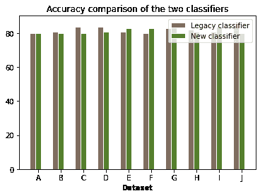

```py
print('$p_{left}, p_{rope},p_{right}$ using the two_on_multiple function: ')
print(two_on_multiple(classifier_legacy_acc, classifier_new_acc, rope=1))

# With some additional arguments, the function can also plot the posterior distribution from 
# which these probabilities came.
# Tests are packed into test classes. 
# The above call is equivalent to

print('$p_{left}, p_{rope},p_{right}$ using the SignedRankTest.probs function: ')
print(SignedRankTest.probs(classifier_legacy_acc, classifier_new_acc, rope=1))

# and to get a plot, we call

print(SignedRankTest.plot(classifier_legacy_acc, classifier_new_acc, rope=1, names=("Legacy-SRT", "New-SRT")))

# To switch to another test, use another class:
SignTest.probs(classifier_legacy_acc, classifier_new_acc, rope=1)
# Finally, we can construct and query sampled posterior distributions.

posterior = SignedRankTest(classifier_legacy_acc, classifier_new_acc, rope=1)
print(posterior.probs())
posterior.plot(names=("legacy-Post", "new-Post"))$p_{left}, p_{rope},p_{right}$ using the two_on_multiple function: 
(0.28222, 0.4604, 0.25738)
$p_{left}, p_{rope},p_{right}$ using the SignedRankTest.probs function: 

***(0.28056, 0.46356, 0.25588)***
######################################################
acc_bnn=np.zeros(10)
acc_nsl=np.zeros(10)
for c in range(10):
  mask_c=y_test==c
  acc_bnn[c]= (y_pred_bnn[mask_c]==c).mean()
  acc_nsl[c]= (y_pred_nsl[mask_c]==c).mean()

bar_plt2(acc_nsl,acc_bnn,label_1='NSL',label_2='BNN',X_LABELS=list(np.arange(10).astype(str)),Category_x='MNIST digit classes')
posterior = SignedRankTest(acc_nsl, acc_bnn, rope=0.005)
print(posterior.probs())
posterior.plot(names=("NSL", "BNN"))
***(0.0, 0.2846, 0.7154)***
```

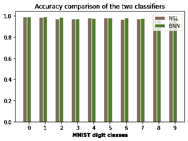


使用 baycomp 比较分类器 +NSL 与 BNN 分类器在 MNIST 数据集上的比较

***重要警告***：*有关机器学习中预测准确性崇拜的相关但不同的讨论。这*[*预测主义与适应辩论*](https://plato.stanford.edu/entries/prediction-accommodation/#:~:text=The%20view%20that%20predictions%20are,when%20predicted%20than%20when%20accommodated.)*在科学中自 19 世纪的约翰·赫歇尔和威廉·惠更斯时代以来一直在演变。*

### [3: PyEER](https://pypi.org/project/pyeer/)


PyEER 中可用的方法广泛

比较两个分类器的另一种方法，特别是在解决二元身份验证问题的背景下（而非*监控*而是*身份验证*），是通过绘制比较检测错误权衡（DET）和接收器操作特性（ROC）图。PyEER 在这方面是绝对的杰作，因为它不仅可以绘制相关图形，还能自动生成指标报告和估算 EER 最佳阈值。在下面的示例单元中，我们比较了即将在下一节介绍的角度基础异常检测器（ABOD）和 KNN 内点-外点检测器二元分类器。

```py
from pyeer.eer_info import get_eer_stats
from pyeer.report import generate_eer_report, export_error_rates
from pyeer.plot import plot_eer_stats

# Gather up all the 'Genuine scores' and the 'impostor scores'

gscores_abod=y_test_proba_abod[y_test_ood==0,0]
iscores_abod=y_test_proba_abod[y_test_ood==1,0]

gscores_knn=y_test_proba_knn[y_test_ood==0,0]
iscores_knn=y_test_proba_knn[y_test_ood==1,0]

# Calculating stats for classifier A
stats_abod = get_eer_stats(gscores_abod, iscores_abod)

# Calculating stats for classifier B
stats_knn = get_eer_stats(gscores_knn, iscores_knn)
print(f'EER-KNN = {stats_knn.eer}, EER-ABOD = {stats_abod.eer}')
plot_eer_stats([stats_abod, stats_knn], ['ABOD', 'KNN'])##############################
import matplotlib.image as mpimg
img1 = mpimg.imread('DET.png')
img2 = mpimg.imread('ROC.png')

plt.figure(figsize=(9,4))
plt.subplot(121)
plt.imshow(img1)

plt.subplot(122)
plt.imshow(img2)
plt.show()EER-KNN = 0.0, EER-ABOD = 0.008333333333333333
```


### C: 现实世界部署前的压力测试：PyOD、HyPPO 和 Gradio

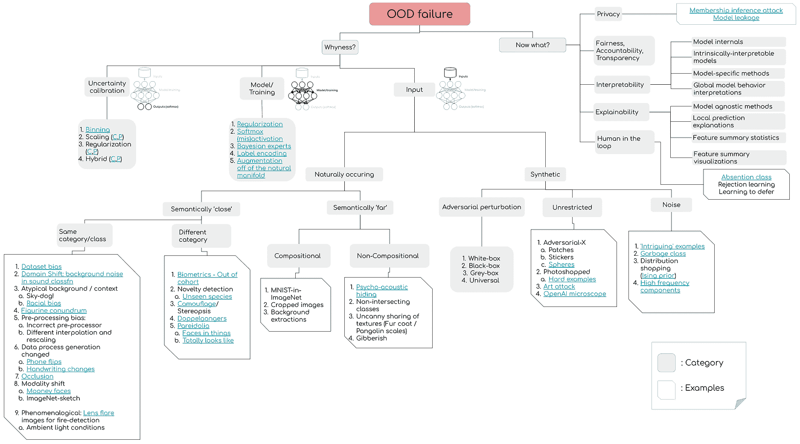

OOD 易感性的全景：访问 SVG [这里](https://matthew-mcateer.github.io/oodles-of-oods/)

对于外部分布（OOD）样本造成的自信错误预测，目前是从理论论文过渡到现实世界部署中最严重的障碍之一，因为输入没有从所谓的*训练流形*中获得保证。在与[Matthew McAteer](https://matthew-mcateer.github.io/oodles-of-oods/)的联合项目中，我创建了一个易感性全景（见上图），这应该能够帮助机器学习者覆盖与他们的模型相关的广泛特定易感性向量。

虽然没有银弹（可能永远也不会有——见 [这篇](https://arxiv.org/pdf/1802.08686.pdf) 和 [这篇](https://arxiv.org/abs/1809.02104)），但很难反对在你的管道中加入 OOD 模型正则化和 OOD 检测模块。

关于 OOD 检测，我认为 ML 社区有三项近期努力被低估了。

前两个， *PyOD* 和 *HyPPO*，在进行推理前有助于预筛选输入，而第三个，Gradio，是一个出色的人机交互白帽压力测试工具，补充了如 [Dynabench](https://dynabench.org/) 这样的 FAIR 努力。

### [1: PYOD](https://pyod.readthedocs.io/en/latest/)

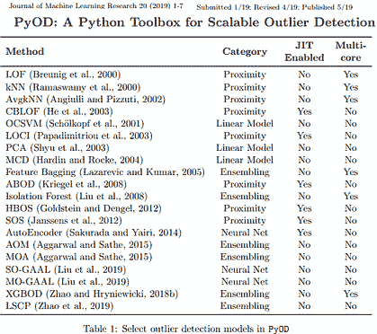

来源：[`www.jmlr.org/papers/volume20/19-011/19-011.pdf`](https://www.jmlr.org/papers/volume20/19-011/19-011.pdf)

PyOD 可以说是最全面和可扩展的异常检测 Python 工具包，包含了 30 多种检测算法的实现！

学生维护的 PyPi 包能够结合软件工程最佳实践，这确保了实现的模型类都经过了单元测试、跨平台持续集成、代码覆盖率和代码可维护性检查，这种情况比较少见。这与清晰统一的 API、详细的文档以及即时（JIT）编译执行相结合，使得学习不同技术和实际使用变得异常轻松。作者在仔细并行化方面投入的努力，使得异常检测代码不仅非常快速且可扩展，而且在 *Python 2 和 3 及主要操作系统（Windows、Linux 和 MacOS）* 上也无缝兼容。

在下面的示例单元格中，我们训练并可视化了两个内点-外点检测器二元分类器在一个合成数据集上的结果：角度基础异常检测器（ABOD）和 KNN 异常检测器。

```py
from pyod.models.abod import ABOD
from pyod.models.knn import KNN   # kNN detector
from pyod.utils.data import generate_data
from pyod.utils.data import evaluate_print
from pyod.utils.example import visualize
# Generate sample data with pyod.utils.data.generate_data():contamination = 0.4  # percentage of outliers
n_train = 200  # number of training points
n_test = 100  # number of testing pointsX_train_ood, y_train_ood, X_test_ood, y_test_ood = generate_data(n_train=n_train, n_test=n_test, contamination=contamination)
##### 1: ABOD
clf_name_1 = 'ABOD'
clf_abod = ABOD(method="fast") # initialize detector
clf_abod.fit(X_train_ood)y_train_pred_abod = clf_abod.predict(X_train_ood) # binary labels
y_test_pred_abod = clf_abod.predict(X_test_ood) # binary labelsy_test_scores_abod = clf_abod.decision_function(X_test_ood) # raw outlier scores
y_test_proba_abod = clf_abod.predict_proba(X_test_ood) # outlier probabilityevaluate_print("ABOD", y_test_ood, y_test_scores_abod) # performance evaluation####### 2 : KNN
clf_knn = KNN() # initialize detector
clf_knn.fit(X_train_ood)y_train_pred_knn = clf_knn.predict(X_train_ood) # binary labels
y_test_pred_knn = clf_knn.predict(X_test_ood) # binary labelsy_test_scores_knn = clf_knn.decision_function(X_test_ood) # raw outlier scores
y_test_proba_knn = clf_knn.predict_proba(X_test_ood) # outlier probabilityevaluate_print("KNN", y_test_ood, y_test_scores_knn) # performance evaluationABOD ROC:0.9992, precision @ rank n:0.975
KNN ROC:1.0, precision @ rank n:1.0
```

现在，让我们可视化结果：

```py
# ABOD Performance
visualize("ABOD", X_train_ood, y_train_ood, X_test_ood, y_test_ood, y_train_pred_abod,
          y_test_pred_abod, show_figure=True, save_figure=False)
# KNN Performance;
visualize("KNN", X_train_ood, y_train_ood, X_test_ood, y_test_ood, y_train_pred_knn,
          y_test_pred_knn, show_figure=True, save_figure=False)
```

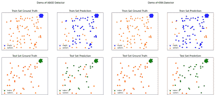

ABOD 与 KNN 在异常检测中的对比

### [2: Hyppo](https://hyppo.neurodata.io/index.html):

目睹深度学习社区普遍存在这种集体遗忘现象，继续将 OOD 易感性视为一种独特的“深度神经网络”缺陷，似乎需要一个深度学习解决方案，而完全忽视了统计学社区已经探索过的一系列方法和解决方案，这有些令人困惑。

有人可能会认为，按定义，OOD（异常检测）属于多变量假设检验框架的范畴，因此看到深度学习 OOD 论文没有将其炫目的新深度方法与可能存在的传统假设检验算法进行基准测试，实在令人沮丧。在这种背景下，我们现在介绍 HYPPO。

HYPPO（**HYP**othesis Testing in **P**yth**O**n，发音为“Hippo”）可以说是由[NEURODATA](https://neurodata.io/)社区生产的最全面的开源多变量假设检验软件包。在下图中，我们可以看到这个包中实现的模块的全景，涵盖了合成数据生成（具有 20 种依赖结构！）、独立性测试、K 样本测试以及时间序列测试。


Hyppo 中实现的算法全景

在下面的示例单元格中，我们看到使用 K-Sample-Distance Correlation（或称“Dcorr”）测试来检验 PyOD 中 generate_data()模块生成的内外分布数据。在深度学习环境中，我们可以在输入层级别或特征嵌入空间中部署这些测试，以估计输出的 softmax 值是否值得进一步在推理管道中处理。

```py
from hyppo.ksample import KSample
samp_in_train= X_train_ood[y_train_ood==0]
samp_out_train= X_train_ood[y_train_ood==1]

samp_in_test= X_test_ood[y_test_ood==0]
samp_out_test= X_test_ood[y_test_ood==1]

stat_in_out, pvalue_in_out = KSample("Dcorr").test(samp_in_train, samp_out_test)
print(f'In-train v/s Out-test \n Energy test statistic: {stat_in_out}. Energy p-value: {pvalue_in_out}')

stat_out_in, pvalue_out_in = KSample("Dcorr").test(samp_in_test, samp_out_train)
print(f'In-test v/s Out-train \n Energy test statistic: {stat_out_in}. Energy p-value: {pvalue_out_in}')

stat_in_in, pvalue_in_in = KSample("Dcorr").test(samp_in_train, samp_in_test)
print(f'In-train v/s In-test \n Energy test statistic: {stat_in_in}. Energy p-value: {pvalue_in_in}')

stat_out_out, pvalue_out_out = KSample("Dcorr").test(samp_out_train, samp_out_test)
print(f'Out-train v/s Out-test \n Energy test statistic: {stat_out_out}. Energy p-value: {pvalue_out_out}')In-train v/s Out-test 
 Energy test statistic: 0.8626341445137959\. Energy p-value: 4.357148137679374e-32
In-test v/s Out-train 
 Energy test statistic: 0.7584832208162725\. Energy p-value: 4.0495216242247524e-25
In-train v/s In-test 
 Energy test statistic: -0.005691336487203311\. Energy p-value: 1.0
Out-train v/s Out-test 
 Energy test statistic: 0.006631965940452427\. Energy p-value: 0.18021672902891694
```

### [3: Gradio](https://gradio.app/ml_examples)：


Gradio 的显著性裁剪算法：[`saliency-model.gradiohub.com/`](http://saliency-model.gradiohub.com/)

迄今为止，与刚刚训练的模型交互所需的良好 GUI 通常需要大量的 JavaScript 前端技巧或 Heroku-Flask 路线，这可能会使算法的重点分散。

借助 Gradio，可以用不到 10 行 Python 代码快速启动一个 GUI，包含文本输入、图像输入（配备了出色的 Toast-UI 图像编辑器）和一个素描板！

在过去的一年里，我在工作流程中大量使用了 Gradio，用它来调查 Twitter 的显著性裁剪算法为何会产生如此种族偏见的结果（见左图），以及为什么 Onions 会触发[facebook](https://www.bbc.com/news/54467384)上的 NSFW 过滤器（见下方推文）。

[NSFW-Onion](https://github.com/vinayprabhu/Crimes_of_Vision_Datasets/blob/master/Notebooks/Notebook_5b_Onion_Gradio_NSFW.ipynb)的灾难。Colab 笔记本：[`github.com/vinayprabhu/Crimes_of_Vision_Datasets/blob/master/Notebooks/Notebook_5b_Onion_Gradio_NSFW.ipynb`](https://github.com/vinayprabhu/Crimes_of_Vision_Datasets/blob/master/Notebooks/Notebook_5b_Onion_Gradio_NSFW.ipynb)

在下面的示例单元格中，我们展示了两个简单的示例，使用 Gradio 启动 UI，以对我们刚刚训练的 MNIST 分类 BNN 模型进行压力测试，并演示了使用 InceptionV3 模型进行图像分类的简便性。Gradio 团队还迅速添加了解释性和嵌入可视化工具，并实现了 SOTA 的[盲超分辨率](https://gradio.app/g/dawoodkhan82/dan)和[实时高分辨率背景抠图](https://gradio.app/g/BackgroundMattingV2) UI！

```py
import gradio as gr
import requests
inception_net = tf.keras.applications.InceptionV3() # load the model
# Download human-readable labels for ImageNet.
response = requests.get("https://git.io/JJkYN")
labels = response.text.split("\n")

def classify_image(inp):
  print(inp.shape)
  inp = inp.reshape((-1, 299, 299, 3))
  inp = tf.keras.applications.inception_v3.preprocess_input(inp)
  prediction = inception_net.predict(inp).flatten()
  return {labels[i]: float(prediction[i]) for i in range(1000)}

image = gr.inputs.Image(shape=(299, 299, 3))
label = gr.outputs.Label(num_top_classes=3)

gr.Interface(fn=classify_image, inputs=image, outputs=label, capture_session=True).launch()import gradio as gr
import requests

# EXAMPLE-1:We use the LARQ trained BNN to launch an interactive UI that facilitates a sktechpad inoput and prediction
def classify(image):
  print(image.shape)
  prediction = model_bnn.predict(image.reshape((-1,28,28,1))).tolist()[0]
  return {str(i): prediction[i] for i in range(10)}

sketchpad = gr.inputs.Sketchpad()
label = gr.outputs.Label(num_top_classes=3)
gr.Interface(fn=classify, inputs=sketchpad, outputs=label, capture_session=True).launch()# EXAMPLE-2:Image-classifcation with InceptionNet-V3inception_net = tf.keras.applications.InceptionV3() # load the model
# Download human-readable labels for ImageNet.
response = requests.get("https://git.io/JJkYN")
labels = response.text.split("\n")

def classify_image(inp):
  print(inp.shape)
  inp = inp.reshape((-1, 299, 299, 3))
  inp = tf.keras.applications.inception_v3.preprocess_input(inp)
  prediction = inception_net.predict(inp).flatten()
  return {labels[i]: float(prediction[i]) for i in range(1000)}

image = gr.inputs.Image(shape=(299, 299))
label = gr.outputs.Label(num_top_classes=3)

gr.Interface(fn=classify_image, inputs=image, outputs=label, capture_session=True).launch()
```


Gradio MNIST 分类与草图输入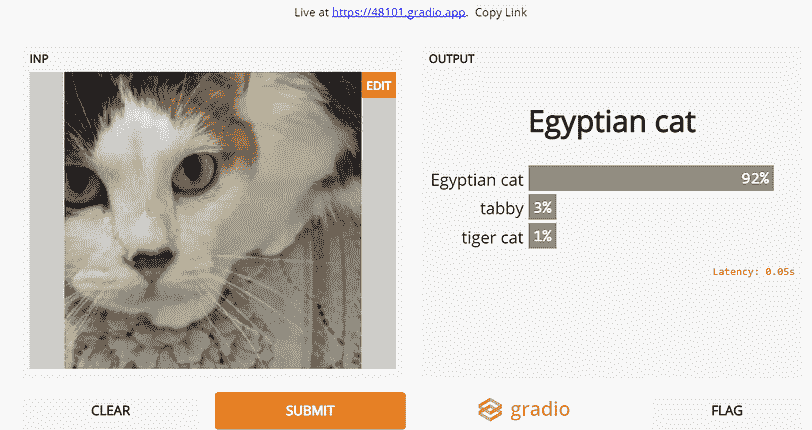

Gradio 图像分类（InceptionV3）与图像输入

### D) 文档/传播：

### 1) Jupyter_to_medium:

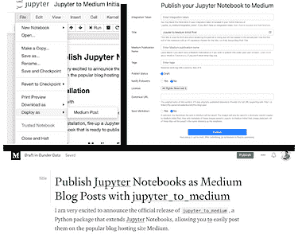

示例图像。来源：[`www.dexplo.org/jupyter_to_medium/`](https://www.dexplo.org/jupyter_to_medium/)

*Jupyter_to_medium 包* 的视频教程

最后但同样重要的是，我使用了*Jupyter_to_medium* PyPi 包来撰写本博客文章，来源于它的[source notebook](https://github.com/vinayprabhu/Favorite_PyPi_2020)! 正如你们中的许多人可能经历过的，将你的 Jupyter/Colab 笔记本转换为可读的博客文章涉及到痛苦的复制粘贴、代码截图和插件花招。自从这个改变游戏规则的包发布以来，这些问题已经成为过去。

这个过程非常简单：pip 安装，完成笔记本，选择文件→‘部署为’，插入来自 medium 的集成令牌，然后进行最终编辑/美化（如有必要）。

最后，我要感谢那些创造了这些精彩 PyPi 包的杰出研究人员和工程师。在即将到来的博客文章中，我计划涵盖与特定主题相关的包，如时间序列分析和降维。这里有一张回顾图片，总结了上述探索的包。

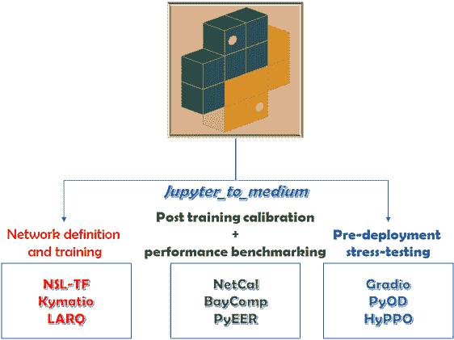

本博客文章中涵盖的 PyPi 生态系统回顾

希望你们中的一些人在机器学习冒险中能发现这篇博客文章有所帮助。祝好运，并祝大家 2021 年快乐高效 ????

随时欢迎对内容/错误/坏链进行反馈。你可以通过[Linkedin](https://www.linkedin.com/in/vinay-prabhu-84619785/)或[Twitter](https://twitter.com/vinayprabhu)与我联系 ????

**个人简介：[Vinay Uday Prabhu](https://vinayprabhu.github.io/)** 是 UnifyID Inc. 的首席科学家。

[原文](https://towardsdatascience.com/most-useful-machine-learning-pypi-packages-of-2020-a0ec6678ce22)。已获许可转载。

**相关内容：**

+   数据科学作为产品 – 为什么这么难？

+   生成美丽的神经网络可视化

+   使用 Pomegranate 进行快速直观的统计建模

### 更多相关话题

+   [成为出色数据科学家所需的 5 个关键技能](https://www.kdnuggets.com/2021/12/5-key-skills-needed-become-great-data-scientist.html)

+   [每个初学数据科学家都应该掌握的 6 种预测模型](https://www.kdnuggets.com/2021/12/6-predictive-models-every-beginner-data-scientist-master.html)

+   [2021 年最佳 ETL 工具](https://www.kdnuggets.com/2021/12/mozart-best-etl-tools-2021.html)

+   [使用管道编写干净的 Python 代码](https://www.kdnuggets.com/2021/12/write-clean-python-code-pipes.html)

+   [是什么使得 Python 成为初创公司理想的编程语言](https://www.kdnuggets.com/2021/12/makes-python-ideal-programming-language-startups.html)

+   [每个数据科学家都应该知道的三大 R 库（即使你使用 Python）](https://www.kdnuggets.com/2021/12/three-r-libraries-every-data-scientist-know-even-python.html)
