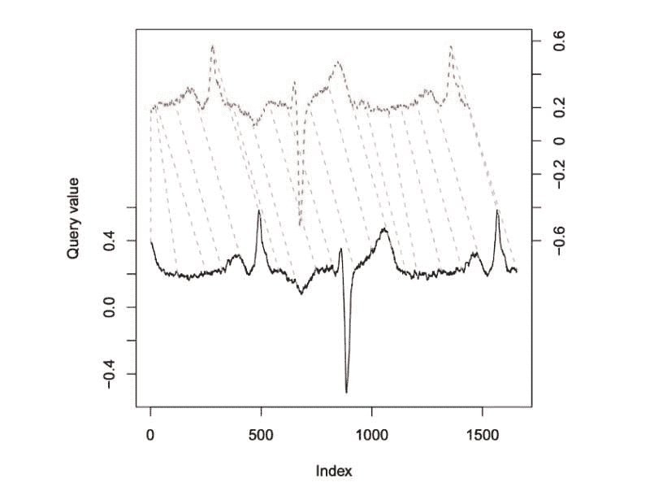

# 10 个被低估的 Python 技能

> 原文：[`www.kdnuggets.com/2020/10/10-underrated-python-skills.html`](https://www.kdnuggets.com/2020/10/10-underrated-python-skills.html)

评论 

照片由[杰曼·乌林瓦](https://www.pexels.com/@roseleon?utm_content=attributionCopyText&utm_medium=referral&utm_source=pexels)提供，来源于[Pexels](https://www.pexels.com/photo/photo-of-woman-leaning-on-wooden-fence-3321584/?utm_content=attributionCopyText&utm_medium=referral&utm_source=pexels)。

* * *

## 我们的前三个课程推荐

 1. [谷歌网络安全证书](https://www.kdnuggets.com/google-cybersecurity) - 快速进入网络安全职业的快车道。

 2. [谷歌数据分析专业证书](https://www.kdnuggets.com/google-data-analytics) - 提升你的数据分析能力

 3. [谷歌 IT 支持专业证书](https://www.kdnuggets.com/google-itsupport) - 支持你组织的 IT 需求

* * *

在 2012 年的一篇文章中，*[哈佛商业评论](https://hbr.org/2012/10/data-scientist-the-sexiest-job-of-the-21st-century)*描绘了[data science teams](https://medium.com/atlas-research/data-science-team-eae84b1af65d)从数据中轻松创建可操作信息的愿景。

虽然这还不是*海滩救护队*，但数据科学是一个充满活力的领域，具有从组织的顶级战略资产——优良的数据基础设施中产生有价值见解的巨大潜力。

为了帮助你的数据科学工作，这里有**十个被低估的 Python 技能**。掌握这些能力会——我敢说——使你成为一个更具吸引力的数据科学家。我们的团队兼具美貌与智慧，同时推动极限，拯救处于危险中的人，并做出英雄般的行为。所以让我们开始吧。

### #10 — 设置虚拟环境

虚拟环境为你的 Python 项目设置了一个隔离的工作空间。无论你是独立工作还是与合作伙伴一起工作，拥有一个虚拟环境都有以下好处：

1.  避免包冲突

1.  提供清晰的视角，查看包的安装位置

1.  确保项目中使用的包版本的一致性

使用虚拟环境允许你（和你的团队成员）为不同的项目拥有不同的依赖项。在虚拟环境中，你可以测试安装包而不会污染系统安装。


“我有点喜欢这里。它很私密。”——*《神秘博士》*的杰米·海涅曼。照片由[NASA](https://unsplash.com/@nasa?utm_source=medium&utm_medium=referral)提供，来源于[Unsplash](https://unsplash.com/?utm_source=medium&utm_medium=referral)。

部署 [venv 模块](https://docs.python.org/3/library/venv.html) 对于避免后续问题非常有帮助，所以在开始你的项目时不要跳过这一步。

[*了解更多*](https://avilpage.com/2020/02/reduce-python-package-footprint.html)*：通过设置一个包含最常用科学计算包的虚拟环境来节省空间——并避免在不同位置安装相同版本的多个包。然后将该公共环境作为 .pth 文件分享给项目特定环境。*

### #9 — 按照 PEP8 标准进行注释

编写好的注释可以提高自信心和协作能力。在 Python 中，这意味着遵循 [PEP8](https://www.python.org/dev/peps/pep-0008/#comments) 风格指南。

注释应该是声明性的，例如：

```py
# Fix issue with utf-8 parsing
```

**不** `# 修复问题`

下面是一个包含 [docstring](https://www.python.org/dev/peps/pep-0257/) 的示例，这是一种特殊类型的注释，用于解释函数的目的：

```py
def persuasion():
   """Attempt to get point across."""
   print('Following this advice about writing proper Python comments will make you popular at parties')
```

Docstrings 特别有用，因为你的 IDE 会识别这个字符串文字作为与类相关的定义。在 Jupyter Notebook 中，你可以通过将光标放在函数的末尾，并同时按下 Shift 和 Tab 来查看函数的 docstring。

### #8 — 查找好的实用代码

你一定听过“站在巨人的肩膀上”这个表达。Python 是一个资源极其丰富的语言。通过认识到你不必单打独斗，你可以并且应该重用前人编写的实用代码，从而加速你的数据科学发现。

一个很好的实用代码来源是 [Chris Albon](https://chrisalbon.com/) 的博客，他是 [机器学习闪卡](https://machinelearningflashcards.com/) 的创建者，这些闪卡装饰了我家办公室/卧室的墙壁。他的网站首页提供了数百个代码片段，以加速你在 Python 中的工作流程。

例如，Chris 向我们展示了如何[对数据框应用函数](https://chrisalbon.com/python/data_wrangling/pandas_apply_function_by_group/)（例如 pandas 的滚动均值 — .rolling()），按组进行：

```py
df.groupby('lifeguard_team')['lives_saved'].apply(**lambda** x:x.rolling(center=False,window=**2**).mean())
```

这段代码输出一个数据框，其中包含每两行的滚动平均值，并在 .groupby() 语句的第一部分中对每个组重新开始。

### #7 — 使用 pandas-profiling 进行自动化 EDA

使用 [panda-profiling 工具包](https://pandas-profiling.github.io/pandas-profiling/docs/master/rtd/) 自动化你的探索性数据分析。EDA 是任何数据科学项目的关键阶段零。它通常涉及基本的统计分析以及查看特征之间的相关性。


[pandas-profiling](https://pandas-profiling.github.io/pandas-profiling/docs/master/rtd/)来救援。照片由[NeONBRAND](https://unsplash.com/@neonbrand?utm_source=medium&utm_medium=referral)拍摄，来自[Unsplash](https://unsplash.com/?utm_source=medium&utm_medium=referral)

本文带你通过标准的‘手动’数据探索方法，并将其与 pandas-profiling 库创建的自动报告进行比较：

[**通过 Pandas-profiling 改进 EDA**](https://towardsdatascience.com/a-better-eda-with-pandas-profiling-e842a00e1136)

探索性数据分析已死，万岁 Pandas-profiling！用更少的努力完美概述你的数据。

### #6 — 使用 qcut 改进目标分析

在这段关于改善机器学习工作流的优秀视频中，[Rebecca Bilbro](https://rebeccabilbro.github.io/)提供了明智的建议，即在进行特征分析之前，先查看你的目标列。

[从终点开始思考](https://amzn.to/3jVSt31)——这种方式可以在开始预测或分类之前，帮助你对目标变量有一个扎实的理解。采用这种方法有助于你提前识别可能棘手的问题（例如，[类别不平衡](https://towardsdatascience.com/how-to-handle-smote-data-in-imbalanced-classification-problems-cf4b86e8c6a1)）。

如果你正在处理一个连续变量，将你的值进行分箱可能会很有用。使用 5 个箱子可以利用帕累托原则。要创建五分位数，只需使用 pandas 的 q-cut 函数：

```py
amount_quintiles = pd.qcut(df.amount, q**=**5)
```

每个区间将包含你数据集的 20%。将目标变量的最高五分位数与最低五分位数进行比较通常会得到有趣的结果。这种技术是确定目标变量中顶尖（或底层）表现者可能存在异常的良好起点。

要进一步学习，也可以查看 Rebecca 在[Women Who Code DC](https://medium.com/u/d6aacbc643bf?source=post_page-----dfdff5741fdf--------------------------------)职业系列中的表现，由我亲自采访：

### #5 — 在特征分析中添加可视化

可视化不仅仅用于商业智能仪表盘。在你调查新数据集时，加入一些有用的图表和图形可以加快洞察的速度。


[Seaborn 示例图库](https://seaborn.pydata.org/examples/index.html)

有许多可能的方法可以使用数据可视化来提升你的分析能力。一些资源供你探索：

+   [Seaborn 示例图库](https://seaborn.pydata.org/examples/index.html)

+   [Bokeh notebook 示例](https://docs.bokeh.org/en/latest/docs/gallery.html#notebook-examples)

+   [Yellowbrick 图库](https://www.scikit-yb.org/en/latest/gallery.html)

+   [数据探索的 Streamlet](https://towardsdatascience.com/the-most-useful-ml-tools-2020-e41b54061c58)（感谢 [Ian Xiao](https://medium.com/u/a0eb4622a0ca?source=post_page-----dfdff5741fdf--------------------------------) 提供这个提示！）

+   [Tableau 入门指南](https://towardsdatascience.com/new-data-science-f4eeee38d8f6)

### #4 — 测量和优化运行时间

数据科学家有点以“修补匠”著称。但随着该领域 [越来越接近软件工程](https://towardsdatascience.com/must-read-data-science-papers-487cce9a2020)，对简洁、高性能代码的需求增加了。程序的性能应在时间、空间和磁盘使用方面进行评估——这些是可扩展性能的关键。

Python 提供了一些 [性能分析工具](https://docs.python.org/3/library/profile.html) 来展示你的代码在哪里花费时间。为了支持函数运行时的监控，Python 提供了 [timeit](https://docs.python.org/3/library/timeit.html) 函数。

```py
**%%**timeitfor i in range(100000):
    i **=** i******3
```

在使用 pandas 时改进代码的一些快速技巧：

1.  按照 pandas 预期的方式使用：不要循环遍历数据框的行——改用 [apply](https://pandas.pydata.org/pandas-docs/stable/reference/api/pandas.DataFrame.apply.html) 方法

1.  利用 [NumPy](https://numpy.org/) 数组实现更高效的编码

### #3— 简化时间序列分析

处理时间序列可能会让人感到畏惧。我的训练营讲师在准备讲解这个主题的那一天，面带忧虑的神情出现在课堂上。

幸运的是，[dtw-python 包](https://pypi.org/project/dtw-python/) 提供了一种直观的方式来比较时间序列。简言之，动态时间规整计算不同长度的两个数组或时间序列之间的距离。



通过 [The dtw Package](https://www.jstatsoft.org/article/view/v031i07) 对齐两个时间序列

首先，DTW 拉伸和/或压缩可能长度不同的序列，使它们尽可能地相似。借用一个语音识别的例子，使用这种技术可以帮助算法识别“now”和“nowwwwwwww”是相同的词，无论是由急躁的成年人还是暴躁的幼儿说的。经过转换后，包计算对齐后的单个元素之间的距离。

了解更多：

+   [在此下载论文](https://www.jstatsoft.org/article/view/v031i07)（最初在 R 中实现，但同样适用于 Python）

+   [在这里阅读用例](https://scholar.google.it/scholar?oi=bibs&hl=it&cites=5151555337428350289)

+   在 Google Colab 上自己试验 DTW Python，点击 [这里](https://colab.research.google.com/drive/1-fbhBlKRrEG8jkqoBAWOAzWaOarDQcDp?usp=sharing) 和 [这里](https://colab.research.google.com/github/nipunbatra/blog/blob/master/_notebooks/2014-05-01-dtw.ipynb)。

### #2 — 设置 ML Flow 进行实验跟踪

[ML Flow](https://mlflow.org/docs/latest/index.html) 支持跟踪参数、代码版本、度量和输出文件。MlflowClient 函数创建和管理实验、管道运行和模型版本。使用 `mlflow.log_artifact`、`.log_metric()` 和 `.log_param()` 记录工件（例如数据集）、度量和超参数。

你可以通过 `mlflow ui` 命令在本地主机浏览器中轻松查看所有实验的元数据和结果。

另外，查看这个关于数据科学工作流的完整指南：

[**模型选择综合指南**](https://medium.com/atlas-research/model-selection-d190fb8bbdda)

选择正确算法的系统化方法。

### #1 — 理解 `__main__` 函数

使用 `if __name__ == '__main__'` 提供了从命令行执行代码或将代码作为包导入到交互环境中的灵活性。这个条件语句控制程序在特定上下文中如何执行。

你应该预期到，作为可执行文件运行代码的用户，其目标与将代码作为包导入的用户不同。`if __name__ == '__main__'` 语句提供了基于代码执行环境的控制流。

+   `__name__` 是模块全局命名空间中的一个特殊变量。

+   它具有一个由 Python 设置的 `repr()` 方法。

+   `repr(__name__)` 的值取决于执行上下文。

+   从命令行中，`repr(__name__)` 的值为 '__main__' —— 因此 if 块中的任何代码都会运行。

+   作为包导入时，`repr(__name__)` 的值为导入的名称 —— 因此 if 块中的代码将 *不会* 执行。

为什么这很有帮助？因为从命令行运行代码的人会有立即执行函数的意图。这可能与将你的包作为工具代码导入到 Jupyter Notebook 的用户的意图不同。

在 `if __name__ == '__main__'` 中，你应该创建一个名为 `main()` 的函数，其中包含你想要运行的代码。在各种编程语言中，主函数提供了执行的入口点。在 Python 中，我们仅通过约定将此函数命名为 `main()` —— 与底层语言不同，Python 并不赋予主函数任何特殊意义。然而，通过使用标准术语，我们让其他程序员知道这个函数代表了完成脚本主要任务的起点。

与其在 `main()` 中包含完成任务的代码块，不如让主函数调用模块中存储的其他函数。有效的模块化允许用户按需重用代码的各个方面。

你模块化的程度取决于你自己 —— 更多的函数意味着更多的灵活性和更容易重用，但也可能使你的包在人类浏览函数之间的逻辑断裂时更难阅读和理解。

### 额外提示：知道何时不使用 Python。

作为一名全职 Python 程序员，有时我会想我是否过于依赖这个科学计算工具。Python 是一种令人愉快的语言。它简单易用且维护成本低，其动态结构非常适合数据科学探索的性质。

不过，Python 绝对不是解决广泛定义的机器学习工作流程中每个方面的最佳工具。例如：

+   SQL 对于将数据转移到[data warehouse](https://towardsdatascience.com/data-warehouse-68ec63eecf78)的 ETL 过程至关重要，在那里数据可以被[data analysts and data scientists](https://towardsdatascience.com/data-analyst-vs-data-scientist-2534fc1057c3)查询。

+   [Java](https://towardsdatascience.com/java-for-data-science-f64631fdda12) 可能有助于构建数据管道组件，如数据摄取和清理工具（例如，使用[Apache PDFBox](https://pdfbox.apache.org/)解析 PDF 文档中的文本）。

+   Julia 正在作为一种飞速发展的 Python 替代品在数据科学中崭露头角。

+   Scala 通常用于大数据和模型服务。

在由[The TWIML AI Podcast](https://medium.com/u/ca095fd8e66c?source=post_page-----dfdff5741fdf--------------------------------)主办的圆桌讨论中，专家们探讨了他们所选择的编程语言的数据科学应用。

听到一个[JavaScript dev](https://burakkanber.com/blog/machine-learning-in-other-languages-introduction/)谈论使用这种通常以网页开发为中心的语言进行机器学习的潜力有些奇怪。但这很大胆也很有创意——它有可能通过[打破障碍](https://towardsdatascience.com/must-read-data-science-papers-487cce9a2020)在机器学习和传统软件开发之间实现数据科学的民主化。

目前，JavaScript 拥有数量上的优势：68%的开发者使用 JavaScript，而使用 Python 的仅为 44%，根据[2020 年 Stack Overflow 开发者调查](https://insights.stackoverflow.com/survey/2020)。只有 1%使用 Julia，但预计这一比例将迅速变化。更多的 ML 开发者是否意味着更多的竞争、更多的见解，甚至更多的 arXiv 论文？这更是提升你 Python 技能的理由。

### 总结

在这篇文章中，我们介绍了 10 个可能被忽视的 Python 技能，这些技巧包括：

+   [为你的项目创建虚拟环境 (#10)](https://towardsdatascience.com/10-underrated-python-skills-dfdff5741fdf#eeab)

+   [根据 Python 风格指南进行注释 (#9)](https://towardsdatascience.com/10-underrated-python-skills-dfdff5741fdf#bd0a)

+   [寻找实用代码而不是重新发明轮子 (#8)](https://towardsdatascience.com/10-underrated-python-skills-dfdff5741fdf#aa14)

+   -   [改进你的 EDA](https://towardsdatascience.com/10-underrated-python-skills-dfdff5741fdf#1f2a)、[目标分析](https://towardsdatascience.com/10-underrated-python-skills-dfdff5741fdf#fb33) 和 [特征分析](https://towardsdatascience.com/10-underrated-python-skills-dfdff5741fdf#c257) (#7, 6, 5)

+   -   [基于运行时优化编写更高效的代码 (#4)](https://towardsdatascience.com/10-underrated-python-skills-dfdff5741fdf#0e56)

+   [使用动态时间规整进行时间序列分析 (#3)](https://towardsdatascience.com/10-underrated-python-skills-dfdff5741fdf#2f9e)

+   -   [使用 ML Flow 进行实验跟踪 (#2)](https://towardsdatascience.com/10-underrated-python-skills-dfdff5741fdf#8022)

+   -   [加入主函数以增强包的灵活性 (#1)](https://towardsdatascience.com/10-underrated-python-skills-dfdff5741fdf#73b1)

-   我希望这篇文章能为你在数据科学实践中提供一些新的学习内容。

-   [通过 GIPHY](https://giphy.com/gifs/baywatch-90s-nostalgia-dARiojBIBC9zJVEMQV)

-   **如果你喜欢这篇文章**，可以在 [Medium](https://medium.com/@nicolejaneway)、[LinkedIn](http://www.linkedin.com/in/nicole-janeway-bills)、[YouTube](https://www.youtube.com/channel/UCO6JE24WY82TKabcGI8mA0Q?view_as=subscriber) 和 [Twitter](https://twitter.com/Nicole_Janeway) 上关注我，获取更多提升数据科学技能的想法。注册以在“[**提升你在 2020 年最后几个月数据科学的资源**](https://page.co/ahje9p)”发布时获得通知。

-   **免责声明**：本文中的任何书籍链接都是附属链接。感谢你对我 Medium 写作的支持。

-   **你认为哪些 Python 技能被低估了？** 请在评论中告诉我。

### -   提升你 Python 技能的项目

-   [**临床文本的命名实体识别**](https://medium.com/atlas-research/ner-for-clinical-text-7c73caddd180)

-   使用 pandas 将 2011 年 i2b2 数据集重新格式化为 CoNLL 格式，以用于自然语言处理（NLP）。

-   [**12 小时 ML 挑战**](https://towardsdatascience.com/build-full-stack-ml-12-hours-50c310fedd51)

-   如何使用 Streamlit 和 DevOps 工具构建和部署 ML 应用

-   [**教程：在 Python 中映射 GIS 数据**](https://towardsdatascience.com/walkthrough-mapping-gis-data-in-python-92c77cd2b87a)

-   通过 GeoPandas DataFrames 和 Google Colab 提高你对地理空间信息的理解

-   [**快速入门 Spotify 的 API 与 Spotipy**](https://medium.com/@maxtingle/getting-started-with-spotifys-api-spotipy-197c3dc6353b)

-   数据科学家的快速入门指南：导航 Spotify 的 Web API 并使用 Spotipy Python 访问数据…

-   **个人简介：[Nicole Janeway Bills](https://www.linkedin.com/in/nicole-janeway-bills/)** 是一位具有商业和联邦咨询经验的数据科学家。她帮助组织利用其最宝贵的资产：一个简单且稳健的数据策略。[**注册获取更多她的写作**](https://page.co/ahje9p)。

[原文](https://towardsdatascience.com/10-underrated-python-skills-dfdff5741fdf). 经许可转载。

**相关:**

+   fastcore: 一个被低估的 Python 库

+   数据科学基础：你需要知道的 10 项关键技能

+   我如何在 8 个月内提升我的数据科学技能

### 更多相关话题

+   [从新手到高手：为什么你的 Python 技能在数据科学中至关重要](https://www.kdnuggets.com/novice-to-ninja-why-your-python-skills-matter-in-data-science)

+   [成为优秀数据科学家所需的 5 项关键技能](https://www.kdnuggets.com/2021/12/5-key-skills-needed-become-great-data-scientist.html)

+   [这里是我使用的 AI 工具以及我的技能来赚取$10,000…](https://www.kdnuggets.com/2023/07/ai-tools-along-skills-make-10000-monthly-bs.html)

+   数据科学基础：你需要知道的 10 项关键技能

+   [成为数据工程师所需的 9 项技能](https://www.kdnuggets.com/2021/03/9-skills-become-data-engineer.html)

+   [为什么谦逊会提升你的数据科学技能](https://www.kdnuggets.com/2022/01/humbling-improve-data-science-skills.html)
