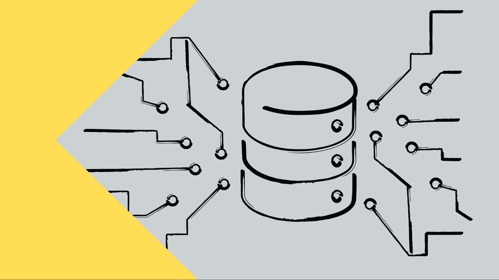
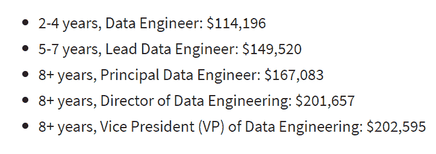

# 11 个关于数据工程师的问题：职业的内容是什么？未来的发展方向如何？

> 原文：[`www.kdnuggets.com/2022/10/11-questions-data-engineers-profession-heading.html`](https://www.kdnuggets.com/2022/10/11-questions-data-engineers-profession-heading.html)

我于 2017 年从开发转向数据工程。在此之前，我在桌面开发、后台（主要是 Java）以及一些前端开发方面工作了十年。尽管我有强大的 IT 经验，但一开始搞清楚数据工程师做什么、他们与数据库管理员有何不同、他们如何与数据分析相关联以及他们与大数据有什么关系并不容易。

* * *

## 我们的前三个课程推荐

 1\. [Google 网络安全证书](https://www.kdnuggets.com/google-cybersecurity) - 快速进入网络安全职业生涯。

 2\. [Google 数据分析专业证书](https://www.kdnuggets.com/google-data-analytics) - 提升您的数据分析能力

 3\. [Google IT 支持专业证书](https://www.kdnuggets.com/google-itsupport) - 支持您的组织的 IT 需求

* * *

正是“大数据”这一术语的魅力决定了我现在所做的事情（这个 [链接](https://aws.amazon.com/big-data/what-is-big-data/) 提供了大数据的一个成熟定义，包含“三位一体：体量、种类、速度”+ 亚马逊 AWS 的一个信息性视频）。对我而言，大数据领域看起来像是一个我必须接受的挑战。

我对分布式系统、可扩展技术和云计算越来越感兴趣，并参加了分析相关大数据产品（如 Hadoop、Kafka、Spark 等）的会议。周围出现了与大数据相关的同事，我向他们提出了很多问题。有时我收到的回答并不完全清楚，这进一步激发了我的好奇心。

*Hadoop 的首次发布——这是一个公开可用的平台，用于存储和处理来自分布式来源的数据阵列，计算量达到 PB 级——发生在 2006 年。很快，商业界开始认为大数据在实践中是适用的。接下来的十年，大多数* [*商业媒体*](https://hbr.org/2012/10/big-data-the-management-revolution) *称大数据无异于一场“革命”和“一次政变”。*

然而，在过去的两三年里，大数据的神奇影响力减弱了：数据工程实际上已经吸收了这个领域，并使其在 IT 专家中变得普遍。大数据无处不在，如果今天商业数据不是“大数据”，那么明天它将变成“大数据”。与此同时，对数据职业的关注只增不减，它们的需求量不亚于例如 Java 开发人员。此外，数据工程师的平均薪资高于后端开发人员（数据科学家更被重视，为什么我们稍后会在本文中理解）。

今天，我看到身边的开发人员和其他 IT 专家对数据工程有着与我 6-7 年前相同的问题。在这里，我试图以一种易于理解的方式回答最常见的问题。我不假装涵盖所有内容，并且完全理解其他人已经更全面和有趣地描述了某些职业方面——这就是为什么文本中有这么多链接。

我希望我的回答对初学数据工程的人员和任何对数据工程感兴趣的人有所帮助。

# 简而言之：谁是数据工程师？

数据工程师是一个使数据对客户可用的人。为此，数据工程师准确了解如何收集所需的数据，并设置一个可能包括以下内容的流程：

+   数据收集：银行交易、忠诚度系统注册、客户地理位置、飞机上的传感器读数等；

+   清理数据中的错误和重复——确保所需的数据质量；

+   数据转换和聚合；

+   数据存储；

+   按客户要求的正确和快速交付。

这里的关键概念是数据仓库：我们将数据上传到其中，在那里进行转换，然后从中卸载以进行分析。通常，存储是关系型的，但与[事务数据库管理系统](https://cloud.google.com/learn/what-are-transactional-databases)不同，它用于分析负载（[OLAP](https://www.guru99.com/online-analytical-processing.html)）。

这是什么意思？事务负载的特点是写入和读取的数据量相对较小，同时用户数量可能较多。分析负载的情况正好相反：写入和读取的数据量很大，同时用户数量有限。这是职业的一个细微差别。

建模仓库有很多选项，例如经典的、[Kimball 或 Inmon 组织](https://www.geeksforgeeks.org/difference-between-kimball-and-inmon/)，或更现代的方法，如 [Data Vault](https://en.wikipedia.org/wiki/Data_vault_modeling)。还有一些非严格关系型的存储选项，如数据湖或 [Lakehouse](https://www.databricks.com/blog/2020/01/30/what-is-a-data-lakehouse.html#:~:text=A%20lakehouse%20is%20a%20new,cloud%20storage%20in%20open%20formats.)——对于这些，您需要建立独立的数据收集管道，并进行预处理和加载到存储中。

存储的选择、数据处理工具、数据处理速度和扩展能力都是数据工程师的关注点。数据管理员通常负责确保配置的管道在一个月、一年及更长时间内无中断地运行。这个人解决问题并提高生产力。大多数数据工程师也能做到这一点，但理想情况下这并不是他们的责任。

数据在提供后如何使用，理想情况下也不应该是数据工程师的关注点。主要的任务是将存储适应于日常负载和数据类型。

# 数据工程师与数据分析师有何关系？

记住，数据工程师使数据可访问。他们从各种来源收集数据，系统化数据，处理数据，并说：“这是数据，需要的人请从这里取。”例如，业务用户，如经理，可以获取这些数据。但理想情况下，数据分析师会首先获取数据。

数据分析师的任务是解读和可视化数据，以找出可以提取的商业价值。数据分析师利用数据中的模式来回答业务问题，做出预测并提供建议。我们可以说数据分析师直接影响商业决策。

相应地，数据分析师为数据工程师设定任务，例如从哪里获取分析数据、需要清理什么、需要修正什么。有时数据工程师会进行数据的初步解读，而数据分析师会准备自己的数据。但通常这些职能并不重叠。然而，高级数据分析师理解非结构化数据，知道如何编写复杂的 SQL 查询，并用 R 或 Python 编写少量代码。

一般来说，数据工程师可以稍微像数据分析师，反之亦然。如果数据分析师仅使用 Excel 数据透视表，那么他或她与数据工程没有关系。

# 数据工程师与 BI 工程师相比如何？

BI 工程师的重点是报告。对于大型客户，BI 工程师决定使用哪些 BI 工具，如 Tableau、Qlik、Power BI、Looker、Sisense 等，并进行配置。多亏了 BI 工程师，公司经理可以实时查看公司情况的可视化仪表盘：在 10 秒内就能清楚地了解公司的弱点。如果经理希望，他们可以将报告转换为演示文稿。

那么，谁来配置必要数据的交付到 BI 系统呢？没错，是数据工程师。

然而，在数据集较小的小公司中——没有像 MySQL 或 Oracle 这样的平台或基础平台——BI 工程师独立配置数据管道。总的来说，从技能角度来看，BI 工程师是数据工程师和数据分析师的混合体：这个人理解数据集成、处理和数据分析的基础知识，并能将知识应用于实践。

另一方面，几乎任何数据工程师都会在 Tableau 中构建仪表盘，即使他或她没有足够的经验来了解即使是最常见的 BI 系统的所有可能性。此外，任何系统都有生命周期，包括 BI 系统——它们在不断演变，需要监控和更新。数据工程师通常没有时间处理这些，但监控和更新系统是 BI 工程师的优先任务。

# 数据工程师与数据科学家有什么共同点？

简而言之，他们几乎没有共同之处，除了数据工程师（现在你会有既视感）设置了数据科学家所需的数据管道。数据科学家主要需要这些数据来训练使用神经网络和机器学习算法的模型。

模型在商业中用于预测和自动响应。例如，它们可以为经纪公司提供买卖苹果股票的建议。

数据科学家的专业领域包括 AI、ML 和 DL。即使是高级数据工程师也很少在工作中接触这些。除了编程技能，数据科学家还必须具备强大的数学技能和统计知识。

所以，数据工程师既有点数据管理员、数据分析师，又有点 BI 工程师。数据分析师、BI 工程师和数据管理员也可以有点数据工程师的特质。而数据科学家则是一个独立的领域：他们有不同的生产周期、不同的理论基础和资格要求。

# 数据工程师实习生需要具备什么能力？初级工程师呢？

我建议新手数据工程师不要忽视理论基础——关系代数和分布式计算。

初学者需要弄清楚什么是 ETL 和 ELT，以及它们之间的 [区别](https://www.qlik.com/us/etl/etl-vs-elt)，除了“提取、转换和加载”这几个词的不同顺序。他们还需要理解 [SQL 和 NoSQL 的区别](https://www.mongodb.com/nosql-explained/nosql-vs-sql)。他们必须熟悉数据工程任务的类别，并至少在每一类别中拆解一个主流工具：

+   数据存储；

+   分布式数据处理；

+   编排。

了解 [软件开发生命周期](https://www.guru99.com/software-development-life-cycle-tutorial.html) 也很有用：需求如何收集和文档化，以及软件如何开发、测试和实施。展望未来，许多数据工程师编写代码和自动化测试，换句话说，他们在没有测试人员的情况下完成工作。

数据工程师与客户直接沟通的频率相当高，绕过了业务分析师。这就是我目前项目中的情况：数据工程师独立将任务从业务语言翻译成技术语言。这意味着从一开始就应对数据业务需求有共同的理解，以及银行、医疗、零售、电信、保险公司和旅游业如何使用这些数据。没有高级的软技能和良好的英语口语是不行的。你的英语水平至少需要达到中级。

# 我在哪里可以找到有关数据工程的信息？

开始时，你可以阅读数据工程技术和工具创建者的英文博客。本文中的大多数链接都指向像 MongoDB、Qlik、AWS 等博客。

如果你已经选择了一个要精通的平台，查看供应商的培训材料是有意义的。像 [Snowflake](https://www.snowflake.com/) 和 [Databricks](https://www.databricks.com/) 这样的主流、自给自足的平台提供了大量高质量的各种复杂程度的材料，适合初学者、中级人员和架构师。当然，它们也会强调自己的产品。

数据工程师有自己的宝典 — [DMBOK](https://www.amazon.com/DAMA-DMBOK-Data-Management-Body-Knowledge/dp/1634622340)（数据管理知识体系）。这里描述了标准化的数据管理方法和最佳实践。

这本严肃且可能有些枯燥的书适用于高级及以上水平。初学者可以将其作为参考。DMBOK 将突出值得探索的领域 —— 然后你可以去供应商的博客，那里以更有趣和易懂的方式描述了所有内容。

# 数据工程师是否需要会编程？

许多数据工程师懂得编写代码。绝大多数客户期望数据工程师至少在脚本层面上熟练掌握 SQL 和这些语言中的一种：Python、Scala、Java、JavaScript、C#。

我们中的一些人使用低代码平台，通过现成工具组装数据管道（[数据集成工具](https://www.gartner.com/reviews/market/data-integration-tools)）。在这种情况下，他们有时被称为 ETL 开发人员、数据集成工程师或其他称谓。基本上，这些人也是数据工程师，只是专注于数据集成。

他们可能不知道一些职业的细节。例如，如果需要将生产力提高 10 倍，如果没有提供具体的扩展工具并说：“做这个”，将会遇到困难。

总而言之，即使你只会最低水平的编程，也可以成为数据工程师。同时，一个只会 C#脚本的数据工程师仍然可以达到高级水平甚至更高——就像一个不懂编程的 QA 工程师（与 QAA 不同）一样。

# 人们在进入数据工程领域之前来自哪里？哪些领域在成为数据工程师时最容易？

我只能谈论我个人朋友和同事的经历，这并不一定反映整体情况。我只偶尔遇到完全“从零”进入这个职业的人——大多数人都是开发人员或数据专家。此外，我不知道 DevOps 工程师转行做数据工程师的案例。也许他们比其他 IT 职业更热爱自己的工作，并且同样非常受欢迎。

许多数据工程师起初是数据库管理员或数据分析师。他们已经知道 SQL、BI，并且理解如何处理数据。以这样的背景，在多个领域中，你可以在六个月内完全解决数据工程师的任务。

我可以假设，对于一个了解 Java 和/或 Python 的后端开发人员来说，成为数据工程师更容易、更快。如果你了解 Scala、Airflow 或 Spark，那么你真的很有优势。

# 与客户工作的一个简单例子是什么？

几乎所有公司都有数据库，他们时不时地使用它：他们在其中上传某些内容，卸载其他内容，并根据需求以某种方式使用数据库。例如，一个 Python 开发人员编写平台，一个业务分析师和市场营销人员分析数据，有时还需要连接系统管理员。当显然需要系统化的方法并且工作量足够多到需要一个整个人时，就会呼叫数据工程师来帮忙。

他们来找我们，说：“我们有自己的数据库，但它承受不了这种负载。我们需要一个存储解决方案，可以放置所有内容，并进行大而重的请求”（顺便提一下，还有反向情况：存储空间负载不足，你需要找出如何处理它）。

好的，我们理解数据需要转移到内部存储并使其可用。为了提高允许的负载，你需要进行扩展。我们澄清细节：我们需要验证数据，还是数据本身已经是干净的？我们需要多频繁地更新/处理数据——一天做一次就足够，还是这个过程是持续的？可能会有几十个类似的要求。

收集需求后，我们进入系统设计阶段。我们展示将如何在技术上解决问题，使用哪种技术栈。有时客户对自己的决定不确定——这种情况下，我们会展示备选方案，并描述每个方案的优缺点。也有可能客户愿意超出预算，只要他们看到对业务更有用的选项。

我们必须让业务方能够理解，并使用他们的语言。如果客户在技术上很成熟，并且非常了解[数据仓库与数据湖的区别](https://www.mongodb.com/databases/data-lake-vs-data-warehouse-vs-database)，那么我们就提供更多的技术细节。如果不是，我们则关注基本问题：成本是多少，存储的安全性如何，以及切换到其他供应商解决方案的难易程度。

我们一定会讨论在紧急情况下的行动方案，以及这种响应所需的时间。

# 数据工程师的职业轨迹是什么样的？在哪些方面可以成长？

和几乎所有职业一样，成长可以是扩展性的（横向增长），也可以是深入性的（纵向深入）。你可以精通一个技术栈，成为一个被视为半神般的专家，求助时大家都找你。当其他人无法解决时，你可以被求助。你也可以提升你的管理技能，成为团队领导等。

*美国数据工程师的职业发展轨迹，* [*根据 Glassdoor*](https://www.glassdoor.com/Career/how-to-become-big-data-engineer_KO14,31.htm)

数据工程师的发展路径以及对数据工程师的要求因公司而异。在我的公司，职业阶梯如下：数据工程师？团队领导数据工程师？数据技术架构师？数据解决方案架构师（DSA）。

**数据工程师。** 了解数据管理的基础知识：数据建模、ELT/ETL、数据质量、数据仓库/湖模型、分布式系统。能熟练使用至少一种技术栈：AWS、Azure、Snowflake、Apache Hadoop 等。要求掌握 SQL，并至少掌握一种编程语言：Scala、Python、Java、C#。

**团队领导数据工程师。** 此人对数据管理和工程的基础知识有较高的了解。具备较强的沟通和解决问题的能力。知道如何管理项目、交付和变更。

**数据技术架构师。** 通常，这个人是渴望担任 DSA 职位的人，但缺乏经验和技术博学。他或她至少精通一个技术栈，并且能够在 DSA 的指导下处理解决方案实施的技术细节。

**数据解决方案架构师。** 数据管理和数据工程的专家。此人了解当前的数据处理技术，能够快速掌握新技术。此人具备领导力、项目和变更管理技能，以及工程管理能力，如团队和技术部门管理。

大型 IT 公司经常创建技能中心来发展硬技能和软技能。例如，现在 DataArt 中几乎有 200 名数据专家，其中几个人在卓越中心（包括我）。我们的主要目标是帮助同事选择他们希望在职业上成长的方向，并帮助他们掌握新技术。我们为数据专家提供机会，通过担任导师、演讲者、技术专家和客户服务专家，充分发挥他们的潜力。

# 职业在如何变化？有什么趋势？

在我看来，越来越多的关注被放在数据管理上，即 [数据治理](https://blog.hubspot.com/website/data-governance)。以前，公司可以将数据倾倒到数据湖中，最终这些数据湖变成了“数据沼泽”：一些难以理解的数据，很难搞清楚是谁放了什么，以及为什么。现在，在架构层面，这家公司从不同的角度考虑数据管理，并描述如何确保 [数据质量](https://www.sisense.com/glossary/data-quality/)，以及如何处理元数据、主数据和参考数据等。这比建立一个 ETL 流水线要困难得多。

其中一个趋势是转向云管理系统。也就是说，我们不在本地部署系统，而是购买一个已经组装好的云系统。我们可以拥有至少 10,000 台机器的请求池，但完全不需要考虑如何分配和扩展。

这种无服务器的趋势对数据工程来说是非常重要的。因此，大数据失去了它的神奇魅力，因为大数据主要涉及水平扩展。由于云技术，数据工程师的重点从扩展转向了数据管理。**从概念上讲，现在更正确的提问不是如何处理大数据，而是如何全面管理数据**。

技术的数量被夸大了，类似工具的数量越来越多。几乎不可能找到技术栈完全匹配的专家。这意味着，例如，任何级别的数据工程师都必须在实践中获取必要的知识，这很正常。

**[伊利亚·莫什科夫](https://ru.linkedin.com/in/ilia-moshkov-a37364172)** 是高级数据工程师，并且是 DataArt 数据卓越中心的成员

### 更多相关主题

+   [IBM 针对各行各业的生成式人工智能专业课程](https://www.kdnuggets.com/generative-ai-specialisation-courses-from-ibm-for-every-profession)

+   [高保真合成数据，适用于数据工程师和数据科学家](https://www.kdnuggets.com/2022/tonic-high-fidelity-synthetic-data-engineers-scientists-alike.html)

+   [数据科学家和数据工程师如何协作？](https://www.kdnuggets.com/2022/08/data-scientists-data-engineers-work-together.html)

+   [如何获得机器学习职位：来自 Meta、Google Brain 和 SAP 工程师的建议](https://www.kdnuggets.com/2022/08/corise-land-ml-job-advice-engineers-meta-google-brain-sap.html)

+   [我们不需要数据科学家，我们需要数据工程师](https://www.kdnuggets.com/2021/02/dont-need-data-scientists-need-data-engineers.html)

+   [5 款适用于数据工程师的 SQL 可视化工具](https://www.kdnuggets.com/2023/02/5-sql-visualization-tools-data-engineers.html)
