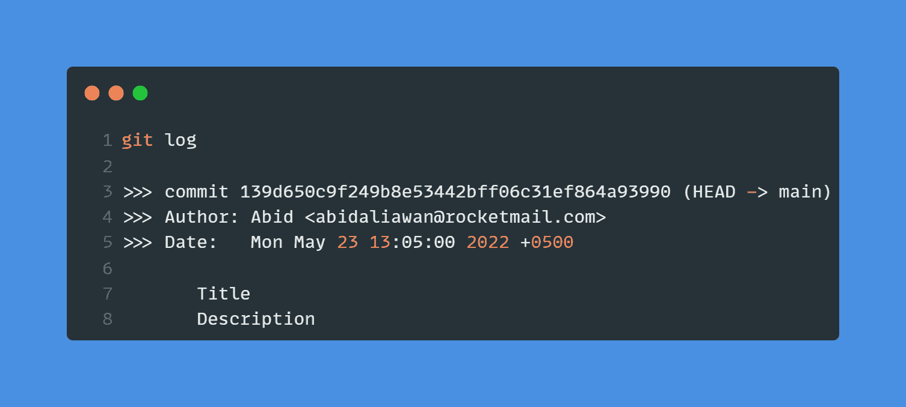

# 数据科学家的 14 个必备 Git 命令

> 原文：[`www.kdnuggets.com/2022/06/14-essential-git-commands-data-scientists.html`](https://www.kdnuggets.com/2022/06/14-essential-git-commands-data-scientists.html)


图片由[RealToughCandy.com](https://www.pexels.com/photo/man-love-people-woman-11035539/)提供

历史上，大多数数据科学家对软件开发实践和工具（如版本控制系统）不太了解。但这种情况正在改变，数据科学项目正在采纳软件工程的最佳实践，Git 已成为文件和数据版本控制的重要工具。现代数据团队利用它来协作处理代码库项目，并更快地解决冲突。

* * *

## 我们的前三大课程推荐

 1\. [谷歌网络安全证书](https://www.kdnuggets.com/google-cybersecurity) - 快速进入网络安全职业生涯。

 2\. [谷歌数据分析专业证书](https://www.kdnuggets.com/google-data-analytics) - 提升你的数据分析技能

 3\. [谷歌 IT 支持专业证书](https://www.kdnuggets.com/google-itsupport) - 支持你的组织进行 IT 管理

* * *

在这篇文章中，我们将学习 14 个必备的 Git 命令，这些命令将帮助你初始化项目、创建和合并分支、版本控制文件、与远程服务器同步以及监控变更。

> **注意：** 请确保你已从[官方站点](https://git-scm.com/downloads)正确安装 Git。

# 1\. 初始化

你可以通过输入以下命令在当前目录中初始化 Git 版本控制系统：

```py
git init
```

或者你可以在特定目录中初始化 Git。

```py
git init <directory>
```


# 2\. 克隆

**clone**命令将从远程服务器复制所有项目文件到本地计算机。它还会将远程名称添加为`origin`以便与远程服务器同步文件。

Git clone 需要 HTTPS 链接，安全连接需要 SSH 链接。

```py
git clone <HTTPS/SSH>
```

# 3\. 添加远程

你可以通过添加远程名称和 HTTPS/SSH 地址来连接到一个或多个远程服务器。

```py
git remote add <remote name> <HTTPS/SSH>
```

> **注意：** 从 GitHub 或任何远程服务器克隆一个仓库会自动将远程添加为`origin`。

# 4\. 创建分支

分支是处理新功能或调试代码的最佳方式。它允许你在不干扰`main`分支的情况下进行隔离工作。

使用**checkout**命令和`-b`标签及分支名称创建一个新分支。

```py
git checkout -b <branch-name>
```

或使用**switch**与`-c`标签和分支名称

```py
git switch -c <branch-name>
```

或者简单地使用**branch**命令

```py
git branch <branch-name>
```


# 5\. 切换分支

要将分支从当前分支切换到不同的分支，你可以使用**checkout**或**switch**命令，后跟分支名称。

```py
git checkout <branch-name>

git switch <branch-name>
```

# 6\. 拉取

要与远程服务器同步更改，我们需要首先通过使用**pull**命令从远程拉取更改到本地仓库。这在远程仓库中进行了更改时是必需的。

```py
git pull
```

你可以添加远程名称后跟分支名称来拉取单个分支。

```py
git pull <remote name> <branch> 
```

默认情况下，pull 命令会获取更改并将它们与当前分支合并。要进行变基，你可以在远程名称和分支之前添加`--rebase`标志。

```py
git pull --rebase origin master
```

# 7\. 添加

使用**add**命令将文件添加到暂存区。它需要文件名或文件名列表。

```py
git add <file-name>
```

你还可以使用` . `或` -A `标志一次性添加所有文件。

```py
git add .
```

# 8\. 提交

在将文件添加到暂存区后，你可以使用**commit**命令创建一个版本。

提交命令需要通过`-m`标志指定提交的标题。如果你做了多个更改并想列出它们，请通过另一个`-m`标志将它们添加到描述中。

```py
git commit -m "Title" -m "Description"
```


> **注意：** 在提交更改之前，请确保你已经配置了**用户名**和**电子邮件**。

```py
git config --global user.name <username>

git config --global user.email <youremail@yourdomain.com>
```

# 9\. 推送

要将本地更改同步到远程服务器，请使用**push**命令。你可以简单地输入`git push`来将更改推送到远程仓库。

要将更改推送到特定的远程服务器和分支，请使用下面的命令。

```py
git push <remote name> <branch-name>
```

# 10\. 撤销提交

Git **revert**会将更改撤销到特定提交，并将其作为新提交添加，保持日志不变。要撤销更改，你需要提供特定提交的哈希值。

```py
git revert <commit>
```

你也可以通过使用**reset**命令撤销更改。它会将更改重置回特定提交，并丢弃之后所做的所有提交。

```py
git reset <commit>
```

> **注意：** 使用 reset 命令是不推荐的，因为它会修改你的 git 日志历史记录。

# 11\. 合并

**merge**命令将简单地将特定分支的更改合并到当前分支。该命令需要一个分支名称。

```py
git merge <branch>
```

当你在多个分支上工作并且希望将更改合并到主分支时，这个命令非常方便。

# 12\. 日志

要检查之前提交的完整历史记录，你可以使用**log**命令。

要显示最近的日志，你可以添加`-`后跟数字，它将显示有限数量的最近提交历史。

例如，将日志限制为 5 条：

```py
git log -5
```

你还可以查看特定作者所做的提交。

```py
git log --author=”<pattern>”
```

> **注意：** git log 有多个标志可以过滤特定类型的提交。查看完整的[文档](https://www.git-scm.com/docs/git-log)。



# 13\. 差异

使用**diff**命令将显示未提交更改与当前提交之间的比较。

```py
git diff
```

对于比较两个不同的提交，请使用：

```py
git diff <commit1> <commit2>
```

对于比较两个分支，可以使用：

```py
git diff <branch1> <branch2>
```

# 14\. 状态

**status**命令显示工作目录的当前状态。它包括有关要提交的更改、未合并路径、未暂存的更改以及未跟踪文件的列表的信息。

```py
git status
```

> **注意：** 查看 [Github 和 Git 初学者教程](https://www.datacamp.com/tutorial/github-and-git-tutorial-for-beginners) 以了解更多关于数据科学中的版本控制系统的内容。

**[Abid Ali Awan](https://www.polywork.com/kingabzpro)** ([@1abidaliawan](https://twitter.com/1abidaliawan)) 是一位认证的数据科学专家，热衷于构建机器学习模型。目前，他专注于内容创作，并撰写关于机器学习和数据科学技术的技术博客。Abid 拥有技术管理硕士学位和电信工程学士学位。他的愿景是使用图神经网络构建一个人工智能产品，以帮助那些面临心理健康问题的学生。

### 更多相关话题

+   [数据科学的 16 个基本 DVC 命令](https://www.kdnuggets.com/2022/07/16-essential-dvc-commands-data-science.html)

+   [数据科学的 10 个基本 SQL 命令](https://www.kdnuggets.com/2022/10/10-essential-sql-commands-data-science.html)

+   [Streamlit 的 12 个基本命令](https://www.kdnuggets.com/2023/01/12-essential-commands-streamlit.html)

+   [KDnuggets 新闻，6 月 29 日：数据科学的 20 个基本 Linux 命令…](https://www.kdnuggets.com/2022/n26.html)

+   [每个数据科学家都应该知道的 12 个 Docker 命令](https://www.kdnuggets.com/2023/01/12-docker-commands-every-data-scientist-know.html)

+   [数据科学初学者的 20 个基本 Linux 命令](https://www.kdnuggets.com/2022/06/20-basic-linux-commands-data-science-beginners.html)
