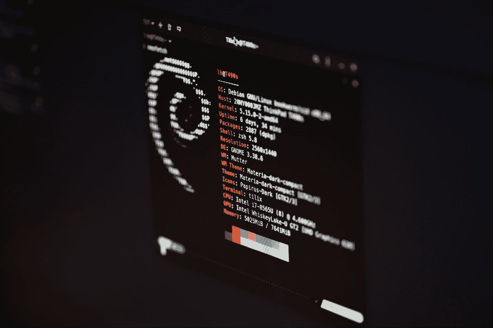
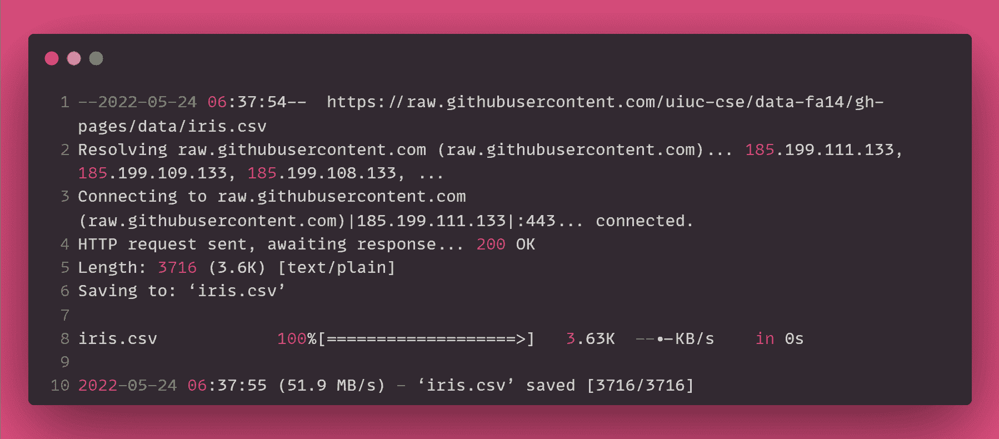
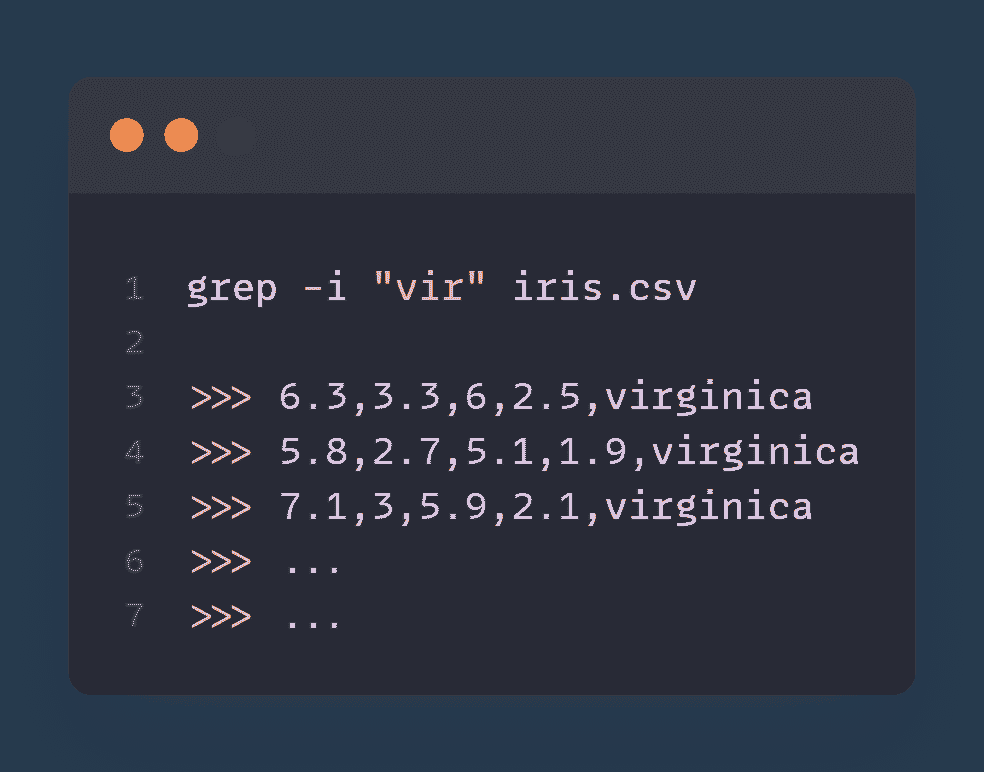
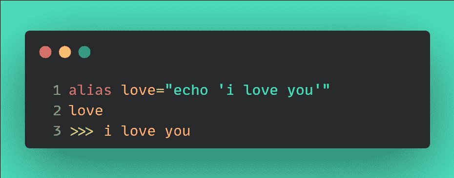

# 20 个基础 Linux 命令供数据科学初学者使用

> 原文：[`www.kdnuggets.com/2022/06/20-basic-linux-commands-data-science-beginners.html`](https://www.kdnuggets.com/2022/06/20-basic-linux-commands-data-science-beginners.html)



照片由 [Lukas](https://unsplash.com/@lukash?utm_source=unsplash&utm_medium=referral&utm_content=creditCopyText) 提供，来自 [Unsplash](https://unsplash.com/s/photos/linux?utm_source=unsplash&utm_medium=referral&utm_content=creditCopyText)

# 1\. ls

* * *

## 我们推荐的前 3 个课程

 1\. [Google 网络安全证书](https://www.kdnuggets.com/google-cybersecurity) - 快速进入网络安全职业道路

 2\. [Google 数据分析专业证书](https://www.kdnuggets.com/google-data-analytics) - 提升你的数据分析技能

 3\. [Google IT 支持专业证书](https://www.kdnuggets.com/google-itsupport) - 支持你的组织的 IT 工作

* * *

**ls** 命令用于显示当前目录中的所有文件和文件夹列表。

```py
$ ls
```

**输出**

```py
AutoXGB_tutorial.ipynb  binary_classification.csv      requirements.txt

Images/                 binary_classification.csv.dvc  test-api.ipynb

LICENSE                 output/

README.md               output.dvc
```

# 2\. pwd

它将显示当前目录的完整路径。

```py
$ pwd
```

**输出**

```py
C:\Repository\HuggingFace
```

# 3\. cd

**cd** 命令代表更改目录。通过输入新的目录路径，你可以更改当前目录。这个命令对于浏览包含多个文件夹的目录非常重要。

```py
$ cd C:/Repository/GitHub/
```


# 4\. wget

**wget** 允许你从互联网上下载任何文件。在数据科学中，它用于从数据存储库中下载数据。

```py
$ wget https://raw.githubusercontent.com/uiuc-cse/data-fa14/gh-pages/data/iris.csv
```

**输出**



# 5\. cat

`cat`（连接）是一个常用命令，用于创建、连接和查看文件。**cat** 命令读取 CSV 文件并将文件内容显示为输出。

```py
$ cat iris.csv
```

**输出**

```py
sepal_length,sepal_width,petal_length,petal_width,species

5.1,3.5,1.4,0.2,setosa

4.9,3,1.4,0.2,setosa

4.7,3.2,1.3,0.2,setosa

4.6,3.1,1.5,0.2,setosa

5,3.6,1.4,0.2,setosa

………………………..
```

# 6\. wc

**wc**（单词计数）用于获取有关单词数、字符数和行数的信息。在我们的例子中，它显示了 4 列作为输出。第一列是行数，第二列是单词数，第三列是字符数，第四列是文件名。

```py
$ wc iris.csv
```

**输出**

```py
151  151 3716 iris.csv
```

# 7\. head

**head** 命令显示文件中的前 **n** 行。在我们的例子中，它显示了 iris.csv 文件中的前 5 行。

```py
$ head -n 5 iris.csv
```

**输出**

```py
sepal_length,sepal_width,petal_length,petal_width,species

5.1,3.5,1.4,0.2,setosa

4.9,3,1.4,0.2,setosa

4.7,3.2,1.3,0.2,setosa

4.6,3.1,1.5,0.2,setosa
```

# 8\. find

**find** 命令用于查找文件和文件夹，并且通过使用 `-exec`，你可以在文件和文件夹上执行其他 Linux 命令。在我们的例子中，我们正在查找所有扩展名为“.dvc”的文件。

```py
$ find . -name "*.dvc" -type f
```

**输出**

```py
./binary_classification.csv.dvc

./output.dvc
```

## 9\. grep

它用于过滤特定模式并显示包含该模式的所有行。

我们正在查找包含“vir”的所有行，位于 iris.csv 文件中

```py
$ grep -i "vir" iris.csv
```



# 10\. history

历史记录将显示过去命令的日志。我们已将输出限制为显示最近的 5 个命令。

```py
$ history 5
```

**输出**

```py
 494  cat iris.csv

 495  wc iris.csv

 496  head -n 5 iris.csv

 497  find . -name "*.dvc" -type f

 498  grep -i "vir" iris.csv
```

# 11\. zip

**zip**用于压缩文件大小和文件包实用程序。zip 命令中的第一个参数是 zip 文件名，第二个参数是文件名或文件名列表。zip 命令主要用于压缩和打包数据集。

```py
$ zip ZipFile.zip File1.txt File2.txt
```

# 12\. unzip

它解压缩或解压文件和文件夹。只需提供一个`.zip`文件名，它将提取当前目录中的所有文件和文件夹。

```py
$ unzip sampleZipFile.zip
```

# 13\. cp

它允许你将文件、文件列表或目录复制到目标目录。**cp**命令中的第一个参数是文件，第二个参数是目标目录路径。

```py
$ cp a.txt work
```

# 14\. mv

类似于**cp**，**mv**命令允许你将文件、文件列表或目录移动到另一个位置。它也用于重命名文件和目录。mv 命令中的第一个参数是文件，第二个参数是目标目录路径。

```py
$ mv a.txt work
```

# 15\. rm

它从文件系统中删除文件和目录。你可以在**rm**命令后添加文件或文件列表名称。

```py
$ rm b.txt c.txt
```

# 16\. mkdir

它允许你一次创建多个目录。只需在**mkdir**命令后写上文件夹路径。

```py
$ mkdir /love
```

> **注意**：用户必须有权限在父目录中创建文件夹。

# 17\. rmdir

你可以通过使用**rmdir**删除一个或多个目录。只需将一个文件夹的名称作为第一个参数添加即可。

> **注意：** `-v` 标志表示详细信息。

```py
$ rmdir -v /love
```

**输出**

```py
VERBOSE: Performing the operation "Remove Directory" on target "C:\love".
```

# 18\. man

它用于显示 Linux 系统中任何命令的手册。在我们的例子中，我们将学习**echo**命令。

```py
$ man echo
```

# 19\. diff

它用于显示两个文件之间逐行的差异。只需在**diff**命令后添加两个文件即可查看比较。

```py
$ diff app1.py app2.py
```

**输出**

```py

31c31
<     solar_irradiation = loaded_model.predict(data)[1]

---

>     solar_irradiation = loaded_model.predict(data)[0]

```

# 20\. alias

**alias**是一个生产力工具。我已经缩短了所有冗长和重复的命令。我已缩短了所有 Linux 和 Git 命令，以避免在编写相同命令时出错。

在下面的例子中，终端每当我运行**love**命令时，就会显示文本“i love you”。

```py
$ alias love="echo 'i love you'"
```



**[Abid Ali Awan](https://www.polywork.com/kingabzpro)** ([@1abidaliawan](https://twitter.com/1abidaliawan)) 是一名认证的数据科学专家，他喜欢构建机器学习模型。目前，他专注于内容创作，并撰写关于机器学习和数据科学技术的技术博客。Abid 拥有技术管理硕士学位和电信工程学士学位。他的愿景是利用图神经网络为面临心理问题的学生构建 AI 产品。

### 更多相关内容

+   [KDnuggets 新闻，6 月 29 日：数据科学的 20 个基本 Linux 命令……](https://www.kdnuggets.com/2022/n26.html)

+   [KDnuggets 新闻，11 月 30 日：什么是切比雪夫定理及其如何…](https://www.kdnuggets.com/2022/n46.html)

+   [数据科学 Linux 备忘单](https://www.kdnuggets.com/2022/11/linux-data-science-cheatsheet.html)

+   [数据科学的前 5 大 Linux 发行版](https://www.kdnuggets.com/top-5-linux-distro-for-data-science)

+   [数据科学的 16 个必备 DVC 命令](https://www.kdnuggets.com/2022/07/16-essential-dvc-commands-data-science.html)

+   [数据科学的 10 个必备 SQL 命令](https://www.kdnuggets.com/2022/10/10-essential-sql-commands-data-science.html)
