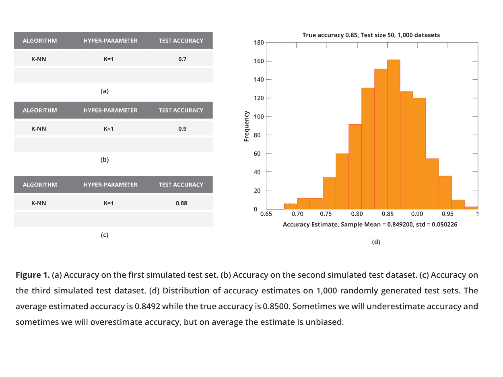
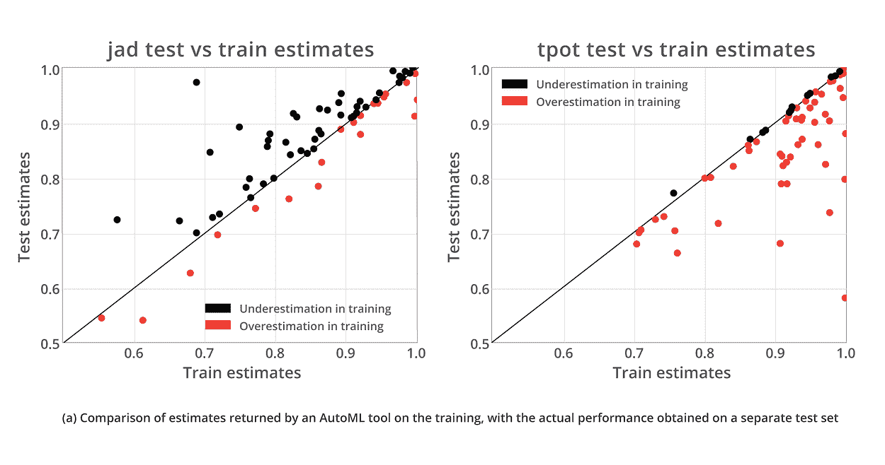

# 你能信任 AutoML 吗？

> 原文：[`www.kdnuggets.com/2020/12/trust-automl.html`](https://www.kdnuggets.com/2020/12/trust-automl.html)

评论

**由[Ioannis Tsamardinos](https://www.linkedin.com/in/ioannistsamardinos/)、(JADBio)、Iordanis Xanthopoulos (克里特大学，希腊)、Vassilis Christophides (ENSEA，法国)**。

*图片来源于 Shutterstock，许可下使用。*

### 什么是 AutoML？

自动化机器学习（AutoML）承诺端到端自动化机器学习过程。它是机器学习和数据科学领域快速崛起的超热门子领域。AutoML 平台尝试数百种甚至数千种不同的机器学习管道，称为***配置***，将不同分析步骤（变换、插补、特征选择和建模）及其相应的超参数结合在一起。它们通常提供击败专家并赢得竞赛的模型，只需几个鼠标点击或几行代码。

### 需要估计性能

然而，获取一个模型永远不够！除非有预测性能的保证，否则不能信任模型的预测。这个模型几乎总是准确的，还是更接近随机猜测？我们能依赖它来做生命攸关的临床决策，或成本高昂的商业决策吗？可靠的样本外（在新样本上）性能估计至关重要。一个优秀的分析师会为你提供这些，而 AutoML 工具也应如此。现有的 AutoML 库和平台是否能提供其模型性能的可靠估计？

### 测试集的大小是多少？

好吧，一些 AutoML 工具根本不返回任何估计！以一个有争议的、最受欢迎的 AutoML 库为例：auto sklearn。其作者建议，为了估计性能，你需要保留一个独立的、未被库看到的测试集，严格用于估计最终模型的性能。像 auto sklearn 这样的工具本质上提供的是一个综合算法选择和超参数优化（**CASH**）或超参数优化（**HPO**）引擎。它们可能非常有用且流行，但只是部分实现了 AutoML 的愿景。毕竟，如果你需要决定最佳测试集大小、编写应用模型的代码以及进行估计的代码，那么这个工具就不是完全自动化的。决定最佳测试集大小并非易事。它需要机器学习技能和知识。它需要专家。你应该留下 10%、20%还是 30%的数据？你应该随机分割还是根据结果类别进行分层分割？如果你有 1,000,000 个样本呢？你会留下多少比例？如果你有 1,000,000 个样本，并且正类的发生率是 1/100,000 呢？如果你有像生存分析中的截尾结果呢？你的测试集需要多少才能保证估计的准确性？你如何计算估计的置信区间？一旦你让用户决定测试集估计，你就不能再声称你的工具“使”机器学习对非专家分析师“民主化”。

### 样本丢失对估计的影响

然而，拥有一个单独的测试集会产生一个额外、更深层次、更严重的问题。保留的数据“丧失了估计”的机会。那些可能是我们花费高昂成本收集或测量的宝贵数据，可能是我们等待了很长时间才获得的数据，我们只是用它们来评估模型的效果。它们没有被用于改进模型和我们的预测。在许多应用中，我们可能没有留下一个相当大测试集的奢侈条件！我们需要在观察到首批死亡后立即分析 SARS-CoV-2（COVID-19）数据，而不是等到我们有 1000 个“可支配”的受害者来进行性能估计。当有新竞争对手产品推出时，我们需要立即分析我们最新的数据并做出反应，而不是等到我们有足够的客户流失。即使是“少量”的样本数据也很重要。它们存在，并且会一直存在。***大数据可能在计算上具有挑战性，但小样本数据在统计上具有挑战性***。需要额外测试集的 AutoML 平台和库不适合小样本数据的分析。

### 从估计模型性能到估计配置性能

其他 AutoML 工具确实只根据你的输入数据返回性能估计。它们不要求你选择测试集的大小，真正实现了程序的自动化，并且名副其实。其理念是：最终模型是在**所有输入数据**上训练的。通常来说，由于分类器在样本量增加时会提高，这将是最佳模型。但这样，我们就没有任何样本用于估计了。好吧，交叉验证和类似的协议（例如，重复保留法）使用代理模型来估计最终模型的性能。它们会训练许多使用相同配置生成的其他模型。因此，***它们并不直接估计预测模型的性能，而是估计生成模型的配置（学习方法、流程）的性能***。但，你能相信它们的估计吗？这引出了所谓的“赢家的诅咒”。

### 单个配置的性能估计

我们将通过一个小型模拟实验来说明一个有趣的统计现象。首先，我们尝试估计**单个配置**的性能，这个配置由一个具有特定超参数的分类器组成，比如 1-最近邻。我模拟了一个二元结果的测试集，包含 50 个样本，分布为 50-50%。我假设我的分类器有 85%的概率提供正确的预测，即 85%的准确率。下图面板（a）显示了我第一次尝试时获得的准确率估计。然后，我生成了第二个（b）和第三个（c）测试集以及相应的估计。

有时候，我的模型在特定测试集上稍微幸运一些，我会估计出高于 0.85 的性能。实际上，有一次模拟中，模型在几乎所有 50 个样本中都预测正确，得出了 95%-100%的准确率。其他时候，模型在特定测试集上的表现会不佳，我会低估性能，但平均来说，估计将是正确且无偏的。我不会欺骗自己、我的客户或我的同行科学家。

### 胜者的诅咒（或你为什么系统性地高估）  

现在，让我们模拟 AutoML 库和平台实际上做的事情，即**尝试成千上万的配置**。为简单起见，我假设我只有 8 个配置（而不是成千上万），这些配置由 3 种不同的算法（K-NN、决策树和简单贝叶斯）与一些超参数值匹配。每次我应用*所有这些配置*，我都会在相同的测试集上估计它们的性能，*选择表现最佳的一个*作为我的最终模型，并*报告获胜配置的估计性能*。在模拟中，我假设所有配置都导致具有 85%准确率的同等预测模型。

在 1000 次模拟后会发生什么？平均而言，我的估计是 0.916，而真实的准确率是 0.85。**我系统性地过高估计。** 别自欺欺人；你通过交叉验证也会得到相同的结果。这是为什么呢？这一现象与统计学中的“赢家的诅咒”有关，其中在许多模型中优化的效应量往往会被过高估计。在机器学习中，这一现象首次由 David Jensen 发现，并被命名为“多重诱导问题”[Jensen, Cohen 2000]。不过，说实话，“赢家的诅咒”听起来更酷（对不起，David）。从概念上讲，这一现象类似于多重假设检验。我们需要使用 Bonferroni 或虚假发现率程序来“调整”产生的*p*-值。同样，当我们交叉验证多个配置时，我们需要对获胜配置的交叉验证表现进行“调整”以应对多次尝试。因此，***当你对单一配置进行交叉验证时，你会得到一个准确的性能估计***（实际上，这是对在所有数据上训练的模型的保守估计）；***当你对多个配置进行交叉验证并报告获胜配置的估计时，你会过高估计性能。***

### 这真的重要吗？

这种过高估计是否真的重要，还是只是学术上的好奇？好吧，当你拥有一个大且平衡的数据集时，这种过高估计是无足轻重的。在小样本数据集或非常不平衡的数据集上，比如某个类别只有几个样本时，它可能会变得相当显著。它很容易达到 15–20 AUC 点[Tsamardinos et al. 2020]，这意味着你实际的 AUC 等同于随机猜测（0.50），而你报告的是 0.70，这在某些领域被认为是令人尊敬且可以发表的表现。过高估计会更高： (a) 某些类别的样本量越小，(b) 你尝试的配置越多，(c) 你配置所产生的模型越独立，(d) 你的最佳模型越接近随机猜测。

### 过高估计可以修复吗？我们能否战胜“赢家的诅咒”？

那么，我们该如何解决这个问题呢？至少有三种方法。第一种方法是——你猜对了——保留一个单独的测试集，我们称之为估计集。在每个配置的交叉验证过程中，测试集用于选择最佳配置（即进行 *调优*），并且每个配置都会多次“看到”这些测试集。估计集仅会被使用一次，用于估计最终模型的性能，因此不存在“赢家的诅咒”。但当然，我们又会回到之前的问题，“样本用于估计的损失”。第二种方法是进行 **嵌套交叉验证** [Tsamardinos et al., 2018]。其思路如下：我们将选择获胜模型视为学习过程的一部分。我们现在有一个 **单一过程**（如果你愿意，可以称之为元配置），它尝试许多配置，使用交叉验证选择最佳配置，并在所有输入数据上使用获胜配置训练最终模型。**我们现在对我们的单一学习过程进行交叉验证**（这个过程内部也对每个配置进行交叉验证，因此称为嵌套）。嵌套交叉验证是准确的（见 [Tsamardinos et al. 2018] 的图 2），但计算开销相当大。它训练 O(*C*⋅*K*2) 个模型，其中 *C* 是我们尝试的配置数量，*K* 是交叉验证的折数。但幸运的是，还有一种更好的方法；那就是 **自助法偏差修正交叉验证**（**BBC-CV**）方法 [Tsamardinos et al. 2018]。BBC-CV 在估计准确性上与嵌套交叉验证相当（见 [Tsamardinos et al. 2018] 的图 2），并且快一个数量级，即训练 O(C⋅K) 个模型。***BBC-CV 本质上消除了需要单独的估计集***。

### 那么，我们可以信任 AutoML 吗？

回到我们激励性的问题：我们可以信任 AutoML 吗？尽管 AutoML 已经取得了大量的工作，包括数十篇论文、竞赛、挑战和比较评估，**至今还没有人检查过这些工具是否返回了准确的估计**。没有人，直到我们最近的一些工作 [Xanthopoulos 2020, Tsamardinos et al. 2020]。在下图中，我们比较了两个 AutoML 工具，即 TPOT [Olson et al. 2016] 和我们自己的 Just Add Data Bio，简称 JADBio [Tsamardinos et al. 2020] ([www.jadbio.com](http://www.jadbio.com/))。TPOT 是一个常用的免费 AutoML 库，而 JADBio 是我们采用 BBC-CV 的商业 AutoML 平台。JADBio 设计时考虑到了这些估计因素，并特别适用于小样本、高维生物数据。鉴于从生物数据中学习到的模型可能用于关键的临床应用，例如预测治疗反应和优化治疗，我们确实在努力返回准确的性能估计。

我们在来自 openml.org 的 100 个二分类问题上尝试了这两种系统，涵盖了广泛的样本大小、特征大小和平衡比例（详细信息见 [Xanthopoulos 2020]）。每个数据集被分成两半，一部分用于输入 AutoML 工具以获取模型和自我评估估计（AutoML 平台评估的模型估计，称为 Train Estimate），另一部分用于应用模型（测试集上的模型估计，称为 Test Estimate）。性能的度量指标是 AUC。每个点是对一个数据集的实验。红点是对角线下方的点，其中 Test Estimate 低于训练估计，即高估的性能。黑点是对角线以上的点，其中性能被低估。

TPOT 严重高估了性能。有些数据集上，这个工具估计模型的性能为 1.0！在其中一个案例（最低的红点）中，实际测试性能不到 0.6，危险地接近随机猜测（0.5 AUC）。显然，你应该对 TPOT 自我评估的估计持怀疑态度。你需要将样本分配到保留测试集中。另一方面，JADBio 系统性地低估了性能。其图中间的最高黑点在测试中的 AUC 接近 1.00，但估计的性能低于 0.70 AUC。平均而言，JADBio 的估计更接近对角线。这些实验中的数据集有超过 100 个样本，有些数据集超过几万。在其他更具挑战性的实验中，我们在 370 多个组学数据集上尝试了 JADBio，样本量最小为 40，特征平均数为 80,000+。JADBio 使用 BBC-CV 并不会高估性能 [Tsamardinos et al. 2020]。不幸的是，不仅 TPOT 展现了这种行为。额外的类似评估和初步结果表明，这可能是 AutoML 工具的普遍问题 [Xanthopoulos 2020]。

### 不要盲目相信，而要验证。

总结来说，首先，要警惕 AutoML 工具性能的自我评估。当你自动化分析并生成成千上万的模型时，很容易高估性能。尝试在一些数据集上使用你喜欢的工具，其中你完全保留了一部分数据。你需要多次进行这种尝试，以评估平均行为。尝试具有挑战性的任务，比如小样本或高度不平衡的数据。过度估计的程度可能取决于元特征（数据集特征），例如缺失值的百分比、离散特征的百分比、离散特征的值的数量等。因此，尝试具有类似特征的数据集，类似于你通常分析的数据集！其次，即使你不使用 AutoML 而是自己编写分析代码，你仍然可能会产生大量模型，并报告未经调整、未经修正的交叉验证估计的最佳模型。 “赢家诅咒”总是存在并困扰着你。你不想向你的客户、老板、教授或论文评审者报告一个高度夸大的、不切实际的性能，对吧？ … 或者，你会吗？

### 参考文献

+   *Jensen D.D. 和 Cohen P.R. (2000) *[*归纳算法中的多重比较*](https://arizona.pure.elsevier.com/en/publications/multiple-comparisons-in-induction-algorithms)*. Mach. Learn., 38, 309–338.*

+   *Tsamardinos I., Charonyktakis P., Lakiotaki K., Borboudakis G., Zenklusen J.C., Juhl H., Chatzaki E. 和 Lagani V. (2020) *[*仅需添加数据：自动预测建模与生物标志发现*](https://www.biorxiv.org/content/10.1101/2020.05.04.075747v1)* bioRxiv, 10.1101/2020.05.04.075747*

+   *Tsamardinos I., Greasidou E. 和 Borboudakis G. (2018) *[*引导外样本预测以实现高效准确的交叉验证*](https://link.springer.com/article/10.1007/s10994-018-5714-4)* Mach. Learn., 107, 1895–1922.*

+   *Iordanis Xanthopoulos, 硕士论文, 计算机科学系, 克里特大学, 2020*

+   *Olson R.S., Bartley N., Urbanowicz R.J. 和 Moore J.H. (2016)*[* 评估一个基于树的管道优化工具用于自动化数据科学*](https://arxiv.org/abs/1603.06212)* 在 GECCO 2016 — 2016 年遗传与进化计算会议论文集。ACM Press, 纽约, 美国, 页码 485–492.*

[原文](https://ioannis-tsamardinos.medium.com/can-you-trust-automl-3a02332e66a0)。经许可转载。

**简介：** [Tsamardinos 博士](https://twitter.com/tsamardgr) 于 2001 年获得美国匹兹堡大学博士学位。2006 年，他在范德比尔特大学生物医学信息学系担任助理教授，随后加入克里特大学。他的研究兴趣包括人工智能与人工智能哲学、生物医学中的人工智能、机器学习、因果推断与归纳、从生物医学数据中学习、分类的特征与变量选择、生物信息学、规划、机器学习在生物医学信息学中的应用。

[Iordanis Xanthopoulos](https://www.linkedin.com/in/iordanis-xanthopoulos-72943571/?originalSubdomain=gr) 是克里特大学的研究生研究员。

[Vassilis Christophides](https://who.rocq.inria.fr/Vassilis.Christophides/) 在法国 ENSEA。

**相关：**

+   [高级超参数优化/调整算法](https://www.kdnuggets.com/2020/11/algorithms-for-advanced-hyper-parameter-optimization-tuning.html)

+   [AutoML 何时会取代数据科学家？调查结果与分析](https://www.kdnuggets.com/2020/03/poll-automl-replace-data-scientists-results.html)

+   [防止神经网络过拟合的 5 种技术](https://www.kdnuggets.com/2019/12/5-techniques-prevent-overfitting-neural-networks.html)

* * *

## 我们的前 3 个课程推荐

 1\. [谷歌网络安全证书](https://www.kdnuggets.com/google-cybersecurity) - 快速进入网络安全职业生涯

 2\. [谷歌数据分析专业证书](https://www.kdnuggets.com/google-data-analytics) - 提升你的数据分析能力

 3\. [谷歌 IT 支持专业证书](https://www.kdnuggets.com/google-itsupport) - 支持你的组织 IT

* * *

### 更多相关内容

+   [对模型信心的追求：你能信任黑箱吗？](https://www.kdnuggets.com/the-quest-for-model-confidence-can-you-trust-a-black-box)

+   [对人工智能的信任是无价的](https://www.kdnuggets.com/2022/08/trust-ai-priceless.html)

+   [我们信任数据：数据驱动的人工智能](https://www.kdnuggets.com/2022/10/data-trust-data-centric-ai.html)

+   [无限可能：了解 JetBlue 如何利用蒙特卡洛和 Snowflake…](https://www.kdnuggets.com/2022/12/monte-carlo-jetblue-snowflake-build-trust-improve-model-accuracy.html)

+   [2023 年你应该考虑的顶级 AutoML 框架](https://www.kdnuggets.com/2023/05/best-automl-frameworks-2023.html)

+   [9 个专业证书可以帮助你获得学位…如果…](https://www.kdnuggets.com/9-professional-certificates-that-can-take-you-onto-a-degree-if-you-really-want-to)
