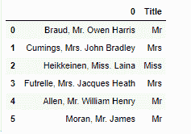

# 3 个你应该知道的高级 Python 特性

> 原文：[`www.kdnuggets.com/2020/07/3-advanced-python-features.html`](https://www.kdnuggets.com/2020/07/3-advanced-python-features.html)

评论


*照片由 [David Clode](https://unsplash.com/@davidclode?utm_source=medium&utm_medium=referral) 通过 [Unsplash](https://unsplash.com/?utm_source=medium&utm_medium=referral) 提供。*

在本文中，我将讨论 3 个对数据科学家非常有用的 Python 重要特性，这些特性可以节省大量时间。让我们开始，不浪费时间。

### 列表和字典推导

列表和字典推导是 Python 中非常强大的工具，它们在创建列表时非常方便。它节省时间，语法简单，并且使逻辑比使用普通的 Python for 循环创建列表更容易。

基本上，这些是用于替代带有简单逻辑的显式 for 循环，这些逻辑会将列表或字典中的某些内容附加或处理。这些是单行代码，使代码更具可读性。

**列表推导**

我们将首先看到一个普通的 Python 示例，然后看到它使用*列表推导*的等效形式。

**场景**

假设我们在 Pandas 中有一个简单的数据框，其中包含 3 门科目的学生成绩。

```py
In [1]: results = [[10,8,7],[5,4,3],[8,6,9]]

In [2]: results = pd.DataFrame(results, columns=['Maths','English','Science'])

```

如果我们打印它，

```py
In [5]: results

Out[5]:
   Maths  English  Science
0     10        8        7
1      5        4        3
2      8        6        9

```

现在假设我们想要制作一个包含每门科目最大分数的列表，即，该列表应为 [10,8,9]，因为这些是每门科目的最高分。

**Python 代码**

```py
In [7]: maxlist = []

In [8]: for i in results:
   ...:     maxlist.append(max(results[i]))

```

如果我们打印它，

```py
In [9]: maxlist

Out[9]: [10, 8, 9]

```

**使用列表推导**

列表推导的基本语法是

```py
[varname for varname in iterableName]

```

在这里，我们可以对*varname*做任何修改。

在我们的例子中，我们的列表推导将是

```py
In [27]:maxlist = [max(results[i]) for i in results]

```

我们的输出将是

```py
Out[27]: [10, 8, 9]

```

你是否看到它如何与我们的 Python 代码相似？我们在普通 Python 代码中的循环内将*max(results[i])*追加到*maxlist*中，在这里我们不再追加它，但你想追加的任何内容应该是列表推导中的第一个参数。因此，现在我可以将基本语法重写为

```py
newlist = [whatYouwantToAppend for anything in anyIterable]

```

因此，在我们的示例中，我们想要将数据框中每一行的最大值，即*max(results[i])*，追加到列表中，所以我们使用了

```py
[max(results[i]) for i in results]

```

**字典推导**

类似地，我们对字典推导使用相同的思想。通常使用的基本语法是

```py
{key, value for key, value in anyIterable}

```

比如，假设我有一个用于英文字母的示例表，

```py
df = 
{0: 'A',
 1: 'B',
 2: 'C',
 3: 'D',
 4: 'E',
 5: 'F',
 6: 'G',
 7: 'H',
 8: 'I',
 9: 'J',
 10: 'K',
 11: 'L',
 12: 'M',
 13: 'N',
 14: 'O',
 15: 'P',
 16: 'Q',
 17: 'R',
 18: 'S',
 19: 'T',
 20: 'U',
 21: 'V',
 22: 'W',
 23: 'X',
 24: 'Y',
 25: 'Z'}

```

现在，如果我们想使用数字（0–25）作为字典的值，因为机器学习模型只能处理数字，并且我们想要提供字典的值，我们需要交换字典的键和值。交换字典中键和值的最简单方法是使用*字典推导*。

```py
{number: alphabet for alphabet , number in df.items()}

```

如果你稍微关注一下，就会明白它是如何反转字典的，我们在循环*alphabet*和*number*，这是字典的正常顺序，但我们要插入的内容是反向的，因此我们使用*number:alphabet*而不是*alphabet:number*。

### Lambda 表达式

Lambda 表达式是数据科学家非常强大的工具。特别是当与 *DataFrame.apply()*、*map()*、*filter()* 或 *reduce()* 一起使用时，它们非常方便。它们提供了一种避免手动定义函数的简单方法，并将其写成一行代码，使代码更加清晰。

让我们来看一下 Lambda 表达式的基本语法，其中我们返回传递给任何函数的数字的下一个数字。

```py
z = lambda functionArgument1 : functionArgument1 + 1

```

在这里，我们的函数参数是 *functionArgument1*，我们返回 *functionArgument1* +1，即下一个数字。

所以要使用它，

```py
z(5)
>>>6

```

看，它就是这么简单。让我们看一个实际的例子，我们有一个包含名字的数据框（取自泰坦尼克号数据集），我们想要制作一个特征，从名字中提取标题（Mr、Miss、Sir 等）。

那么我们数据框的代码是

```py
df = pd.DataFrame([
    'Braud, Mr. Owen Harris',
    'Cumings, Mrs. John Bradley',
    'Heikkeinen, Miss. Laina',
    'Futrelle, Mrs. Jacques Heath',
    'Allen, Mr. William Henry',
    'Moran, Mr. James'
])

```

数据框是


现在，如果我们注意到，我们发现这里有一个特定的模式，即在名字后有一个逗号，而标题后有一个句号，我们可以使用 *list slicing* 从逗号到句号提取。

我们希望从逗号后的两个索引开始切片，因为我们不想包括逗号和逗号后的空格，所以我们的起始索引将是 *str.find(',')+2*，我们希望切片直到句号（不包括），所以我们将切片直到 *str.find('.')*。幸运的是，最后一个索引未包含，因此我们不需要从索引中显式减去 -1。让我们使用 Lambda 表达式来解决这个问题。

```py
df['Title'] = df[0].apply(lambda a: a[a.find(',')+2: a.find('.')])

```

在这里，我们使用 pandas 的 *.apply* 函数对 df[0] 应用，它是包含所有名字的列。在其中，我们传递一个 Lambda 表达式，该表达式接收每个名字并返回该名字的切片版本。这个切片版本就是该名字的标题。我们数据框的输出现在是



在这里，我们可以看到我们是如何利用这个很清晰的技巧从名字中提取标题的。

Lambda 表达式在 Python 中与 *map*、*reduce* 或 *filter* 配合使用时非常有用。

### Map 函数

在 Python 中，Map 函数是非常常用的函数，它使我们的工作变得更加容易。*map* 的概念是，当传递一个函数和一个可迭代对象到 *map* 时，它会对该可迭代对象的每一个实体执行这个函数。

这是什么意思？

假设我有一个可迭代的列表，其数据为 *[0, 5, 10, 15, 20, 25, 30]*，还有一个自定义函数 *isEven(anyInteger)*，它判断传递给它的 *anyInteger* 是否为偶数。如果我们将这个函数和可迭代对象传递给 *map*，它将自动对列表中的所有实体应用此函数，并返回 *map* 对象，我们可以将其转换为列表、元组或字典。

**示例**

假设我们的函数是

```py
def isEven(anyInteger):
   return anyInteger % 2 == 0

```

而我们的可迭代对象是

```py
myList = [0, 5, 10, 15, 20, 25, 30]

```

如果我们想使用传统的方法，那么我们必须循环遍历列表，并将函数应用于每个项目。

```py
# Traditional approach
isEvenList = []
for i in myList:
    isEvenList.append(isEven(i))

```

这将返回一个新的列表 *isEvenList*，其中偶数为 True，奇数为 False。

使用 *map* 将使我们的任务更简单。我们的代码将是

```py
isEvenList = list(map(isEven, myList))

```

我们的代码完成了！

在这里，我们正在做的是在 *map* 函数中传入我们的函数 *isEven* 和我们的可迭代对象 *myList*，这将返回一个 *map* 对象，我们将其转换为 *list*。

所以 map 函数的基本语法是

```py
list/dict/tuple(map(myFunction, myIterable))

```

幸运的是，Pandas 提供了 *map*、*apply* 和 *applymap* 作为内置函数。它们非常常用且很有帮助。这三种函数的基本思想与 Python 的内置 map 函数相同。你可以在 Pandas 的官方文档中了解更多关于这些函数的信息，[点击这里](https://pandas.pydata.org/pandas-docs/stable/reference/api/pandas.Series.map.html)。

**相关内容：**

+   [Python For Everybody: The Free eBook](https://www.kdnuggets.com/2020/05/python-everybody-free-ebook.html)

+   [你今天应该学习的 10 个 Python 提示和技巧](https://www.kdnuggets.com/2020/01/10-python-tips-tricks-learn-today.html)

+   [停止伤害你的 Pandas！](https://www.kdnuggets.com/2020/04/stop-hurting-pandas.html)

* * *

## 我们的前三个课程推荐

 1\. [Google 网络安全证书](https://www.kdnuggets.com/google-cybersecurity) - 快速进入网络安全职业生涯。

 2\. [Google 数据分析专业证书](https://www.kdnuggets.com/google-data-analytics) - 提升你的数据分析技能

 3\. [Google IT 支持专业证书](https://www.kdnuggets.com/google-itsupport) - 支持你的组织 IT 部门

* * *

### 更多相关话题

+   [KDnuggets 新闻，4 月 13 日：数据科学家应了解的 Python 库…](https://www.kdnuggets.com/2022/n15.html)

+   [你必须了解的 10 个高级数据科学 SQL 面试问题…](https://www.kdnuggets.com/2023/01/top-10-advanced-data-science-sql-interview-questions-must-know-answer.html)

+   [你应该知道的 Python 装饰器和 metaclasses](https://www.kdnuggets.com/2023/03/know-python-decorators-metaclasses.html)

+   [每个数据科学家都应该知道的三大 R 库（即使你使用 Python）](https://www.kdnuggets.com/2021/12/three-r-libraries-every-data-scientist-know-even-python.html)

+   [更多分类问题的性能评估指标你…](https://www.kdnuggets.com/2020/04/performance-evaluation-metrics-classification.html)

+   [你应该了解的梯度下降和成本函数的 5 个概念](https://www.kdnuggets.com/2020/05/5-concepts-gradient-descent-cost-function.html)
