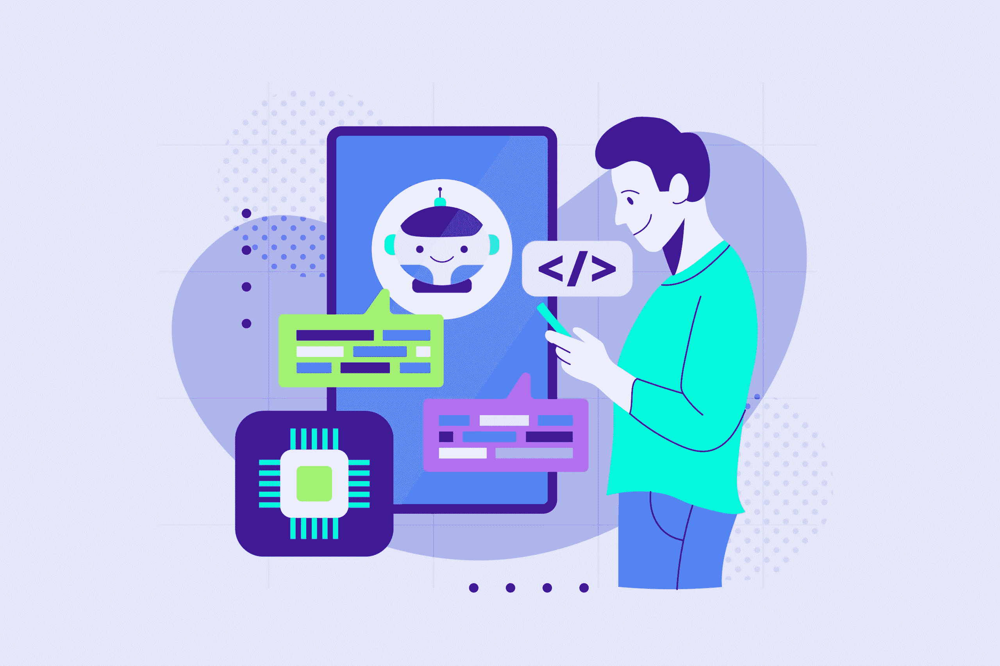
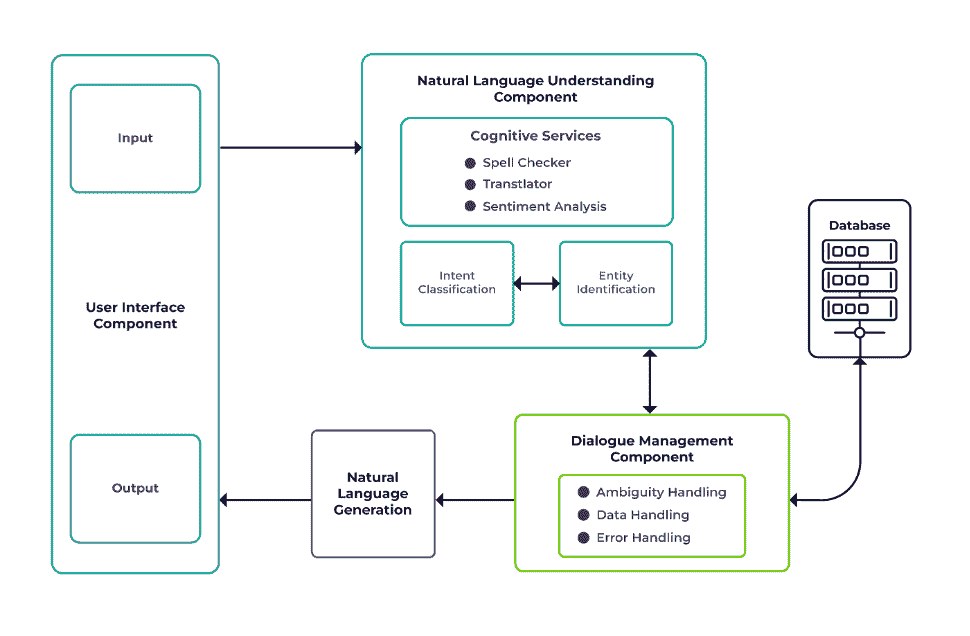

# 对话式人工智能开发中的 3 个关键挑战及其解决方法

> 原文：[`www.kdnuggets.com/3-crucial-challenges-in-conversational-ai-development-and-how-to-avoid-them`](https://www.kdnuggets.com/3-crucial-challenges-in-conversational-ai-development-and-how-to-avoid-them)

图片来源：[Freepik](https://www.freepik.com/free-vector/hand-drawn-flat-design-npl-illustration_22379569.htm#query=Conversational%20AI&position=8&from_view=search&track=ais&uuid=d808c694-ede6-4be4-b65b-f42080e496fc)

对话式人工智能是指模拟人类互动的虚拟代理和聊天机器人，可以与人类进行对话。使用对话式人工智能正迅速成为一种生活方式——从要求 Alexa“*找到最近的餐馆*”到要求 Siri“*创建一个提醒*”，虚拟助手和聊天机器人通常用于回答消费者的问题、解决投诉、进行预订等等。

* * *

## 我们的三大课程推荐

 1\. [谷歌网络安全证书](https://www.kdnuggets.com/google-cybersecurity) - 快速进入网络安全职业

 2\. [谷歌数据分析专业证书](https://www.kdnuggets.com/google-data-analytics) - 提升你的数据分析能力

 3\. [谷歌 IT 支持专业证书](https://www.kdnuggets.com/google-itsupport) - 支持组织的信息技术

* * *

开发这些虚拟助手需要大量的努力。然而，理解和解决关键挑战可以简化开发过程。我使用了在招聘平台上创建成熟聊天机器人的第一手经验作为参考点，来解释关键挑战及其相应的解决方案。

要构建对话式人工智能聊天机器人，开发人员可以使用像 RASA、亚马逊的 Lex 或谷歌的 Dialogflow 这样的框架来构建聊天机器人。当计划进行自定义更改或机器人处于成熟阶段时，大多数人更倾向于使用 RASA，因为它是一个开源框架。其他框架也适合作为起点。

这些挑战可以被分类为聊天机器人的三个主要组件。

**自然语言理解（NLU）**是指机器人理解人类对话的能力。它执行意图分类、实体提取和响应检索。

**对话管理器**负责根据当前和之前的用户输入执行一系列动作。它以意图和实体作为输入（作为之前对话的一部分），并确定下一个响应。

**自然语言生成（NLG）**是从给定数据中生成书面或口头句子的过程。它构建响应，然后呈现给用户。

图片来源：Talentica Software

# 自然语言理解的挑战

## 数据不足

当开发人员用聊天机器人替换常见问题解答或其他支持系统时，他们会获得相当多的训练数据。但当他们从头开始创建聊天机器人时，情况则不同。在这种情况下，开发人员会合成生成训练数据。

### 该怎么办？

基于模板的数据生成器可以生成相当多的用户查询用于训练。一旦聊天机器人准备好，项目负责人可以将其暴露给有限数量的用户，以增强训练数据并在一段时间内进行升级。

## 模型选择不当

选择合适的模型和训练数据对获得最佳的意图和实体提取结果至关重要。开发人员通常在特定的语言和领域中训练聊天机器人，而且大多数现有的预训练模型往往是领域特定的，并且训练于单一语言。

也可能出现混合语言的情况，其中人们是多语种使用者。他们可能会以混合语言输入查询。例如，在以法语为主的地区，人们可能会使用一种混合了法语和英语的英语。

### 该怎么办？

使用多语言训练的模型可能会减少问题。像 LaBSE（语言无关的 Bert 句子嵌入）这样的预训练模型在这种情况下可能会有所帮助。LaBSE 在 109 多种语言中训练了句子相似度任务。该模型已经知道不同语言中的相似词。在我们的项目中，它表现得非常好。

## 实体提取不当

聊天机器人需要实体来识别用户搜索的数据类型。这些实体包括时间、地点、人物、物品、日期等。然而，聊天机器人可能无法从自然语言中识别实体：

*相同的上下文但不同的实体*。例如，当用户输入“来自 IIT Delhi 的学生名字”然后输入“来自 Bengaluru 的学生名字”时，聊天机器人可能会将一个地点混淆为实体。

*实体被低置信度误预测的场景。* 例如，聊天机器人可能会以低置信度将“ IIT Delhi”识别为一个城市。

*机器学习模型的部分实体提取。* 如果用户输入“来自 IIT Delhi 的学生”，模型可能只能将“ IIT”识别为实体，而不是“ IIT Delhi”。

*单词输入没有上下文可能会让机器学习模型感到困惑。* 例如，“Rishikesh”这个词既可以指一个人的名字，也可以指一个城市。

### 该怎么办？

添加更多的训练示例可能是一个解决方案。但有一个限制，超出之后添加更多的示例将无济于事。此外，这是一个无休止的过程。另一个解决方案可能是定义使用预定义词的正则表达式模式，以帮助提取具有已知可能值的实体，如城市、国家等。

模型在对实体预测不确定时，通常会表现出较低的信心。开发者可以利用这一点作为触发条件，调用一个自定义组件来纠正低信心的实体。举个例子，如果*IIT Delhi*被预测为一个城市但信心不足，那么用户可以在数据库中搜索它。在未能在*City*表中找到预测实体后，模型会继续在其他表中查找，最终在*Institute*表中找到它，从而纠正实体。

## 错误的意图分类

每个用户消息都有相关的意图。由于意图决定了机器人接下来的行动步骤，因此正确分类用户查询的意图至关重要。然而，开发者必须尽量减少意图之间的混淆，否则可能会出现混淆问题。例如，*“显示空缺职位”*与*“显示空缺职位候选人”*。

### 如何处理？

区分混淆查询有两种方法。首先，开发者可以引入子意图。其次，模型可以根据识别出的实体来处理查询。

特定领域的聊天机器人应是一个封闭系统，能够明确识别自己的能力范围。开发者在规划特定领域的聊天机器人时必须分阶段进行开发。在每个阶段，他们可以识别聊天机器人不支持的功能（通过不支持的意图）。

他们还可以识别聊天机器人无法处理的“超出范围”的意图。但可能会有机器人对不支持和超出范围的意图感到困惑的情况。在这种情况下，应该有一个回退机制，如果意图信心低于阈值，模型可以优雅地使用回退意图来处理混淆情况。

# 对话管理的挑战

一旦机器人识别出用户消息的意图，它必须发送响应。机器人根据一套定义好的规则和故事来决定响应。例如，一个规则可以是当用户打招呼时，机器人简单地说*“早上好”*。然而，大多数情况下，与聊天机器人的对话包含后续互动，响应依赖于对话的整体上下文。

## 如何处理？

为了应对这一点，聊天机器人需要提供实际对话示例，这些示例被称为故事。然而，用户的互动并不总是如预期的那样。一个成熟的聊天机器人应能够优雅地处理所有这些偏差。如果设计者和开发者在编写故事时不仅关注顺利的路径，还要处理不顺利的路径，他们就能保证这一点。

# 自然语言生成的挑战

用户与聊天机器人的互动在很大程度上依赖于聊天机器人的响应。如果响应过于机械或过于熟悉，用户可能会失去兴趣。例如，即使响应是正确的，用户也可能不喜欢*“你输入了错误的查询”*这样的答案。这里的回答不符合助理的角色。

## 如何处理？

聊天机器人作为助手，应具备特定的个性和语调。它们应该热情和谦虚，开发人员应根据这些设计对话和发言。回应不应听起来像机器人或机械。例如，机器人可以说，“*对不起，看起来我没有相关细节。请您重新输入您的查询？*”以应对错误输入。

# 将 LLMs 添加到聊天机器人系统中

基于 LLM（大语言模型）的聊天机器人，如 ChatGPT 和 Bard，是颠覆性的创新，提升了对话 AI 的能力。它们不仅擅长进行开放式的人类对话，还可以执行文本摘要、段落撰写等不同任务，这些任务以前只有特定模型才能完成。

传统聊天机器人系统的一大挑战是将每句话分类到意图中并据此决定响应。这种方法不切实际。诸如“对不起，我没听懂”之类的回应常常令人烦恼。无意图聊天机器人系统是未来的发展方向，而 LLMs 可以使这一点成为现实。

LLMs 在通用命名实体识别方面可以轻松实现最先进的结果，但在某些特定领域的实体识别方面除外。将 LLMs 与任何聊天机器人框架混合使用，可以激发更成熟和更强大的聊天机器人系统。

随着对话 AI 的最新进展和持续研究，聊天机器人每天都在变得更好。处理多个意图的复杂任务，例如“预订到孟买的航班并安排到达达的出租车”，正受到越来越多的关注。

不久之后，个性化对话将基于用户的特征进行，以保持用户的参与。例如，如果机器人发现用户不满，它会将对话转交给真实的客服。此外，随着聊天机器人数据的不断增加，像 ChatGPT 这样的深度学习技术可以自动生成查询的响应，利用知识库。

****[Suman Saurav](https://www.linkedin.com/in/suman-saurav-ssd/)**** 是 Talentica Software 的数据科学家，该公司是一家软件产品开发公司。他是 NIT Agartala 的校友，拥有超过 8 年的经验，设计和实施使用 NLP、对话 AI 和生成 AI 的革命性 AI 解决方案。

### 相关主题

+   [5 个常见的 Python 隐患（及如何避免）](https://www.kdnuggets.com/5-common-python-gotchas-and-how-to-avoid-them)

+   [5 个常见的数据科学错误及如何避免它们](https://www.kdnuggets.com/5-common-data-science-mistakes-and-how-to-avoid-them)

+   [大数据分析：为什么对商业智能如此关键？](https://www.kdnuggets.com/2023/06/big-data-analytics-crucial-business-intelligence.html)

+   [开发有效编码常规的 5 个关键步骤](https://www.kdnuggets.com/2023/08/5-crucial-steps-develop-effective-coding-routine.html)

+   [LangChain + Streamlit + Llama：将对话式人工智能带到你的……](https://www.kdnuggets.com/2023/08/langchain-streamlit-llama-bringing-conversational-ai-local-machine.html)

+   [开放助手：探索开放和协作的可能性……](https://www.kdnuggets.com/2023/04/open-assistant-explore-possibilities-open-collaborative-chatbot-development.html)
