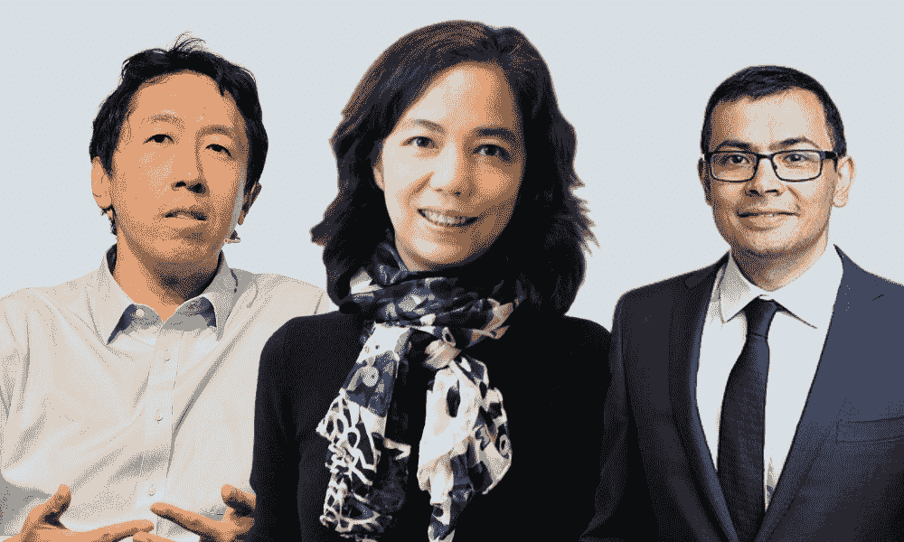

# 人工智能领域的 3 个鼓舞人心的故事

> 原文：[`www.kdnuggets.com/3-inspirational-stories-of-leaders-in-ai`](https://www.kdnuggets.com/3-inspirational-stories-of-leaders-in-ai)

图片由编辑提供

近年来，人工智能已经主导了世界，并将在下一个十年继续如此。我们能想象回到没有人工智能的生活吗？我很难这么认为，因为人工智能已经开始补充我们的生活方式。人工智能突破日常生活并不是突然发生的；相反，它是一些个人有意为之。这些个人中的许多人就是我们所称的人工智能领域的领袖。

在人工智能领域的领袖不一定需要是大公司的首席执行官或富有的投资者。他们可以来自任何生活领域，但仍然对我们今天讨论的人工智能发展做出显著贡献。这些个人及其鼓舞人心的故事就是我们将在本文中讨论的内容。

这些人是谁？让我们深入了解一下。

# 1\. Andrew Yan-Tak Ng

由于他对该领域的贡献，[Andrew Ng](https://www.andrewng.org/)的名字在讨论机器学习或深度学习时经常出现。作为 Coursera 的创始人，他曾教育过数以百万计的人，因此可以被视为人工智能领域的灵感领导者和传奇人物。然而，许多幕后故事使他如此受尊敬。

Andrew 于 1997 年以优异的成绩完成本科课程，获得统计学、经济学和计算机科学三个学位。从 1996 年到 1998 年，他在 AT&T 贝尔实验室专注于强化学习、特征选择和模型选择。他的研究在 1998 年开始声名鹊起，当时他建立了一个自动索引的网页搜索引擎，用于机器学习研究论文。

完成博士学位后，他在斯坦福大学从事学术教学工作，教授学生数据挖掘、大数据和机器学习。在这所大学，他开始倡导在深度学习中使用 GPU。这种方法虽然在当时颇具争议，但后来已经成为标准。

从 2012 年开始，他与 Daphne Coller 共同创办了 Coursera，秉持为所有人提供免费学习的精神。在类似的时间线上，他还在谷歌工作，创办了谷歌脑深度学习项目，并在百度工作直到 2017 年。之后，他创办了 Deeplearning.ai，作为一个在线学习深度学习的平台，以及一个专注于提供人工智能驱动的 SaaS 产品的 Landing AI 初创公司。从那时起，Andrew 更加关注于让人工智能普及到公众中。

凭借 Andrew Ng 所创造的所有成果，他为许多人打开了进入机器学习和深度学习的道路。他因此获得了许多荣誉，包括 2013 年被评选为《时代》100 位最具影响力人物，2014 年被评选为《财富》40 位 40 岁以下杰出人物，以及 2023 年被评选为《时代》人工智能领域 100 位最具影响力人物。

通过保持专注和愿意为许多人提供学习路径，安德鲁·吴的故事无疑激励了任何人跟随。

# 2\. 李飞飞

如果你听说过 ImageNet，你应该知道它的创始人是[李飞飞](https://www.linkedin.com/in/fei-fei-li-4541247/)。正如我们所知，ImageNet 是一个庞大的视觉数据库，用于快速推动计算机视觉的发展，其中超过 1400 万张图片已经手动标注并被广泛使用。从一个数据集，它发展成为深度学习研究的一个重要部分。

李飞飞拥有令人印象深刻的教育背景；她以物理学专业的优异成绩完成本科课程，并学习了计算机科学和工程。即使获得了高荣誉，她仍能平衡她的工作，在那时她每周末回家到父母的店里工作。

她于 2005 年获得博士学位，并在斯坦福大学从助理教授升至正教授。在此期间，她还在 2017 至 2018 年期间在谷歌工作，她对 Project Maven（军事项目）表达了她的观点。她表示，她的原则是关于以人为本的人工智能，以积极和善意的方式造福人类。

在斯坦福大学，她建立了一个名为 SAILORS（斯坦福人工智能实验室外展夏季项目）的倡议，旨在对 9 年级的高中女生进行人工智能教育和研究。从那时起，它演变为 AI4ALL，旨在提高人工智能领域的多样性和包容性。

她的动力始终围绕着使人工智能普及于人类，有人称她为“将人性带入人工智能的研究员”。凭借她的工作，她获得了许多成就，特别是在 2018 年被《福布斯》评为美国前 50 位女性科技人才，以及在 2023 年被《时代》评为 AI100。

从一个 humble 的起点，她的坚持和原则使她成为我们始终仰望的人工智能领导者之一。

# 3\. 德米斯·哈萨比斯

你可能听说过 DeepMind，这是一家谷歌子公司，旨在将人工智能推向 AGI（通用人工智能）。但你知道创始人是谁吗？他就是[德米斯·哈萨比斯](https://twitter.com/demishassabis)，首席执行官和联合创始人。

德米斯·哈萨比斯从 4 岁起就是国际象棋天才，13 岁时成为大师。他还在 15 岁和 16 岁时完成了 A-level 和奖学金水平的考试。凭借赢得的象棋奖金，他购买了自己的第一台计算机，并自学编程。

在大学的间隔年，他开始作为游戏计算机开发者工作。他的显著成就是作为游戏《主题公园》的首席程序员。在他的游戏开发生涯中，他成立了自己的 Elixir Studio 工作室，试图开发一个名为《共和国：革命》的雄心勃勃的游戏，但由于开发时间过长而缩小了范围。工作室于 2005 年关闭，但他在游戏中进行的许多人工智能模拟实验为他未来的工作提供了灵感。

2009 年，他获得了认知神经科学博士学位，之后他将许多工作集中在想象、记忆和遗忘领域。在此期间，他还在研究中取得了突破，将想象过程与情景记忆联系起来。这些想法被称为心智的模拟引擎。

2010 年，他共同创立了 DeepMind，旨在结合神经科学和机器学习实现 AGI。2013 年，公司推出了一种名为 Deep Q-Network 的训练算法，能够仅使用原始像素输入以超人的水平玩 ATARI 游戏。2014 年，谷歌以 4 亿英镑收购了 DeepMind，并自那时起推出了许多突破性的进展。DeepMind 在当前时期，已经在深度学习和强化学习方面取得了许多进展，开创了深度强化学习的先河。

凭借所有的工作，Demis 获得了许多认可，包括 2013 年被列入 WIRED 的“Smart 50”，2017 年入选《时代》杂志“100 位最具影响力人物”，以及 2020 年被英国 GQ 杂志评为“50 位最具影响力人物”。

凭借他的热情，他不断在自己热爱的领域努力，并将其转化为对全世界的进步。他的鼓舞人心的故事也应激励我们实现自己的目标。

# 结论

这篇文章讨论了三位人工智能领导者的鼓舞人心的故事：Andrew Ng、Fei-Fei Li 和 Demis Hassabis。他们现在可能是领袖，但每个人都有自己的出发点，这很令人鼓舞。

****[Cornellius Yudha Wijaya](https://www.linkedin.com/in/cornellius-yudha-wijaya/)****是一名数据科学助理经理和数据撰稿人。在全职工作于 Allianz Indonesia 的同时，他喜欢通过社交媒体和写作媒体分享 Python 和数据技巧。Cornellius 撰写了各种 AI 和机器学习主题的文章。

### 更多相关内容

+   [解锁商业成功：数据科学领导者的日益需求](https://www.kdnuggets.com/unlocking-business-success-the-growing-demand-for-data-science-leaders)

+   [数据讲故事 - 通过数据讲述故事的艺术](https://www.kdnuggets.com/2023/07/manning-data-storytelling-the-art-telling-stories-data.html)
