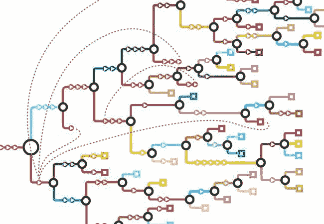

# 3 种进入数据科学领域的可能途径

> 原文：[`www.kdnuggets.com/2022/03/3-possible-ways-get-data-science.html`](https://www.kdnuggets.com/2022/03/3-possible-ways-get-data-science.html)

如果你对学习数据科学感兴趣，了解可能的途径是很重要的。本文将探讨进入数据科学领域的 3 种可能途径。

* * *

## 我们的前三个课程推荐

 1\. [Google 网络安全证书](https://www.kdnuggets.com/google-cybersecurity) - 快速进入网络安全职业。

 2\. [Google 数据分析专业证书](https://www.kdnuggets.com/google-data-analytics) - 提升你的数据分析技能

 3\. [Google IT 支持专业证书](https://www.kdnuggets.com/google-itsupport) - 支持你的组织进行 IT 工作

* * *

## 1\. 传统大学学位

一些顶级大学提供传统的研究生水平的数据科学课程。由于这些是研究生课程，大多数要求具有物理学、数学、会计、商业、计算机科学或工程等分析领域的本科学位。这些课程通常为期 3 到 4 个学期，适合全日制学习。传统课程有不同的种类，如数据科学硕士、数据分析硕士或商业分析硕士。传统面授课程的学费范围可能在$15,000 到$40,000 之间，不包括生活费用。因此，在选择传统大学学位之前，请务必问自己以下问题：

1.  我应该考虑在线课程还是面授课程？

1.  面授课程是否需要我搬迁？

1.  课程的质量如何？

1.  需要哪些先决条件？一些课程要求你完成基本的数学和编程课程。某些课程可能需要 GRE 或 GMAT 考试成绩。

1.  该课程的时长是多少？

1.  该课程的费用是多少？

## **在线硕士**

在线硕士课程是传统大学课程的延伸。在线课程的优势在于成本较低，不需要搬迁。大多数数据科学或商业分析的在线硕士课程通常可以在 18 到 24 个月内完成。在线数据科学硕士课程的费用从$13,000 到$40,000 不等。

## **MOOCs 专业证书/微硕士**

在 edX、Coursera、DataCamp、Udacity 和 Udemy 等平台上，有许多优秀的大规模开放在线课程（MOOCs）提供数据科学的学习。这些课程可能是独立课程，也可能是专业证书或 MicroMasters 课程的形式。这些课程由哈佛大学、麻省理工学院、密歇根大学、波士顿学院、阿德莱德大学、加州大学圣地亚哥分校、加州大学伯克利分校等顶尖大学提供。这些项目价格较便宜且负担得起，您可以按照自己的节奏学习。专业证书和 MicroMasters 课程的费用通常在 $600 到 $1,500 之间。

通过投入一些时间，你可以通过这些课程自学数据科学的基础知识。以下是我喜欢的一些在线数据科学专业化/MicroMasters 课程：

+   [数据科学专业证书（HarvardX，通过 edX）](https://www.edx.org/professional-certificate/harvardx-data-science)

+   [分析：必备工具和方法（Georgia TechX，通过 edX）](https://www.edx.org/micromasters/gtx-analytics-essential-tools-and-methods)

+   [应用数据科学与 Python 专业化（密歇根大学，通过 Coursera）](https://www.coursera.org/specializations/data-science-python)

你可以通过这个链接了解更多在 edX 平台上提供的 MicroMasters 课程：[**edX 数据科学 MicroMasters 课程**](https://programs.edx.org/micromasters/about)。

总之，我们讨论了三种可能的数据科学路径。如果你愿意，可以在大学学习四年（或在研究生院学习更长时间）。这将使你对该领域有更深入的理解，但如果你的情况不允许你追求学位，你可以（凭借一些热情和专注）通过自学掌握数据科学。MOOCs 提供了各种数据科学主题的优质课程，其价格仅为传统项目的几分之一。通过投入适当的时间和精力，你可以通过 MOOC 专业化和 MicroMasters 学习数据科学的基础知识。

**[本杰明·O·塔约](https://www.linkedin.com/in/benjamin-o-tayo-ph-d-a2717511/)** 是一位物理学家、数据科学教育者和作家，也是 DataScienceHub 的所有者。此前，本杰明曾在中欧大学、Grand Canyon 大学和匹兹堡州立大学教授工程学和物理学。

### 相关话题

+   [利用 LLM 将非结构化数据转换为结构化见解的 5 种方法](https://www.kdnuggets.com/5-ways-of-converting-unstructured-data-into-structured-insights-with-llms)

+   [如果你没有合适的学位，如何进入数据分析领域](https://www.kdnuggets.com/2021/12/how-to-get-into-data-analytics.html)

+   [进入 FAANG 公司有多难](https://www.kdnuggets.com/2023/05/hard-get-faang-companies.html)

+   [理解贝叶斯定理如何提升你的数据科学能力的 3 种方法](https://www.kdnuggets.com/2022/06/3-ways-understanding-bayes-theorem-improve-data-science.html)

+   [黑客如何利用数据科学窃取数十亿的 4 种方式](https://www.kdnuggets.com/2022/02/4-ways-hackers-data-science-steal-billions.html)

+   [利用数据科学提高收入的 5 种方法](https://www.kdnuggets.com/2022/05/5-ways-double-income-data-science.html)
