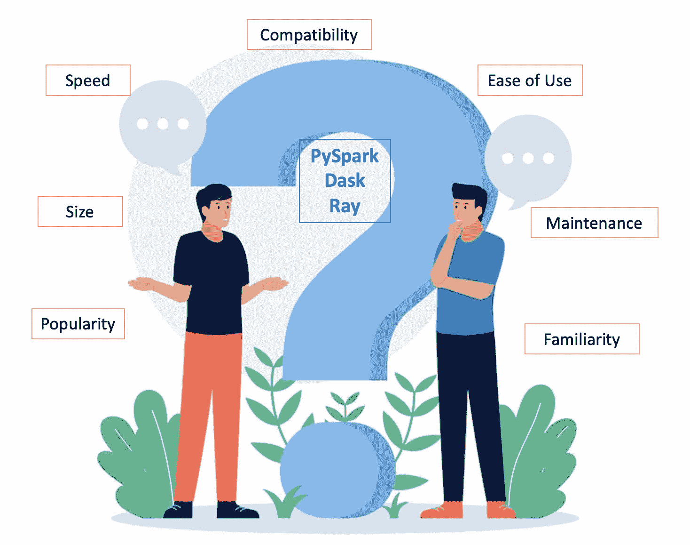
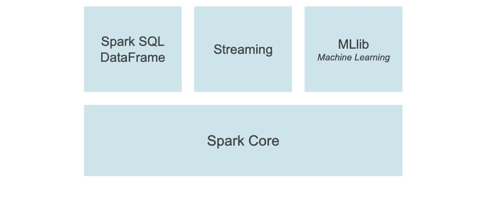
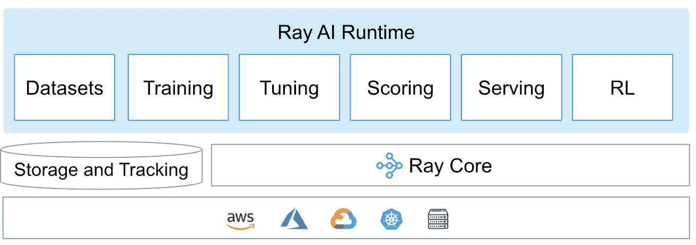

# 加速你的 Python 代码的三种简单方法

> 原文：[`www.kdnuggets.com/2022/10/3-simple-ways-speed-python-code.html`](https://www.kdnuggets.com/2022/10/3-simple-ways-speed-python-code.html)

[来源](https://www.freepik.com/free-vector/flat-people-asking-questions_13561931.htm#query=thinking&position=28&from_view=search): 图片由 Freepik 提供

你刚刚完成了一个使用 Python 的项目。代码干净且可读，但你的性能基准未达标。你原本期望结果在毫秒内出来，却得到了秒级的结果。你该怎么办？

* * *

## 我们的三大课程推荐

 1\. [谷歌网络安全证书](https://www.kdnuggets.com/google-cybersecurity) - 快速进入网络安全职业。

 2\. [谷歌数据分析专业证书](https://www.kdnuggets.com/google-data-analytics) - 提升你的数据分析水平

 3\. [谷歌 IT 支持专业证书](https://www.kdnuggets.com/google-itsupport) - 支持你的组织的 IT 需求

* * *

如果你正在阅读这篇文章，你可能已经知道 Python 是一种具有动态语义和高可读性的解释型编程语言。这使得它易于使用和阅读，但对于许多现实世界的使用场景却不够快速。

因此，可能有多种方法来加速你的 Python 代码，包括但不限于使用高效的数据结构和快速高效的算法。一些 Python 库还在底层使用 C 或 C++ 来加速计算。

如果你已经耗尽了所有这些选项，接下来可以考虑并行处理，进一步则是分布式计算。在这篇文章中，你将了解在机器学习背景下三种流行的分布式计算框架：PySpark、Dask 和 Ray。

# PySpark

PySpark，顾名思义，是 Apache Spark 在 Python 中的接口。它允许用户使用 Python API 编写 Spark 程序，并提供 PySpark shell 进行分布式环境下的交互式数据分析。它支持几乎所有的 Spark 特性，如 Streaming、MLlib、Spark SQL、DataFrame 和 Spark Core，如下所示：

[来源](https://spark.apache.org/docs/latest/api/python/_images/pyspark-components.png)

## 1\. 流处理

Apache Spark 的流处理特性易于使用且具备容错性，运行在 Spark 之上。它为流数据和历史数据提供直观和分析系统。

## 2\. MLlib

MLlib 是建立在 Spark 框架上的可扩展机器学习库。它暴露了一组一致的高层 API，用于创建和调整可扩展的机器学习管道。

## 3\. Spark SQL 和 DataFrame

它是一个用于表格数据处理的 Spark 模块。它提供了一个抽象层，称为 DataFrame，可以在分布式设置中作为 SQL 风格的查询引擎。

## 4\. Spark Core

Spark Core 是一个基础的通用执行引擎，所有其他功能都建立在其上。它提供了一个弹性分布式数据集（RDD）和内存计算。

## 5\. Pandas API on Spark

Pandas API 是一个模块，使得 pandas 的特性和方法可以进行可扩展处理。它的语法与 pandas 一致，不需要用户培训新的模块。它为 pandas（小型/单机数据集）和 Spark（大型分布式数据集）提供了无缝集成的代码库。

# Dask

Dask 是一个多功能的开源分布式计算库，它提供了一个与 Pandas、Scikit-learn 和 NumPy 类似的用户界面。

它提供了高级和低级 API，使用户能够在单机或分布式机器上并行运行自定义算法。

它有两个组件：

+   大数据集合包括高级集合，如 Dask Array 或并行化 NumPy 数组、Dask Bag 或并行化列表、Dask DataFrame 或并行化 Pandas DataFrames、以及并行化 Scikit-learn。它们还包括低级集合，如 Delayed 和 Futures，这些都简化了自定义任务的并行和实时实现。

+   动态任务调度使得任务图可以并行执行，扩展到数千个节点的集群。

# Ray

Ray 是一个用于通用分布式 Python 以及 AIML 驱动应用程序的单一平台框架。它包含一个核心分布式运行时和一个库工具包（Ray AI Runtime），用于并行化 AIML 计算，如下图所示：

[来源](https://docs.ray.io/en/latest/_images/ray-air.svg)

## Ray AI Runtime

Ray AIR 或 Ray AI Runtime 是一个一站式工具包，用于分布式 ML 应用，支持轻松扩展个体和端到端工作流。它基于 Ray 的库，处理各种任务，如预处理、评分、训练、调优、服务等。

## Ray Core

Ray Core 提供了核心原语，如任务（在集群中执行的无状态函数）、演员（在集群中创建的有状态工作进程）和对象（在集群中可访问的不可变值），用于构建可扩展的分布式应用程序。

Ray 使用 Ray AIR 扩展机器学习工作负载，并通过 Ray Core 和 Ray Clusters 构建和部署分布式应用程序。

# 选择哪一个？

现在你已经了解了你的选择，接下来的自然问题是选择哪一个。答案取决于多个因素，如具体的业务需求、开发团队的核心实力等。

让我们了解一下哪种框架适合下面列出的具体要求：

+   **规模：** PySpark 在处理超大型工作负载（TB 级及以上）时最为强大，而 Dask 和 Ray 在中等规模的工作负载下表现相当不错。

+   **通用性：** 在通用解决方案方面，Ray 领先，其次是 PySpark。而 Dask 完全旨在扩展 ML 管道。

+   **速度：** Ray 是处理 NLP 或文本标准化任务的最佳选择，利用 GPU 加速计算。另一方面，Dask 提供了快速读取结构化文件到 DataFrame 对象的功能，但在连接和合并方面表现较差。这里 Spark SQL 表现优异。

+   **熟悉度：** 对于更倾向于 Pandas 数据获取和过滤方式的团队，Dask 似乎是一个首选，而 PySpark 则适合那些寻找类似 SQL 查询接口的团队。

+   **易用性：** 三个工具建立在不同的平台上。虽然 PySpark 主要基于 Java 和 C++，Dask 则完全基于 Python，这意味着你的机器学习团队，包括数据科学家，可以更容易地追踪错误消息。另一方面，Ray 的核心是 C++，但在 AIML 模块（Ray AIR）中相当 Python 风格。

+   **安装和维护：** 在维护开销方面，Ray 和 Dask 得分相当。另一方面，Spark 基础设施相当复杂且难以维护。

+   **流行度和支持：** PySpark 作为所有选项中最成熟的一个，享有开发者社区的支持，而 Dask 排名第二。Ray 在功能方面表现出色，处于测试阶段。

+   **兼容性：** 虽然 PySpark 与 Apache 生态系统集成良好，但 Dask 与 Python 和 ML 库的兼容性也很好。

# 总结

本文讨论了如何在常见的数据结构和算法选择之外加速 Python 代码。文章重点介绍了三个著名的框架及其组件。本文旨在通过权衡不同选项在各种特性和业务背景下的表现，帮助读者做出选择。

**[Vidhi Chugh](https://vidhi-chugh.medium.com/)** 是一位获奖的 AI/ML 创新领导者和 AI 伦理学家。她在数据科学、产品和研究的交汇点工作，以提供商业价值和洞察。她是数据中心科学的倡导者，也是数据治理领域的领先专家，致力于构建可信赖的 AI 解决方案。

### 更多内容

+   [如何通过缓存加速 Python 代码](https://www.kdnuggets.com/how-to-speed-up-python-code-with-caching)

+   [个性化 AI 变得简单：你的无代码 GPTs 适配指南](https://www.kdnuggets.com/personalized-ai-made-simple-your-no-code-guide-to-adapting-gpts)

+   [数据科学家共享代码块的新方式](https://www.kdnuggets.com/2022/03/new-ways-sharing-code-blocks.html)

+   [ChatGPT 如何让你的代码更好更快的 7 种方法](https://www.kdnuggets.com/2023/06/7-ways-chatgpt-makes-code-better-faster.html)

+   [你可以利用 ChatGPT 的代码解释器进行数据科学的 5 种方式](https://www.kdnuggets.com/2023/08/5-ways-chatgpt-code-interpreter-data-science.html)

+   [RAPIDS cuDF 加速你下一个数据科学工作流程](https://www.kdnuggets.com/2023/04/rapids-cudf-speed-next-data-science-workflow.html)
