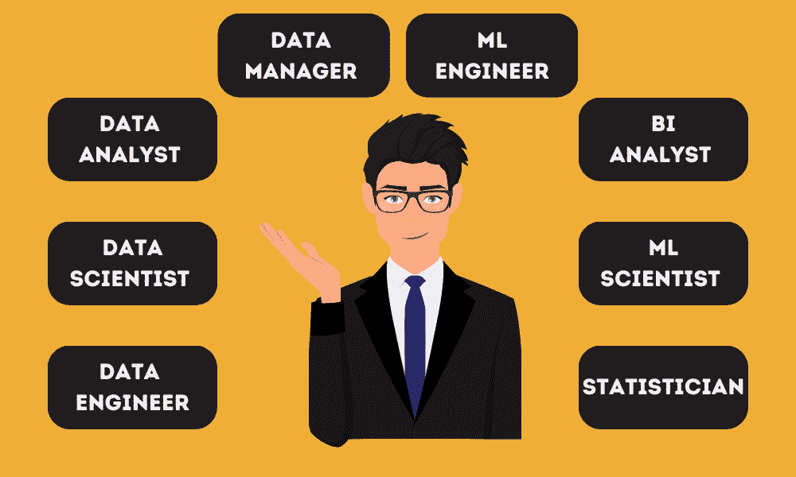

# 我希望自己在开始数据科学时知道的三件事

> 原文：[`www.kdnuggets.com/2023/01/3-things-wish-knew-started-data-science.html`](https://www.kdnuggets.com/2023/01/3-things-wish-knew-started-data-science.html)

图片由 [Moose Photos](https://www.pexels.com/photo/man-sitting-with-laptop-computer-on-desk-and-lamp-1586996/) 提供

当我开始学习数据科学时，我的背景是技术管理。我对编程、统计学或机器学习了解很少。

* * *

## 我们的三大课程推荐

 1\. [谷歌网络安全证书](https://www.kdnuggets.com/google-cybersecurity) - 快速进入网络安全职业生涯

 2\. [谷歌数据分析专业证书](https://www.kdnuggets.com/google-data-analytics) - 提升你的数据分析技能

 3\. [谷歌 IT 支持专业证书](https://www.kdnuggets.com/google-itsupport) - 支持你组织的 IT 需求

* * *

我最大的担忧是缺乏编程语言。我总是忽视数学、统计学和概率。我甚至将机器学习视为一种试错实验，将一堆算法结合起来以改进模型性能，而不知其工作原理或我能为公司带来什么价值。

在这篇文章中，我将分享我完全错误的三件事，以及你如何利用这些经验来导航数据科学职业路径。

# 1\. 你不能成为数据科学领域的全能型人才

我曾经认为我的目标是成为一名“数据科学家”。因此，我专注于此，忽略了其他领域，如计算机视觉、自然语言处理、时间序列、商业智能和机器学习工程。

我认为数据科学全在于数据摄取、清理、分析、可视化、建模和报告。

“我完全错了”

作者提供的图像

在数据科学领域，你不能成为一个全能型人才。公司希望找到在特定数据科学领域有专长的人，或者能在多个任务上工作的敏捷数据科学家，例如实验跟踪、商业智能、报告以及模型部署和监控。

如果你查看任何“数据科学家”职位的招聘信息，你会看到公司如何寻找在特定领域有专长的人。

例如，一家卡车追踪公司将始终寻找能够使用现代机器学习技术并具备复杂计算机视觉模型经验的数据科学家。

> **教训：** 你必须了解整个数据科学生命周期，找到最适合你的方法并做到精通。

# 2\. 你必须理解统计学和机器学习算法

即使在作为数据科学家工作了好几年之后，我仍在不断学习新的算法类型，特别是强化学习算法。

但我当时并不是这样。

对统计学和机器学习算法缺乏知识在面试和工作中给我带来了尴尬。此外，我像盲人一样尝试各种方法来找到解决方案，却不知道如何改善当前的模型或过程。

图片来源：[Andrea Piacquadio](https://www.pexels.com/photo/woman-holding-books-3768126/)

我只希望如果我当时能专注于基础知识，我本可以节省很多时间和尴尬的情况。此外，我本可以早早获得更好的工作，因为公司总是寻找对深度学习算法和架构有深入了解的个人。

> **教训：** 学习所有基础知识很难，但你必须从某处开始。因此，当你开始你的职业生涯时，专注于数学和编程，这两者都是职业成功的关键。

# 3. 了解你在行业中的价值

了解你的价值是最重要的，我花了很长时间才明白自己的位置。

了解你的价值包括两个方面：

+   了解你的技能和技能水平。

+   了解你时间的价值。

图片来源：作者

## 了解你的技能和技能水平

我知道，冒名顶替综合症是存在的。它会阻止你跳槽到更好的机会。你会总觉得自己不够好。所以，你最好开始了解你拥有多少技能和你的专业水平。为此，你可以参加评估测试和认证考试，参与开源项目，或参加竞赛。

## 了解你时间的价值

起初，我被利用了，我每篇文章只赚$12，我以为这是行业标准，直到我碰到另一个机会，那个机会支付我$100。

在了解了你的技能水平之后，你需要搞清楚你的时间价值是多少。你可以与多家公司合作，与你的同龄人交流，向行业内的专业人士请教，并阅读博客来评估你的价值。

我花了很长时间才明白自己的价值，并且我仍在学习新技能以提高当前价值。如果你想在职业生涯中持续成长，学习过程永远不会停止。

# 结论

我喜欢分享我成为数据科学家的历程，以及如果在职业生涯开始前知道一些事情，情况会变得更好。

这个过程很艰难且重复，需要耐心。它完全没有被美化。这是一项压力巨大的工作，你总是要面对独特的问题。

你可以通过专注于一个研究领域，学习算法背后的数学，并了解你的价值来简化你的历程。

我相信任何背景的人都能学习数据科学。这一切都关乎于努力、坚持和好奇心。如果你想了解数据科学、机器学习、MLOps 以及我的经历，请关注我的[社交平台](https://www.linkedin.com/in/1abidaliawan/)。

**[Abid Ali Awan](https://www.polywork.com/kingabzpro)** ([@1abidaliawan](https://twitter.com/1abidaliawan)) 是一名认证的数据科学专业人士，热衷于构建机器学习模型。目前，他专注于内容创作，并撰写关于机器学习和数据科学技术的技术博客。Abid 拥有技术管理硕士学位和电信工程学士学位。他的愿景是利用图神经网络为挣扎于心理疾病的学生开发一个 AI 产品。

### 更多相关主题

+   [选择下一个数据科学职位前需要注意的 5 件事](https://www.kdnuggets.com/2022/01/5-things-keep-mind-selecting-next-job.html)

+   [关于 SAS 数据科学学院你不知道的 3 件事](https://www.kdnuggets.com/2022/07/sas-3-things-didnt-know-sas-academy-data-science.html)

+   [学生在数据科学简历中遗漏的 7 件事](https://www.kdnuggets.com/7-things-students-are-missing-in-a-data-science-resume)

+   [将数据科学家与其他职业区分开的 5 件事](https://www.kdnuggets.com/2021/11/5-things-set-data-scientist-apart-other-professions.html)

+   [你需要知道的数据管理 6 件事及其重要性……](https://www.kdnuggets.com/2022/05/6-things-need-know-data-management-matters-computer-vision.html)

+   [扩展你的网络数据驱动产品时你应该知道的事情](https://www.kdnuggets.com/2023/08/things-know-scaling-web-datadriven-product.html)
