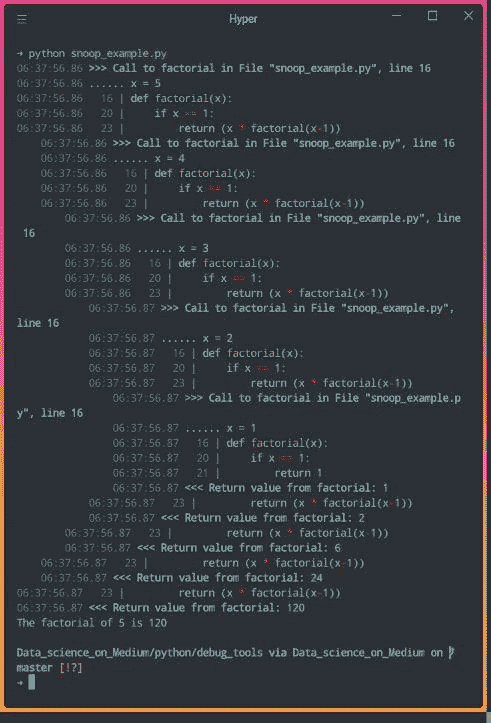
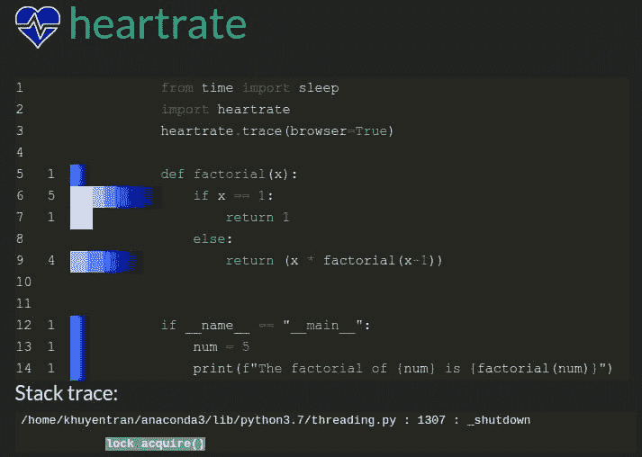

# 3 个工具来跟踪和可视化你的 Python 代码执行

> 原文：[`www.kdnuggets.com/2021/12/3-tools-track-visualize-execution-python-code.html`](https://www.kdnuggets.com/2021/12/3-tools-track-visualize-execution-python-code.html)

# 动机

* * *

## 我们的前三个课程推荐

 1\. [Google 网络安全证书](https://www.kdnuggets.com/google-cybersecurity) - 快速进入网络安全职业生涯。

 2\. [Google 数据分析专业证书](https://www.kdnuggets.com/google-data-analytics) - 提升你的数据分析技能

 3\. [Google IT 支持专业证书](https://www.kdnuggets.com/google-itsupport) - 支持你的组织 IT

* * *

你是否见过如下的错误输出：

```py
2 divided by 1 is equal to 2.0.
Traceback (most recent call last):
  File "loguru_example.py", line 17, in <module>
    divide_numbers(num_list)
  File "loguru_example.py", line 11, in divide_numbers
    res = division(num1, num2)
  File "loguru_example.py", line 5, in division
    return num1/num2
ZeroDivisionError: division by zero
```

并希望输出能像这里所示的那样更容易理解？


作者的图片

你可能还希望实时可视化哪些代码行正在执行以及它们被执行了多少次：


作者的 GIF

如果是这样，这篇文章将提供工具来实现上述目标。这三个工具是：

+   Loguru — 打印更好的异常

+   snoop — 打印函数中正在执行的代码行

+   heartrate — 实时可视化 Python 程序的执行

使用这些工具只需要一行代码！

# Loguru — 打印更好的异常

[Loguru](https://github.com/Delgan/loguru) 是一个旨在让 Python 日志记录变得愉快的库。Loguru 提供了许多有趣的功能，但我发现最有用的功能是**捕捉意外错误**并**显示导致代码失败的变量值**。

要安装 Loguru，输入

```py
pip install loguru
```

要理解 Loguru 的有用性，假设你有 2 个函数`division`和`divide_numbers`，并且函数`divide_numbers`被执行。

注意`combinations([2,1,0], 2)`返回`[(2, 1), (2, 0), (1, 0)]`。在运行上述代码后，我们遇到了这个错误：

```py
2 divided by 1 is equal to 2.0.
Traceback (most recent call last):
  File "loguru_example.py", line 17, in <module>
    divide_numbers(num_list)
  File "loguru_example.py", line 11, in divide_numbers
    res = division(num1, num2)
  File "loguru_example.py", line 5, in division
    return num1/num2
ZeroDivisionError: division by zero
```

从输出结果中，我们知道`return num1/num2`是错误发生的地方，但我们不知道`num1`和`num2`的哪些值导致了错误。幸运的是，通过添加 Loguru 的`logger.catch`装饰器，这可以很容易地追踪：

输出：


作者的图片

通过添加`logger.catch`，异常更容易理解了！原来错误发生在将`2`除以`0`时。

# snoop — 打印正在执行的代码行

如果代码没有错误，但我们想了解代码中发生了什么，这时 snoop 就派上用场了。

[snoop](https://github.com/alexmojaki/snoop)是一个 Python 包，它通过添加一个装饰器打印被执行的代码行及每个变量的值。

要安装 snoop，请输入：

```py
pip install snoop
```

让我们假设有一个叫做`factorial`的函数，它[计算整数的阶乘](https://www.programiz.com/python-programming/recursion)。

输出：

```py
The factorial of 5 is 120
```

要理解`factorial(5)`的输出是`20`，我们可以将`snoop`装饰器添加到`factorial`函数中。

输出：



图片由作者提供

在上面的输出中，我们可以查看变量的值以及哪些代码行被执行。现在我们可以更好地理解递归是如何工作的！

# heartrate — 实时可视化 Python 程序的执行

如果你想可视化哪些行被执行以及执行了多少次，可以尝试使用 heartrate。

[heartrate](https://github.com/alexmojaki/heartrate)也是 snoop 的创建者开发的。要安装 heartrate，请输入：

```py
pip install heartrate
```

现在让我们将`heartrate.trace(browser=True)`添加到之前的代码中。这将打开一个浏览器窗口，显示调用`trace()`的文件的可视化图。

运行上述代码时应该会弹出一个新的浏览器窗口。如果没有，请访问[`localhost:9999`](http://localhost:9999/file/?filename=heartrate_example.py)。你应该会看到如下输出：



图片由作者提供

太棒了！这些条形图展示了被命中的行。条形图越长，命中次数越多，颜色越浅，表示越新近。

从上面的输出中，我们可以看到程序执行了：

+   `if x==1` 5 次

+   `return 1` 一次

+   `return (x * factorial(x-1))` 4 次

输出是有意义的，因为`x`的初始值为 5，并且函数会重复调用，直到`x`等于`1`。

现在让我们看看使用 heartrate 实时可视化 Python 程序的执行是什么样的。让我们添加`sleep(0.5)`，使程序运行得稍慢一点，并将`num`增加到`20`。


GIF 由作者提供

太棒了！我们可以实时看到哪些代码行正在执行，以及每行代码的执行次数。

# 结论

恭喜！你刚刚学习了跟踪和可视化 Python 代码执行的 3 个工具。我希望使用这 3 个工具时调试会变得不那么痛苦。既然这些工具只需要一行代码，何不尝试一下，看看它们有多么有用？

随意玩耍并[在这里叉开这篇文章的源代码](https://github.com/khuyentran1401/Data-science/tree/master/python/debug_tools)。

给这个 [仓库](https://github.com/khuyentran1401/Data-science) 点个星。

**[Khuyen Tran](https://www.linkedin.com/in/khuyen-tran-1401/)** 是一位多产的数据科学作家，她编写了 [一系列令人印象深刻的有用数据科学主题及其代码和文章](https://github.com/khuyentran1401/Data-science)。Khuyen 目前正在寻找一份机器学习工程师、数据科学家或开发者倡导者的职位，地点在 2022 年 5 月后湾区，如果你在寻找拥有她技能的人，请与她联系。

[原文](https://towardsdatascience.com/3-tools-to-track-and-visualize-the-execution-of-your-python-code-666a153e435e)。经许可转载。

### 更多相关主题

+   [KDnuggets™ 新闻 22:n01, 1 月 5 日: 追踪和可视化的 3 个工具…](https://www.kdnuggets.com/2022/n01.html)

+   [SQL 执行顺序的基本指南](https://www.kdnuggets.com/the-essential-guide-to-sql-execution-order)

+   [通过热门数据技能加速你的下一步行动](https://www.kdnuggets.com/2023/01/datacamp-fast-track-next-move-indemand-data-skills.html)

+   [如何使用 Python 跟踪 IP 地址的位置](https://www.kdnuggets.com/2023/01/track-location-ip-address-python.html)

+   [作为数据科学家管理你的可重用 Python 代码](https://www.kdnuggets.com/2021/06/managing-reusable-python-code-data-scientist.html)

+   [加快 Python 代码执行的 3 种简单方法](https://www.kdnuggets.com/2022/10/3-simple-ways-speed-python-code.html)
