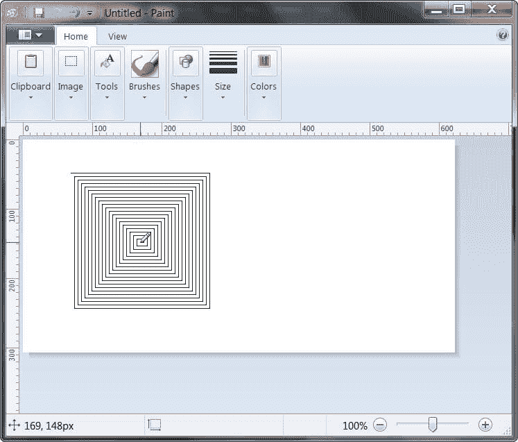

# 3 个实用的 Python 自动化脚本

> 原文：[`www.kdnuggets.com/2022/11/3-useful-python-automation-scripts.html`](https://www.kdnuggets.com/2022/11/3-useful-python-automation-scripts.html)

无论是十分钟的送餐服务还是随时随地可用的内容，我们都习惯于在指尖完成任务。世界一直在自动化某些东西，无论是使用简单的机器、流水线、机器人，还是计算机处理交易。人类通过自动化和将日常任务委派给机器，获得了显著的好处并享受了便利。


图片由 [olia danilevich](https://www.pexels.com/photo/two-men-looking-at-a-laptop-4974920/) 提供

说到编程，Python 是一种备受追捧且易于使用的语言，用于自动化一些重复的任务。随着机器学习和人工智能成为主流，Python 由于其简单易学而广受关注。像回复邮件、下载视频、在特定时间向一组收件人发送短信、朗读电子邮件等简单的日常任务，都可以通过 Python 轻松自动化。

在这篇文章中，我们将讨论 Python 及其库在桌面上自动化常见任务的三种最有用的应用。

# 清理下载文件夹

如果你已经使用你的机器一段时间了，那么你的下载文件夹很可能会变得混乱。我们都曾遇到过这样的情况，并且手动删除无关的文件非常麻烦——有没有解决方案？当然有。为什么不自动删除一些文件，比如按类型来删除呢？

我们通常会从互联网下载大量的 PDF 文件，因此下面分享的脚本对于删除这些文件非常有用。值得注意的是，这个脚本会删除所有符合条件的文件，而不是将它们移到回收站。

支持这种自动化的库是“os”。首先导入“os”库。将你的目录更改为下载目录。然后调用“listdir()”函数，该函数列出当前目录中的所有文件和目录，即在我们的例子中是 Downloads。遍历这些文件，检查文件是否以“.pdf”扩展名结尾，并使用“.remove(file)”方法删除文件。

```py
import os
os.chdir('/Users/macUser/Downloads')
for file in os.listdir():
    if file.endswith(('.pdf')):
        os.remove(file)
```

你还可以在筛选文件时添加其他条件。例如，我通常从“web.whatsapp.com”下载图片，所有这些图片的文件名都以“Whatsapp”子串开头。

```py
import os
os.chdir('/Users/macUser/Downloads')
for file in os.listdir():
    if file.startswith(("Whatsapp")) and file.endswith((“.png”, “.jpg”)):
        os.remove(file)
```

上述代码删除了所有以“Whatsapp”开头的 png 和 jpg 文件。

# 自动化你的桌面

现在你的下载文件夹已经干净整洁，让我们在桌面上添加一些“幽灵”吧。Pyautogui 是一个支持自动化鼠标指针移动和键盘按键操作的 Python 库，使用起来非常方便。

下面的代码将文本“This Desktop is Automated!”输入到已经打开的 TextEdit 文件中。首先，导入库“pyautogui”并使用别名“pag”。调用“doubleClick()”方法，传入你希望双击的坐标作为参数。在此例中，坐标选择为 x = 150 和 y = 150。

请注意，在计算机屏幕上，0,0 坐标从左上角开始，y 轴值随着向下移动而增加，x 轴值随着向右移动而增加。

```py
import pyautogui as pag
pag.doubleClick(150, 150)
pag.write('This Desktop is Automated!', interval=0.25)
```

双击坐标位于打开的文本文件内部，因此光标会在文件内闪烁。你也可以调用“click()”方法，而不是“doubleClick()”。“pyautogui.write()”会在光标闪烁的位置添加文本。

事件序列如下图 GIF 所示。


Pyautogui 还允许你移动文件、保存文件、选择和复制文本以及截取屏幕截图，从而使其成为桌面自动化的多功能选项。

你也可以通过在每次迭代中减少圆的半径或正方形边的长度来绘制一些难以绘制的图像，比如螺旋。下面的 [code](https://pyautogui.readthedocs.io/en/latest/) 来自官方文档，突出了这个应用。

```py
distance = 200
while distance > 0:
    pyautogui.drag(distance, 0, duration=0.5)   # move right
    distance -= 5
    pyautogui.drag(0, distance, duration=0.5)   # move down
    pyautogui.drag(-distance, 0, duration=0.5)  # move left
    distance -= 5
    pyautogui.drag(0, -distance, duration=0.5)
```



来源：[Pyautogui 官方文档](https://pyautogui.readthedocs.io/en/latest/)

# 下载 YouTube 视频

今天你有一段长途飞行，需要在桌面上观看一些 YouTube 视频。使用“pytube”很简单。只需导入 pytube，并使用视频 URL 调用 Youtube().streams.first() 方法。将输出保存到视频变量中，然后使用下载位置调用 download() 方法以下载视频。

使用 try 和 except 添加异常处理会有所帮助，因为大多数错误源于不正确或不完整的 URL。

```py
import pytube
video_url = 'https://www.youtube.com/watch?v=npA-2ONUqOc'
try:
    video = pytube.YouTube(video_url).streams.first()  
    video.download('/Users/macUser/Downloads')  
    print("Success: The file is downloaded.")
except:
    print("Error: There might be an issue with the url provided.")
```

控制台上的输出如下图所示。

```py
Success: The file is downloaded.
```

你可以在下载文件夹中看到下载的文件。


# 附加参考

本文旨在分享可以每日自动化的一系列任务，使我们的生活更加轻松。从文章中显示的例子可以看出，你无需具备广泛和高级的 Python 编程知识即可实现这些任务。如果你有兴趣更进一步，了解更多类似的例子，可以参考 Al Sweigart 的《用 Python 自动化无聊事务：完全初学者的实用编程》。

> *我希望你喜欢 Python 在自动化简单桌面任务（如清理文件夹、下载 YouTube 视频和自动化桌面）中的三个应用。如果你有更多使用 Python 自动化任务的建议，欢迎在下面的评论区留言。*

**[Vidhi Chugh](https://vidhi-chugh.medium.com/)** 是一位 AI 战略家和数字化转型领导者，她在产品、科学和工程交汇处工作，致力于构建可扩展的机器学习系统。她是一位获奖的创新领袖、作者和国际演讲者。她的使命是使机器学习民主化，并打破术语，让每个人都能参与这一转型。

### 更多相关内容

+   [5 个真正有用的数据科学 Bash 脚本](https://www.kdnuggets.com/2023/02/bash-scripts-data-science.html)

+   [免费 Python 自动化课程](https://www.kdnuggets.com/2022/07/free-automate-python-course.html)

+   [数据科学工作流中的自动化](https://www.kdnuggets.com/2023/03/automation-data-science-workflows.html)

+   [数据科学中的 4 个有用的中级 SQL 查询](https://www.kdnuggets.com/2022/12/4-useful-intermediate-sql-queries-data-science.html)

+   [KDnuggets 新闻，12 月 7 日：揭示十大数据科学误区 • 4…](https://www.kdnuggets.com/2022/n47.html)

+   [Kaggle 竞赛对现实世界问题有用吗？](https://www.kdnuggets.com/are-kaggle-competitions-useful-for-real-world-problems)
