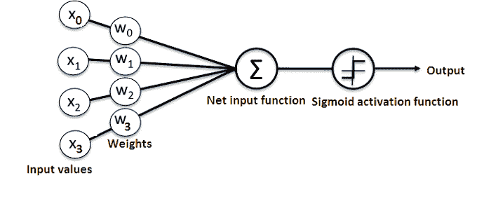
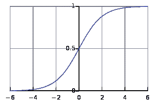

# 如何在 Python 中创建一个简单的神经网络

> 译文：[`www.kdnuggets.com/2018/10/simple-neural-network-python.html`](https://www.kdnuggets.com/2018/10/simple-neural-network-python.html)

评论

**由 [Dr. Michael J. Garbade](https://www.linkedin.com/in/garbade) 提供**

神经网络（NN），也称为人工神经网络（ANN），是机器学习领域内的一类学习算法，松散地基于生物神经网络的概念。

* * *

## 我们的前三大课程推荐

 1\. [谷歌网络安全证书](https://www.kdnuggets.com/google-cybersecurity) - 快速进入网络安全职业。

 2\. [谷歌数据分析专业证书](https://www.kdnuggets.com/google-data-analytics) - 提升你的数据分析技能

 3\. [谷歌 IT 支持专业证书](https://www.kdnuggets.com/google-itsupport) - 支持你所在组织的 IT

* * *

[安德烈·布列祖克](https://www.liveedu.tv/andreybu/REaxr-machine-learning-model-python-sklearn-kera/oPGdP-machine-learning-model-python-sklearn-kera/)，一位拥有五年以上经验的德国机器学习专家表示：“神经网络正在彻底改变机器学习，因为它们能够高效地建模跨多个学科和行业的复杂抽象。”

基本上，一个 ANN 包括以下组件：

+   一个接收数据并传递数据的输入层

+   一个隐藏层

+   一个输出层

+   层间权重

+   每个隐藏层的激活函数。在这个简单的神经网络 Python 教程中，我们将使用 Sigmoid 激活函数。

有多种类型的神经网络。在这个项目中，我们将创建前馈或感知神经网络。这种类型的 ANN 直接从前到后传递数据。

训练前馈神经元通常需要反向传播，这为网络提供了相应的输入和输出数据。当输入数据传输到神经元中时，会被处理并生成输出。

这里是一个展示简单神经网络结构的图示：



了解神经网络工作原理的最佳方法是学习如何从头开始构建一个（不使用任何库）。

在本文中，我们将演示如何使用 Python 编程语言创建一个简单的神经网络。

### **问题**

这里是一个展示问题的表格。

|  | 输入 |  | 输出 |
| --- | --- | --- | --- |
| **训练数据 1** | 0 | 0 | 1 | 0 |
| **训练数据 2** | 1 | 1 | 1 | 1 |
| **训练数据 3** | 1 | 0 | 1 | 1 |
| **训练数据 4** | 0 | 1 | 1 | 0 |
|  |
| **新情况** | 1 | 0 | 0 | **?** |

我们将训练神经网络，使其在提供新数据集时能够预测正确的输出值。

如你在表中所见，输出的值始终等于输入部分的第一个值。因此，我们期望输出的值（**?**）为 1。

让我们看看是否可以使用一些 Python 代码得到相同的结果（在继续阅读之前，你可以在本文末尾查看这个项目的代码）。

### **创建一个 NeuralNetwork 类**

我们将在 Python 中创建一个**NeuralNetwork**类来训练神经元以提供准确的预测。这个类还将包含其他辅助函数。

尽管我们不会在这个简单的神经网络示例中使用神经网络库，我们将导入**numpy**库来协助计算。

这个库提供了以下四个重要的方法：

1.  **exp**——用于生成自然指数

1.  **array**——用于生成矩阵

1.  **dot**——用于矩阵相乘

1.  **random**——用于生成随机数。注意，我们将对随机数进行初始化，以确保其有效分布。

+   **应用 Sigmoid 函数**

我们将使用[Sigmoid 函数](https://en.wikipedia.org/wiki/Sigmoid_function)，它绘制了一个特征性的“S”形曲线，作为神经网络的激活函数。



这个函数可以将任何值映射到 0 到 1 之间的值。它将帮助我们对输入的加权和进行归一化。

然后，我们将创建 Sigmoid 函数的导数，以帮助计算对权重的必要调整。

Sigmoid 函数的输出可以用来生成其导数。例如，如果输出变量是“x”，则其导数将是 x * (1-x)。

+   **训练模型**

这是我们将教神经网络做出准确预测的阶段。每个输入都有一个权重——可以是正的也可以是负的。

这意味着具有大量正权重或大量负权重的输入将对结果输出产生更大的影响。

记住，我们最初是通过将每个权重分配给一个随机数来开始的。

这是我们在这个神经网络示例问题中使用的训练过程：

1.  我们从训练数据集中获取输入，根据其权重进行一些调整，并通过一种计算 ANN 输出的方法来处理它们。

1.  我们计算了反向传播的误差率。在这种情况下，它是神经元预测输出与训练数据集期望输出之间的差异。

1.  根据获得的误差程度，我们使用[误差加权导数公式](https://en.wikipedia.org/wiki/Backpropagation#Finding_the_derivative_of_the_error)进行了些许权重调整。

1.  我们将这个过程迭代了任意次数的 15,000 次。在每次迭代中，整个训练集同时处理。

我们使用了“.T”函数将矩阵从横向位置转置为纵向位置。因此，数字将以这种方式存储：


**最终**，神经元的权重将根据提供的训练数据进行优化。因此，如果神经元被要求思考一个新的情况，与之前的情况相同，它可以做出准确的预测。这就是反向传播的过程。

### **总结**

最后，我们初始化了 NeuralNetwork 类并运行了代码。

这是用于在 Python 项目中创建神经网络的完整代码：

```py

import numpy as np

class NeuralNetwork():

    def __init__(self):
        # seeding for random number generation
        np.random.seed(1)

        #converting weights to a 3 by 1 matrix with values from -1 to 1 and mean of 0
        self.synaptic_weights = 2 * np.random.random((3, 1)) - 1

    def sigmoid(self, x):
        #applying the sigmoid function
        return 1 / (1 + np.exp(-x))

    def sigmoid_derivative(self, x):
        #computing derivative to the Sigmoid function
        return x * (1 - x)

    def train(self, training_inputs, training_outputs, training_iterations):

        #training the model to make accurate predictions while adjusting weights continually
        for iteration in range(training_iterations):
            #siphon the training data via  the neuron
            output = self.think(training_inputs)

            #computing error rate for back-propagation
            error = training_outputs - output

            #performing weight adjustments
            adjustments = np.dot(training_inputs.T, error * self.sigmoid_derivative(output))

            self.synaptic_weights += adjustments

    def think(self, inputs):
        #passing the inputs via the neuron to get output   
        #converting values to floats

        inputs = inputs.astype(float)
        output = self.sigmoid(np.dot(inputs, self.synaptic_weights))
        return output

if __name__ == "__main__":

    #initializing the neuron class
    neural_network = NeuralNetwork()

    print("Beginning Randomly Generated Weights: ")
    print(neural_network.synaptic_weights)

    #training data consisting of 4 examples--3 input values and 1 output
    training_inputs = np.array([[0,0,1],
                                [1,1,1],
                                [1,0,1],
                                [0,1,1]])

    training_outputs = np.array([[0,1,1,0]]).T

    #training taking place
    neural_network.train(training_inputs, training_outputs, 15000)

    print("Ending Weights After Training: ")
    print(neural_network.synaptic_weights)

    user_input_one = str(input("User Input One: "))
    user_input_two = str(input("User Input Two: "))
    user_input_three = str(input("User Input Three: "))

    print("Considering New Situation: ", user_input_one, user_input_two, user_input_three)
    print("New Output data: ")
    print(neural_network.think(np.array([user_input_one, user_input_two, user_input_three])))
    print("Wow, we did it!")

```

这是运行代码后的输出：


我们成功地创建了一个简单的神经网络。

神经元开始时分配了一些随机权重。之后，它使用训练样本进行了训练。

因此，如果面对一个新的情况 [1,0,0]，它给出的值是 0.9999584。

你记得我们想要的正确答案是 1 吗？

那么，这非常接近——考虑到 Sigmoid 函数输出的值介于 0 和 1 之间。

当然，我们只使用了一个神经元网络来完成这个简单的任务。如果我们将几千个这样的人工神经网络连接在一起呢？我们能否可能 100% 模拟人脑的工作方式？

你有任何问题或评论吗？

请在下方提供。

**个人简介**: [Dr. Michael J. Garbade](https://www.linkedin.com/in/garbade) 是洛杉矶区块链教育公司 [LiveEdu](https://www.liveedu.tv/) 的创始人兼 CEO。这是全球领先的平台，为人们提供在未来技术领域创建完整产品的实用技能，包括机器学习。

**相关：**

+   [更有效的 NLP 转移学习](https://www.kdnuggets.com/2018/10/more-effective-transfer-learning-nlp.html)

+   [深度学习简介](https://www.kdnuggets.com/2018/09/introduction-deep-learning.html)

+   [使用 Python 的基本图像数据分析 – 第三部分](https://www.kdnuggets.com/2018/09/image-data-analysis-python-p3.html)

### 更多相关内容

+   [成为优秀数据科学家所需的 5 项关键技能](https://www.kdnuggets.com/2021/12/5-key-skills-needed-become-great-data-scientist.html)

+   [每个初学者数据科学家都应该掌握的 6 种预测模型](https://www.kdnuggets.com/2021/12/6-predictive-models-every-beginner-data-scientist-master.html)

+   [2021 年最佳 ETL 工具](https://www.kdnuggets.com/2021/12/mozart-best-etl-tools-2021.html)

+   [使用管道编写干净的 Python 代码](https://www.kdnuggets.com/2021/12/write-clean-python-code-pipes.html)

+   [为什么 Python 是初创公司理想的编程语言](https://www.kdnuggets.com/2021/12/makes-python-ideal-programming-language-startups.html)

+   [每个数据科学家都应该了解的三个 R 库（即使你使用 Python）](https://www.kdnuggets.com/2021/12/three-r-libraries-every-data-scientist-know-even-python.html)
