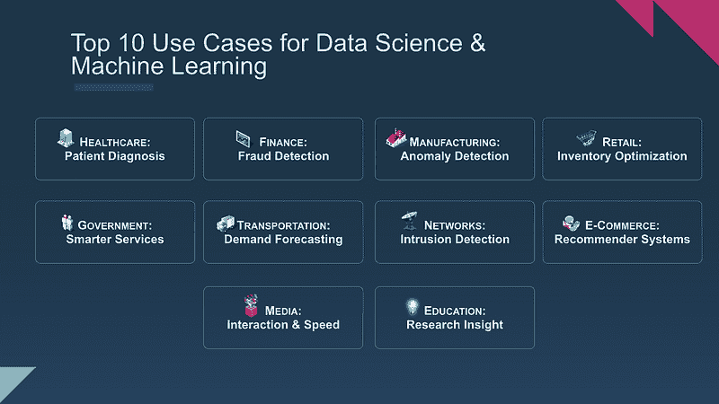

# 前 10 大机器学习应用场景：第二部分

> 译文：[`www.kdnuggets.com/2017/09/ibm-top-10-machine-learning-use-cases-part2.html`](https://www.kdnuggets.com/2017/09/ibm-top-10-machine-learning-use-cases-part2.html)

作者：Steve Moore，IBM 故事策略师。赞助帖子。

* * *

## 我们的前三大课程推荐

 1\. [Google 网络安全证书](https://www.kdnuggets.com/google-cybersecurity) - 快速进入网络安全职业轨道。

 2\. [Google 数据分析专业证书](https://www.kdnuggets.com/google-data-analytics) - 提升你的数据分析水平

 3\. [Google IT 支持专业证书](https://www.kdnuggets.com/google-itsupport) - 支持你的组织的 IT 需求

* * *

上个月，我们发布了 [第一部分](https://medium.com/inside-machine-learning/new-mental-models-for-machine-learning-part-1-7eaa7130fab) ，这是一个系列帖子，旨在突出 [IBM 机器学习中心](http://ibm-ml-hub.com/) 的前 10 大应用场景。我们特别希望分享那些能扩展我们对机器学习理解的场景——得益于我们与客户数据科学家的合作。

> 如果你有兴趣尝试 [**IBM 的新 Watson 机器学习服务 - 点击这里**](https://developer.ibm.com/clouddataservices/docs/ibm-watson-machine-learning/get-started/)
> 
> 尝试 [**数据科学体验 - 订阅免费试用**](https://datascience.ibm.com/registration/stepone)

本系列的目标是超越考虑特定领域时常见的机器学习应用场景。例如，第一部分专注于政府，但不仅仅探讨了机器学习在判刑和假释中的作用，还探索了推动区域和市政机构重要改进的应用场景。在第二部分，我们将超越机器学习在肿瘤学和放射学中的作用，探讨其对心理健康、整体健康和减少再入院率的影响。

### **1\. 利用机器学习帮助减少再入院率**

医院和诊所通过多种方式评估自身的有效性——从平均住院时间到急诊等待时间，再到直接的服务调查。再入院率是指标中很重要的一项，它定义为患者出院后在指定时间内返回医院或诊所的比例。再入院可能会给提供者、保险公司和患者带来巨大的成本和麻烦。

但现在，美国的一家医疗保健系统正在利用机器学习来帮助创建一个透视影响再入院因素的视角。从最初的预判再入院率的努力开始，预测建模和认知评估模型汇总了许多因素：医生笔记、医疗注释员、社会因素、患者人口统计等。这些模型不仅将预测准确率提高了 47%，还帮助隔离出有助于降低再入院率的因素，保持患者健康，并节省了开支。

### **2\. 终身的机器学习与健康**

一家总部位于华沙的国际医疗公司通过广泛的附属机构网络在其自有健康中心提供医院和临床护理。多年来，他们协调了初级和专科护理、诊断测试、医院服务和后续护理。

由于他们在患者的整个生命周期内提供端到端的护理，他们所捕获的数据赋予了他们个性化医疗计划的巨大能力，以更好地服务患者，平滑不同护理中心之间的过渡，建立信任，并降低成本。做到这一点意味着对患者数据、风险因素和主动解决方案的组合进行深入分析。

### **3\. 将机器学习引入心理健康项目**

对心理健康和成瘾问题的研究，无论如何都是一项复杂的工作——但对于那些渴望将实验室和诊所的见解应用于现实世界项目以帮助困境中的个人改善生活的研究人员来说，更是如此。这是美国东北部一家研究机构的任务，该机构与 IBM 合作，组织、维护并挖掘他们的研究数据，以发现数据中的趋势，从而指导他们所采取的干预措施。在 IBM 的帮助下，他们建立了一个系统，该系统跟踪研究环境、患者和时间跨度上的结果。

因为找到足够的资源来支付项目可能是一个挑战，所以能够证实其发现的严谨性——以及干预措施的结果——有助于说服资助者支持该机构的关键工作。

### **健康图像**

随着数据不断涌入医疗保健系统，包括程序、检查、处方信息、可穿戴传感器等，提供者有望利用机器学习来根除低效，并通过改善服务和结果让患者惊艳。进展依赖于我们所有人发现和倡导机会。让我们继续宣传[机器学习](http://ibm.biz/machinelearning)——并继续分享将其应用的新愿景。

署名： [Diganta Talukdar，维基共享资源](https://commons.wikimedia.org/wiki/File:Winter_Morning_in_Nagaon.jpg)

> 如果你有兴趣尝试[**IBM 的 Watson 机器学习服务 - 点击这里**](https://developer.ibm.com/clouddataservices/docs/ibm-watson-machine-learning/get-started/)
> 
> 尝试 [**数据科学体验 - 订阅免费试用**](https://datascience.ibm.com/registration/stepone)

### 更多相关主题

+   [企业中的机器学习：使用案例与挑战](https://www.kdnuggets.com/2022/08/dss-machine-learning-enterprise-cases-challenges.html)

+   [NoSQL 数据库及其使用案例](https://www.kdnuggets.com/2023/03/nosql-databases-cases.html)

+   [DALLE-3 的 5 个使用案例](https://www.kdnuggets.com/5-use-cases-of-dalle-3)

+   [AI 和 LLM 中的向量数据库使用案例](https://www.kdnuggets.com/vector-databases-in-ai-and-llm-use-cases)

+   [为什么 TinyML 案例越来越受欢迎？](https://www.kdnuggets.com/2022/10/tinyml-cases-becoming-popular.html)

+   [机器学习不像你的大脑 第一步：神经元很慢，……](https://www.kdnuggets.com/2022/04/machine-learning-like-brain-part-one-neurons-slow-slow-slow.html)
