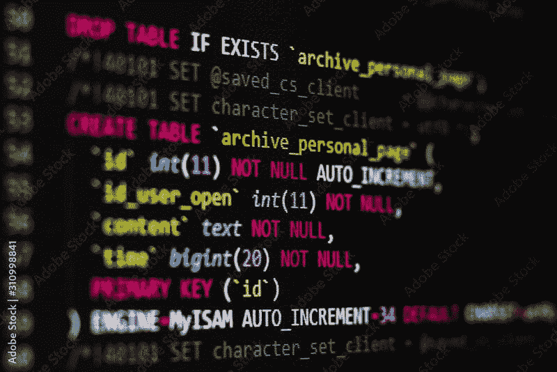
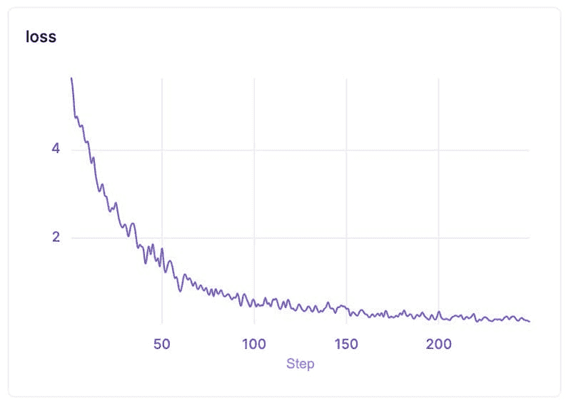

# 我们能用 T5 查询表格吗？

> 原文：[`www.kdnuggets.com/2022/05/query-table-t5.html`](https://www.kdnuggets.com/2022/05/query-table-t5.html)



来源：Adobe Stock

你还记得第一次开始构建一些 SQL 查询来分析数据的情景吗？我相信大多数时候你只是想查看“畅销产品”或“按周统计的产品访问次数”。为什么要写 SQL 查询，而不是直接用自然语言提问呢？

这现在得益于最近在自然语言处理领域的进展。你现在不仅可以使用 LLM（大型语言模型），还可以教授它们新技能。这称为迁移学习。你可以将预训练模型作为起点。即使使用较小的标注数据集，相较于单独训练数据，你也可以获得很好的性能。

在本教程中，我们将使用文本到文本生成模型 [T5 by Google](https://ai.googleblog.com/2020/02/exploring-transfer-learning-with-t5.html) 进行迁移学习，使用我们的自定义数据，以便将基本问题转换为 SQL 查询。我们将为 T5 添加一个新任务，称为：`translate English to SQL`。在本文末尾，你将拥有一个训练好的模型，能够翻译以下示例查询：

```py
Cars built after 2020 and manufactured in Italy
```

成为以下 SQL 查询：

```py
SELECT name FROM cars WHERE location = 'Italy' AND date > 2020
```

你可以在 [Gradio](https://gradio.app/) 演示 [**这里**](https://huggingface.co/spaces/mecevit/english-to-sql) 找到，Layer 项目 [**这里**](https://app.layer.ai/layer/t5-fine-tuning-with-layer)。

# 构建训练数据

与常见的语言到语言翻译数据集不同，我们可以借助模板以编程方式构建自定义的英语到 SQL 翻译对。现在，来想一些模板吧：

我们可以构建我们的函数，它将使用这些模板并生成我们的数据集。

如你所见，我们在这里使用了 Layer [@dataset](https://docs.app.layer.ai/docs/sdk-library/dataset-decorator) 装饰器。我们现在可以轻松地将此功能传递给 Layer：

```py
layer.run([build_dataset])
```

一旦运行完成，我们可以开始构建自定义数据集加载器来微调 T5。

# 创建数据加载器

我们的数据集基本上是一个 [PyTorch Dataset](https://pytorch.org/tutorials/beginner/basics/data_tutorial.html) 实现，特定于我们自定义构建的数据集。

# 微调 T5

我们的数据集已经准备好并注册到 Layer。现在我们要开发微调逻辑。用 [@model](https://docs.app.layer.ai/docs/sdk-library/model-decorator) 装饰该函数，并将其传递给 Layer。这会在 Layer 基础设施上训练模型，并将其注册到我们的项目下。

在这里我们使用了三个独立的 Layer 装饰器：

+   `[@model](https://docs.app.layer.ai/docs/sdk-library/model-decorator)`: 告诉 Layer 这个函数训练一个 ML 模型

+   `[@fabric](https://docs.app.layer.ai/docs/sdk-library/fabric-decorator)`：告诉 Layer 训练模型所需的计算资源（CPU、GPU 等）。T5 是一个大模型，我们需要 GPU 来微调它。以下是你可以与 Layer 一起使用的[可用 fabrics](https://docs.app.layer.ai/docs/reference/fabrics)列表。

+   `[@pip_requirements](https://docs.app.layer.ai/docs/sdk-library/pip-requirements-decorator)`：微调模型所需的 Python 包。

现在我们只需将 tokenizer 和模型训练函数传递给 Layer，以便在远程 GPU 实例上训练我们的模型。

```py
layer.run([build_tokenizer, build_model], debug=True)
```

训练完成后，我们可以在 Layer UI 中找到我们的模型和相关的指标。这是我们的损失曲线：



# 构建 Gradio 演示

[Gradio](https://gradio.app/) 是演示机器学习模型的最快方式，提供友好的网页界面，使任何人都可以在任何地方使用它！我们将使用[Gradio](https://gradio.app/)构建一个互动演示，为希望尝试我们模型的用户提供 UI。

让我们开始编程吧。创建一个名为`app.py`的 Python 文件，并添加以下代码：

在上述代码中：

+   我们从 Layer 中获取我们微调的模型和相关的 tokenizer

+   使用 Gradio 创建一个简单的 UI：一个用于查询输入的文本字段和一个用于显示预测 SQL 查询的输出文本字段

我们需要一些额外的库来支持这个小的 Python 应用，因此创建一个`requirements.txt`文件，内容如下：

```py
layer-sdk==0.9.350435
	torch==1.11.0
	sentencepiece==0.1.96
```

我们现在准备发布我们的 Gradio 应用：

1.  访问 Hugging Face 并[创建一个空间](https://huggingface.co/login?next=/new-space)。

1.  不要忘记选择 Gradio 作为 Space SDK

现在将你的仓库克隆到本地目录中，使用以下命令：

```py
$ git clone [YOUR_HUGGINGFACE_SPACE_URL]
```

将`requirements.txt`和`app.py`文件放入克隆的目录中，并在终端中运行以下命令：

```py
$ git add app.py
	$ git add requirements.txt
	$ git commit -m "Add application files"
	$ git push
```

现在前往你的 Hugging Face 空间，你会看到应用部署后你的示例


# 最后的想法

我们学习了如何微调大型语言模型来教授它们一项新技能。现在你可以设计自己的任务，并为自己的用途微调 T5。

查看完整的[微调 T5](https://app.layer.ai/layer/t5-fine-tuning-with-layer)项目并将其修改为适应你的任务。

## 资源

+   [`ai.googleblog.com/2020/02/exploring-transfer-learning-with-t5.html`](https://ai.googleblog.com/2020/02/exploring-transfer-learning-with-t5.html)

+   [`app.layer.ai/layer/t5-fine-tuning-with-layer`](https://app.layer.ai/layer/t5-fine-tuning-with-layer)

+   [`huggingface.co/spaces`](https://huggingface.co/spaces)

**[Mehmet Ecevit](https://www.linkedin.com/in/mecevt/)** 是 Layer: Collaborative Machine Learning 的联合创始人兼首席执行官。

### 更多相关话题

+   [用 SQL 查询你的 Pandas 数据框](https://www.kdnuggets.com/2021/10/query-pandas-dataframes-sql.html)

+   [SQL 查询优化技术](https://www.kdnuggets.com/2023/03/sql-query-optimization-techniques.html)

+   [提升 SQL 查询性能的 5 个技巧](https://www.kdnuggets.com/5-tips-for-improving-sql-query-performance)

+   [BERT 在稀疏性下能有多快？](https://www.kdnuggets.com/2022/04/fast-bert-go-sparsity.html)

+   [如何使用机器学习自动标记数据](https://www.kdnuggets.com/2022/02/machine-learning-automatically-label-data.html)

+   [等级系统如何帮助预测 AI 成本](https://www.kdnuggets.com/2022/03/level-system-help-forecast-ai-costs.html)
