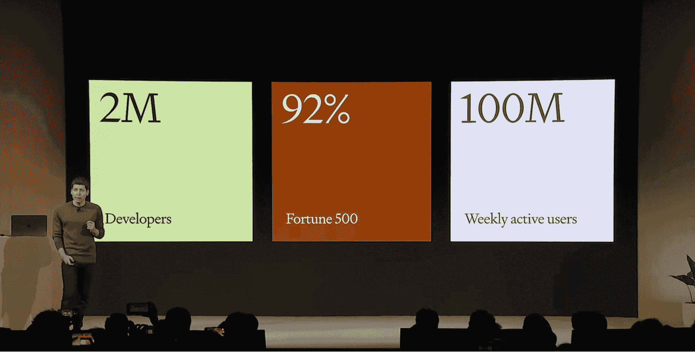

# 成为生成性 AI 开发者的 4 个步骤

> 原文：[`www.kdnuggets.com/4-steps-to-become-a-generative-ai-developer`](https://www.kdnuggets.com/4-steps-to-become-a-generative-ai-developer)

# 介绍

* * *

## 我们的三大课程推荐

 1\. [Google 网络安全证书](https://www.kdnuggets.com/google-cybersecurity) - 快速入门网络安全职业生涯。

 2\. [Google 数据分析专业证书](https://www.kdnuggets.com/google-data-analytics) - 提升你的数据分析技能

 3\. [Google IT 支持专业证书](https://www.kdnuggets.com/google-itsupport) - 支持你的组织 IT 部门

* * *



OpenAI 的 CEO **萨姆·奥特曼** 在 2023 年 10 月的 OpenAI 开发者日上展示了产品使用数据。OpenAI 将客户划分为三个细分市场：开发者、企业和普通用户。链接: https://www.youtube.com/watch?v=U9mJuUkhUzk&t=120s

在 2023 年 10 月的 OpenAI 开发者日上，OpenAI 的 CEO **萨姆·奥特曼** [展示了一张幻灯片](https://www.youtube.com/watch?v=U9mJuUkhUzk&t=120s)，讲述了不同客户细分市场（开发者、企业和普通用户）中的产品使用情况。

在本文中，我们将重点关注开发者这一细分市场。我们将介绍生成性 AI 开发者的工作内容、你需要掌握的工具以及如何入门。

# 步骤 1：了解生成性 AI 开发者的工作内容

尽管一些公司致力于开发生成性 AI 产品，但大多数生成性 AI 开发者还是在其他公司，这些公司并不是传统意义上的 AI 聚焦点。

原因在于生成性 AI 在广泛的商业领域中都有应用。生成性 AI 有四种常见用途，适用于大多数企业。

## 聊天机器人


由 DALL·E 3 生成的图像

尽管聊天机器人已经主流了十多年，但大多数聊天机器人都很糟糕。通常，第一次与聊天机器人的互动最常见的就是询问是否可以与真人交谈。

生成性 AI 的进步，尤其是大语言模型和向量数据库，意味着这种情况不再成立。现在聊天机器人可以为客户提供愉快的使用体验，每家公司都在忙于（或者至少应该忙于）努力升级它们。

MIT 技术评论的文章 [生成性 AI 对聊天机器人的影响](https://www.technologyreview.com/2023/06/15/1074743/impact-of-generative-ai-on-chatbots/) 对聊天机器人世界的变化有很好的概述。

## 语义搜索

搜索被广泛应用于各种场所，从文档到购物网站，再到互联网本身。传统上，搜索引擎 heavily 使用关键字，这就产生了搜索引擎需要被编程以识别同义词的问题。

例如，考虑尝试在营销报告中搜索有关客户细分的部分。你按下 CMD+F，输入“segmentation”，然后循环浏览搜索结果直到找到相关内容。不幸的是，你可能会错过作者在文档中使用“classification”而不是“segmentation”的情况。

语义搜索（根据*意义*进行搜索）通过自动找到具有相似含义的文本来解决同义词问题。这个想法是，你使用一个嵌入模型——一个将文本根据其意义转换为数值向量的深度学习模型——然后找到相关文本只是简单的线性代数。更好的是，许多嵌入模型还允许其他数据类型如图像、音频和视频作为输入，让你为搜索提供不同的数据输入或输出数据类型。

与聊天机器人一样，许多公司正试图通过使用语义搜索来改进其网站的搜索功能。

这篇关于[语义搜索](https://zilliz.com/glossary/semantic-search)的教程由 Milvus 向量数据库的制造商 Zillus 提供，提供了很好的用例描述。

## 个性化内容


由 DALL·E 3 生成的图像

生成式 AI 降低了内容创建的成本。这使得为不同用户群体创建定制内容成为可能。一些常见的例子是根据你对用户的了解，改变营销文案或产品描述。你还可以提供本地化服务，使内容对不同国家或人群更具相关性。

这篇关于[如何使用生成式 AI 平台实现超个性化](https://www.zdnet.com/article/how-to-achieve-hyper-personalization-using-generative-ai-platforms/)的文章由 Salesforce 首席数字布道师 Vala Afshar 撰写，涵盖了使用生成式 AI 个性化内容的好处和挑战。

## 软件的自然语言界面

随着软件变得越来越复杂和功能全面，用户界面也变得臃肿，菜单、按钮和工具让用户难以找到或使用。自然语言界面让用户可以用一句话说明他们想要的内容，这可以显著提高软件的可用性。“自然语言界面”可以指控制软件的口头或书面方式。关键在于，你可以使用标准的、易于理解的人类句子。

商业智能平台是较早采用这一技术的一些平台，自然语言接口帮助商业分析师编写更少的数据处理代码。然而，这一技术的应用几乎是无限的：几乎每个功能丰富的软件都可以受益于自然语言接口。

这篇 Forbes 文章 [拥抱 AI 和自然语言接口](https://www.forbes.com/sites/forbesbusinesscouncil/2023/07/11/embracing-ai-and-natural-language-interfaces/?sh=61379ae63798) 来自 Omega Venture Partners 的创始人兼管理合伙人 Gaurav Tewari，对自然语言接口如何帮助软件可用性进行了易于阅读的描述。

# 第 2 步：了解生成式 AI 开发者使用的工具

首先，你需要一个生成式 AI 模型！对于处理文本，这意味着一个大型语言模型。GPT 4.0 是当前性能的**黄金标准**，但也有许多开源替代品，如 Llama 2、Falcon 和 Mistral。

其次，你需要一个向量数据库。Pinecone 是最受欢迎的商业向量数据库，还有一些开源替代品，如 Milvus、Weaviate 和 Chroma。

在编程语言方面，社区似乎已经围绕 Python 和 JavaScript 达成了一致。JavaScript 对于 Web 应用很重要，而 Python 则适合其他所有人。

在这些基础上，使用生成式 AI 应用框架是有帮助的。两个主要的竞争者是 LangChain 和 LlamaIndex。LangChain 是一个更广泛的框架，允许你开发各种生成式 AI 应用，而 LlamaIndex 则更专注于开发语义搜索应用。

如果你在开发搜索应用，使用 LlamaIndex；否则，使用 LangChain。

值得注意的是，技术领域变化非常迅速，许多新的 AI 初创公司和新工具每周都会出现。如果你想开发应用程序，预计比其他应用程序更频繁地更改软件堆栈的部分。

特别是，新模型不断出现，你的用例中表现最佳的模型可能会发生变化。一个常见的工作流程是开始使用 API（例如，OpenAI API 用于 API，Pinecone API 用于向量数据库），因为它们开发速度快。随着用户基础的增长，API 调用的成本可能会变得沉重，因此你可能会想切换到开源工具（Hugging Face 生态系统是一个不错的选择）。

# 第 3 步：学习一些技能以开始

和任何新项目一样，从简单的开始！最好一次学习一个工具，然后再弄清楚如何将它们结合起来。

第一步是为你想使用的任何工具设置账户。你需要开发者账户和 API 密钥才能使用这些平台。

[OpenAI API 初学者指南：实践教程和最佳实践](https://www.datacamp.com/tutorial/guide-to-openai-api-on-tutorial-best-practices)包含了逐步说明，介绍了如何设置 OpenAI 开发者账户并创建 API 密钥。

同样，[Pinecone 向量数据库掌握教程：全面指南](https://www.datacamp.com/tutorial/mastering-vector-databases-with-pinecone-tutorial)包含了设置 Pinecone 的详细信息。

[什么是 Hugging Face？AI 社区的开源绿洲](https://www.datacamp.com/tutorial/what-is-hugging-face) 解释了如何开始使用 Hugging Face。

## 学习 LLM

要开始编程使用像 GPT 这样的 LLM，最简单的方法是学习如何调用 API 以发送提示并接收消息。

虽然许多任务可以通过 LLM 的单次往返交换完成，但像聊天机器人这样的用例需要较长的对话。OpenAI 最近在其助手 API 中宣布了“线程”功能，你可以在[OpenAI 助手 API 教程](https://www.datacamp.com/tutorial/open-ai-assistants-api-tutorial)中了解更多。

并非所有的 LLM 都支持这项功能，因此你可能还需要学习如何手动管理对话状态。例如，你需要决定对话中之前的消息中哪些仍然与当前对话相关。

除此之外，不必仅限于文本工作。你可以尝试处理其他媒体；例如，转录音频（语音转文本）或从文本生成图像。

## 学习向量数据库

向量数据库最简单的应用场景是语义搜索。在这里，你使用一个嵌入模型（见[OpenAI API 文本嵌入介绍](https://www.datacamp.com/tutorial/introduction-to-text-embeddings-with-the-open-ai-api)），将文本（或其他输入）转换成一个表示其含义的数值向量。

然后，你将嵌入的数据（数值向量）插入到向量数据库中。搜索就是编写一个搜索查询，询问数据库中哪些条目与您所请求的内容最接近。

例如，你可以将公司某个产品的一些常见问题（FAQs）嵌入，并上传到向量数据库中。然后，你询问有关该产品的问题，它会返回最接近的匹配项，将数值向量转换回原始文本。

## 结合 LLM 和向量数据库

你可能会发现，直接从向量数据库返回文本条目是不够的。通常，你希望文本以一种更自然的方式处理，以回答查询。

解决这个问题的方法是一种称为检索增强生成（RAG）的技术。这意味着在你从向量数据库中检索文本之后，你会为大型语言模型（LLM）写一个提示，然后将检索到的文本包含在提示中（你*增强*了提示与*检索到*的文本）。然后，你要求 LLM 写出一个易于理解的回答。

在回答用户从常见问题中提问的例子中，你需要编写一个包含占位符的提示，像下面这样。

```py
"""
Please answer the user's question about {product}.
---
The user's question is : {query}
---
The answer can be found in the following text: {retrieved_faq}
"""
```

最终步骤是将你的 RAG 技能与管理消息线程的能力结合起来，从而进行更长时间的对话。瞧！你就有了一个聊天机器人！

# 步骤 4：继续学习！

DataCamp 提供了 [一系列九个代码实操课程](https://www.datacamp.com/ai-code-alongs)，教你成为一名生成式 AI 开发者。你需要基本的 Python 技能才能开始，但所有 AI 概念都是从零开始讲解的。

该系列课程由来自 Microsoft、Pinecone、伦敦帝国学院和 Fidelity 的顶级讲师（还有我！）授课。

你将学习到本文涉及的所有主题，包括六个专注于 OpenAI API、Pinecone API 和 LangChain 的商业堆栈的代码实操课程。其他三节教程则专注于 Hugging Face 模型。

在系列课程结束时，你将能够创建一个聊天机器人，并构建 NLP 和计算机视觉应用程序。

**[](https://www.linkedin.com/in/richierocks/)**[Richie Cotton](https://www.linkedin.com/in/richierocks/)**** 是 DataCamp 的数据传播者。他是 DataFramed 播客的主持人，著有两本关于 R 编程的书籍，并创建了 10 门 DataCamp 数据科学课程，已有超过 70 万学习者参与学习。

### 更多相关话题

+   [如果你想进入科技领域：成为一名软件开发者](https://www.kdnuggets.com/if-you-want-to-get-in-the-tech-space-become-a-software-developer)

+   [成为数据科学专业人士的五个步骤](https://www.kdnuggets.com/2022/03/become-data-science-professional-five-steps.html)

+   [KDnuggets 新闻 2022 年 3 月 16 日：学习数据科学基础和 5…](https://www.kdnuggets.com/2022/n11.html)

+   [软件开发者与软件工程师](https://www.kdnuggets.com/2022/05/software-developer-software-engineer.html)

+   [设备端 AI 与开发者就绪的软件堆栈](https://www.kdnuggets.com/2022/03/qualcomm-ondevice-ai-developer-ready-software-stacks.html)

+   [AI + 无代码：重新定义开发者创新的热门组合](https://www.kdnuggets.com/ai-no-code-the-viral-combo-redefining-developer-innovation)
