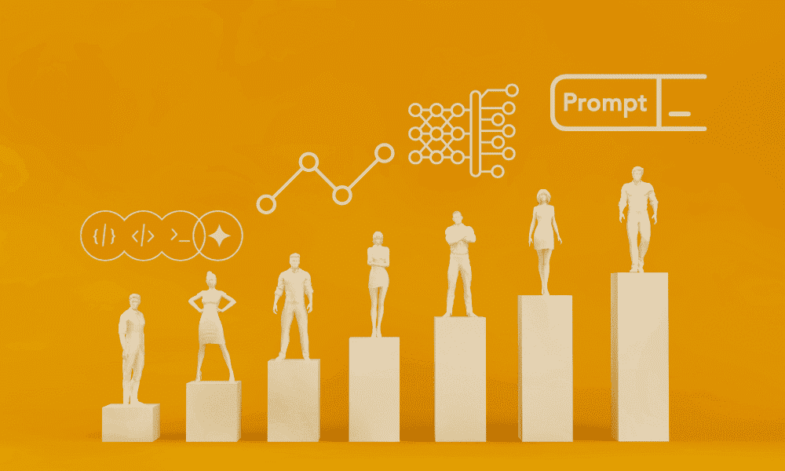
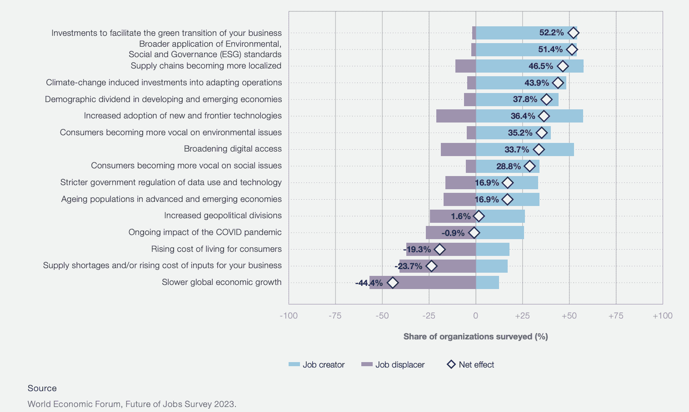
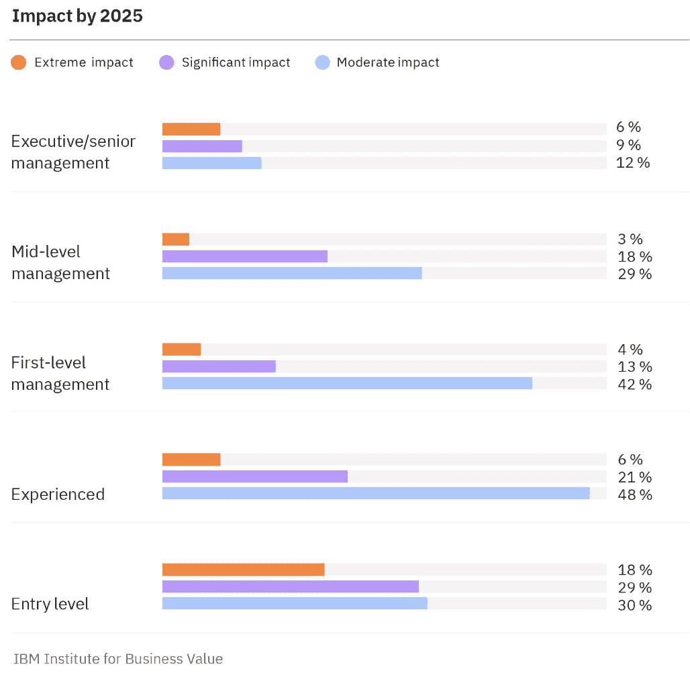
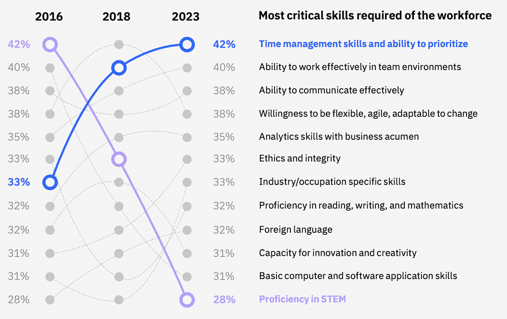

# 40%的劳动力将在 3 年内受到人工智能的影响

> 原文：[`www.kdnuggets.com/40-of-labour-force-will-be-affected-by-ai-in-3-years`](https://www.kdnuggets.com/40-of-labour-force-will-be-affected-by-ai-in-3-years)

图片由编辑提供

在过去的十年或二十年里，我们看到电子学习平台的兴起，以满足技术领域的需求。许多人涉足这一领域，因为当时它看起来是下一个大趋势。薪水丰厚，而且总是有成长空间。那时，这似乎是一个双赢的局面。

* * *

## 我们的前三大课程推荐

 1\. [谷歌网络安全证书](https://www.kdnuggets.com/google-cybersecurity) - 快速进入网络安全领域

 2\. [谷歌数据分析专业证书](https://www.kdnuggets.com/google-data-analytics) - 提升你的数据分析技能

 3\. [谷歌 IT 支持专业证书](https://www.kdnuggets.com/google-itsupport) - 支持你的组织进行 IT 管理

* * *

然而，随着生成式人工智能在当今各行各业产生重大影响，许多成熟组织面临的一个大问题是填补技能差距。如果组织希望保持竞争力，他们需要有一支技术娴熟的团队。

人工智能可以自动化各种任务，自然会推动某些职位的消失。那么这对我们意味着什么呢？

所以现在这仍然是双赢的局面吗，还是生死攸关？我知道这有点戏剧化。

# 让我们查看一下统计数据

根据[世界经济论坛（WEF）](https://www.weforum.org/press/2020/10/recession-and-automation-changes-our-future-of-work-but-there-are-jobs-coming-report-says-52c5162fce/)，在 2020 年至 2025 年间，新技术及其持续增长将全球范围内扰乱 8500 万个工作岗位，并创造 9700 万个新职位。哎呀，只剩 2 年时间了。这条信息发布于 2020 年，同时指出，分析思维、创造力和灵活性是 2025 年所需的顶尖技能。

如下图所示，这是世界经济论坛（WEF）报告中展示的 2023 年至 2027 年宏观趋势对工作影响的预期。在左侧，你可以看到预期趋势将如何创造或取代工作岗位。

图片由[世界经济论坛（WEF）](https://www3.weforum.org/docs/WEF_Future_of_Jobs_2023.pdf)提供

要查看完整报告，请参考[这里](https://www3.weforum.org/docs/WEF_Future_of_Jobs_2023.pdf)。

IBM 商业价值研究所的另一项研究指出：

> “四分之五的高管表示生成性 AI 将改变员工的角色和技能。尽管所有级别的员工都会感受到生成性 AI 的影响，但预计低级别员工会经历最大的变化。”

看起来，成长过程中接触了更多技术并可能感受到经济衰退影响的 Z 世代，在生成性 AI 和找工作方面也将产生最大的影响。

从[IBM 报告](https://www.ibm.com/thought-leadership/institute-business-value/en-us/report/augmented-workforce#:~:text=people%20who%20don%E2%80%99t.-,Download%20the%20insights,-Get%20additional%20insights)中的图片来看，正如我们预期的那样，高管和高级管理人员的影响最小。但随着经验的减少，影响会变得更大。入门级员工的影响会比有经验的员工和初级管理人员小，这可能与上述陈述相矛盾。

这是否由于能够比有经验的员工和初级管理人员更迅速地提升入门级员工的技能？

图片来源：[IBM 报告](https://www.ibm.com/thought-leadership/institute-business-value/en-us/report/augmented-workforce#:~:text=people%20who%20don%E2%80%99t.-,Download%20the%20insights,-Get%20additional%20insights)

## 新的技能范式

IBM 报告中令我感兴趣的一部分是新的技能范式。当我们考虑跟上技术时，大多数人想到的是学习硬技能，如编码或进入技术产品管理领域。该 IBM 报告显示，高管估计，40%的员工将因 AI 和自动化而需要重新技能培训。

新的技能范式关注软技能，以及这些技能如何从 2016 年到 2023 年发生变化。正如下面的图片所示，诸如 STEM 技能和基本计算机及软件应用这些我们认为非常可取的技能，其重要性已经显著下降。时间管理、有效团队合作和沟通等技能则处于领先地位。

图片来源：[IBM 报告](https://www.ibm.com/thought-leadership/institute-business-value/en-us/report/augmented-workforce#:~:text=people%20who%20don%E2%80%99t.-,Download%20the%20insights,-Get%20additional%20insights)

IBM 报告还指出，平均 87%的高管预计生成性 AI 将增强而非取代工作角色。87%是一个很大的比例。

这意味着在市场营销（73%）和客户服务（77%）以及采购（97%）、风险和合规（93%）和财务（93%）等角色和任务中，接近四分之三的工作将会被增强。

这是否意味着劳动力将与技术迅速协作，还是我们仍需提升技能？

在这个时代，提升技能的答案始终是正确的。

# 结论

那么你应该从中获取什么？

许多事情正在发生变化，而且变化很快。为了跟上这些变化，你需要接受重新技能培训或提升技能，并利用 AI 工具来增强你的能力，而不是被取代。

你应该感到欣慰的是，高管们表示，提升技能虽然与生成式 AI 无关，但更多的是关于时间管理和协作，而不是学习编程。

**[尼莎·阿里亚](https://www.linkedin.com/in/nisha-arya-ahmed/)**是一位数据科学家、自由技术作家，同时也是 KDnuggets 的编辑和社区经理。她特别关注提供数据科学职业建议或教程以及理论知识。尼莎涵盖了广泛的话题，并希望探索人工智能可以如何促进人类寿命的不同方式。作为一名热衷学习者，尼莎寻求拓宽自己的技术知识和写作技能，同时帮助指导他人。

### 更多相关主题

+   [AI 在算法交易中的应用如何影响了……](https://www.kdnuggets.com/2022/04/adoption-ai-algorithmic-trading-affected-finance-industry.html)

+   [AI 十年回顾](https://www.kdnuggets.com/2023/06/ten-years-ai-review.html)

+   [我如何在 14 年内将薪水提高了 14 倍，作为数据分析/科学专业人士](https://www.kdnuggets.com/2021/12/14x-salary-in-14-years-data-professional.html)

+   [数据科学 30 年：数据科学从业者的回顾](https://www.kdnuggets.com/30-years-of-data-science-a-review-from-a-data-science-practitioner)
