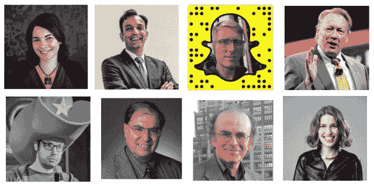

# 数据科学思想领袖的 42 条关键名言

> 原文：[`www.kdnuggets.com/2017/05/42-essential-quotes-data-science-thought-leaders.html`](https://www.kdnuggets.com/2017/05/42-essential-quotes-data-science-thought-leaders.html)

评论

**作者：劳伦·德拉佩纳，[DiscoverDataScience.com](https://discoverdatascience.com/) 编辑**

* * *

## 我们的前三大课程推荐

 1\. [Google 网络安全证书](https://www.kdnuggets.com/google-cybersecurity) - 快速入门网络安全职业。

 2\. [Google 数据分析专业证书](https://www.kdnuggets.com/google-data-analytics) - 提升你的数据分析技能

 3\. [Google IT 支持专业证书](https://www.kdnuggets.com/google-itsupport) - 支持你在 IT 领域的组织

* * *

怀疑的侦探。信号提取者。被驱使的。如果你是数据科学家，完全可以把这些身份（或全部）视为自己的。至少，今天一些数据科学领域的领先创新者这样说。在这些引用中，他们分享了从多年经验中得出的建议和见解，以解决这一领域最紧迫的问题。这个列表旨在帮助有志于和已建立的数据科学家提升职业生涯，并激发你在下次数据科学聚会上的智能对话。

* * *

### 数据科学家是谁？

1.  “按定义，**所有科学家都是数据科学家。** 在我看来，他们一半是黑客，一半是分析师，他们使用数据来构建产品和发现洞察。**这是哥伦布遇见科伦波——星光熠熠的探险者和怀疑的侦探。**”

*―*[*莫妮卡·罗加提*](https://www.linkedin.com/in/mrogati/)*，独立数据科学顾问*

阅读完整文章 [这里](https://www.forbes.com/sites/danwoods/2011/11/27/linkedins-monica-rogati-on-what-is-a-data-scientist/#6da6064c3e15)。

1.  “‘被‘驱使’可能是最合适的词。我经常告诉人们，‘**我并不*想*成为数据科学家。你就是某种程度上*成为*了数据科学家。**你就是无法抗拒地看着那份数据集，然后觉得，‘我感觉需要深入看看。我觉得这不对。’”

*―*[*詹妮弗·申*](https://www.linkedin.com/in/jennshin/)*，尼尔森公司高级首席数据科学家；加州大学伯克利分校讲师*

观看完整访谈 [这里](https://www.youtube.com/watch?v=BRQhZFYDCiw)。

1.  “我认为数据科学更像是一种实践，而不是一份工作。想象一下科学方法，你需要有一个问题陈述，提出假设，收集数据，分析数据，然后传达结果并采取行动……**如果你把科学方法作为应对数据密集型项目的方式，我认为你更有可能在结果上取得成功。**”

*―*[*Bob Hayes*](https://www.linkedin.com/in/bobehayes/)*，博士，Appuri 首席研究官*

收听完整采访 [这里](https://www.youtube.com/watch?v=-P9e6aFEbqw).

1.  “**作为数据科学家，我可以预测可能发生的事情，但我无法解释为什么它会发生。** 我可以预测某人可能会流失，或对促销做出回应，或犯欺诈行为，或选择粉色按钮而不是蓝色按钮，但我无法告诉你为什么会发生这些事。我相信无法解释为什么事情会发生是我难以称‘数据科学’为科学的原因。”

*―*[*Bill Schmarzo*](https://www.linkedin.com/in/schmarzo/)*，Dell EMC 首席技术官*

阅读完整文章 [这里](https://infocus.emc.com/william_schmarzo/data-science-really-science/).

1.  “数据科学家有点像新文艺复兴时代的人，因为**数据科学本质上是多学科的**。”

*―*[*John Foreman*](https://www.linkedin.com/in/johnwforeman/)*，MailChimp 产品管理副总裁*

阅读完整文章 这里.

1.  “**数据科学家（n.）：比任何软件工程师都擅长统计学，比任何统计学家都擅长软件工程。**”

*―*[*Josh Wills*](https://www.linkedin.com/in/josh-wills-13882b/)*，Slack 数据工程总监*

阅读完整文章 [这里](https://twitter.com/josh_wills/status/198093512149958656).

1.  “**作为数据科学家，我们的工作是从噪音中提取信号。**”

*―*[*Daniel Tunkelang*](https://www.linkedin.com/in/dtunkelang/)*，顾问 / 顾问*

阅读完整文章 [这里](https://books.google.com/books?id=86jhBQAAQBAJ&pg=PA92&lpg=PA92&dq=As+data+scientists,+our+job+is+to+extract+signal+from+noise.&source=bl&ots=to5evsRfoA&sig=HUz0QlUYhV-6FXCGaFx8ZYRowls&hl=en&sa=X&ved=0ahUKEwjiys_Fpv_SAhXCq1QKHb_sBMsQ6AEIGjAA#v=onepage&q=As%20data%20scientists%2C%20our%20job%20is%20to%20extract%20signal%20from%20noise.&f=false).

1.  “**数据科学家的工作是提出正确的问题**。如果我问一个像‘这个链接点击了多少次？’这样的问题，那是我们一直关注的事情，这不是一个数据科学问题。这是一个分析问题。如果我问一个像‘基于这个出版商网站上以往的链接历史，我能否预测未来三小时内有多少人来自法国会阅读这个？’这样的问题，那就更像是一个数据科学问题。”

*―*[*Hilary Mason*](https://www.linkedin.com/in/hilarymason/)*，Fast Forward Labs 创始人*

阅读完整文章 [这里](https://www.forbes.com/sites/danwoods/2012/03/08/hilary-mason-what-is-a-data-scientist/#5239f7fc5502).

1.  “数据科学家对我们的数据进行模型驱动的分析；**分析以改善我们的规划，增加我们的生产力，并发展我们对主题的更深层次的专业知识。** 数据科学家在战术、操作和战略层面工作，与业务分享见解。”

*―*[*克里斯·佩胡拉*](https://www.linkedin.com/in/chrispehura/)*，C-SUITE DATA 管理咨询实践总监*

阅读完整文章 [这里](http://www.bizcatalyst360.com/does-data-scientist-mean-what-you-think-it-means/%20)。

1.  “[数据科学家]能够想到**利用数据解决那些否则无法解决的问题，或者仅凭直觉解决的问题。**”

*―*[*彼得·斯科莫罗赫*](https://www.linkedin.com/in/peterskomoroch/)*，前 LinkedIn 首席数据科学家*

阅读完整文章 [这里](https://conferences.oreilly.com/nextcon/economy-us/public/schedule/speaker/76203)。

1.  “什么样的个性适合做有效的数据科学家？绝对是好奇心…… **数据科学中最大的疑问是‘为什么？’** 为什么会发生这种情况？如果你注意到有一个模式，问问自己，‘为什么？’ 数据是否有问题，还是这是一个实际存在的模式？我们能从这个模式中得出什么结论？自然的好奇心肯定会给你一个很好的基础。”

*―*[*卡拉·金特里*](https://www.linkedin.com/in/datanerd13/)*，Talent Analytics 数据科学家*

阅读完整文章 [这里](https://www.linkedin.com/pulse/big-data-needs-science-doesnt-need-carla-gentry)

1.  “有句话说，‘全能却无所精通。’ 做数据科学家时你需要有点像这样，但也许更好的说法是，**‘全能而有所精通。’**”

*―*[*布伦丹·蒂尔尼*](https://www.linkedin.com/in/brendantierney/)*，Oralytics 首席顾问*

阅读完整文章 [这里](http://www.oralytics.com/2012/06/data-science-is-multidisciplinary.html%20)。

* * *

### 我如何成为一名数据科学家？

1.  “我永远的建议是**首先跟随你的激情。** 了解你擅长什么，关心什么，并追求它……作为一名成功的数据科学家，你的每一天都可能以你为自己能通过数据解决现实问题而感恩的心态开始和结束。”

*―*[*科克·博恩*](https://www.linkedin.com/in/kirkdborne/)*，首席数据科学家，Booz Allen Hamilton*

阅读完整文章 [这里](https://mapr.com/blog/definitive-qa-aspiring-data-scientists/%20)。

1.  “**第一件事是你必须要有激情。** 这种对问题的无情追求的丰富激情，以及对自己是否得到合理答案的深刻知识诚实感……”

“第二部分是拥有对数据极其聪明的处理能力。我所说的就是：你在处理模糊性的问题。而且很经常，你不能像处理作业一样严谨地处理问题。**唯一的生存之道就是要聪明——思考一个不同的问题，以得到答案。**”

*―*[*DJ Patil*](https://www.linkedin.com/in/dpatil/)*，前美国首席数据科学家*

阅读完整文章 [这里](https://fivethirtyeight.com/datalab/dj-patil-white-house-chief-data-scientist-interview/)。

1.  “没有人谈论**学习中的动机**。数据科学是一个广泛而模糊的领域，这使得学习变得困难。非常困难。没有动机的话，你会在半途而废，认为自己做不到，其实问题不在你身上，而在于教学。”

**通过根据你想做的事情来量身定制你的学习，掌控自己的学习。**”

*―*[*Vik Paruchuri*](https://www.linkedin.com/in/vikparuchuri/)*, 创始人，Dataquest*

阅读完整文章 [这里](https://www.quora.com/How-can-I-become-a-data-scientist-1%20)。

1.  “我不知道你如何教人们热爱学习，但**自我激励是这个领域的核心。** 一旦你掌握了核心概念，能够真正兴奋并持续寻找新信息是我在招聘时所看重的，比如，当我们招聘人员时。”

*―*[*Shelly D. Farnham, Ph.D.*](https://www.linkedin.com/in/shellyfarnham/)*, 执行董事兼研究科学家，Third Place Technologies*

阅读完整文章 [这里](http://online.liebertpub.com/doi/abs/10.1089/big.2013.1510?journalCode=big)。

1.  “**你最好的数据挖掘和数据科学学习方法是通过实践，** 所以尽快开始分析数据吧！然而，别忘了学习理论，因为你需要一个好的统计和机器学习基础来理解你在做什么，并在大数据的噪音中找到真正的价值。”

*―*[*Gregory Piatetsky-Shapiro*](https://www.linkedin.com/in/gpiatetsky/)*, KDnuggets 总裁*

阅读完整文章 这里。

1.  “学习如何做数据科学就像学习滑雪。**你必须去做。**”

*―*[*Claudia Perlich*](https://www.linkedin.com/in/cperlich/)*, 首席科学家，Dstillery*

阅读完整文章 这里。

1.  “**数据科学的学习曲线是巨大的。** 在很大程度上，你需要一个学位或类似的东西，以证明你对这一职业的承诺……

“课堂教学很重要，但完全专注于读书、考试和听讲座的课程是不够的。**动手实验室工作对于成为一个全面的数据科学家至关重要。**…

“这不应该退化为一个只生产理论填满脑袋的分析极客的程序，他们的文凭只是挂在墙上的装饰品。”

*―*[*James Kobielus*](https://www.linkedin.com/in/jameskobielus/)*, SiliconANGLE Media, Inc. 数据科学、深度学习及应用开发首席分析师*

阅读完整文章 [这里](http://www.odbms.org/blog/2016/04/on-big-data-and-data-science-interview-with-james-kobielus/)。

1.  “在我看来，数据科学专业人员的成功依赖于成为训练有素的数据科学家，具备在大规模进行数据处理和计算的能力。为此，**专业人员必须通过包含工程学、数学科学和社会科学元素的多学科项目的机构投入时间进行持续教育**。将大数据转化为有意义的信息始于受过各学科教育、既是数据科学家又是统计学家的熟练专业人员。”

*―*[*Devavrat Shah*](https://www.linkedin.com/in/devavrat-shah-63b59a2/)*，麻省理工学院电气工程与计算机科学系教授*

阅读完整文章 [这里](http://blog.edx.org/future-data-science-qa-mit-professional-educations-devavrat-shah)。

1.  “**数据科学家没有瓶颈**……瓶颈通常是在没有数据文化的公司，这些公司无法将过程切分为正确的步骤。”

*―*[*Lutz Finger*](https://www.linkedin.com/in/lutzfinger/)*，Snap 数据科学总监*

听完整采访 [这里](https://www.youtube.com/watch?v=Mo9yQYytUhg%20)。

1.  “一旦你拥有一定量的数学/统计学和黑客技能，**掌握一个或多个学科的基础远比在你的黑客技能中增加另一种编程语言，或者在你的数学/统计学组合中增加另一种机器学习算法要好**……客户宁愿与理解其特定领域的数据科学家 A 合作，也不愿意与需要先学习基础的另一数据科学家 B 合作——即便 B 在数学/统计学/黑客技能上更强。”

*―*[*Stephan Kolassa*](https://www.linkedin.com/in/stephankolassa/)*，SAP 瑞士数据科学专家*

阅读完整文章 [这里](http://datascience.stackexchange.com/questions/2403/data-science-without-knowledge-of-a-specific-topic-is-it-worth-pursuing-as-a-ca)。

### 相关话题

+   [数据科学定义幽默：奇特名言合集……](https://www.kdnuggets.com/2022/02/data-science-definition-humor.html)

+   [探索思维树提示：AI 如何通过搜索学习推理……](https://www.kdnuggets.com/2023/07/exploring-tree-of-thought-prompting-ai-learn-reason-through-search.html)

+   [揭示链式思维提示在大型语言模型中的威力](https://www.kdnuggets.com/2023/07/power-chain-thought-prompting-large-language-models.html)

+   [自动化思维链：AI 如何自我提示进行推理](https://www.kdnuggets.com/2023/07/automating-chain-of-thought-ai-prompt-itself-reason.html)

+   [提示工程中的并行处理：思维框架……](https://www.kdnuggets.com/parallel-processing-in-prompt-engineering-the-skeleton-of-thought-technique)

+   [思维传播：复杂推理的类比方法……](https://www.kdnuggets.com/thought-propagation-an-analogical-approach-to-complex-reasoning-with-large-language-models)
a-science-definition-humor.html)

+   [探索思维树提示：AI 如何通过搜索学习推理…](https://www.kdnuggets.com/2023/07/exploring-tree-of-thought-prompting-ai-learn-reason-through-search.html)

+   [揭示思维链提示在大型语言模型中的力量](https://www.kdnuggets.com/2023/07/power-chain-thought-prompting-large-language-models.html)

+   [自动化思维链：AI 如何自我提示以进行推理](https://www.kdnuggets.com/2023/07/automating-chain-of-thought-ai-prompt-itself-reason.html)

+   [提示工程中的并行处理：思维骨架…](https://www.kdnuggets.com/parallel-processing-in-prompt-engineering-the-skeleton-of-thought-technique)

+   [思维传播：一种类比方法来解决复杂推理问题…](https://www.kdnuggets.com/thought-propagation-an-analogical-approach-to-complex-reasoning-with-large-language-models)
