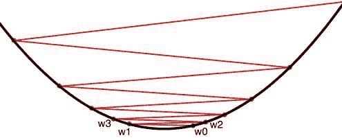
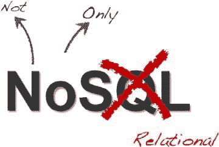

# 掌握数据科学的 42 个步骤

> 原文：[`www.kdnuggets.com/2017/08/42-steps-mastering-data-science.html`](https://www.kdnuggets.com/2017/08/42-steps-mastering-data-science.html)

如果你对各种数据科学主题的元教程感兴趣，你来对地方了。

* * *

## 我们的前 3 名课程推荐

 1\. [谷歌网络安全证书](https://www.kdnuggets.com/google-cybersecurity) - 加速你的网络安全职业生涯。

 2\. [谷歌数据分析专业证书](https://www.kdnuggets.com/google-data-analytics) - 提升你的数据分析技能

 3\. [谷歌 IT 支持专业证书](https://www.kdnuggets.com/google-itsupport) - 支持你的组织的 IT

* * *

在这里包含的六个 7 步教程中，前 3 个教程按顺序涵盖了从数据准备到多种机器学习任务的过程，包括理论理解和使用 Python 库的实际应用。

第四个教程主要从“理解”的角度讲解深度学习，而最后两个教程则涵盖了数据库主题：数据科学的 SQL 和理解 NoSQL 数据库。

向道格拉斯·亚当斯致敬，[生命、宇宙和一切的答案](https://en.wikipedia.org/wiki/The_Hitchhiker%27s_Guide_to_the_Galaxy)，让我们来看看掌握数据科学的 42 个步骤。

**掌握 Python 数据准备的 7 个步骤**

数据准备、清理、预处理、净化、整理。无论你选择哪个术语，它们都指代机器学习、数据挖掘和数据科学领域中一系列相关的数据前处理活动。

但请记住，本文涵盖的是一种特定的数据准备技术，具体情况可能会使用额外的或完全不同的技术，基于要求。你应该发现，本文所持的方法既是正统的也是通用的。

**掌握 Python 机器学习的 7 个步骤**

本文旨在将新手从对 Python 机器学习的最低知识水平提升到有知识的实践者，整个过程分为 7 步，并且在过程中使用免费提供的材料和资源。本大纲的主要目标是帮助你穿越众多可用的免费选项；确实有很多，但哪些是最好的？哪些相互补充？选择资源的最佳顺序是什么？

**掌握 Python 机器学习的更多 7 个步骤**

在快速回顾——以及几种新的视角选项之后——这篇文章将更有分类地集中在几个相关的机器学习任务集上。由于这次我们可以安全地跳过基础模块——Python 基础、机器学习基础等——我们将直接进入各种机器学习算法。这次我们也可以沿功能线更好地对教程进行分类。

**理解深度学习的 7 个步骤**

这组阅读材料和教程旨在为深度神经网络新手提供一个理解这个庞大而复杂主题的路径。虽然我不假设你对神经网络或深度学习有任何真实的理解，但我会假设你对一般机器学习理论和实践有一定的了解。为弥补你在机器学习理论或实践方面的不足，你可以参考最近的 KDnuggets 文章掌握 Python 机器学习的 7 个步骤。由于我们还将看到用 Python 实现的示例，了解一些 Python 语言将会有帮助。入门和复习资源也可以在前述文章中找到。

**掌握数据科学 SQL 的 7 个步骤**

显然，SQL 在数据科学中很重要。因此，这篇文章旨在利用免费在线资源，将读者从 SQL 新手带到熟练的从业者，时间较短。虽然互联网上有很多这样的资源，但从头到尾绘制出一条路径，使用彼此补充的资源，并不像看起来那么简单。希望这篇文章能在这方面提供帮助。

**理解 NoSQL 数据库的 7 个步骤**

NoSQL 一词已成为无模式、非关系型数据存储方案的代名词。NoSQL 是一个总称，涵盖了许多不同的技术。这些不同的技术甚至不一定有任何关联，除了 NoSQL 的单一定义特征：它们在本质上不是关系型的；对错与否，结构化查询语言（SQL）多年来已经与关系数据库管理系统混为一谈。

**相关**：

+   机器学习算法：简明技术概述 – 第一部分

+   深度学习与神经网络入门：初学者的基本概念

+   数据科学入门：初学者的基本概念

### 更多相关内容

+   [停止学习数据科学以寻找目标，并寻找目标以……](https://www.kdnuggets.com/2021/12/stop-learning-data-science-find-purpose.html)

+   [数据科学学习统计学的顶级资源](https://www.kdnuggets.com/2021/12/springboard-top-resources-learn-data-science-statistics.html)

+   [建立一个稳固的数据团队](https://www.kdnuggets.com/2021/12/build-solid-data-team.html)

+   [成功数据科学家的 5 个特征](https://www.kdnuggets.com/2021/12/5-characteristics-successful-data-scientist.html)

+   [成为出色数据科学家所需的 5 项关键技能](https://www.kdnuggets.com/2021/12/5-key-skills-needed-become-great-data-scientist.html)

+   [每位初学者数据科学家都应掌握的 6 种预测模型](https://www.kdnuggets.com/2021/12/6-predictive-models-every-beginner-data-scientist-master.html)
