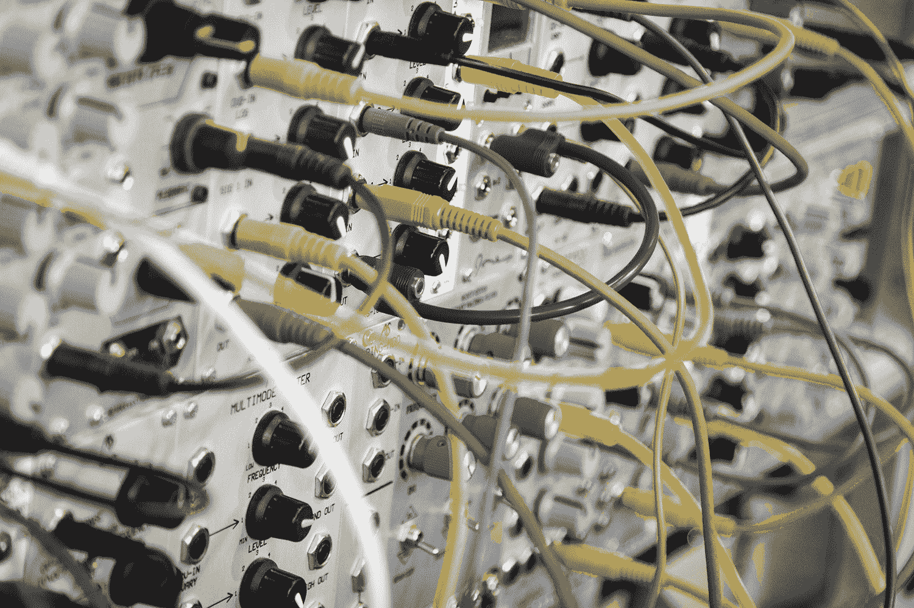

# 使用 Keras 的深度学习介绍

> 译文：[`www.kdnuggets.com/2018/10/introduction-deep-learning-keras.html`](https://www.kdnuggets.com/2018/10/introduction-deep-learning-keras.html)

 评论



在本文中，我们将使用 [Keras](http://keras.io/) 构建一个简单的神经网络。我们假设你已经具备如 [scikit-learn](http://scikit-learn.org/stable/) 和其他科学包如 [Pandas](https://pandas.pydata.org/) 和 [Numpy](http://www.numpy.org/) 的机器学习知识。

### **训练人工神经网络**

训练人工神经网络包括以下步骤：

1.  权重被随机初始化为接近零但不为零的数字。

1.  将数据集的观测值输入到输入层。

1.  正向传播（从左到右）：神经元被激活并得到预测值。

1.  比较预测结果与实际值，并测量误差。

1.  反向传播（从右到左）：调整权重。

1.  重复步骤 1–5

1.  当整个训练集经过神经网络一次时，称为一个周期。

### **商业问题**

现在让我们开始解决一个实际的商业问题。一家保险公司向你提供了一份客户之前索赔的数据集。保险公司希望你开发一个模型，以帮助他们预测哪些索赔看起来像是欺诈行为。这样做，你希望每年为公司节省数百万美元。这是一个分类问题。以下是我们数据集中的列。


### ****数据预处理****

与许多商业问题一样，提供的数据不会为我们处理。因此，我们必须以算法能够接受的方式来准备数据。我们从数据集中看到有一些类别列。我们需要将这些列转换为零和一，以便我们的深度学习模型能够理解它们。另一个需要注意的是，我们必须将数据集作为 numpy 数组输入模型。下面我们导入必要的包，然后加载数据集。

```py
*import pandas as pd

import numpy as np

df = pd.read_csv(‘Datasets/claims/insurance_claims.csv’)*
```

然后我们将类别列转换为虚拟变量。

在这种情况下，我们使用 drop_first=True 避免虚拟变量陷阱。例如，如果你有 a、b、c、d 作为类别，那么你可以丢弃 d 作为虚拟变量。这是因为如果某些东西既不属于 a、b，也不属于 c，那么它肯定在 d 中。这被称为多重共线性。

我们使用 [sklearn](http://scikit-learn.org/) 的 train_test_split 将数据分成训练集和测试集。

```py
*from sklearn.model_selection import train_test_split*
```

接下来，我们确保丢弃我们预测的列，以防止其泄漏到训练集和测试集中。我们必须避免使用相同的数据集来训练和测试模型。我们在数据集末尾设置**.values**以获得 numpy 数组。这是我们的深度学习模型接受数据的方式。这一步很重要，因为我们的机器学习模型期望数据以数组的形式存在。

然后我们将数据拆分为训练集和测试集。我们使用 70%的数据用于训练，30%用于测试。

```py
*X_train, X_test, y_train, y_test = train_test_split(X, y, test_size=0.3)*
```

接下来，我们需要使用 Sklearn 的*StandardScaler*对数据集进行缩放。由于深度学习中大量的计算，特征缩放是强制性的。特征缩放标准化了我们自变量的范围。

```py
*from sklearn.preprocessing import StandardScaler*

*sc = StandardScaler()*

*X_train = sc.fit_transform(X_train)*

*X_test = sc.transform(X_test)*
```

### ****构建人工神经网络（ANN）****

首先我们需要导入 Keras。默认情况下，Keras 会使用 TensorFlow 作为其后台。

```py
*import keras*
```

接下来，我们需要从 Keras 中导入一些模块。Sequential 模块是初始化 ANN 所必需的，而 Dense 模块是构建 ANN 层所必需的。

```py
*from keras.models import Sequential*

*from keras.layers import Dense*
```

接下来，我们需要通过创建 Sequential 实例来初始化我们的 ANN。Sequential 函数初始化了一个线性堆叠的层。这允许我们以后使用 Dense 模块添加更多层。

```py
*classifier = Sequential()*
```

### **添加输入层（第一个隐藏层）**

我们使用 add 方法将不同的层添加到我们的 ANN 中。第一个参数是你想添加到这一层的节点数。没有固定的规则来确定应该添加多少个节点。然而，一种常见的策略是将节点数量选为输入层节点数和输出层节点数的平均值。

例如，假设你有五个自变量和一个输出。然后你可以将其求和并除以二，即三。你也可以尝试一种叫做参数调优的技术。第二个参数，*kernel_initializer*，是用于初始化权重的函数。在这种情况下，它将使用均匀分布来确保权重是接近零的小数。下一个参数是激活函数。我们使用的是 Rectifier 函数，简写为 relu。我们主要在 ANN 的隐藏层中使用此函数。最后一个参数是 input_dim，它是输入层中的节点数。它代表了自变量的数量。

```py
*classsifier.add(
        Dense(3, kernel_initializer = ‘uniform’,
              activation = ‘relu’, input_dim=5))*
```

### ****添加第二个隐藏层****

添加第二个隐藏层类似于添加第一个隐藏层。

```py
*classsifier.add(
      Dense(3, kernel_initializer = ‘uniform’,
            activation = ‘relu’))*
```

我们不需要指定 input_dim 参数，因为我们已经在第一个隐藏层中指定了它。在第一个隐藏层中，我们指定了这个参数以便让该层知道期望多少个输入节点。在第二个隐藏层中，ANN 已经知道期望多少个输入节点，因此我们不需要重复。

### ****添加输出层****

```py
*classifier.add(
     Dense(1, kernel_initializer = ‘uniform’,
           activation = ‘sigmoid’))*
```

我们更改第一个参数，因为在我们的输出节点中，我们期望只有一个节点。这是因为我们只关心知道一个声明是否是欺诈性的。我们更改激活函数是因为我们想要获得声明是欺诈性的概率。我们通过使用 Sigmoid 激活函数来实现这一点。如果你处理的是一个有多个类别的分类问题（即对猫、狗和猴子进行分类），我们需要更改两件事。我们将第一个参数更改为 3，并将激活函数更改为 softmax。Softmax 是一种应用于具有两个以上类别的独立变量的 sigmoid 函数。

* * *

## 我们的前三个课程推荐

 1\. [Google 网络安全证书](https://www.kdnuggets.com/google-cybersecurity) - 快速进入网络安全职业轨道

 2\. [Google 数据分析专业证书](https://www.kdnuggets.com/google-data-analytics) - 提升你的数据分析技能

 3\. [Google IT 支持专业证书](https://www.kdnuggets.com/google-itsupport) - 支持你的组织 IT

* * *

### 更多相关主题

+   [使用 TensorFlow 和 Keras 构建和训练您的第一个神经网络](https://www.kdnuggets.com/2023/05/building-training-first-neural-network-tensorflow-keras.html)

+   [Keras 3.0：你需要知道的一切](https://www.kdnuggets.com/2023/07/keras-30-everything-need-know.html)

+   [深度学习库介绍：PyTorch 和 Lightning AI](https://www.kdnuggets.com/introduction-to-deep-learning-libraries-pytorch-and-lightning-ai)

+   [学习数据科学、机器学习和深度学习的可靠计划](https://www.kdnuggets.com/2023/01/mwiti-solid-plan-learning-data-science-machine-learning-deep-learning.html)

+   [KDnuggets 新闻，4 月 27 日：关于 Papers With Code 的简要介绍；…](https://www.kdnuggets.com/2022/n17.html)

+   [统计学习简介，Python 版：免费书籍](https://www.kdnuggets.com/2023/07/introduction-statistical-learning-python-edition-free-book.html)
