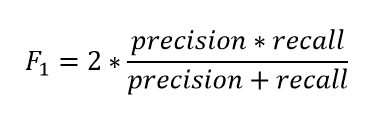
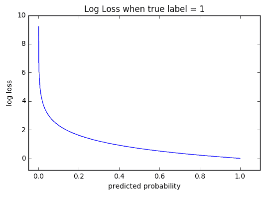
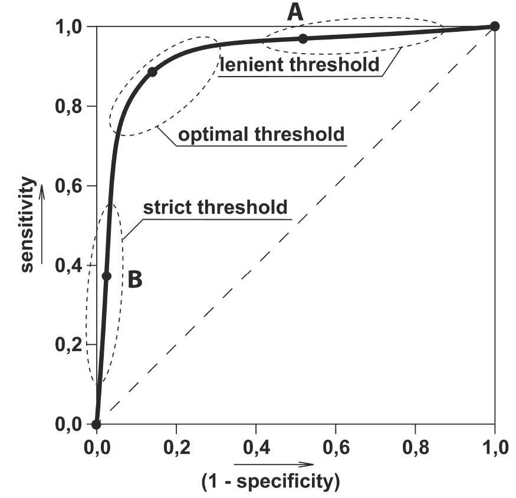

# 每个数据科学家必须了解的 5 种分类评价指标

> 原文：[`www.kdnuggets.com/2019/10/5-classification-evaluation-metrics-every-data-scientist-must-know.html`](https://www.kdnuggets.com/2019/10/5-classification-evaluation-metrics-every-data-scientist-must-know.html)

comments

***我们想要优化什么？*** 大多数企业无法回答这个简单的问题。

***每个业务问题都有些许不同，因此需要不同的优化方式。***

* * *

## 我们的前三推荐课程

 1\. [Google Cybersecurity Certificate](https://www.kdnuggets.com/google-cybersecurity) - 快速进入网络安全职业生涯。

 2\. [Google Data Analytics Professional Certificate](https://www.kdnuggets.com/google-data-analytics) - 提升您的数据分析技能

 3\. [Google IT Support Professional Certificate](https://www.kdnuggets.com/google-itsupport) - 支持您的组织的 IT 需求

* * *

我们都创建过分类模型。很多时候我们尝试通过准确率来评估我们的模型。***但我们真的希望准确率作为模型性能的指标吗？***

***如果我们预测的是会撞击地球的小行星数量呢？***

只需始终说零。你将会 99%准确。我的模型可能相对准确，但完全没有价值。在这种情况下我们应该怎么办？

> *设计数据科学项目比建模本身更为重要。*

***这篇文章讨论了各种评价指标以及如何和何时使用它们。***

### 1\. 准确率、精确率和召回率：


### A. 准确率

准确率是经典的分类指标。它很容易理解，并且适用于二分类以及多分类问题。

`Accuracy = (TP+TN)/(TP+FP+FN+TN)`

准确率是指所有检查的案例中真实结果所占的比例。

**何时使用？**

准确率对于平衡且没有偏斜或没有类别不平衡的分类问题是一个有效的评价指标。

**警告**

假设我们的目标类别非常稀疏。我们是否希望准确率作为模型性能的衡量标准？***如果我们预测的是小行星是否会撞击地球？*** 只需始终回答`No`。你将会 99%准确。我的模型可能相对准确，但完全没有价值。

### B. 精确率

让我们从*精确率*开始，它回答以下问题：**预测为正的比例中真正的正例占多少？**

`Precision = (TP)/(TP+FP)`

在小行星预测问题中，我们从未预测过一个真实的正例。

因此精确率 = 0

**何时使用？**

精确度是一个有效的评估指标，当我们想要对我们的预测非常确定时。例如：如果我们在构建一个系统来预测是否应该减少特定账户的信用额度，我们希望对我们的预测非常确定，否则可能会导致客户不满。

**警告**

*非常精确意味着我们的模型将有很多信用违约者未被触及，从而导致损失。*

### C. 回忆率

另一个非常有用的度量是*回忆率*，它回答了一个不同的问题：**实际正例**的比例被正确分类了多少？

`Recall = (TP)/(TP+FN)`

在小行星预测问题中，我们从未预测到真正的正例。

因此回忆率也等于 0。

**何时使用？**

当我们希望捕捉尽可能多的正例时，回忆率是一个有效的评估指标。例如：如果我们在构建一个系统来预测一个人是否患有癌症，我们希望即使不太确定也要捕捉到疾病。

**警告**

***回忆率为 1 当我们对所有样本预测 1 时。***

因此，出现了利用精确度与回忆率权衡的想法—— ***F1 分数***。

### 2\. F1 分数：

这是我***最喜欢的评估指标***，我在分类项目中经常使用这个指标。

F1 分数是 0 到 1 之间的数字，是精确度和回忆率的调和平均数。



让我们从一个二分类预测问题开始。 ***我们正在预测小行星是否会撞击地球。***

所以如果我们对整个训练集说“否”。我们的精确度为 0。我们的正类回忆率是多少？是零。准确率是多少？超过 99%。

因此，F1 分数也是 0。因此我们了解到，准确率为 99%的分类器在我们的情况下基本上毫无用处。因此它解决了我们的问题。

**何时使用？**

我们希望拥有一个精确度和回忆率都很好的模型。


精确度-回忆率权衡

简单地说，***F1 分数在你的分类器中在精确度和回忆率之间保持了一种平衡***。如果你的精确度低，F1 分数低；如果回忆率低，F1 分数同样低。

> 如果你是警察检查员，并且你想抓住罪犯，你希望确保你抓到的人是罪犯（精确度），同时你也希望捕捉到尽可能多的罪犯（回忆率）。F1 分数处理了这种权衡。

**如何使用？**

你可以使用以下方法计算二分类预测问题的 F1 分数：

```py

from sklearn.metrics import f1_score
y_true = [0, 1, 1, 0, 1, 1]
y_pred = [0, 0, 1, 0, 0, 1]
*f1_score(y_true, y_pred)* 

```

这是我用来获得最大化 F1 分数的最佳阈值的函数。下面的函数迭代可能的阈值，以找到提供最佳 F1 分数的阈值。

```py
# y_pred is an array of predictions
def bestThresshold(y_true,y_pred):
    best_thresh = None
    best_score = 0
    for thresh in np.arange(0.1, 0.501, 0.01):
        score = f1_score(y_true, np.array(y_pred)>thresh)
        if score > best_score:
            best_thresh = thresh
            best_score = score
    return best_score , best_thresh
```

**警告**

F1 分数的主要问题是它对精确度和回忆率给予相等的权重。我们有时可能需要在评估中包含领域知识，以便我们想要更多的回忆率或更多的精确度。

为解决此问题，我们可以通过创建加权的 F1 指标来实现，下面的公式中β管理精确度和召回率之间的权衡。


在这里，我们给予召回率β倍的权重，而不是精确度。

```py

from sklearn.metrics import fbeta_score
y_true = [0, 1, 1, 0, 1, 1]
y_pred = [0, 0, 1, 0, 0, 1]
fbeta_score(y_true, y_pred,beta=0.5)

```

F1 分数也可以用于多类问题。请参阅[这篇](https://towardsdatascience.com/multi-class-metrics-made-simple-part-ii-the-f1-score-ebe8b2c2ca1)精彩博客文章，由[Boaz Shmueli](https://medium.com/u/57ee515c83c5?source=post_page-----aa97784ff226----------------------)提供详细信息。

### 3\. 日志损失/二元交叉熵

日志损失是评估二元分类器的一个相当好的指标，并且在逻辑回归和神经网络中有时也是优化目标。

二元日志损失的示例如下公式，其中 p 是预测 1 的概率。




如你所见，当我们对 1 的预测相当确定且实际标签为 1 时，日志损失减少。

**何时使用？**

*当分类器的输出是预测概率时。****日志损失考虑了你的预测的不确定性，基于其与实际标签的差异。***这为我们的模型性能提供了更细致的视角。一般来说，最小化日志损失可以提高分类器的准确性。

**如何使用？**

```py

from sklearn.metrics import log_loss  
# where y_pred are probabilities and y_true are binary class labels
log_loss(y_true, y_pred, eps=1e-15)

```

**注意事项**

在[不平衡](https://towardsdatascience.com/the-5-sampling-algorithms-every-data-scientist-need-to-know-43c7bc11d17c)数据集的情况下，它容易受到影响。你可能需要引入类别权重，以更多地惩罚少数类错误，或者在平衡数据集后使用此方法。

### 4\. 分类交叉熵

日志损失也可以推广到多类问题。在多类情况下，分类器必须为所有示例分配每个类别的概率。如果有 N 个样本属于 M 个类别，则*分类交叉熵*是-`ylogp`值的总和：


`y_ij`是 1 如果样本`i`属于类别`j`，否则为 0

`p_ij`是我们分类器预测样本`i`属于类别`j`的概率。

**何时使用？**

*当分类器的输出是多类预测概率时，我们通常在神经网络中使用分类交叉熵。*一般来说，最小化分类交叉熵可以提高分类器的准确性。

**如何使用？**

```py

from sklearn.metrics import log_loss  
# Where y_pred is a matrix of probabilities 
# with shape *=(n_samples, n_classes)* and y_true is an array of class labels
log_loss(y_true, y_pred, eps=1e-15)

```

**注意事项：**

在[不平衡](https://towardsdatascience.com/the-5-sampling-algorithms-every-data-scientist-need-to-know-43c7bc11d17c)数据集的情况下，它容易受到影响。

### 5\. AUC

AUC 是 ROC 曲线下的面积。

***AUC ROC 指标显示正类概率与负类概率的分离程度***

***ROC 曲线是什么？***


我们从分类器得到了概率。我们可以使用各种阈值来绘制我们的灵敏度（TPR）和（1-特异度）（FPR）的曲线，这样我们就会得到 ROC 曲线。

其中，真正的阳性率（True Positive Rate，TPR）只是我们使用算法捕获的真正阳性的比例。

`Sensitivty = TPR(True Positive Rate)= Recall = TP/(TP+FN)`

假阳性率（False Positive Rate，FPR）只是我们使用算法捕获的假阳性的比例。

`1- Specificity = FPR(False Positive Rate)= FP/(TN+FP)`



ROC 曲线

在这里，我们可以使用 ROC 曲线来决定阈值。

阈值的选择还将取决于分类器的使用意图。

如果这是一个癌症分类应用，你不希望你的阈值设为 0.5。即使一个患者的癌症概率是 0.3，你也会将他分类为 1。

否则，在降低信用卡限额的应用中，你不希望你的阈值设为 0.5。你此时更担心降低限额对客户满意度的负面影响。

**何时使用？**

AUC 是**尺度不变的**。它衡量的是预测的排名情况，而不是其绝对值。因此，例如，如果你作为市场营销人员想要找出响应营销活动的用户列表。AUC 是一个好的指标，因为按概率排名的预测就是你将创建营销活动用户列表的顺序。

使用 AUC 的另一个好处是它是**分类阈值不变的**，类似于对数损失。它衡量模型预测的质量，而不管选择了什么分类阈值，这与 F1 分数或准确度不同，它们依赖于阈值的选择。

**如何使用？**

```py

import numpy as np
from sklearn.metrics import roc_auc_score
y_true = np.array([0, 0, 1, 1])
y_scores = np.array([0.1, 0.4, 0.35, 0.8])
*print(roc_auc_score(y_true, y_scores))*

```

**注意事项**

有时我们需要从模型中获得良好的概率输出，而 AUC 对此无济于事。

### 结论

创建我们的[machine learning pipeline](https://towardsdatascience.com/6-important-steps-to-build-a-machine-learning-system-d75e3b83686)的一个重要步骤是将不同的模型相互评估。选择不当的评价指标可能会对整个系统造成严重影响。

***因此，始终要注意你预测的内容以及评价指标的选择如何影响/改变你的最终预测。***

此外，选择评价指标应与业务目标良好对齐，因此这有些主观。你也可以提出自己的评价指标。

### 继续学习

如果你想要[了解](https://towardsdatascience.com/how-did-i-start-with-data-science-3f4de6b501b0?source=---------8------------------) 更多关于如何构建机器学习项目和最佳实践的内容，我推荐他的精彩[第三门课程](https://click.linksynergy.com/link?id=lVarvwc5BD0&offerid=467035.11421702016&type=2&murl=https%3A%2F%2Fwww.coursera.org%2Flearn%2Fmachine-learning-projects)，这门课程名为《构建机器学习项目》，在 Coursera 的[深度学习专业课程](https://click.linksynergy.com/deeplink?id=lVarvwc5BD0&mid=40328&murl=https%3A%2F%2Fwww.coursera.org%2Fspecializations%2Fdeep-learning)中提供。一定要看看，它讲述了许多基本概念和改进模型的陷阱。

感谢阅读。我将来还会写更多适合初学者的文章。可以在[**Medium**](https://medium.com/@rahul_agarwal?source=post_page---------------------------)上关注我，或订阅我的[**博客**](http://eepurl.com/dbQnuX?source=post_page---------------------------)以获取最新动态。一直以来，我欢迎反馈和建设性的批评，可以通过 Twitter [@mlwhiz](https://twitter.com/MLWhiz?source=post_page---------------------------) 联系我。

另外，附个小免责声明——这篇文章可能包含一些相关资源的推荐链接，因为分享知识永远是个好主意。

**简介：[Rahul Agarwal](https://www.linkedin.com/in/rahulagwl/)** 是 WalmartLabs 的高级统计分析师。可以在 Twitter 上关注他 [@mlwhiz](https://twitter.com/MLWhiz)。

[原文](https://towardsdatascience.com/the-5-classification-evaluation-metrics-you-must-know-aa97784ff226)。已获许可转载。

**相关：**

+   数据科学家应该了解的 5 种图算法

+   特征提取的向导

+   数据科学家的 6 条建议

### 相关主题

+   [更多分类问题的性能评估指标](https://www.kdnuggets.com/2020/04/performance-evaluation-metrics-classification.html)

+   [机器学习评估指标：理论与概述](https://www.kdnuggets.com/machine-learning-evaluation-metrics-theory-and-overview)

+   [分类指标详解：逻辑回归与…](https://www.kdnuggets.com/2022/10/classification-metrics-walkthrough-logistic-regression-accuracy-precision-recall-roc.html)

+   [理解分类指标：评估模型准确性的指南](https://www.kdnuggets.com/understanding-classification-metrics-your-guide-to-assessing-model-accuracy)

+   [KDnuggets 新闻，5 月 25 日：每个数据科学家都应该了解的 6 种 Python 机器学习工具](https://www.kdnuggets.com/2022/n21.html)

+   [每个数据科学家都应该了解的 6 种 Python 机器学习工具](https://www.kdnuggets.com/2022/05/6-python-machine-learning-tools-every-data-scientist-know.html)
