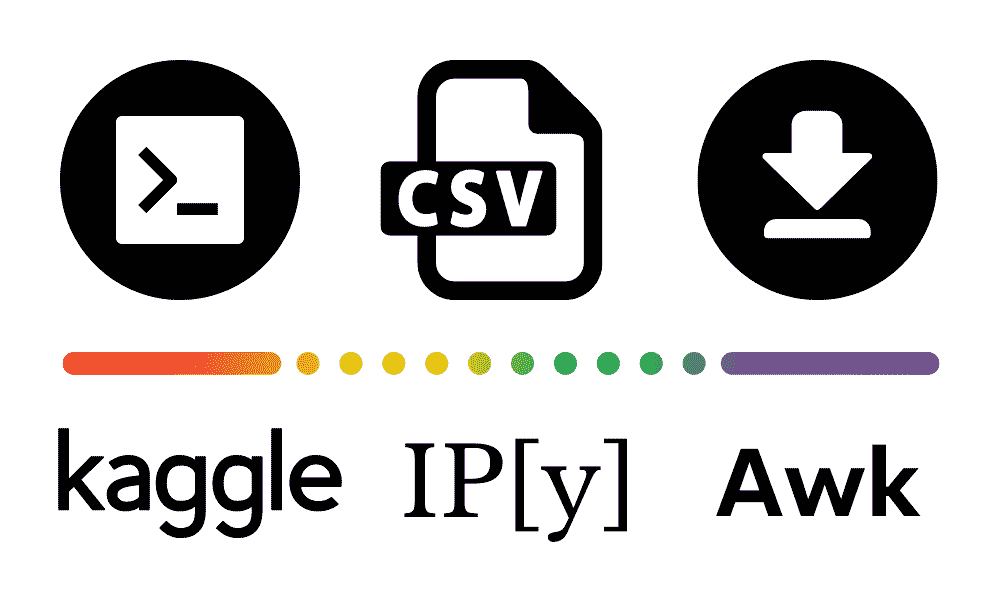
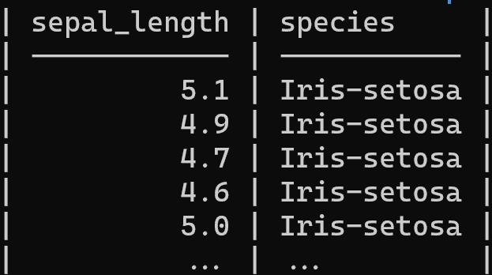
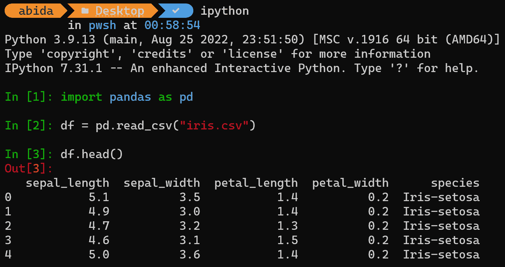
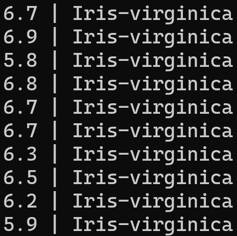
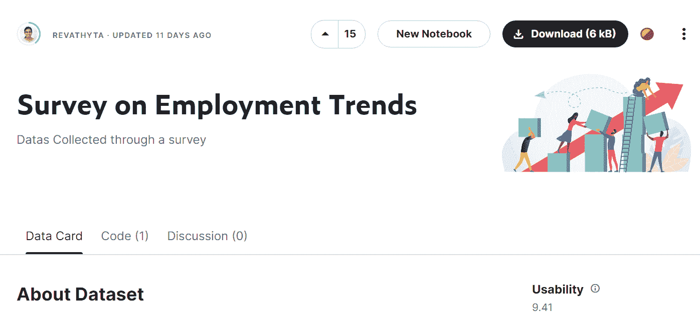
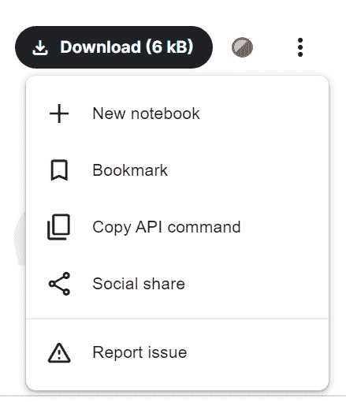

# 5 种数据科学的命令行工具

> 原文：[`www.kdnuggets.com/2023/03/5-command-line-tools-data-science.html`](https://www.kdnuggets.com/2023/03/5-command-line-tools-data-science.html)



作者提供的图片

# 1\. `csvkit`

* * *

## 我们的前三个课程推荐

 1\. [谷歌网络安全证书](https://www.kdnuggets.com/google-cybersecurity) - 快速进入网络安全职业

 2\. [谷歌数据分析专业证书](https://www.kdnuggets.com/google-data-analytics) - 提升你的数据分析技能

 3\. [谷歌 IT 支持专业证书](https://www.kdnuggets.com/google-itsupport) - 支持你的组织进行 IT 管理

* * *

[Csvkit](https://csvkit.readthedocs.io/en/latest/index.html)是表格数据的工具王。它包含了一系列可用于转换 CSV 文件、操控数据和进行数据分析的工具。

你可以使用 pip 安装`csvkit`。

```py
$ pip install csvkit
```

## 示例 1

在这个示例中，我们将使用`csvcut`来选择两个列，并使用`csvlook`以表格格式显示结果。

```py
csvcut -c sepal_length,species iris.csv | csvlook --max-rows 5
```



**注意：** 你可以使用参数`--max-rows`来限制行数

## 示例 2

我们将使用`csvjson`将 CSV 文件转换为 JSON 文件。

```py
csvjson iris.csv > iris.json
```

**注意：** `csvkit`还提供了将 Excel 转换为 CSV 和将 JSON 转换为 CSV 的工具。

## 示例 3

我们还可以通过使用 SQL 查询对 CSV 文件进行数据分析。`csvsql`需要 SQL 查询和 CSV 文件路径。你可以显示结果或将其保存为 CSV。

```py
csvsql --query "select * from iris where species like 'Iris-setosa'" iris.csv | csvlook --max-rows 5
```


# 2\. `IPython`

[IPython](https://ipython.readthedocs.io/en/latest/index.html)是一个交互式 Python 外壳，它将 Jupyter 笔记本的一些功能带入你的终端。它允许你更快地测试想法，而无需创建 Python 文件。

使用 pip 安装`ipython`。

```py
$ pip install ipython
```

**注意：** `Ipython`也包含在 Anaconda 和 Jupyter Notebook 中。因此，在大多数情况下你不需要单独安装它。

安装后，只需在终端中输入`ipython`，即可像在 Jupyter 笔记本中一样开始数据分析。这既简单又快捷。



# 3\. `cURL`

[cURL](https://curl.se/)代表客户端 URL，是一个用于通过 URL 在服务器间传输数据的 CLI 工具。你可以使用它来限制速率、记录错误、显示进度以及测试端点。

在这个示例中，我们从加州大学下载机器学习数据并将其保存为 CSV 文件。

```py
curl -o blood.csv https://archive.ics.uci.edu/ml/machine-learning-databases/blood-transfusion/transfusion.data
```

**输出：**

```py
% Total    % Received % Xferd  Average Speed   Time    Time     Time  Current
                                 Dload  Upload   Total   Spent    Left  Speed
100 12843  100 12843    0     0   7772      0  0:00:01  0:00:01 --:--:--  7769
```

你可以使用`cURL`来访问带有令牌的 API、推送文件以及自动化数据管道。

# 4\. `awk`

Awk 是一种终端脚本语言，我们可以用来操作数据并进行数据分析。它无需抱怨。我们可以使用变量、数字函数、字符串函数和逻辑运算符来编写任何类型的脚本。

在示例中，我们展示了 CSV 文件的第一列和最后一列，并显示了最后 10 行。脚本中的$1 表示第一列。你也可以将其改为$3 以显示第 3 列。$NF 表示最后一列。

```py
awk -F "," '{print $1 " | " $NF}' iris.csv | tail
```



# 5\. Kaggle

[Kaggle API](https://github.com/Kaggle/kaggle-api) 允许你从 Kaggle 网站下载各种数据集。此外，你还可以更新你的公共数据集，提交文件到竞赛，并运行和管理 Jupyter Notebook。它是一个超级命令行工具。

使用 pip 安装 Kaggle API。

```py
$ pip install kaggle
```

之后，前往 [Kaggle](https://www.kaggle.com/) 网站并获取你的凭据。你可以按照 [这个](https://github.com/Kaggle/kaggle-api#api-credentials)指南来设置你的用户名和私钥。

```py
export KAGGLE_USERNAME=kingabzpro
export KAGGLE_KEY=xxxxxxxxxxxxxx
```

## 示例 1

设置认证后，你可以搜索随机数据集。在我们的案例中，我们使用了 [就业趋势调查](https://www.kaggle.com/datasets/revathyta/survey-on-employment-trends) 数据集。



图片来自 [就业趋势调查](https://www.kaggle.com/datasets/revathyta/survey-on-employment-trends)

你可以使用`-d`参数 USERNAME/DATASET 来运行下载脚本。

```py
$ kaggle datasets download -d revathyta/survey-on-employment-trends
```

或者，

你可以通过点击三个点并选择“复制 API 命令”选项来简单地获取 API 命令。



图片来自 [就业趋势调查](https://www.kaggle.com/datasets/revathyta/survey-on-employment-trends)

它将数据集以 zip 文件的形式下载。你还可以将脚本与`unzip`命令连接，以提取数据。

```py
Downloading survey-on-employment-trends.zip to C:\Users\abida

0%|                                                                                                   | 0.00/6.22k [00:00<?, ?B/s]

100%|██████████████████████████████████████████████████████████████████████████████████████████████████| 6.22k/6.22k [00:00<?, ?B/s]
```

## 示例 2

要在 Kaggle 上创建并分享你的数据集，你首先需要通过提供数据集的路径来初始化一个元数据文件。

```py
$ kaggle datasets init -p /work/Kaggle/World-Vaccine-Progress
```

之后创建数据集并将文件推送到 Kaggle 服务器。

```py
$ kaggle datasets create -p /work/Kaggle/World-Vaccine-Progress
```

你还可以使用 `version` 命令来更新你的数据集。它需要一个文件路径和消息。就像 git 一样。

```py
$ kaggle datasets version -p /work/Kaggle/World-Vaccine-Progress -m "second version"
```

你也可以查看我的项目 [疫苗更新仪表板](https://deepnote.com/@abid/Vaccine-Update-Dashboard-8326e20a-9f85-4c0c-8380-c8c898e7e3d3)，它成功地实现了 Kaggle API 来定期更新数据集。

# 结论

我使用了许多惊人的 CLI 工具，它们提高了我的生产力，帮助我自动化了大部分工作。你甚至可以使用 click 或 argparse 在 Python 中创建你自己的 CLI 工具。

在这篇文章中，我们学习了 CLI 工具来下载数据集、操作数据、进行分析、运行脚本和生成报告。

我是 Kaalgle API 和 csvkit 的粉丝。我经常使用它们来自动化我的笔记本和分析。如果你想了解如何在数据科学工作流中使用命令行工具，可以在线免费阅读命令行中的数据科学这本书。

**[Abid Ali Awan](https://www.polywork.com/kingabzpro)** ([@1abidaliawan](https://twitter.com/1abidaliawan)) 是一位认证数据科学专家，热衷于构建机器学习模型。目前，他专注于内容创作，并撰写关于机器学习和数据科学技术的技术博客。Abid 拥有技术管理硕士学位和电信工程学士学位。他的愿景是利用图神经网络开发一个 AI 产品，帮助那些面临心理健康问题的学生。

### 更多相关话题

+   [命令行中的数据科学：免费电子书](https://www.kdnuggets.com/2022/03/data-science-command-line-free-ebook.html)

+   [ChatGPT CLI：将您的命令行界面转换为 ChatGPT](https://www.kdnuggets.com/2023/07/chatgpt-cli-transform-commandline-interface-chatgpt.html)

+   [通过这个 GitHub 仓库掌握命令行艺术](https://www.kdnuggets.com/master-the-art-of-command-line-with-this-github-repository)

+   [用 Python 在 7 个简单步骤中构建命令行应用程序](https://www.kdnuggets.com/build-a-command-line-app-with-python-in-7-easy-steps)

+   [数据编排：生成性 AI 成功与失败之间的分界线…](https://www.kdnuggets.com/2024/07/astronomer/data-orchestration-the-dividing-line-between-generative-ai-success-and-failure)

+   [利用数据科学使清洁能源更具公平性](https://www.kdnuggets.com/2022/03/data-science-make-clean-energy-equitable.html)
