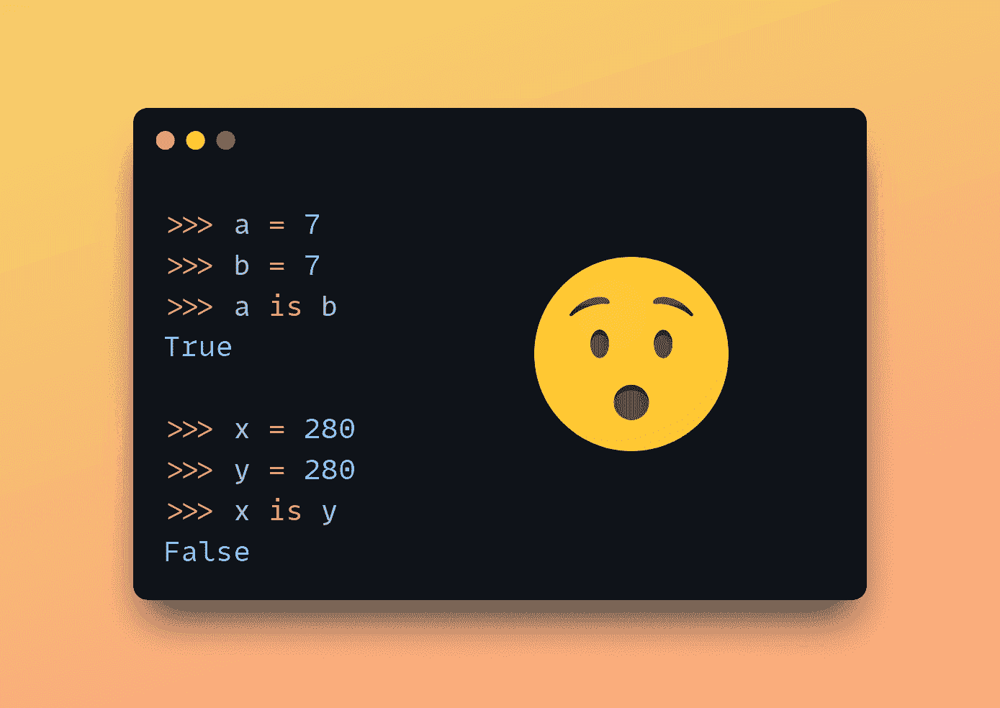

# 5 个常见的 Python 陷阱（以及如何避免它们）

> 原文：[`www.kdnuggets.com/5-common-python-gotchas-and-how-to-avoid-them`](https://www.kdnuggets.com/5-common-python-gotchas-and-how-to-avoid-them)



作者提供的图片

Python 是一种对初学者友好且多才多艺的编程语言，以其简洁性和可读性而闻名。然而，它优雅的语法并非没有奇怪之处，这可能会让即使是经验丰富的 Python 开发者感到意外。理解这些问题对于编写无错误的代码——或者说无痛调试——是至关重要的。

* * *

## 我们的三大课程推荐

 1\. [Google 网络安全证书](https://www.kdnuggets.com/google-cybersecurity) - 快速进入网络安全职业。

 2\. [Google 数据分析专业证书](https://www.kdnuggets.com/google-data-analytics) - 提升你的数据分析水平

 3\. [Google IT 支持专业证书](https://www.kdnuggets.com/google-itsupport) - 支持你组织的 IT

* * *

本教程探讨了一些这些问题：可变的默认值、循环和推导式中的变量作用域、元组赋值等。我们将编写简单的示例来了解*为什么*事情会这样工作，并且还会研究*如何*避免这些（如果我们真的可以的话 🙂）。

那我们开始吧！

# 1\. 可变的默认值

在 Python 中，可变的默认值常常是个棘手的问题。每当你定义一个带有可变对象（如列表或字典）作为默认参数的函数时，你会遇到意想不到的行为。

**默认值仅在函数定义时评估一次，而不是每次调用函数时**。如果你在函数内更改默认参数，这可能会导致意想不到的行为。

让我们来看一个例子：

```py
def add_to_cart(item, cart=[]):
    cart.append(item)
    return cart
```

在这个例子中，`add_to_cart` 是一个函数，它接受一个项目并将其追加到一个列表 `cart` 中。`cart` 的默认值是一个空列表。也就是说，如果调用函数时没有添加项目，它会返回一个空购物车。

下面是几个函数调用：

```py
# User 1 adds items to their cart
user1_cart = add_to_cart("Apple")
print("User 1 Cart:", user1_cart) 
```

```py
Output >>> ['Apple']
```

这按预期工作。但现在会发生什么呢？

```py
# User 2 adds items to their cart
user2_cart = add_to_cart("Cookies")
print("User 2 Cart:", user2_cart) 
```

```py
Output >>>

['Apple', 'Cookies'] # User 2 never added apples to their cart!
```

因为默认参数是一个列表——一个可变对象——它在函数调用之间保持其状态。所以每次调用 `add_to_cart` 时，它都会将值追加到函数定义时创建的同一个列表对象中。在这个例子中，就像所有用户共享同一个购物车一样。

## 如何避免

作为解决方案，你可以将 `cart` 设置为 `None`，然后在函数内部初始化购物车，如下所示：

```py
def add_to_cart(item, cart=None):
    if cart is None:
        cart = []
    cart.append(item)
    return cart
```

所以每个用户现在都有一个单独的购物车。🙂

如果你需要复习 Python 函数和函数参数，可以阅读 Python 函数参数：终极指南。

# 2\. 循环和推导式中的变量作用域

Python 的作用域怪癖需要一个专门的教程。不过我们将在这里看看其中一个怪癖。

看一下以下代码片段：

```py
x = 10
squares = []
for x in range(5):
    squares.append(x ** 2)

print("Squares list:", squares)  

# x is accessible here and is the last value of the looping var
print("x after for loop:", x)
```

变量 `x` 被设置为 10。但是 `x` 也是循环变量。我们假设循环变量的作用范围仅限于 for 循环块，对吗？

让我们看看输出：

```py
Output >>>

Squares list: [0, 1, 4, 9, 16]
x after for loop: 4
```

我们看到 `x` 现在是 4，这个值是它在循环中取到的最终值，而不是我们设置的初始值 10。

现在让我们看看如果我们将 for 循环替换为列表解析表达式会发生什么：

```py
x = 10
squares = [x ** 2 for x in range(5)]

print("Squares list:", squares)  

# x is 10 here
print("x after list comprehension:", x)
```

在这里，`x` 是 10，这是我们在列表解析表达式之前设置的值：

```py
Output >>>

Squares list: [0, 1, 4, 9, 16]
x after list comprehension: 10
```

## 如何避免

为了避免意外行为：如果你在使用循环时，确保不要将循环变量命名为你稍后想要访问的其他变量相同的名称。

# 3\. 整数身份特性

在 Python 中，我们使用 `is` 关键字来检查对象身份。这意味着它检查两个变量是否引用了内存中的同一对象。要检查相等性，我们使用 `==` 操作符。对吗？

现在，启动一个 Python REPL 并运行以下代码：

```py
>>> a = 7
>>> b = 7
>>> a == 7
True
>>> a is b
True
```

现在运行这个：

```py
>>> x = 280
>>> y = 280
>>> x == y
True
>>> x is y
False
```

**等等，为什么会发生这种情况？** 好吧，这是由于 CPython 中的“整数缓存”或“驻留”。

CPython [缓存整数对象](https://stackoverflow.com/questions/15171695/whats-with-the-integer-cache-maintained-by-the-interpreter) 在 -5 到 256 的范围内。**这意味着每次你使用这个范围内的整数时，Python 将使用内存中的相同对象。** 因此，当你使用 `is` 关键字比较这范围内的两个整数时，结果是 `True`，因为它们*指向内存中的相同对象*。

这就是为什么 `a is b` 返回 `True`。你也可以通过打印 `id(a)` 和 `id(b)` 来验证这一点。

但是，这个范围之外的整数不会被缓存。每次出现这样的整数都会在内存中创建一个新对象。

所以，当你使用 `is` 关键字比较两个范围之外的整数时（是的，在我们的示例中 `x` 和 `y` 都设置为 280），结果是 `False`，因为它们确实是内存中的两个不同对象。

## 如何避免

除非你尝试使用 `is` 来比较两个对象的相等性，否则这种行为不应成为问题。因此，总是使用 `==` 操作符来检查任何两个 Python 对象是否具有相同的值。

# 4\. 元组赋值和可变对象

如果你熟悉 Python 的内置数据结构，你会知道元组是 **不可变** 的。所以你 *不能* 就地修改它们。另一方面，像列表和字典这样的数据结构是 **可变** 的。这意味着你 *可以* 就地更改它们。

**但是包含一个或多个可变对象的元组怎么办？**

启动一个 Python REPL 并运行这个简单的示例是很有帮助的：

```py
>>> my_tuple = ([1,2],3,4)
>>> my_tuple[0].append(3)
>>> my_tuple
([1, 2, 3], 3, 4)
```

这里，元组的第一个元素是一个包含两个元素的列表。我们尝试向第一个列表中添加 3，它工作得很好！好吧，我们刚刚就地修改了一个元组吗？

现在让我们尝试向列表中添加两个元素，这次使用 += 操作符：

```py
>>> my_tuple[0] += [4,5]
Traceback (most recent call last):
  File "<stdin>", line 1, in <module>
TypeError: 'tuple' object does not support item assignment</module></stdin>
```

是的，你会得到一个 TypeError，表示元组对象不支持项赋值。这是预期的。但让我们检查一下元组：

```py
>>> my_tuple
([1, 2, 3, 4, 5], 3, 4)
```

我们看到元素 4 和 5 已经被添加到列表中！程序是否在同时抛出错误并成功？

+= 操作符在内部通过调用 `__iadd__()` 方法来执行就地加法，并在原地修改列表。赋值会引发 TypeError 异常，但将元素添加到列表末尾已经成功。 += 也许是最尖锐的棱角！

## 如何避免

为了避免程序中的这种怪癖，尽量 *仅* 使用元组来处理不可变集合。尽可能避免将可变对象作为元组元素。

# 5\. 可变对象的浅拷贝

可变性一直是我们讨论中的一个反复出现的话题。所以这是另一个总结本教程的内容。

有时你可能需要创建列表的独立副本。但是，当你使用类似 `list2 = list1` 的语法创建副本时，其中 `list1` 是原始列表，会发生什么？

这是一个浅拷贝。因此，它仅复制了对原始列表元素的引用。通过浅拷贝修改元素会影响 *原始列表* 和 *浅拷贝*。

让我们看这个例子：

```py
original_list = [[1, 2, 3], [4, 5, 6], [7, 8, 9]]

# Shallow copy of the original list
shallow_copy = original_list

# Modify the shallow copy
shallow_copy[0][0] = 100

# Print both the lists
print("Original List:", original_list)
print("Shallow Copy:", shallow_copy)
```

我们看到对浅拷贝的修改也影响了原始列表：

```py
Output >>>

Original List: [[100, 2, 3], [4, 5, 6], [7, 8, 9]]
Shallow Copy: [[100, 2, 3], [4, 5, 6], [7, 8, 9]]
```

在这里，我们修改了浅拷贝中第一个嵌套列表的第一个元素：`shallow_copy[0][0] = 100`。但我们看到修改影响了原始列表和浅拷贝。

## 如何避免

为了避免这种情况，你可以像这样创建深拷贝：

```py
import copy

original_list = [[1, 2, 3], [4, 5, 6], [7, 8, 9]]

# Deep copy of the original list
deep_copy = copy.deepcopy(original_list)

# Modify an element of the deep copy
deep_copy[0][0] = 100

# Print both lists
print("Original List:", original_list)
print("Deep Copy:", deep_copy)
```

现在，对深拷贝的任何修改都不会改变原始列表。

```py
Output >>>

Original List: [[1, 2, 3], [4, 5, 6], [7, 8, 9]]
Deep Copy: [[100, 2, 3], [4, 5, 6], [7, 8, 9]]
```

# 总结

这就结束了！在本教程中，我们探索了 Python 中的一些奇特现象：从可变默认值的意外行为到浅拷贝列表的细微差别。这只是 Python 奇特现象的一个介绍，绝不是详尽无遗的列表。你可以在 [GitHub](https://github.com/balapriyac/python-basics/tree/main/common-gotchas) 上找到所有的代码示例。

随着你在 Python 中编程时间的增加——并更好地理解语言——你可能会遇到更多这样的情况。所以，继续编程，继续探索！

哦，如果你想读这个教程的续集，请在评论中告诉我们。

**[](https://twitter.com/balawc27)**[Bala Priya C](https://www.kdnuggets.com/wp-content/uploads/bala-priya-author-image-update-230821.jpg)**** 是来自印度的开发人员和技术作家。她喜欢在数学、编程、数据科学和内容创作的交汇点上工作。她的兴趣和专长领域包括 DevOps、数据科学和自然语言处理。她喜欢阅读、写作、编程和喝咖啡！目前，她通过编写教程、操作指南、观点文章等方式，学习并与开发者社区分享她的知识。Bala 还创建了引人入胜的资源概述和编程教程。

### 更多相关话题

+   [5 个常见的数据科学错误及如何避免](https://www.kdnuggets.com/5-common-data-science-mistakes-and-how-to-avoid-them)

+   [对话式 AI 开发中的 3 个关键挑战及如何避免它们](https://www.kdnuggets.com/3-crucial-challenges-in-conversational-ai-development-and-how-to-avoid-them)

+   [避免这些 5 个 AI 新手常犯的错误](https://www.kdnuggets.com/avoid-these-5-common-mistakes-every-novice-in-ai-makes)

+   [10 个最常见的数据质量问题及如何解决](https://www.kdnuggets.com/2022/11/10-common-data-quality-issues-fix.html)

+   [KDnuggets 新闻，8 月 24 日：在 Python 中实现 DBSCAN • 如何…](https://www.kdnuggets.com/2022/n34.html)

+   [常见数据问题（及解决方案）](https://www.kdnuggets.com/2022/02/common-data-problems-solutions.html)
