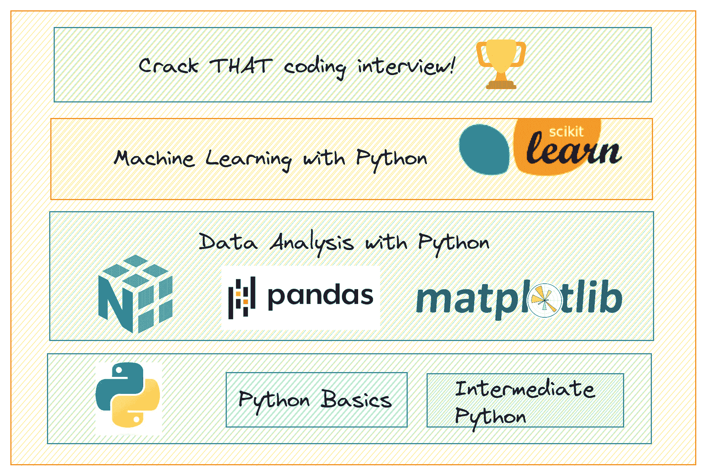

# 5 个免费课程掌握数据科学中的 Python

> 原文：[`www.kdnuggets.com/5-free-courses-to-master-python-for-data-science`](https://www.kdnuggets.com/5-free-courses-to-master-python-for-data-science)

作者提供的图片

学习 Python 对于想要转行数据职业的人来说非常有帮助。但有很多需要学习的内容：从 Python 编程基础到数据分析、机器学习以及破解编码面试。那么你如何找到最佳的学习资源呢？

* * *

## 我们的前三名课程推荐

 1\. [谷歌网络安全证书](https://www.kdnuggets.com/google-cybersecurity) - 快速进入网络安全职业道路。

 2\. [谷歌数据分析专业证书](https://www.kdnuggets.com/google-data-analytics) - 提升你的数据分析技能

 3\. [谷歌 IT 支持专业证书](https://www.kdnuggets.com/google-itsupport) - 支持你的组织的 IT 工作

* * *

为了帮助你，我们编制了一份课程清单，帮助你掌握 Python 在数据科学中的应用。无论你是初学者还是经验丰富的专业人士，希望刷新你的 Python 技能，这些课程都适合你。推荐的课程将帮助你学习以下内容：

+   Python 基础

+   Python 数据科学库

+   使用 Python 进行数据分析和机器学习

+   使用 Python 进行数据结构和算法

让我们开始吧。

# 1\. 初学者的 Python

Mosh 的[初学者 Python](https://www.youtube.com/watch?v=kqtD5dpn9C8)课程将帮助你熟悉 Python 编程的绝对基础。

在大约一个小时内，你可以掌握以下基础知识：

+   变量

+   接收输入

+   类型转换

+   字符串

+   运算符及运算符优先级

+   if 语句

+   while 和 for 循环

+   列表和元组

链接：[初学者的 Python](https://www.youtube.com/watch?v=kqtD5dpn9C8)

# 2\. 中级 Python 编程

现在你掌握了基础知识，你可以参加这个[中级 Python 编程](https://youtu.be/HGOBQPFzWKo?feature=shared)课程。该课程从讨论各种 Python 内置数据结构开始，并继续讲解语言的更高级特性。

本课程涵盖的主题包括：

+   Python 的内置数据结构

+   集合

+   itertools

+   Lambda 函数

+   异常和错误

+   日志记录

+   处理 JSON

+   随机数生成

+   装饰器

+   生成器

+   多线程和多进程

+   函数参数

+   浅拷贝与深拷贝

+   上下文管理器

链接：[中级 Python 编程](https://youtu.be/HGOBQPFzWKo?feature=shared)

# 3\. 使用 Python 进行数据分析

一旦你对 Python 有了良好的掌握，你可以继续学习各种 Python 数据科学库。

[Python 数据分析](https://www.freecodecamp.org/learn/data-analysis-with-python/#data-analysis-with-python-course) 认证将帮助你学习所有必要的 Python 数据科学库：

+   NumPy

+   Pandas

+   Matplotlib

+   Seaborn

你还将构建一些数据分析项目。你应完成这些项目以获得 Python 数据分析认证。

链接: [Python 数据分析认证](https://www.freecodecamp.org/learn/data-analysis-with-python/#data-analysis-with-python-course)

# 4\. 使用 Python 和 Scikit-Learn 的机器学习

你现在应该能够熟练使用 Python 编程并操作 Python 数据科学库。现在你可以开始探索机器学习。

[使用 Python 和 Scikit-Learn 的机器学习](https://youtu.be/hDKCxebp88A?feature=shared) 将帮助你了解机器学习算法的理论（如何工作）和使用 scikit-learn 实现这些算法。该课程还将教你如何规划和实施机器学习项目，并构建和部署机器学习应用。

这是所涉及主题的概述：

+   线性回归和梯度下降

+   用于分类的逻辑回归

+   决策树和随机森林

+   如何接近机器学习项目

+   使用 XGBoost 的梯度提升机

+   从零开始的机器学习项目

+   以课堂形式部署机器学习项目

链接: [使用 Python 和 Scikit-Learn 的机器学习](https://youtu.be/hDKCxebp88A?feature=shared)

# 5\. Python 中的数据结构和算法

在数据科学面试过程中，你应该首先破解编码面试，才能进入下一个阶段。为了破解它们，并使你的编码练习更有效，你应首先在数据结构和算法方面打下坚实的基础。

[Python 中的数据结构和算法](https://youtu.be/pkYVOmU3MgA?feature=shared) 是一个免费课程，将帮助你学习基本的数据结构和算法，重点是 Python。

只需遵循数据结构和算法课程，你将学习到以下内容

+   二分查找、链表和复杂度

+   二叉搜索树、遍历和递归

+   哈希表和 Python 字典

+   排序算法、分治法

+   递归和动态编程

+   图算法

+   Python 面试问题、技巧和建议

链接: [Python 中的数据结构和算法](https://youtu.be/pkYVOmU3MgA?feature=shared)

# 总结

希望你觉得这些课程有帮助。我们整理了一份全面的课程列表，将帮助你在 Python 数据科学方面变得熟练。

如果你还记得，我们的课程从 Python 编程的基础开始，到使用 Python 进行数据分析和机器学习。我们还包括了一门课程，帮助你学习数据结构和算法的基础，以备编码面试之需。祝学习愉快，编码顺利！

****[Bala Priya C](https://www.kdnuggets.com/wp-content/uploads/bala-priya-author-image-update-230821.jpg)**是来自印度的开发者和技术作家。她喜欢在数学、编程、数据科学和内容创作的交汇点上工作。她的兴趣和专长包括 DevOps、数据科学和自然语言处理。她喜欢阅读、写作、编码和咖啡！目前，她正致力于通过撰写教程、操作指南、观点文章等方式学习和分享她的知识。Bala 还创建了引人入胜的资源概述和编码教程。**

### 更多相关话题

+   [掌握数据科学、数据工程、机器学习等的 25 门免费课程](https://www.kdnuggets.com/25-free-courses-to-master-data-science-data-engineering-machine-learning-mlops-and-generative-ai)

+   [掌握数据科学 SQL 的 5 门免费课程](https://www.kdnuggets.com/5-free-courses-to-master-sql-for-data-science)

+   [掌握数据科学数学的 5 门免费课程](https://www.kdnuggets.com/5-free-courses-to-master-math-for-data-science)

+   [掌握数据科学的 5 门免费课程](https://www.kdnuggets.com/5-free-courses-to-master-data-science)

+   [掌握数据科学的 5 门免费统计课程](https://www.kdnuggets.com/5-free-courses-to-master-statistics-for-data-science)

+   [掌握数据工程的 5 门免费课程](https://www.kdnuggets.com/5-free-courses-to-master-data-engineering)
