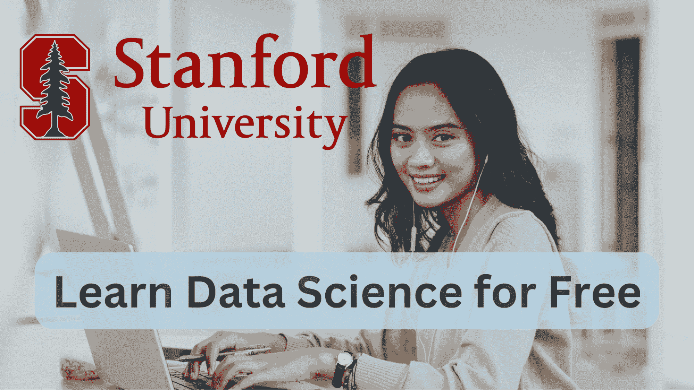

# 5 门免费斯坦福大学数据科学课程

> 原文：[`www.kdnuggets.com/5-free-stanford-university-courses-to-learn-data-science`](https://www.kdnuggets.com/5-free-stanford-university-courses-to-learn-data-science)

作者提供的图片

学习数据科学从未如此便捷。如果你有动力，你可以通过世界各地顶级大学提供的课程免费自学数据科学。

* * *

## 我们的前三个课程推荐

 1\. [谷歌网络安全证书](https://www.kdnuggets.com/google-cybersecurity) - 快速进入网络安全职业。

 2\. [谷歌数据分析专业证书](https://www.kdnuggets.com/google-data-analytics) - 提升你的数据分析能力

 3\. [谷歌 IT 支持专业证书](https://www.kdnuggets.com/google-itsupport) - 支持你的组织的 IT

* * *

我们整理了这份来自斯坦福大学的免费课程列表，以帮助你掌握所有必需的数据科学技能：

+   编程基础

+   数据库和 SQL

+   机器学习

+   处理大型数据集

所以今天就开始学习，以实现你的学习目标并开启你的数据职业生涯。现在让我们深入了解这些课程。

# 1\. 编程方法论

要开始数据科学，建立如 Python 等编程语言的基础很重要。[编程方法论](https://web.stanford.edu/class/archive/cs/cs106a/cs106a.1226/)课程从零基础教你 Python 编程，不需要任何编程经验。

在这门课程中，你将学习使用 Python 解决问题，同时熟悉语言的特点。你将从基础知识开始，例如变量和控制流，然后学习内置数据结构，如列表和字典。

在此过程中，你还将学习如何处理图像，探索 Python 中的面向对象编程和内存管理。

**链接**: [编程方法论](https://web.stanford.edu/class/archive/cs/cs106a/cs106a.1226/)

# 2\. 数据库

对数据库和 SQL 有深入理解对任何数据职业都至关重要。你可以在 edX 上参加由 Jennifer Widom 教授主讲的流行数据库课程，课程分为五个自学模块。

**备注**: 你可以免费旁听课程并访问所有课程内容。

如果你是数据库新手，请先学习涵盖关系数据库基础的第一门课程，然后再学习更高级的课程。通过学习这些课程系列，你将掌握：

+   关系数据库和 SQL

+   查询性能

+   事务和并发控制

+   数据库约束、触发器、视图

+   OLAP 立方体，星型模式

+   数据库建模

+   处理半结构化数据如 JSON 和 XML

**课程链接**:

1.  [数据库：关系数据库与 SQL](https://www.edx.org/learn/relational-databases/stanford-university-databases-relational-databases-and-sql)

1.  [数据库：SQL 中的高级主题](https://www.edx.org/learn/sql/stanford-university-databases-advanced-topics-in-sql)

1.  [数据库：OLAP 与递归](https://www.edx.org/learn/databases/stanford-university-databases-olap-and-recursion)

1.  [数据库：建模与理论](https://www.edx.org/learn/databases/stanford-university-databases-modeling-and-theory)

1.  [数据库：半结构化数据](https://www.edx.org/learn/relational-databases/stanford-university-databases-semistructured-data)

# 3\. 机器学习

作为数据科学家，你应该能够使用 Python 和 SQL 分析数据并回答业务问题。但有时你还需要构建预测模型。这就是学习机器学习的帮助所在。

[机器学习](https://www.youtube.com/playlist?list=PLoROMvodv4rNyWOpJg_Yh4NSqI4Z4vOYy) 或 [CS229: 机器学习](https://cs229.stanford.edu/) 斯坦福大学的课程之一，是最受欢迎和高度推荐的机器学习课程之一。你将学习到一个学期大学课程中通常涵盖的所有内容。此课程包括以下主题：

+   监督学习

+   无监督学习

+   深度学习

+   泛化和正则化

+   强化学习和控制

**链接**: [机器学习](https://www.youtube.com/playlist?list=PLoROMvodv4rNyWOpJg_Yh4NSqI4Z4vOYy)

# 4\. 用 Python 进行统计学习

《Python 统计学习导论》（或 [ISL with Python](https://www.statlearning.com/)）是流行的 ISLR 统计学习书籍的 Python 版。

[用 Python 进行统计学习](https://www.edx.org/learn/python/stanford-university-statistical-learning-with-python) 课程涵盖了 [ISL with Python](https://www.statlearning.com/) 书籍的所有内容。因此，你将学习到数据科学和统计建模的基本工具。以下是此课程涵盖的一些重要主题概述：

+   线性回归

+   分类

+   重采样

+   线性模型选择

+   基于树的方法

+   无监督学习

+   深度学习

**链接**: [用 Python 进行统计学习](https://www.edx.org/learn/python/stanford-university-statistical-learning-with-python)

# 5\. 挖掘大规模数据集

[挖掘大规模数据集](https://web.stanford.edu/class/cs246/) 是一个专注于数据挖掘和机器学习算法，用于处理和分析大规模数据集的课程。

为了充分利用此课程，你应该对编程感到自如，最好是 Java 或 Python。你还应熟悉数学：概率和线性代数。如果你是初学者，考虑在参加此课程之前完成之前提到的课程。

该课程涵盖的一些主题包括：

+   高维空间中的最近邻搜索

+   局部敏感哈希（LSH）

+   降维

+   大规模监督机器学习

+   聚类

+   推荐系统

你可以使用 [Mining Massive Datasets](http://www.mmds.org/) 这本书作为本课程的补充。该书也可以在网上免费获取。

**链接**: [Mining Massive Data Sets](https://web.stanford.edu/class/cs246/)

# 总结

这份来自斯坦福大学的免费课程汇编应该能帮助你学习几乎所有你需要的内容，如果你想探索数据科学的话。

如果你正在寻找免费学习 Python 和数据科学的大学课程，以下是几篇你可能会觉得有用的文章：

+   5 门免费大学 Python 课程

+   5 门免费大学数据科学课程

快乐学习！

****[Bala Priya C](https://www.kdnuggets.com/wp-content/uploads/bala-priya-author-image-update-230821.jpg)** 是一位来自印度的开发者和技术作家。她喜欢在数学、编程、数据科学和内容创作的交叉点上工作。她的兴趣和专长领域包括 DevOps、数据科学和自然语言处理。她喜欢阅读、写作、编码和咖啡！目前，她正在通过撰写教程、操作指南、观点文章等方式学习并与开发者社区分享她的知识。Bala 还制作引人入胜的资源概述和编码教程。**

### 更多相关主题

+   [免费学习斯坦福大学计算机科学中的概率](https://www.kdnuggets.com/learn-probability-in-computer-science-with-stanford-university-for-free)

+   [哈佛、斯坦福、麻省理工、康奈尔和伯克利的免费数据科学课程合集](https://www.kdnuggets.com/a-collection-of-free-data-science-courses-from-harvard-stanford-mit-cornell-and-berkeley)

+   [5 门免费斯坦福人工智能课程](https://www.kdnuggets.com/5-free-stanford-ai-courses)

+   [5 门免费大学数据科学编码课程](https://www.kdnuggets.com/5-free-university-courses-to-learn-coding-for-data-science)

+   [5 门免费大学数据科学课程](https://www.kdnuggets.com/5-free-university-courses-to-learn-data-science)

+   [5 门免费大学计算机科学课程](https://www.kdnuggets.com/5-free-university-courses-to-learn-computer-science)
