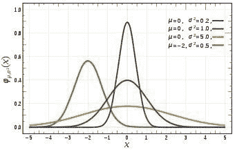
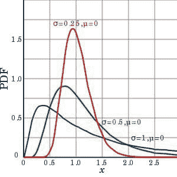
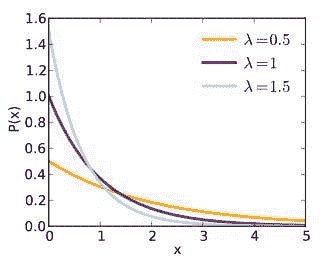

# 5 个每个数据科学家应该知道的概率分布

> 原文：[`www.kdnuggets.com/2019/07/5-probability-distributions-every-data-scientist-should-know.html`](https://www.kdnuggets.com/2019/07/5-probability-distributions-every-data-scientist-should-know.html)

 评论

概率分布就像是 3D 眼镜。它们使得有技能的数据科学家能够识别出在完全随机变量中存在的模式。

从某种程度上说，大多数其他数据科学或机器学习技能都基于对数据概率分布的某些假设。

* * *

## 我们的三大课程推荐

 1\. [谷歌网络安全证书](https://www.kdnuggets.com/google-cybersecurity) - 快速进入网络安全职业生涯。

 2\. [谷歌数据分析专业证书](https://www.kdnuggets.com/google-data-analytics) - 提升你的数据分析技能

 3\. [谷歌 IT 支持专业证书](https://www.kdnuggets.com/google-itsupport) - 支持你的组织的 IT 需求

* * *

这使得概率知识成为你作为统计学家构建工具包的基础之一。如果你正在了解 [如何成为数据科学家](http://www.datastuff.tech/data-science/3-machine-learning-books-that-helped-me-level-up-as-a-data-scientist/) 的第一步。

不再啰嗦，让我们直接切入正题。

### 什么是概率分布？

在概率论和统计学中，**随机变量** 是一个 **取随机值** 的事物，例如“我看到的下一个人的身高”或“我下一碗拉面中的厨师头发数量”。

给定一个随机变量 *X*，我们希望有一种方式来描述它取的值。更进一步，我们希望能够表征 **该变量取某一特定值** *x* 的 **可能性**。

例如，如果 *X* 是“我女朋友有多少只猫”，那么这个数字有可能是 1。可以说，这个值甚至有可能是 5 或 10。

然而，没有办法（因此也没有概率）一个人会有负数只猫。

因此，我们希望有一种明确的数学方式来表达变量 *X* 可以取的每一个可能值 *x*，以及事件 *(X= x)* 的可能性。

为了做到这一点，我们定义一个函数 *P*，使得 *P(X = x)* 是变量 *X* 具有值 *x* 的概率。

我们也可以请求 P(X < x) 或 P(X > x)，用于区间而不是离散值。这将变得更加相关。

*P* 是变量的 **密度函数**，它描述了该变量的 **分布**。

随着时间的推移，科学家们逐渐认识到，许多自然现象和现实生活中的事物往往**行为类似**，变量共享某种分布，或者拥有相同的密度函数（或在其中改变几个常数的类似函数）。

有趣的是，为了使*P*成为实际的密度函数，需要满足一些条件。

+   ***P(X =x)***** <= 1** 对于任何值*x*。没有什么比确定更确定的了。

+   ***P(X =x)***** >= 0** 对于任何值*x*。某件事可以是不可能的，但不可能比这更不可能。

+   最后一条：*P(X=x)* 对于所有可能值*x*的**总和** ***是 1**。

最后一条意味着“X 取*任何*值的概率，*必须*加起来等于 1，因为我们知道它会取*某个*值”。

### 离散与连续随机变量分布

最后，随机变量可以被认为属于两个组：**离散**和**连续**随机变量。

### 离散随机变量

**离散变量**有一组离散的可能值，每个值都有一个非零的概率。

例如，当掷硬币时，如果我们说

> X = “如果硬币是正面则为 1，如果是反面则为 0”

然后*P(X = 1) = P(X = 0) = 0.5*。

但要注意，离散集不必是有限的。

**几何分布**用于建模某个事件在概率*p* **经过*****k***** 次重试后发生的机会**。

它具有以下密度公式。

其中***k*****可以取任何具有正概率的非负值**。

注意所有可能值的概率的总和仍然**加起来等于 1**。

### 连续随机变量

如果你说

> X = “从我头上随机拔取的头发的长度（以毫米为单位，不进行四舍五入）”

*X*可以取哪些可能值？我们可能都同意负值在这里没有意义。

但是如果你说它正好是 1 毫米，而不是 1.1853759…或者类似的数字，我要么会怀疑你的测量技能，要么会怀疑你的测量误差报告。

连续随机变量可以在给定的（连续）区间内取**任何值**。

因此，如果我们给它所有可能的值分配**非零概率**，它们的总和将**不会加起来等于 1**。

为了解决这个问题，如果*X*是连续的，我们将*P(X=x) = 0* 对于所有*k*，而是给*X*在**某个区间内取值**分配一个非零的机会。

要表示 X 在*a*和*b*之间的概率，我们说 *P(a < X < b)*。

你需要通过对*X*的密度函数从*a*到*b*进行积分来获得*P(a < X < b)*，而不是仅仅替换密度函数中的值。

哇，你已经完成了整个理论部分！这是你的奖励。

奖励小狗。来源：[Pixabay](https://pixabay.com/photos/pug-puppy-dog-animal-cute-690566/)。

现在你知道什么是概率分布了，我们来学习一些最常见的概率分布吧！

### 伯努利概率分布

伯努利分布的随机变量是最简单的分布之一。

它表示一个**二元事件**：“这发生了”与“这没发生”，并以*p*作为其**唯一参数**，代表**事件发生的概率**。

一个参数为*p*的伯努利分布的随机变量*B*将具有以下密度函数：

*P(B = 1) = p, P(B = 0) = (1-p)*

这里*B=1*表示事件发生，*B=0*表示事件未发生。

注意这两个概率之和为 1，因此*B*的其他值是不可能的。

### 均匀概率分布

有两种均匀随机变量：离散型和连续型。

**离散均匀分布**将取**（有限）**的一组值 *S*，并为每个值分配*1/n*的概率，其中*n*是*S*中的元素数量。

这样，如果我的变量*Y*在{1,2,3}中均匀分布，那么每个值出现的概率为 33%。

**骰子**是一个非常典型的离散均匀随机变量例子，其中你的典型骰子有值集{1,2,3,4,5,6}。

**连续均匀分布**仅取**两个值** *a* 和 *b* 作为参数，并对**它们之间的区间**中的每个值分配相同的密度。

这意味着 Y 在一个**区间内取值**（从*c*到*d*）的概率是**与其大小成比例**的，相对于整个区间（*b-a*）的大小。

因此，如果*Y*在*a*和*b*之间均匀分布，那么

这样，如果*Y*是 1 和 2 之间的均匀随机变量，

*P(1 < X < 2) = 1* 和 *P(1 < X < 1.5) = 0.5*

Python 的`random`包中的`random`方法对 0 和 1 之间的均匀分布连续变量进行采样。

有趣的是，**任何其他分布**都可以通过[均匀随机值生成器和一些微积分](https://www.mathworks.com/help/stats/generate-random-numbers-using-the-uniform-distribution-inversion-method.html)进行采样。

### 正态概率分布

正态分布。来源：[维基百科](https://en.wikipedia.org/wiki/Normal_distribution)

**正态分布变量**在自然界中如此常见，实际上是***标准***。这也正是其名字的来源。

如果你把所有同事聚在一起，测量他们的身高，或称量他们的体重并绘制直方图，结果很可能会接近正态分布。

我实际上在展示[探索性数据分析](http://www.datastuff.tech/data-analysis/data-analysis-pandas-seaborn-kaggle-dataset/)的示例时看到了这种效果。

还可以证明，如果你**取一个样本**的任何随机变量并**计算这些测量的平均值**，然后多次重复这个过程，这个平均值也将有一个**正态分布**。这个事实非常重要，所以它被称为**[统计学基本定理](https://math.tutorvista.com/statistics/fundamental-theorem-of-statistics.html)**。

正态分布的变量：

+   是**对称的**，围绕一个均值（通常称为**μ**）中心对称。

+   可以取**实数空间中的所有值**，但只有 5%的时间会偏离标准差的两倍。

+   **无处不在**。

如果你测量的任何经验数据是对称的，假设它是正态分布通常也能奏效。

例如，掷*K*颗骰子并加总结果将近似于正态分布。

### 对数正态概率分布

对数正态分布。来源：[维基百科](https://en.wikipedia.org/wiki/Log-normal_distribution)

对数正态分布是正态分布的一个较小、出现频率较低的姐妹。

如果一个变量*X*被称为**对数正态分布**，则意味着变量*Y = log(X)*遵循正态分布。

当在直方图中绘制时，对数正态概率分布是**不对称的**，如果其标准差更大则更加明显。

我认为**对数正态**分布值得一提，因为**大多数基于金钱的变量**都表现得如此。

如果你查看任何与金钱相关的变量的概率分布，比如

+   某家银行最新一次转账的金额。

+   华尔街最新交易的交易量。

+   一组公司在某一季度的季度收益。

它们通常不会有正态概率分布，但会更接近于对数正态随机变量。

*(其他数据科学家：如果你能想到在工作中遇到的任何其他经验对数正态变量，请在评论中补充！尤其是金融以外的领域)*。

### 指数概率分布

指数分布。来源：[维基百科](https://en.wikipedia.org/wiki/Exponential_distribution)

**指数概率分布**也无处不在。

它们与一个叫做**泊松过程**的概率概念密切相关。

直接引用维基百科，**[泊松过程](https://en.wikipedia.org/wiki/Poisson_point_process)**是“*一个事件不断独立发生且以恒定平均速率发生的过程*”。

这意味着，如果：

+   你有很多事件正在发生。

+   它们以某种速率发生（这个速率**不会随时间变化**）。

+   仅仅因为一个事件发生了，另一个事件发生的概率不会改变。

那么你就有一个泊松过程。

一些例子可能是服务器上的请求、超市中的交易，或是在某个湖泊中捕鱼的鸟类。

想象一个频率率为λ的泊松过程（假设事件每秒发生一次）。

指数随机变量用于建模事件发生后，下一次事件发生所需的时间。

有趣的是，在泊松过程中**事件可以在任何时间间隔内发生 0 到无限次**（*概率逐渐减少*）。

这意味着无论你等待多久，都有**非零的事件不会发生的可能性**。这也意味着它可能在很短的时间间隔内发生很多次。

在课堂上，我们曾经开玩笑说公交车到达是泊松过程。我认为，当你向*某些人*发送 WhatsApp 消息时，响应时间也符合这个标准。

然而，λ参数**调节事件的频率**。

它将使**期望时间**实际发生事件的时间**围绕某个值**。

这意味着，如果我们知道一辆出租车每 15 分钟经过我们这条街道，虽然理论上我们*可以*永远等待，但极有可能我们不会等待超过 30 分钟。

### 指数概率分布在数据科学中的应用

这里是一个指数分布随机变量的密度函数：

假设你有一个变量的样本，想要查看它是否可以用指数分布变量建模。

最优的**λ参数可以很容易地估计**为你采样值的平均值的倒数。

指数变量非常适合建模那些非常少见但巨大的（并且破坏均值的）**离群值**的概率分布。

这是因为它们可以**取任何非负值**，但更集中在较小的值上，随着值的增长，频率下降。

在一个特别**离群值多的样本**中，你可能想将λ估计为**中位数而不是平均数**，因为中位数对离群值更**鲁棒**。这方面的效果可能会有所不同，所以要谨慎对待。

### 结论

总结来说，作为数据科学家，我认为学习基础知识对我们很重要。

概率和统计可能不如[深度学习](http://www.datastuff.tech/machine-learning/autoencoder-deep-learning-tensorflow-eager-api-keras/)或[无监督机器学习](http://www.datastuff.tech/machine-learning/k-means-clustering-unsupervised-learning-for-recommender-systems/)那样引人注目，但它们是**数据科学的基石**，特别是机器学习。

在我的经验中，给机器学习模型提供特征而不知道它们遵循哪种分布，通常是一个糟糕的选择。

记住**指数分布和正态分布的普遍性**及其较小的对应分布——对数正态分布，也是很好的。

了解它们的属性、用途和表现对**训练机器学习模型具有颠覆性**。在进行任何数据分析时，通常也要将它们牢记在心。

你发现本文的任何部分有用吗？这些都是你已经知道的内容吗？你学到了什么新东西吗？在评论中告诉我吧！

*如果有任何不清楚的地方、你不同意的观点，或者有任何明显错误的内容，请在 [Twitter](https://www.twitter.com/strikingloo)、 [Medium](https://www.medium.com/@strikingloo) 或 [dev.to](http://www.dev.to/strikingloo) 联系我。不用担心，我不会咬人的。*

**个人简介： [Luciano Strika](http://www.datastuff.tech)** 是布宜诺斯艾利斯大学的计算机科学学生，同时也是 MercadoLibre 的数据科学家。他还在 [**www.datastuff.tech**](http://www.datastuff.tech) 上撰写关于机器学习和数据的文章。

[原文](http://www.datastuff.tech/data-science/5-probability-distributions-every-data-scientist-should-know/)。经许可转载。

**相关内容：**

+   数据科学基础：幂律和分布

+   Python 中的基础统计学：概率

+   概率质量和密度函数

### 更多相关话题

+   [每个初学者数据科学家都应该掌握的 6 个预测模型](https://www.kdnuggets.com/2021/12/6-predictive-models-every-beginner-data-scientist-master.html)

+   [每个数据科学家都应该知道的三个 R 库（即使你使用 Python）](https://www.kdnuggets.com/2021/12/three-r-libraries-every-data-scientist-know-even-python.html)

+   [成为一名出色数据科学家所需的 5 项关键技能](https://www.kdnuggets.com/2021/12/5-key-skills-needed-become-great-data-scientist.html)

+   [2021 年最佳 ETL 工具](https://www.kdnuggets.com/2021/12/mozart-best-etl-tools-2021.html)

+   [成功数据科学家的 5 个特征](https://www.kdnuggets.com/2021/12/5-characteristics-successful-data-scientist.html)

+   [停止学习数据科学以寻找目标，并通过目标来…](https://www.kdnuggets.com/2021/12/stop-learning-data-science-find-purpose.html)
