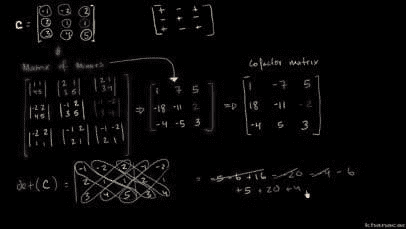
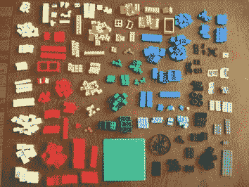
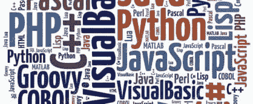

# 在急于开始数据科学之前要知道的 5 件事

> 原文：[`www.kdnuggets.com/2018/03/5-things-before-rushing-data-science.html`](https://www.kdnuggets.com/2018/03/5-things-before-rushing-data-science.html)

 评论

### 以下是我希望一年前决定开始数据科学之旅时能知道的 5 件重要事情：

**1\. 高中数学对于数据科学至关重要。**

* * *

## 我们的前 3 个课程推荐

 1\. [Google 网络安全证书](https://www.kdnuggets.com/google-cybersecurity) - 快速开启网络安全职业生涯

 2\. [Google 数据分析专业证书](https://www.kdnuggets.com/google-data-analytics) - 提升你的数据分析技能

 3\. [Google IT 支持专业证书](https://www.kdnuggets.com/google-itsupport) - 支持你的组织 IT 需求

* * *

矩阵计算、导数、特征值、集合论、函数、向量、线性变换等，对于理解统计方法和编程背后的理论至关重要。因此，在开始下一个 MOOC 或机器学习书籍之前，重新复习所有这些概念是至关重要的。大多数学校要求学生掌握这些方法才能毕业，但幸运的是，刷新或获得这些知识不会占用你太多时间。

有很多资源可以开始，但对我有效的是[《漫画线性代数指南》](https://www.amazon.com/Manga-Guide-Linear-Algebra-Guides/dp/1593274130/ref=sr_1_11?ie=UTF8&qid=1519734143&sr=8-11&keywords=the+manga+guide+to)，这本书非常简单、图文并茂，并且在深入更复杂的内容之前提供了很好的基础。

**图 1：3x3 矩阵的逆矩阵**

我的建议是安排几周时间来复习这些概念，并使用[Feynman 技巧](https://www.kdnuggets.com/2018/01/data-scientist-feynman-technique.html)以便能够用简单的术语解释每一个主题。

**2\. 尽管有很多有用的互联网资源，书籍仍然是学习的最佳工具之一。**

人们在尝试进入像数据科学这样的领域时面临的一个问题是[信息过载](https://en.wikipedia.org/wiki/Information_overload)，这个术语用来描述拥有太多资源时的影响。有数以百计的 MOOC、在线课程、专业化、视频等等，但对我们最宝贵的资源“时间”来说，最好的利用方式是选择一本书，从基础开始学习新概念，然后用其他书籍填补知识空白。

**学习数据科学**应该被视作一种积木游戏。

**图 2：乐高积木**

我相信这个类比对于学习大多数东西来说是最好的，但在我们的数据科学旅程中尤为有用：

+   首先，你需要选择你想要构建的玩具模型。

+   打开所有塑料袋，把不同的部件铺在平面上，这样你可以看到所有不同的部分。

+   了解每个部分的使用方法。学习它们的特征：维度、颜色、重量、形状。

+   开始构建小块，直到你掌握了所有的用途。

+   最后，当你按照说明手册完成了想要的模型后，把所有部件拆开，开始实验。

数据科学的每个领域中的所有技术都应该如此。学习所有的积木是什么，学习如何使用它们，然后当你想创建更复杂的东西时，寻找你没有的缺失部分。

**3\. 计算技能至关重要，不仅仅是对于数据科学，也对于未来的世界。**

直到我开始学习数据科学硕士课程，我才意识到一个通过所有博客文章、书籍和新闻已经被低声传达了一段时间的信息：

**“计算机代码占据了我们今天生活的 80%以上。”**

代码存在于我们的智能手机、网站、汽车、电视、健康系统、公共交通、商品制造等领域。

**图 3：编程语言词云**

几乎每个行业的工作/职业都直接受到某些程序的影响，这些程序能实现信息的输入、转换和打印。学习编程以及代码的工作原理不仅仅是为了制作软件、应用程序或创建一个伟大的网站。学习编程将使你有优势去理解技术如何影响我们的生活。与其责怪计算机程序“无法工作”，你现在会系统地思考并理解问题可能出在哪里。谁知道呢，也许你会从用户的角度提出改进技术的更好想法。

**4\. 你的批判性和分析能力非常重要。**

我是犯罪和问题解决类电视节目的大粉丝。例如，[《蝎子》（Scorpion）](https://en.wikipedia.org/wiki/Scorpion_(TV_series))讲述了一群天才利用技术和数学技能解决各种问题的故事。这类节目最突出的特点，除了所有的动作、笑话和英雄场景外，就是角色们用来解决各种问题的“批判性思维”。这是大多数数据科学资源中没有提到的一点。找到正确的角度来解决问题将帮助你确定不仅要使用哪些工具，还会有时带你找到最有效的解决方案。

**5\. 每个人都喜欢 TED 演讲，每个人都分享关于领导者的精彩演讲。然而，你必须准备好展示你的发现。**

有许多可视化包（seaborn、ggplot、matplotlib）和软件（tableau、excel）可以帮助创建精美的图表。因此，要避免因选择过多而感到困惑。最重要的是信息的传递方式。有时候，最简单的工具会产生清晰、相关的结果。

**相关：**

+   [新手和初级数据科学家的建议](https://www.kdnuggets.com/2017/11/chang-advice-new-junior-data-scientists.html)

+   [数据科学家：华尔街最炙手可热的职位](https://www.kdnuggets.com/2017/11/data-scientist-hottest-job-wall-street.html)

+   [如何成为数据科学家：权威指南](https://www.kdnuggets.com/2017/08/become-data-scientist-definitive-guide.html)

### 更多相关内容

+   [选择下一个数据科学工作之前要牢记的 5 件事](https://www.kdnuggets.com/2022/01/5-things-keep-mind-selecting-next-job.html)

+   [神经网络之前尝试的 10 件简单事情](https://www.kdnuggets.com/2021/12/10-simple-things-try-neural-networks.html)

+   [在学习 Transformers 之前你应该了解的概念](https://www.kdnuggets.com/2023/01/concepts-know-getting-transformer.html)

+   [数据科学最低要求：开始所需的 10 项基本技能](https://www.kdnuggets.com/2020/10/data-science-minimum-10-essential-skills.html)

+   [Google 建议你在参加他们的机器学习课程之前做些什么…](https://www.kdnuggets.com/2021/10/google-recommends-before-machine-learning-data-science-course.html)

+   [在职业转向数据科学之前请阅读此内容](https://www.kdnuggets.com/read-this-before-making-a-career-switch-to-data-science)
