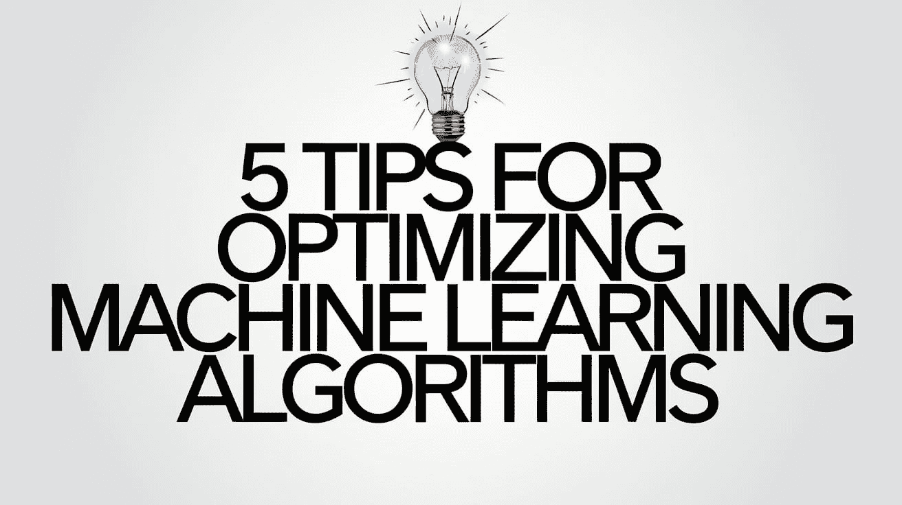

# 5 个优化机器学习算法的提示

> 原文：[`www.kdnuggets.com/5-tips-for-optimizing-machine-learning-algorithms`](https://www.kdnuggets.com/5-tips-for-optimizing-machine-learning-algorithms)

图片来源：编辑

机器学习（ML）算法是构建智能模型的关键，这些模型通过从数据中学习来解决特定任务，即进行预测、分类、检测异常等。优化机器学习模型涉及调整数据和算法，以构建更准确和高效的模型，提高其在新情况或意外情况中的表现。

* * *

## 我们的前三个课程推荐

 1\. [谷歌网络安全证书](https://www.kdnuggets.com/google-cybersecurity) - 快速进入网络安全职业。

 2\. [谷歌数据分析专业证书](https://www.kdnuggets.com/google-data-analytics) - 提升您的数据分析技能

 3\. [谷歌 IT 支持专业证书](https://www.kdnuggets.com/google-itsupport) - 支持您的组织的 IT

* * *

以下列表总结了优化机器学习算法性能的五个关键提示，特别是优化所构建的机器学习模型的准确性或预测能力。我们来看一下。

## 1\. 准备和选择正确的数据

在训练机器学习模型之前，预处理用于训练的数据是非常重要的：清理数据、去除异常值、处理缺失值，并在需要时对数值变量进行缩放。这些步骤通常有助于提高数据质量，而高质量的数据通常与高质量的机器学习模型密切相关。

此外，并非数据中的所有特征都可能与所构建的模型相关。特征选择技术有助于识别最相关的属性，这些属性将影响模型结果。仅使用这些相关特征可能有助于减少模型的复杂性，并改善其性能。

## 2\. 超参数调优

与在训练过程中学习的机器学习模型参数不同，超参数是我们在训练模型之前选择的设置，就像控制面板上的按钮或齿轮，可以手动调整。通过找到最大化模型在测试数据上性能的配置来适当地调整超参数可以显著影响模型性能：尝试不同的组合以找到最佳设置。

## 3\. 交叉验证

实施交叉验证是一种聪明的方法，可以在实际部署后提高机器学习模型的稳健性和对新见数据的泛化能力。交叉验证将数据分成多个子集或折叠，并在这些折叠上使用不同的训练/测试组合，以测试模型在不同情况下的表现，从而获得对其性能的更可靠的了解。它还减少了过拟合的风险，过拟合是机器学习中的常见问题，其中你的模型“记住”了训练数据而不是从中学习，因此当遇到即使稍微不同于其记忆实例的新数据时，它难以泛化。

## 4\. 正则化技术

继续讨论过拟合问题，有时是因为构建了过于复杂的机器学习模型。决策树模型是这一现象容易察觉的明显例子：一个深度数十层的过度生长的决策树可能比一个深度较小的简单树更容易出现过拟合。

正则化是一种非常常见的策略，用于克服过拟合问题，从而使你的机器学习模型对任何真实数据更具泛化能力。它通过调整训练过程中用于学习错误的损失函数来适应训练算法，从而鼓励“更简单的路径”朝向最终的训练模型，同时惩罚“更复杂的路径”。

## 5\. 集成方法

团结就是力量：这一历史格言是集成技术背后的原则，集成技术通过策略如自助法、提升法或堆叠法将多个机器学习模型结合在一起，能够显著提升解决方案的性能，相较于单一模型。随机森林和 XGBoost 是常见的集成技术，与许多预测问题中的深度学习模型表现相当。通过利用个体模型的优势，集成方法可以成为构建更准确且稳健预测系统的关键。

## 结论

优化机器学习算法可能是构建准确且高效模型的最重要步骤。通过关注数据准备、超参数调优、交叉验证、正则化和集成方法，数据科学家可以显著提升模型的性能和泛化能力。尝试这些技术，不仅能提高预测能力，还能帮助创建更为稳健的解决方案，以应对现实世界的挑战。

****[伊万·帕洛马雷斯·卡拉斯科萨](https://www.linkedin.com/in/ivanpc/)**** 是人工智能、机器学习、深度学习和大型语言模型领域的领导者、作家、演讲者和顾问。他培训和指导他人如何在现实世界中利用人工智能。

### 更多相关内容

+   [用遗传算法优化基因](https://www.kdnuggets.com/2022/04/optimizing-genes-genetic-algorithm.html)

+   [优化 Python 代码性能：深入探讨 Python 性能分析器](https://www.kdnuggets.com/2023/02/optimizing-python-code-performance-deep-dive-python-profilers.html)

+   [优化数据存储：探索 SQL 中的数据类型和规范化](https://www.kdnuggets.com/optimizing-data-storage-exploring-data-types-and-normalization-in-sql)

+   [优化数据分析：在 Databricks 中集成 GitHub Copilot](https://www.kdnuggets.com/optimizing-data-analytics-integrating-github-copilot-in-databricks)

+   [优化你的 LLM 性能和可扩展性](https://www.kdnuggets.com/optimizing-your-llm-for-performance-and-scalability)

+   [在使用大型语言模型时优化性能和成本的策略](https://www.kdnuggets.com/strategies-for-optimizing-performance-and-costs-when-using-large-language-models-in-the-cloud)
