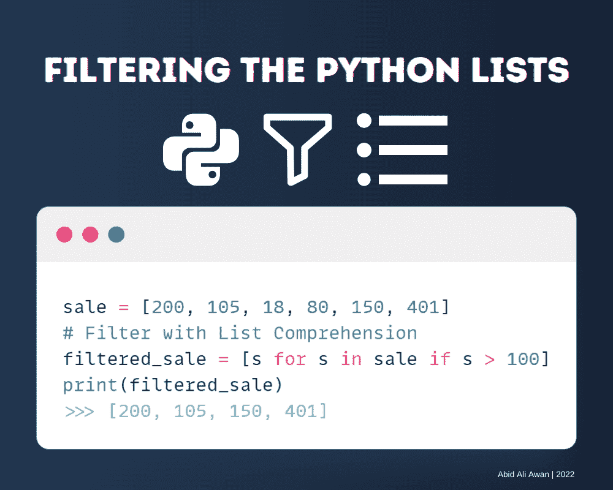

# 筛选 Python 列表的 5 种方法

> 原文：[`www.kdnuggets.com/2022/11/5-ways-filtering-python-lists.html`](https://www.kdnuggets.com/2022/11/5-ways-filtering-python-lists.html)



图片作者

在这个简短的教程中，你将学习 5 种简单的列表筛选方法。它不仅限于数据工作者，甚至网页开发人员和软件工程师也每天使用它。简而言之，筛选列表是每个 Python 程序员在开始时应该学习的基本功能。

# 1\. 使用 for 循环

通过使用 for 循环和 if-else 语句，我们将迭代列表并选择符合特定条件的元素。在我们的例子中，我们将筛选出大于或等于 100 的利润。

使用这种方法，我们创建了一个新列表，并将筛选出的值添加到新列表中。这是一种简单但效率不高的列表筛选方式。

```py
profits = [200, 400, 90, 50, 20, 150]

filtered_profits = []

for p in profits:
    if p >= 100:
        filtered_profits.append(p)

print(filtered_profits)
```

```py
[200, 400, 150]
```

# 2\. 列表推导式

列表推导式是对列表使用 for 循环和 if-else 条件的一种聪明方法。你可以将方法一转换为一行代码。这种方法很简洁。

在我们的例子中，我们对所有列表元素进行循环，并选择大于或等于 150 的分数。

编写起来很简单，你甚至可以添加多个 if-else 条件而没有问题。

通过阅读 [Python 中何时使用列表推导式](https://realpython.com/list-comprehension-python/) 来学习列表推导式的代码示例。

```py
scores = [200, 105, 18, 80, 150, 140]

filtered_scores = [s for s in scores if s >= 150]

print(filtered_scores)
```

```py
[200, 150]
```

# 3\. 模式匹配

要筛选字符串列表，我们将使用 `re.match()`。它需要字符串模式和字符串。

在我们的例子中，我们使用列表推导式通过提供正则表达式模式 “N.*” 给 `re.match()` 来筛选出以 “N” 开头的名称。

你可以通过访问 [regex101](https://regex101.com/) 来学习、构建和测试正则表达式模式。

```py
import re

students = ["Abid", "Natasha", "Nick", "Matthew"]

# regex pattern
pattern = "N.*"

# Match the above pattern using list comprehension
filtered_students = [x for x in students if re.match(pattern, x)]

print(filtered_students)
```

```py
['Natasha', 'Nick']
```

# 4\. 使用 filter() 方法

`filter()` 是一个内置的 Python 函数，用于筛选列表项。它需要一个筛选函数和列表 `filter(fn, list)`。

在我们的例子中，我们将创建一个 **filter_height** 函数。它在高度小于 150 时返回 *True*，否则返回 *False*。

之后，我们将使用 `filter()` 函数将 `filter_height` 函数应用于列表，然后返回一个筛选后的元素迭代器。你可以使用循环提取所有元素，也可以使用 `list(<iter>)` 函数将其转换为列表。

```py
def filter_height(height):
    if (height < 150):
        return True
    else:
        return False

heights = [140, 180, 165, 162, 145]
filtered_heights = filter(filter_height, heights)

print(list(filtered_heights))
```

```py
[140, 145]
```

# 5\. 使用 Lambda 函数

你可以通过使用 Lambda 函数将方法四（`filter()` 方法）转换为一行代码。

与其单独创建一个 **filter_age** 函数，不如在 `filter()` 函数中使用 Lambda 编写条件。

在我们的例子中，我们筛选出年龄大于 50 的项，并将筛选后的迭代器转换为列表。

通过阅读 [Python Lambda](https://www.w3schools.com/python/python_lambda.asp) 教程，了解更多关于 Lambda 函数的信息。

```py
ages = [20, 33, 44, 66, 78, 92]

filtered_ages = filter(lambda a: a > 50, ages)

print(list(filtered_ages))
```

```py
[66, 78, 92]
```

**[Abid Ali Awan](https://www.polywork.com/kingabzpro)** ([@1abidaliawan](https://twitter.com/1abidaliawan)) 是一位认证的数据科学专业人士，热衷于构建机器学习模型。目前，他专注于内容创作，并撰写关于机器学习和数据科学技术的技术博客。Abid 拥有技术管理硕士学位和电信工程学士学位。他的愿景是利用图神经网络为那些挣扎于心理健康问题的学生开发一个 AI 产品。

* * *

## 我们的三大课程推荐

 1\. [谷歌网络安全证书](https://www.kdnuggets.com/google-cybersecurity) - 快速进入网络安全职业生涯。

 2\. [谷歌数据分析专业证书](https://www.kdnuggets.com/google-data-analytics) - 提升您的数据分析技能

 3\. [谷歌 IT 支持专业证书](https://www.kdnuggets.com/google-itsupport) - 支持组织的 IT 需求

* * *

### 更多相关主题

+   [在 Pandas 中进行条件过滤的五种方法](https://www.kdnuggets.com/2022/12/five-ways-conditional-filtering-pandas.html)

+   [直观解释协作过滤](https://www.kdnuggets.com/2022/09/intuitive-explanation-collaborative-filtering.html)

+   [在 Python 中加载数据的 5 种不同方法](https://www.kdnuggets.com/2020/08/5-different-ways-load-data-python.html)

+   [在 Python 中处理 CSV 文件的 3 种方法](https://www.kdnuggets.com/2022/10/3-ways-process-csv-files-python.html)

+   [加速 Python 代码的 3 种简单方法](https://www.kdnuggets.com/2022/10/3-simple-ways-speed-python-code.html)

+   [使用 GPT-4o 构建 Python 项目的 3 种方法](https://www.kdnuggets.com/3-ways-of-building-python-projects-using-gpt-4o)
