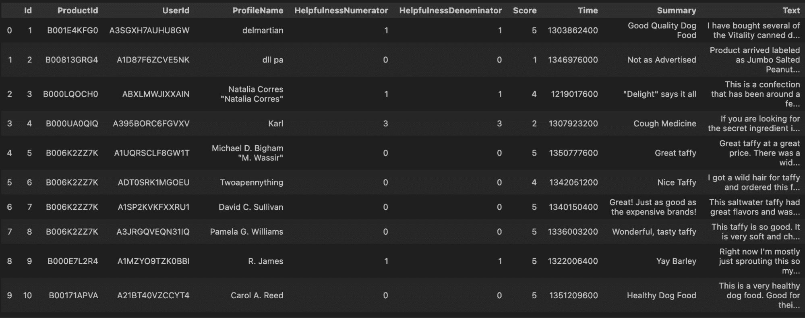
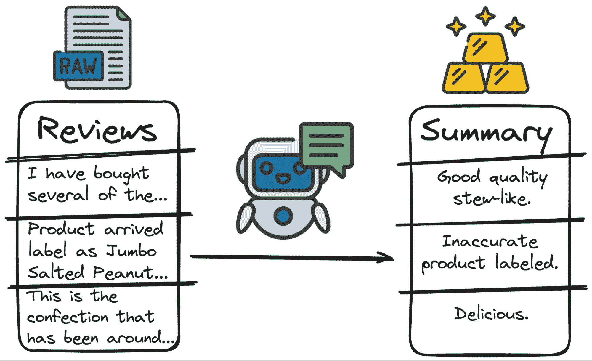
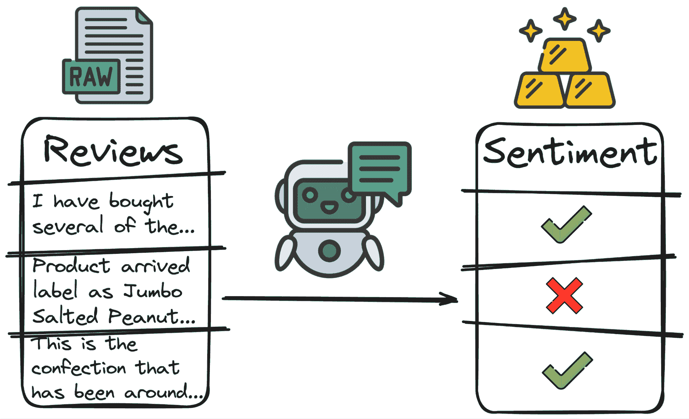
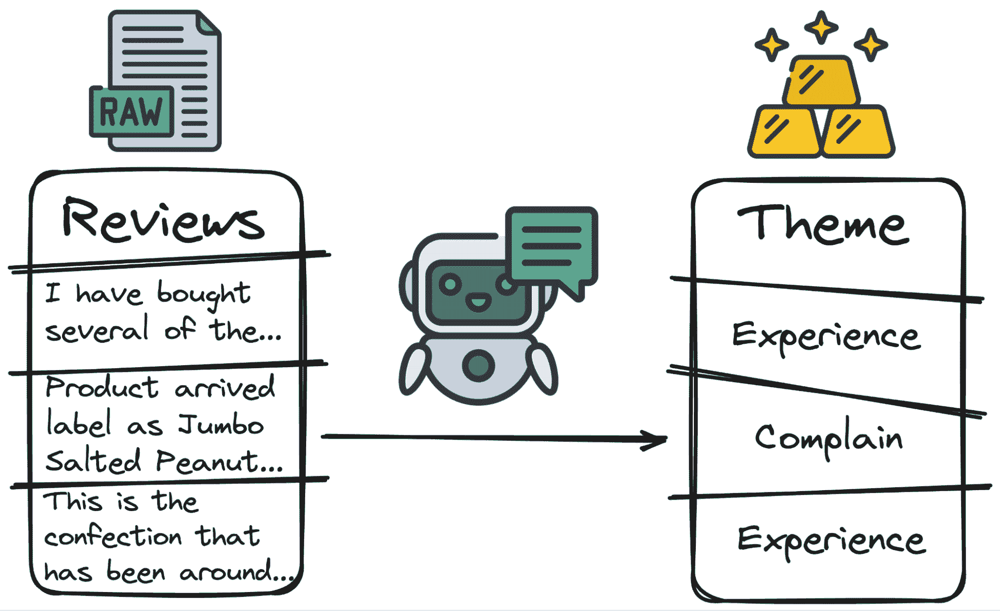
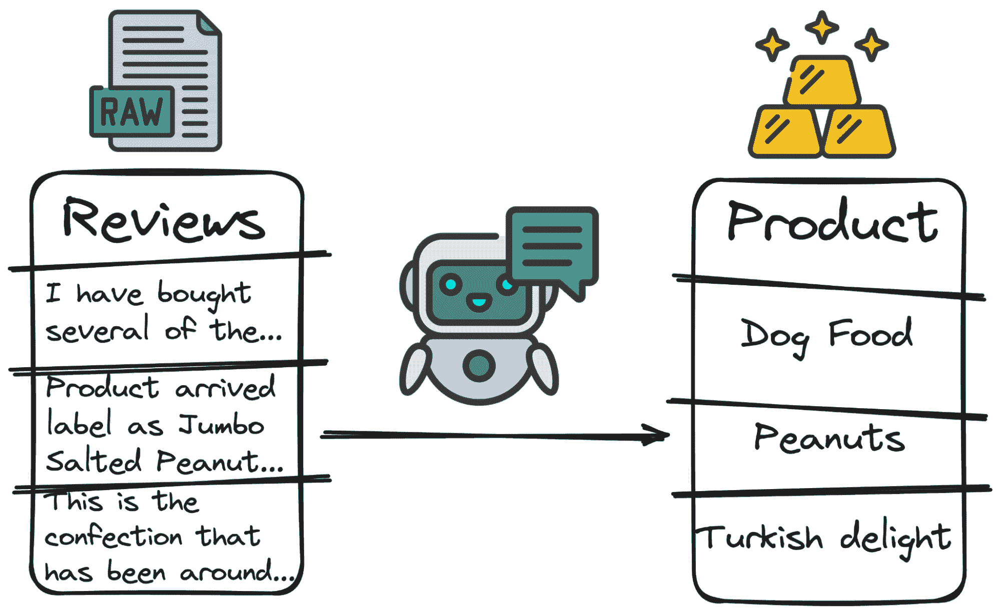

# 将非结构化数据转换为结构化见解的 5 种方法

> 原文：[`www.kdnuggets.com/5-ways-of-converting-unstructured-data-into-structured-insights-with-llms`](https://www.kdnuggets.com/5-ways-of-converting-unstructured-data-into-structured-insights-with-llms)


图片来源：作者

在今天的世界中，我们不断生成信息，但其中许多以非结构化的格式出现。

* * *

## 我们的前三个课程推荐

 1\. [谷歌网络安全证书](https://www.kdnuggets.com/google-cybersecurity) - 快速进入网络安全职业生涯。

 2\. [谷歌数据分析专业证书](https://www.kdnuggets.com/google-data-analytics) - 提升你的数据分析技能

 3\. [谷歌 IT 支持专业证书](https://www.kdnuggets.com/google-itsupport) - 支持你组织的 IT

* * *

这包括社交媒体上的大量内容，以及存储在组织网络中的无数 PDF 和 Word 文档。

从这些非结构化来源（无论是文本文件、网页还是社交媒体更新）获取见解和价值，是一个相当大的挑战。

然而，大型语言模型（LLMs）如 GPT 或 LlaMa 的出现彻底革新了我们处理非结构化数据的方式。

这些复杂的模型作为强大的工具，将非结构化数据转化为结构化的有价值信息，有效挖掘我们数字化环境中的隐藏宝藏。

让我们看看使用 GPT 提取非结构化数据见解的 4 种不同方法 👇🏻

# 为我们的挑战做准备

在本教程中，我们将使用 OpenAI 的 API。如果你还没有一个工作账户，请查看这个 [如何获取你的 OpenAI API 账户的教程](https://medium.com/forcodesake/a-step-by-step-guide-to-getting-your-api-key-2f6ee1d3e197)。

想象一下我们正在运营一个电子商务平台（在此案例中是亚马逊😉），我们需要处理用户对我们产品留下的数百万条评论。

为了展示 LLMs 处理这类数据所代表的机会，我正在使用一个 [包含亚马逊评论的 Kaggle 数据集。](https://www.kaggle.com/datasets/snap/amazon-fine-food-reviews/data)



原始数据集

# 理解挑战

结构化数据指的是格式一致且重复的数据类型。经典示例包括银行交易、航空公司预订、零售销售和电话通话记录。

这些数据通常来自事务处理过程。

这种数据由于其统一格式，非常适合存储和管理在传统的数据库管理系统中。

另一方面，文本通常被归类为非结构化数据。历史上，在文本消歧义技术发展之前，由于其不够严格的结构，将文本纳入标准数据库管理系统是具有挑战性的。

这就引出了以下问题……

> 文本真的完全没有结构吗，还是它具有一种不立即显现的潜在结构？

文本本质上具有结构，但这种复杂性与计算机可以识别的传统结构格式不一致。计算机能够解释简单、直接的结构，但语言由于其复杂的语法超出了其理解范围。

这就引出了一个最终的问题：

> 如果计算机处理非结构化数据效率低下，那么是否有可能将这些非结构化数据转换为更易处理的结构化格式？

手动转换为结构化数据是耗时的，并且具有很高的人为错误风险。它通常是各种格式的单词、句子和段落的混合，这使得机器很难理解其含义并将其结构化。

这正是 LLMs 发挥关键作用的地方。如果我们想以某种方式处理或分析数据，包括数据分析、信息检索和知识管理，将非结构化数据转换为结构化格式是至关重要的。

像 GPT-3 或 GPT-4 这样的**大型语言模型**（LLMs）提供了强大的能力来从非结构化数据中提取见解。

我们的主要工具将是 OpenAI API 和创建我们自己的提示语来定义我们需要什么。以下是四种方法，您可以利用这些模型从非结构化数据中获取结构化见解：

## 1\. 文本摘要

LLMs 可以高效地总结大量文本，例如报告、文章或长篇文档。这对于快速理解大量数据集中的关键点和主题尤其有用。

在我们的情况下，得到一个初步的评价摘要远比获得整个评价更好。因此，GPT 可以在几秒钟内处理它。

我们唯一的——也是最重要的任务——就是制定一个好的提示语。

在这种情况下，我可以告诉 GPT：

```py
Summarize the following review: \"{review}\" with a 3 words sentence.
```

那么让我们通过几行代码来实践一下吧。

由作者编写的代码

我们将得到如下结果……



由作者提供的图片

## 2\. 情感分析

这些模型可以用于情感分析，确定文本数据的语气和情感，例如客户评价、社交媒体帖子或反馈调查。

最简单但最常用的分类方式是极性。

+   积极评价或人们为何对产品感到满意。

+   消极评价或他们为何感到不满。

+   中立态度或人们对产品的不感兴趣。

通过分析这些情感，企业可以评估公众意见、客户满意度和市场趋势。因此，与其让人来为每个评论做决定，不如让我们的朋友 GPT 为我们进行分类。

所以，再次强调，主要代码将包括一个提示和对 API 的简单调用。

让我们将其付诸实践。

作者代码

我们将获得如下结果：



作者图片

## 3\. 主题分析

LLMs 可以识别和分类大型数据集中的主题或话题。这在定性数据分析中特别有用，在这种情况下，你可能需要筛选大量文本以理解常见的主题、趋势或模式。

在分析评论时，了解评论的主要目的可能会很有用。一些用户会抱怨某些问题（服务、质量、成本等），一些用户会评价他们对产品的体验（无论好坏），还有一些用户会提出问题。

再次手动完成这些工作将需要很多小时。但有了我们的朋友 GPT，只需几行代码：

作者代码



作者图片

## 4\. 关键词提取

LLMs 可以用来提取关键词。这意味着，检测我们要求的任何元素。

比如说，我们想了解附带的评论中的产品是否是用户讨论的产品。为此，我们需要检测用户正在评论的是什么产品。

再次……我们可以让我们的 GPT 模型找出用户讨论的主要产品。

那么，让我们把这些应用到实践中吧！

作者代码



作者图片

# 主要结论

总之，大型语言模型（LLMs）在将非结构化数据转化为结构化洞察方面的变革力量不可低估。通过利用这些模型，我们可以从我们数字世界中流动的庞大非结构化数据中提取有意义的信息。

讨论的四种方法——文本总结、情感分析、主题分析和关键词提取——展示了大型语言模型（LLMs）在处理各种数据挑战中的多功能性和高效性。

这些能力使组织能够更深入地了解客户反馈、市场趋势和操作效率。

**[Josep Ferrer](https://www.linkedin.com/in/josep-ferrer-sanchez)** 是一位来自巴塞罗那的分析工程师。他毕业于物理工程专业，目前在应用于人类移动性的领域从事数据科学工作。他还是一名兼职内容创作者，专注于数据科学和技术。Josep 撰写有关 AI 的所有内容，涵盖了这一领域的持续爆炸性应用。

### 更多相关内容

+   [通过 LLM 将非结构化数据转化为结构化数据](https://www.kdnuggets.com/2023/06/predibase-unstructured-structured-data-llms.html)

+   [使用 CountVectorizer 将文本文件转换为词汇计数](https://www.kdnuggets.com/2022/10/converting-text-documents-token-counts-countvectorizer.html)

+   [将 JSON 转换为 Pandas DataFrame：正确解析的方法](https://www.kdnuggets.com/converting-jsons-to-pandas-dataframes-parsing-them-the-right-way)

+   [在你的笔记本电脑上使用 LLM 的五种方式](https://www.kdnuggets.com/5-ways-to-use-llms-on-your-laptop)

+   [进入数据科学的三种可能途径](https://www.kdnuggets.com/2022/03/3-possible-ways-get-data-science.html)

+   [非结构化数据的探索性数据分析技术](https://www.kdnuggets.com/2023/05/exploratory-data-analysis-techniques-unstructured-data.html)
