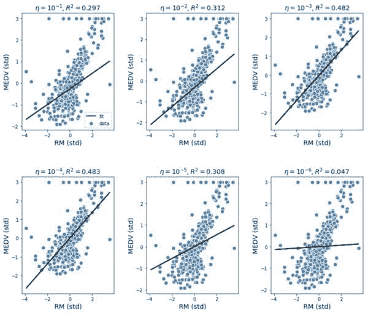

# 数据科学中的六个常见错误及如何避免

> 原文：[`www.kdnuggets.com/2020/09/6-common-data-science-mistakes.html`](https://www.kdnuggets.com/2020/09/6-common-data-science-mistakes.html)

评论

*照片由 [chuttersnap](https://unsplash.com/@chuttersnap?utm_source=medium&utm_medium=referral) 在 [Unsplash](https://unsplash.com?utm_source=medium&utm_medium=referral) 提供。*

### 介绍

在数据科学或机器学习中，我们使用数据进行描述性分析，以从数据中得出有意义的结论，或者我们可以将数据用于预测目的，建立可以对未见数据进行预测的模型。任何模型的可靠性取决于数据科学家的专业水平。构建一个机器学习模型是一回事，确保模型最优且质量最高是另一回事。本文将讨论六个常见错误，这些错误可能会对机器学习模型的质量或预测能力产生不利影响，并包含几个案例研究。

### 数据科学中的六个常见错误

在本节中，我们讨论六个常见错误，这些错误可能严重影响数据科学模型的质量。包含了几个实际应用的链接。

1.  **我们经常假设我们的数据集质量良好且可靠**

数据是任何数据科学和机器学习任务的关键。数据有不同的形式，如数值数据、分类数据、文本数据、图像数据、语音数据和视频数据。***模型的预测能力取决于用于构建模型的数据质量***。因此，在执行任何数据科学任务如探索性数据分析或构建模型之前，检查数据的来源和可靠性是极其重要的，因为即使是看似完美的数据集也可能包含错误。有几个因素可能会降低数据的质量：

+   错误数据

+   缺失数据

+   数据中的离群值

+   数据冗余

+   数据不平衡

+   数据缺乏变异性

+   动态数据

+   数据规模

欲了解更多信息，请参阅以下文章：[数据总是不完美的。](https://medium.com/towards-artificial-intelligence/data-is-always-imperfect-8611d667dd10)

根据我个人在工业数据科学项目中的经验，我的团队花了 3 个月的时间与系统工程师、电气工程师、机械工程师、现场工程师和技术员合作，才理解现有的数据集以及如何利用这些数据提出正确的问题。确保数据无误且质量高将有助于提高模型的准确性和可靠性。

1.  **不要专注于使用整个数据集**

有时作为一个数据科学初学者，当你需要处理一个数据科学项目时，你可能会被诱惑使用提供的整个数据集。然而，如上所述，数据集可能存在若干缺陷，如异常值、缺失值和冗余特征。如果你的数据集中存在缺陷的数据部分非常小，你可以简单地从数据集中删除这些不完美的数据子集。然而，如果不适当数据的比例显著，则可以使用数据插补技术来近似缺失数据。

在实施机器学习算法之前，有必要只选择训练数据集中相关的特征。将数据集转化为只选择训练所需的相关特征的过程称为降维。特征选择和降维很重要，主要有三个原因：

**a) 防止过拟合**：一个具有过多特征的高维数据集有时可能导致过拟合（模型捕捉到真实和随机效应）。

**b) 简洁性**：一个特征过多的过于复杂的模型可能难以解释，特别是当特征之间相关时。

**c) 计算效率**：在低维数据集上训练的模型计算效率高（算法执行所需的计算时间更少）。

有关降维技术的更多信息，请参阅以下文章：

+   [使用协方差矩阵图进行特征选择和降维](https://medium.com/towards-artificial-intelligence/feature-selection-and-dimensionality-reduction-using-covariance-matrix-plot-b4c7498abd07)

+   [机器学习：通过主成分分析进行降维](https://medium.com/towards-artificial-intelligence/machine-learning-dimensionality-reduction-via-principal-component-analysis-1bdc77462831)

使用降维技术去除特征之间的不必要相关性可能有助于提高你的机器学习模型的质量和预测能力。

1.  **在使用数据进行模型构建之前对数据进行缩放**

缩放你的特征将有助于提高模型的质量和预测能力。例如，假设你希望建立一个模型来预测目标变量*信用度*，基于预测变量如*收入*和*信用评分*。由于信用评分的范围从 0 到 850，而年收入的范围可能从 25,000 美元到 500,000 美元，如果不对特征进行缩放，模型将会偏向于*收入*特征。这意味着与*收入*参数相关的权重因子将非常小，这将导致预测模型仅仅基于*收入*参数来预测*信用度*。

为了将特征缩放到相同的尺度，我们可以选择对特征进行标准化或归一化。通常情况下，我们假设数据呈正态分布，并默认使用标准化，但这并非总是如此。在决定使用标准化还是归一化之前，重要的是先查看特征的统计分布。如果特征趋向于均匀分布，则可以使用归一化（*MinMaxScaler*）。如果特征大致呈高斯分布，则可以使用标准化（*StandardScaler*）。再次注意，无论你使用归一化还是标准化，这些方法都是近似的，并且会对模型的总体误差产生影响。

1.  **调整模型中的超参数**

在模型中使用错误的超参数值可能导致模型非最优且质量较低。重要的是你需要对所有超参数进行训练，以确定性能最佳的模型。模型的预测能力如何依赖于超参数的一个很好的示例可以在下面的图中找到（来源：[差劲与优秀的回归分析](https://medium.com/towards-artificial-intelligence/bad-and-good-regression-analysis-700ca9b506ff)）。

**图 1**。使用不同学习率参数进行回归分析。来源：[差劲与优秀的回归分析](https://medium.com/towards-artificial-intelligence/bad-and-good-regression-analysis-700ca9b506ff)，发布于 Towards AI，2019 年 2 月，由 Benjamin O. Tayo 编写。

请记住，使用默认超参数并不总能得到最佳模型。有关超参数的更多信息，请参见本文：[机器学习中的模型参数和超参数 — 有什么区别](https://towardsdatascience.com/model-parameters-and-hyperparameters-in-machine-learning-what-is-the-difference-702d30970f6)。

1.  **比较不同算法**

在选择最终模型之前，比较几个不同算法的预测能力是很重要的。例如，如果你正在构建一个***分类模型***，你可以尝试以下算法：

+   逻辑回归分类器

+   支持向量机（SVM）

+   决策树分类器

+   K-最近邻分类器

+   朴素贝叶斯分类器

如果你正在构建一个***线性回归模型***，你可以比较以下算法：

+   线性回归

+   K-邻近回归（KNR）

+   支持向量回归（SVR）

有关比较不同算法的更多信息，请参阅以下文章：

+   [线性回归与 KNN 回归的比较研究](https://medium.com/towards-artificial-intelligence/a-comparative-study-of-linear-and-knn-regression-a31955e6263d)

+   [机器学习过程教程](https://medium.com/swlh/machine-learning-process-tutorial-222327f53efb)

1.  **量化模型中的随机误差和不确定性**

每个机器学习模型都有固有的随机误差。这种误差源于数据集的固有随机特性；源于在模型构建过程中数据集被划分为训练集和测试集的随机方式；或者源于目标列的随机化（用于检测过拟合的方法）。始终量化随机误差对模型预测能力的影响是非常重要的。这将有助于提高模型的可靠性和质量。有关随机误差量化的更多信息，请参见以下文章：[机器学习中的随机误差量化](https://medium.com/towards-artificial-intelligence/random-error-quantification-in-machine-learning-846f6e78e519)。

### 总结

总结来说，我们讨论了六个常见的错误，这些错误可能影响机器学习模型的质量或预测能力。始终确保你的模型是最佳的且质量最高是非常有用的。避免上述讨论的错误可以帮助数据科学爱好者构建可靠和值得信赖的模型。

**相关：**

+   [数据质量评估并非全是美好。你应该意识到哪些挑战？](https://www.kdnuggets.com/2019/09/data-quality-assessment-challenges.html)

+   [必须知道：大数据常见的数据质量问题及其处理方法](https://www.kdnuggets.com/2017/05/must-know-common-data-quality-issues-big-data.html)

+   [数据科学家认为数据是他们的头号问题。这就是他们错在哪里。](https://www.kdnuggets.com/2020/09/data-scientist-data-problem-wrong.html)

### 更多相关话题

+   [5 个常见的数据科学错误及如何避免](https://www.kdnuggets.com/5-common-data-science-mistakes-and-how-to-avoid-them)

+   [避免这些每个 AI 初学者都会犯的 5 个常见错误](https://www.kdnuggets.com/avoid-these-5-common-mistakes-every-novice-in-ai-makes)

+   [5 个常见的 Python 问题（及如何避免）](https://www.kdnuggets.com/5-common-python-gotchas-and-how-to-avoid-them)

+   [新手数据科学家应避免的错误](https://www.kdnuggets.com/2022/06/mistakes-newbie-data-scientists-avoid.html)

+   [对话式 AI 开发中的 3 个关键挑战及如何避免](https://www.kdnuggets.com/3-crucial-challenges-in-conversational-ai-development-and-how-to-avoid-them)

+   [10 个最常见的数据质量问题及其解决方法](https://www.kdnuggets.com/2022/11/10-common-data-quality-issues-fix.html)
