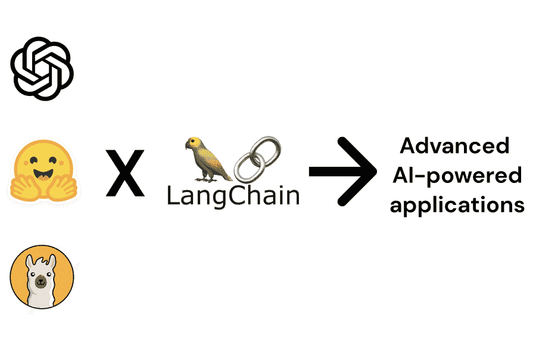
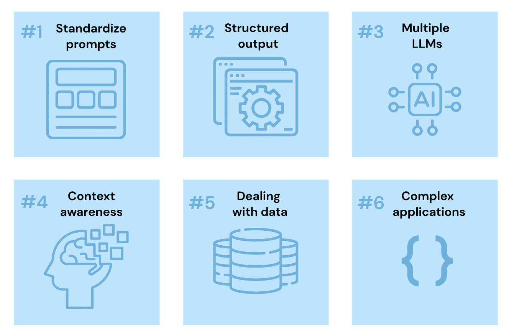

# LangChain 尝试评估的 6 个 LLM 问题

> 原文：[`www.kdnuggets.com/6-problems-of-llms-that-langchain-is-trying-to-assess`](https://www.kdnuggets.com/6-problems-of-llms-that-langchain-is-trying-to-assess)



图片由作者提供

* * *

## 我们的前三个课程推荐

 1\. [Google 网络安全证书](https://www.kdnuggets.com/google-cybersecurity) - 快速入门网络安全职业。

 2\. [Google 数据分析专业证书](https://www.kdnuggets.com/google-data-analytics) - 提升你的数据分析技能

 3\. [Google IT 支持专业证书](https://www.kdnuggets.com/google-itsupport) - 支持你的组织的 IT

* * *

在不断发展的技术领域，大型语言模型（LLMs）的兴起堪称一场革命。像 ChatGPT 和 Google BARD 这样的工具位于前沿，展示了数字互动和应用开发的可能艺术。

ChatGPT 等模型的成功激发了公司对这些先进语言模型的兴趣激增。

然而，LLMs 的真正力量不仅仅在于它们的单独能力。

当 LLMs 与额外的计算资源和知识库集成时，它们的潜力得到了放大，创造出不仅智能且语言能力强大的应用程序，还丰富地依赖数据和处理能力。

而这种集成正是 LangChain 尝试评估的内容。

Langchain 是一个创新的框架，旨在释放 LLMs 的全部能力，实现与其他系统和资源的顺畅共生。它是一个赋予数据专业人员构建既智能又具上下文意识的应用程序的工具，利用今天广阔的信息和计算资源。

它不仅仅是一个工具，它是一个变革性的力量，正在重塑技术格局。

这引出了以下问题：

LangChain 将如何重新定义 LLMs 能够实现的边界？

跟随我，让我们一起探索所有内容。

# 什么是 LangChain？

LangChain 是一个围绕 LLMs 构建的开源框架。它为开发人员提供了一整套工具、组件和接口，简化了 LLM 驱动应用程序的架构。

然而，它不仅仅是另一个工具。

与 LLMs 一起工作有时感觉像是试图将方形 peg 放入圆形孔中。

有一些常见的问题，我敢打赌你们大多数人已经亲身经历过：

+   如何标准化提示结构。

+   如何确保 LLM 的输出可以被其他模块或库使用。

+   如何轻松切换不同的 LLM 模型。

+   如何在需要时保持某种记忆记录。

+   如何处理数据。

所有这些问题引出了以下问题：

> 如何开发一个复杂的应用程序，同时确保 LLM 模型按预期行为。

提示充满了重复的结构和文本，响应像幼儿的游乐场一样无结构，而这些模型的记忆？我们可以说，远远不如大象。

所以……我们如何与它们合作？

尝试使用 AI 和 LLM 开发复杂应用程序可能是一个完全的头痛问题。

这就是 LangChain 作为问题解决者的角色。

从本质上讲，LangChain 由几个巧妙的组件组成，这些组件允许你轻松地将 LLM 集成到任何开发中。

LangChain 因其能够通过赋予强大的大型语言模型记忆和上下文来增强其能力而激发了热情。这一附加功能使得模拟“推理”过程成为可能，从而能够更精确地处理更复杂的任务。

对于开发人员来说，LangChain 的吸引力在于其创新的方法来创建用户界面。用户无需依赖传统的拖放或编码方法，而是可以直接表达他们的需求，界面则根据这些请求进行构建。

这是一个旨在为软件开发人员和数据工程师提供超级动力的框架，能够无缝地将 LLM 集成到他们的应用程序和数据工作流程中。

这就引出了以下问题……

# LangChain 如何尝试解决所有这些问题？

了解当前 LLM 存在 6 个主要问题后，我们现在可以看看 LangChain 如何尝试评估这些问题。



图片由作者提供

## 1\. 提示现在过于复杂

让我们回顾一下，提示的概念在过去几个月里是如何迅速发展的。

一切始于一个简单的字符串，描述了一个容易执行的任务：

```py
Hey ChatGPT, can you please explain to me how to plot a scatter chart in Python?
```

然而，随着时间的推移，人们意识到这过于简单。我们没有为 LLM 提供足够的上下文来理解其主要任务。

今天，我们需要告诉任何 LLM 的不仅仅是描述要完成的主要任务。我们必须描述 AI 的高级行为、写作风格，并包括确保答案准确的指令。还有其他任何细节，以便为我们的模型提供更具上下文的指令。

所以今天，我们不再使用最初的提示，而是提交更类似于：

```py
Hey ChatGPT, imagine you are a data scientist. You are good at analyzing data and visualizing it using Python. 
Can you please explain to me how to generate a scatter chart using the Seaborn library in Python
```

对吧？

然而，正如你们大多数人已经意识到的，我可以请求不同的任务，但仍保持 LLM 的相同行为。这意味着提示的大部分内容可以保持不变。

这就是为什么我们应该能够只写一次这一部分，然后将其添加到任何需要的提示中。

LangChain 通过提供提示模板来解决重复文本问题。

这些模板将你任务所需的具体细节（如准确要求散点图）与通常的文本（如描述模型的高层次行为）混合在一起。

所以我们最终的提示模板将是：

```py
Hey ChatGPT, imagine you are a data scientist. You are good at analyzing data and visualizing it using Python. 
Can you please explain to me how to generate a <type of="" chart=""> using the <python library=""> library in Python?</python></type>
```

有两个主要的输入变量：

+   图表类型

+   python 库

## 2\. 响应本质上是无结构的

我们人类很容易解读文本，这就是为什么当与像 ChatGPT 这样的 AI 驱动聊天机器人对话时，我们可以轻松处理纯文本。

然而，当将这些相同的 AI 算法用于应用或程序时，这些回答应该以特定格式提供，比如 CSV 或 JSON 文件。

再次，我们可以尝试制作复杂的提示，要求特定的结构化输出。但我们不能百分之百确定这个输出会以对我们有用的结构生成。

这就是 LangChain 的输出解析器发挥作用的地方。

这个类允许我们解析任何 LLM 响应并生成一个结构化的变量，便于使用。忘记要求 ChatGPT 用 JSON 回答你，LangChain 现在允许你解析输出并生成自己的 JSON。

## 3\. LLM 没有记忆——但某些应用可能需要记忆。

现在想象一下你正在和一个公司的问答聊天机器人对话。你发送了详细的需求描述，聊天机器人回答正确，但经过第二次迭代……一切都消失了！

这几乎就是通过 API 调用任何 LLM 时发生的情况。当使用 GPT 或其他用户界面的聊天机器人时，AI 模型会在我们转到下一轮时立即忘记对话的任何部分。

它们没有任何或几乎没有内存。

这可能导致令人困惑或错误的答案。

正如你们大多数人已经猜到的那样，LangChain 再次准备好来帮助我们。

LangChain 提供了一个名为 memory 的类。它允许我们保持模型的上下文感知，无论是保持整个聊天历史还是仅仅是一个总结，以免产生错误回复。

## 4\. 为什么选择一个单一的 LLM，当你可以拥有它们所有？

我们都知道 OpenAI 的 GPT 模型仍然处于 LLM 的范畴。然而……还有许多其他选择，比如 Meta 的 Llama、Claude 或 Hugging Face Hub 的开源模型。

如果你只为一个公司的语言模型设计程序，你就会被困在他们的工具和规则中。

直接使用单一模型的原生 API 会使你完全依赖于它们。

想象一下，如果你用 GPT 构建了应用程序的 AI 功能，但后来发现你需要加入一个使用 Meta 的 Llama 更好评估的功能。

你将被迫从头开始……这一点一点都不好。

LangChain 提供了一个名为 LLM 类的工具。可以将其视为一个特殊工具，使得从一个语言模型切换到另一个语言模型，或在你的应用中同时使用多个模型变得容易。

这就是为什么直接使用 LangChain 开发可以让你同时考虑多个模型。

## 5\. 向 LLM 传递数据是棘手的

像 GPT-4 这样的语言模型通过大量的文本进行训练。这就是为什么它们本质上处理文本。然而，当涉及到处理数据时，它们通常会遇到困难。

为什么？你可能会问。

可以区分两个主要问题：

+   在处理数据时，我们首先需要了解如何存储这些数据，以及如何有效选择我们想要展示给模型的数据。LangChain 通过使用称为索引的工具来解决这个问题。这些索引允许你从不同的地方如数据库或电子表格中引入数据，并将其设置好，以便逐步发送给人工智能。

+   另一方面，我们需要决定如何将数据放入你提供给模型的提示中。最简单的方法是将所有数据直接放入提示中，但也有更聪明的方法可以做到这一点。

在第二种情况下，LangChain 具有一些特殊工具，这些工具使用不同的方法将数据提供给人工智能。无论是使用直接的 Prompt stuffing，将整个数据集直接放入提示中，还是使用更先进的选项，如 Map-reduce、Refine 或 Map-rerank，LangChain 简化了我们将数据传递给任何 LLM 的方式。

## 6\. 标准化开发接口

将 LLM 融入更大的系统或工作流程总是很棘手。例如，你可能需要从数据库中获取一些信息，将其提供给人工智能，然后在系统的其他部分使用人工智能的回答。

LangChain 对于这些类型的设置具有特殊功能。

+   链接就像是将不同步骤以简单、直线的方式联系在一起的字符串。

+   代理变得更聪明，可以根据人工智能的反馈做出下一步的选择。

LangChain 通过提供标准化的接口简化了这一过程，简化了开发流程，使集成和链式调用 LLM 和其他工具变得更容易，从而提升了整体开发体验。

# 结论

从本质上讲，LangChain 提供了一系列工具和功能，使得通过解决提示编写、响应结构化和模型集成的复杂性，开发与 LLM 相关的应用变得更加容易。

LangChain 不仅仅是一个框架，它在数据工程和 LLM 的世界中是一个颠覆性的变革者。

它是人工智能复杂且经常混乱的世界与数据应用中所需的结构化、系统化方法之间的桥梁。

当我们结束这次探索时，有一点是明确的：

LangChain 不仅在塑造 LLM 的未来，它还在塑造技术本身的未来。

**[Josep Ferrer](https://www.linkedin.com/in/josep-ferrer-sanchez)** 是一位来自巴塞罗那的分析工程师。他毕业于物理工程专业，目前在应用于人类移动性的领域从事数据科学工作。他还是一位兼职内容创作者，专注于数据科学和技术。Josep 撰写有关人工智能的所有内容，涵盖了该领域持续爆炸的应用。

### 更多相关内容

+   [LangChain + Streamlit + Llama：将对话 AI 带到你的本地机器](https://www.kdnuggets.com/2023/08/langchain-streamlit-llama-bringing-conversational-ai-local-machine.html)

+   [LangChain 101：构建你自己的 GPT 驱动应用程序](https://www.kdnuggets.com/2023/04/langchain-101-build-gptpowered-applications.html)

+   [通过 LangChain 转变 AI：文本数据的游戏规则改变者](https://www.kdnuggets.com/2023/08/transforming-ai-langchain-text-data-game-changer.html)

+   [LangChain 备忘单](https://www.kdnuggets.com/2023/08/langchain-cheat-sheet.html)

+   [如何让大型语言模型与你的软件和谐共处](https://www.kdnuggets.com/how-to-make-large-language-models-play-nice-with-your-software-using-langchain)

+   [LangChain 与 LlamaIndex 的比较分析](https://www.kdnuggets.com/comparative-analysis-of-langchain-and-llamaindex)
