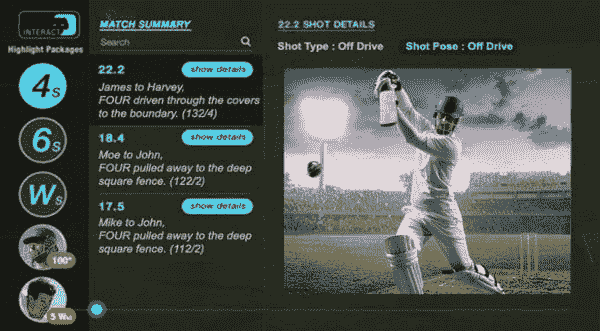

# 7 个人工智能应用案例正在改变实时体育制作和分发

> 原文：[`www.kdnuggets.com/2020/01/7-ai-use-cases-transforming-live-sports-production-distribution.html`](https://www.kdnuggets.com/2020/01/7-ai-use-cases-transforming-live-sports-production-distribution.html)

评论

**由 [Adrish Bera](https://www.linkedin.com/in/adrishbera/), Prime Focus Technologies 提供**

今天，先进的人工智能（AI）和机器学习（ML）解决方案能够识别特定的游戏对象、结构、球员、事件和动作。这有助于近乎实时的内容发现，并帮助体育制作人员即使在比赛进行时也能自动创建体育高光包。体育迷总是希望找到新的方式来与体育互动，使他们更接近实时动作。现代 AI 和 ML 技术提供了一些真正沉浸式的体验，满足了球迷的需求。

以下是 7 个强大的 AI 驱动应用案例，适用于线性电视和 OTT 应用，正在改变实时体育制作的格局：

**1\. 体育档案的编目、发现和搜索以辅助讲故事**

利用 AI 驱动的自动内容识别，比赛内容按段标记。这使得实时比赛以及整个体育档案可以由游戏制作人员搜索每一个可能的动作和戏剧性事件。

**2\. 自动高光包创建**

一旦内容被自动和全面标记，机器可以根据预定义和自动学习的规则剪辑高光包。

**3\. 互动电视体验**

广播公司可以为机顶盒提供商或有线运营商提供动态比赛内容、引人入胜的故事和高光片段。这些片段可以叠加在实时内容上，作为额外内容，通过遥控设备的“主动电视”按钮进行访问。

图 1：关键事件、视频点播高光包（例如 5 次击球、击球手的里程碑等）可以通过“主动电视”按钮进行通知。

**4\. OTT 应用的视频通知**

用户在比赛的关键事件发生（如板球的 4 分、6 分、击球、足球的进球）后会自动收到通知。他们可以通过单击播放这些视频。

**5\. OTT 应用上的视频评分卡**

AI 生成的视频片段可以添加到评分卡或评论文本流中。这使得枯燥的文本评分卡和评论变得生动有趣。

图 2：OTT 应用的视频通知和视频评分卡

**6\. 沉浸式 OTT 体验**

利用 AI 引擎提取的游戏数据可以叠加在视频上，提供类似“亚马逊 X-Ray”的体验。用户可以更详细地探索游戏的不同方面，而无需妥协实时观看体验。

**7\. OTT 应用的个性化播放列表和搜索**

用户可以在比赛进行时享受自动策划的精彩片段包或播放列表。他们可以使用自由文本搜索功能查找比赛事件，也可以生成自己的个性化播放列表。

图 3：比赛的自动生成精彩片段包可以作为覆盖层显示在 OTT 视频播放器上。用户可以即时查看镜头细节或搜索比赛中的任何事件。

### **用例的交付方式**

为了交付上述强大的体验，我们需要能够全面、准确且快速地识别和标记体育事件。标签越细致，下游用例越丰富。如今，体育制作人试图通过部署一支实时观看比赛并每分钟猛烈标记关键属性的操作员队伍来实现这一目标。然后，还有许多编辑人员会搜索这些标签并组装精彩片段。这种操作不可扩展，因此观众最终只能看到有限种类的精彩片段，有时甚至在实际动作发生数小时后才能看到。

人工智能和机器学习极大地改变了局面——通过提供所需的准确性、多样性、速度和规模。人工智能可以快速检测动作，并在几秒钟内创建一套详尽的精彩片段，以从数百个不同的角度观看比赛。

### **体育中的机器学习**

机器学习基于这样一个前提：机器需要大量的训练数据来构建分类算法。一旦算法建立，它就可以使用新的数据集（测试数据）来预测结果。根据这一逻辑，如果我们给机器大量某项运动的录像，它应该开始理解该运动的动作。然而，现实情况却大相径庭，因为每项运动都复杂且独特。即使是没有经验的成年人，如果仅仅让他/她看成千上万小时的比赛录像，也无法解读像板球这样的比赛。

因此，我们需要将基本的游戏逻辑和规则进行编码，并在一个专注的上下文中应用机器学习，以便机器模仿人类的认知。让我们以板球为例来更好地理解这一点。在观看板球比赛时，我们通过比赛内容中的不同元素来解读和欣赏比赛。这些元素包括：1）我们对比赛动作的知识，如投球、接球、裁判信号等；2）屏幕上的图形告诉我们得分亮点和比赛的当前状态；3）来自体育场的声音，如球击中球棒的声音、掌声、呼吁等；4）专家评论。

图 4：人工智能模拟人类识别以辨别比赛

为了帮助机器像人类一样理解比赛，我们需要基于这些多样化的输入建立一个模型。通常，我们会部署不同类型的神经网络以及计算机视觉技术，以解读上述四个元素的各个方面。多种分类和认知引擎被同时使用，以“辨别”比赛的不同视角。

为了训练这些引擎，我们需要筛选数百小时的比赛录像，注释不同的帧、物体、动作等，并生成机器学习的训练数据。然后，这些认知引擎会结合游戏逻辑和对体育制作的理解，将比赛逐段分类。例如，对于板球，我们部署了超过 11 个这样的引擎，以提取每个球的 25+属性，包括击球手、非击球手、投球手、得分、击球类型、四分、六分、重播、观众兴奋程度、庆祝、出局、投球类型、球的概况等。

### **搜索与发现**

为了使单场比赛的档案或录像可以被检索，AI 生成的元数据应该成为使用像 Elastic Search 这样的高级语义搜索引擎的搜索索引的一部分。帮助提供更精确搜索结果的技术包括自然语言处理（NLP）、关键实体识别、词干提取、同义词、模糊逻辑和重复项移除。

### **精彩片段制作**

一旦 AI 引擎彻底分类了比赛，下一个挑战是创建即时的精彩片段包，捕捉比赛的关键事件和戏剧性。对于观众而言，兴奋程度通常在比赛的高潮时达到顶点。例如，在足球比赛中，这可能是在进球或错失进球的时候。视觉线索如裁判/裁判员的信号或屏幕上的文字覆盖也表示关键事件。精彩片段制作引擎可以利用这些高潮和属性来创建一个简单的精彩片段包。

但制作引人入胜的精彩片段涉及更多内容。例如，一个好的板球比赛精彩集锦不仅仅是四分、六分和出局的组合。人类编辑巧妙地剪辑出一个捕捉悬念、幽默、戏剧性的包，并讲述一个引人入胜的故事。如果一个击球手在出局前被击中了几次，编辑会展示所有三球——而不仅仅是最后一球。其他元素如比赛剪辑、赛前仪式、球员入场、掷币等也需要学习并包含在精彩片段中。

AI 生成的精彩片段是使用从过去的比赛精彩片段制作中构建的可学习业务规则创建的。这些规则需要随着时间的推移不断改进，因为引擎会学习什么效果更好，什么效果不好。这些规则基于每场比赛段落的全面属性/标签。类似于人类编辑，机器也可以引入基于 AI 的音频平滑、两个片段之间的场景过渡、流畅的评论剪辑等，从而使人类编辑只需付出最少的努力进行质量检查（QC）和修整。

### **技术和物流挑战**

没有两项运动是相同的。鉴于每项运动的复杂性，制作人员不能使用 Google、微软和 IBM Watson 等第三方视频识别引擎来标记内容、发现有意义的片段或创建精彩片段。需要建立和训练定制模型，以有效标记体育内容。此外，还需要为特定运动建立特定模型 - 包括游戏逻辑、专家方法和历史学习。这是一个繁琐的过程，但任何试图创建通用运动模型的尝试都可能失败。

每项运动的制作方式也各不相同。例如，在足球中，向球门移动的镜头通过不同的相机角度组合展示长镜头和特写镜头。对于板球或棒球，镜头尽量将球保持在画面的中央，而击球手正在击球。我们需要用这些细微差别和制作技术的特定知识来训练我们的引擎。

如今，制作人员需要迅速将精彩片段发布到 Facebook、Twitter 和 YouTube 等平台，因此他们需要快速进行游戏标记和精彩片段生成。具备本地和云托管能力的 AI 引擎可以帮助实现所需的速度。

### **人工智能下的体育制作未来已经到来**

如今，观众期望以更加亲密和个性化的方式参与游戏。应用和采用 AI/ML 是实现这些期望的唯一途径。没有捷径。必须部署特定运动的 AI 主导的定制模型，并经过数月的微调以达到预期结果。像所有其他领域一样，AI 最终将帮助自动化日常任务，使人力资源可以将精力集中在更具创造性的追求上。

**简介: [Adrish Bera](https://www.linkedin.com/in/adrishbera/)** 是 Prime Focus Technologies (PFT) 的 SVP - 在线视频平台、人工智能和机器学习 - 通过 AI 和 ML 为媒体和娱乐行业建立尖端的视频认知能力，以实现规模化的自动化和效率。在 PFT 之前，Adrish 是 Apptarix 的首席执行官及共同创始人，Apptarix 是社交 OTT 平台 TeleTango 的创始公司。Adrish 是一位拥有 20 年移动软件和电信行业经验的资深人士，涵盖了从端到端的产品管理、产品开发和软件工程。他也是一位技术博主，对技术营销、智能手机、新兴市场、社交媒体和数字广告有广泛兴趣。

**相关内容:**

+   能源和公用事业中前 10 名数据科学应用案例

+   市场营销中前 8 名数据科学应用案例

+   使用时间序列编码发现棒球历史上最有趣的赛季

* * *

## 我们的前三大课程推荐

 1\. [谷歌网络安全证书](https://www.kdnuggets.com/google-cybersecurity) - 快速开启网络安全职业生涯

 2\. [谷歌数据分析专业证书](https://www.kdnuggets.com/google-data-analytics) - 提升你的数据分析技能

 3\. [谷歌 IT 支持专业证书](https://www.kdnuggets.com/google-itsupport) - 支持组织的 IT 工作

* * *

### 更多相关主题

+   [将机器学习算法完整部署到生产环境中的全过程](https://www.kdnuggets.com/2021/12/deployment-machine-learning-algorithm-live-production-environment.html)

+   [如何使用 Python 确定最佳拟合数据分布](https://www.kdnuggets.com/2021/09/determine-best-fitting-data-distribution-python.html)

+   [正态分布综合指南](https://www.kdnuggets.com/2022/06/comprehensive-guide-normal-distribution.html)

+   [NoSQL 数据库及其使用案例](https://www.kdnuggets.com/2023/03/nosql-databases-cases.html)

+   [AI 和 LLM 使用案例中的向量数据库](https://www.kdnuggets.com/vector-databases-in-ai-and-llm-use-cases)

+   [企业中的机器学习：使用案例与挑战](https://www.kdnuggets.com/2022/08/dss-machine-learning-enterprise-cases-challenges.html)
