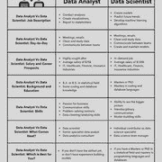
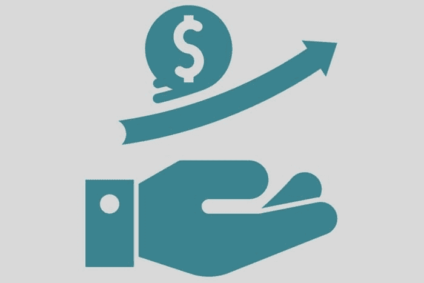

# 数据分析师与数据科学家之间的 7 个区别

> 原文：[`www.kdnuggets.com/2021/09/7-differences-between-data-analyst-data-scientist.html`](https://www.kdnuggets.com/2021/09/7-differences-between-data-analyst-data-scientist.html)

评论

**作者：[Zulie Rane](http://www.stratascratch.com/)，自由撰稿人和编码爱好者**

*剧透：差距是$30k。*

成为数据分析师与数据科学家有什么好处？数据分析师与数据科学家的主要区别是什么？它们是同一工作吗？哪个职位，数据分析师还是数据科学家，薪资更高？你到底是怎么进行数据科学的呢？

自从《哈佛商业评论》称数据科学家是十年来最性感的工作以来，大多数人都听说过这个职位。数据分析师没有受到这样的称赞。

（如果你是或想成为数据分析师，我依然认为这是一个很性感的工作。）

数据分析师和数据科学家的主要区别在于他们如何处理数据。数据分析师做的就是名字所暗示的——她查看数据，尝试预测趋势，制作可视化，并传达结果。换句话说，数据分析师分析数据。

数据科学家的职位描述可能更难确定，因为你不能像分析数据那样直接“科学化”数据。然而，我们可以安全地说，数据科学家负责设计和构建新的数据模型。他们创建原型、算法和预测模型。

不过，在数据分析师与数据科学家的韦恩图中有很多重叠之处！例如，数据分析师和数据科学家都花费大量时间将数据整理成适合分析或研究的状态。

这还不仅仅是这些，所以你很幸运。这篇文章将详细探讨数据分析师与数据科学家之间的细微差别，旨在帮助你决定哪个更适合你。我将介绍典型背景、从事这些领域的工作感受、所需的技能和工具，以及最终如何选择最适合你的工作。

让我们深入了解一下吧。

## 1\. 数据分析师与数据科学家：职位描述

首先，我们来高层次地描述一下数据科学家职位与数据分析师职位之间的区别。我通过谷歌搜索数据科学家职位描述和数据分析师职位描述，发现这些区别大致符合你对这些标题的预期。

数据科学家的职位描述通常包括机器学习、算法和自动化。大多数数据科学家的职位描述还包括使用可视化工具和统计技术来识别数据中的模式。

与此同时，数据分析师的职位描述通常是进行分析并从数据中开发可视化。主要责任是与公司内部其他团队沟通，以从数据中获取见解。如果你细心观察，你会发现这听起来非常像数据科学家职位描述的后半部分。

两种职位描述都涉及统计分析和将结果传达给利益相关者；数据科学家与数据分析师的区别仅在于，数据科学家多了一些创建发现这些见解的方法的工作。

## 2\. 数据分析师与数据科学家：日常工作

让我们来比较一下数据分析师和数据科学家的任务、工具和工作流程。

数据科学家的典型一天通常包括会议、项目报告、检查电子邮件和创建模型。Gartner 的全球机器学习团队负责人 Andriy Burkov，[表示](https://2017/11/day-life-data-scientist.html)他还帮助团队成员改进当前模型和训练示例，以解决模型中的问题。这还涉及大量的数据清理工作。

值得记住的是，数据科学专业宣言本身指出，“数据科学是解决问题，而不是模型或算法”，所以在讨论数据分析师的日常工作时，请记住这一点。

与数据科学家相比，数据分析师的日常工作非常相似。与数据科学一样，数据分析师的一个重要责任是沟通结果。这意味着数据分析师的大部分时间都用于开会、发送电子邮件、与其他团队检查情况以及审查当前项目状态。主要任务是收集、清理和研究数据以帮助解决问题。

数据分析师与数据科学家的日常工作之间的关键区别在于，数据科学家被期望创建和维护模型。除此之外，日常工作非常相似。

## 3\. 数据分析师与数据科学家：薪资和职业前景

这是一个有趣的部分！数据分析师与数据科学家的预期薪资和职业前景如何？

对于这两个领域都有好消息。确实，[报告](https://www.indeed.com/career-advice/pay-salary/how-much-do-data-analysts-make#:~:text=Create%20an%20Account-,Job%20outlook%20for%20data%20analysts,a%20range%20of%20different%20industries.)显示，数据分析师职位预计从 2018 年到 2028 年增长 20%，这显然快于平均水平。这归因于不同领域对更好市场研究的需求。数据分析师可以在 IT、医疗保健、金融和保险行业找到工作。数据分析师在美国的平均薪资为$70,000。数据分析师的最高薪资潜力在北卡罗来纳州，实际上是每年$85,000。

我找不到关于数据科学的相同报告，因此我们不能做到直接比较。然而，正如[非常明确](https://lambdaschool.com/the-commons/data-science-job-growth-in-2021-and-beyond)的那样，数据科学工作的增长前景与数据分析师的工作增长同样有前途。IBM 预测 2020 年对数据科学家的需求将激增 28%；劳动统计局认为数据科学是增长最快的前 20 个职业之一，并预计未来 10 年增长 31%。

根据[美国劳动统计局](https://www.bls.gov/oes/current/oes152098.htm)的数据，能够创建模型的工作薪资提升约为$30,000。数据科学家的平均薪资超过$100,000。查看我们关于[*数据科学家薪资多少*](https://www.stratascratch.com/blog/how-much-do-data-scientists-make/)的文章，了解数据科学的薪资以及这些薪资如何受到各种因素的影响。

数据科学和数据分析师的职位[比](https://www.calu.edu/academics/undergraduate/bachelors/data-science/jobs-career-salaries.aspx)所有其他职位多开放五天。竞争不激烈，公司对各种数据分析和科学需求很大。

## 4\. 数据分析师与数据科学家：所需背景和教育

这两个选项都很棒，也许你开始对哪一个更适合你有了想法。本节将讨论你需要获得每个领域工作的要求和教育。

值得注意的是，这并不是数据分析师与数据科学家之间的非此即彼的选择。许多数据分析师希望在职业生涯后期成为数据科学家。不要把数据科学家视为入门级工作——很多人开始时从数据分析做起以获得行业经验，然后在掌握技能后转向数据科学。

从数据科学开始。例如，要 [成为 Google 的数据科学家](https://www.stratascratch.com/blog/the-ultimate-guide-to-become-a-data-scientist-at-google/)，你需要几个具体的条件：统计学、计算机科学或其他科学的硕士学位；相关工作经验；至少掌握一种统计语言，如 R 或 Python；以及熟练掌握数据库语言如 SQL。

[数据分析师的职业轨迹](https://www.stratascratch.com/blog/should-you-get-a-data-analyst-job/) 要求并没有那么高。你可能会受益于拥有数学、统计学、物理学或其他定量领域的学士学位，但这不是硬性要求。你也不 [需要](https://www.google.com/search?q=entry+level+data+analyst+jobs&rlz=1C5CHFA_enUS890US890&oq=entry+level+data+analyst+&aqs=chrome.0.0i433i457i512j69i57j0i402l2j0i20i263i512j0i512l5.3800j0j4&sourceid=chrome&ie=UTF-8&ibp=htl;jobs&sa=X&ved=2ahUKEwikvL-Qmd7yAhVlUd8KHTbxAa4Qkd0GMAB6BAgGEAE#fpstate=tldetail&htivrt=jobs&htiq=entry+level+data+analyst+jobs&htidocid=mnFRRBPBSQiIBRMmAAAAAA%3D%3D&sxsrf=AOaemvL16MiYwI-20eyRx4RJ1-ipKYesMg:1630513770004) 精通任何语言，只需有学习的愿望。（当然，掌握语言总是有帮助的。）能够创建引人注目的数据可视化也很有用。如果你没有这些技能，可以学习掌握。

## 5\. 数据分析师与数据科学家：技能

要成为数据分析师而不是数据科学家，你需要稍微不同的技能。然而，正如你可能从这篇文章的要点中了解到的那样，二者之间有相当大的重叠。

成为数据分析师，你需要对商业充满热情、具备沟通结果的能力和敏锐的问题解决直觉。你应该能够汇总和清理数据，进行统计分析，识别趋势并展示它们。

与数据科学相比，以 Google 为例，关于 [公司在数据科学家身上看重的因素](https://www.stratascratch.com/blog/the-ultimate-guide-to-become-a-data-scientist-at-google/)，成为数据科学家所需的技能包括跨学科沟通、大局观能量以及商业敏感度和客户导向。大多数公司会有类似的要求。你还应该能够建立预测未来趋势的模型。

换句话说，你需要能够与人交谈，需要了解的不仅是你的部门，还包括整个业务，需要知道你在销售什么以及如何销售。

在面试中，你将被考察这些技能。你可以练习 [数据科学/数据分析师技能](https://www.stratascratch.com/blog/most-in-demand-data-science-technical-skills/) ，以更好地了解具体公司所需的技能。

## 6\. 数据分析师与数据科学家：下一步是什么？

展望未来五年。你获得了数据分析师职位——接下来会发生什么？对于许多数据分析师而言，典型的职业路径是晋升到中级或高级数据分析师职位，也许会专注于公司的数据战略中的某个特定领域。正如我之前提到的，许多数据分析师最终会成为数据科学家。

更远一点，许多数据分析师可能会成为数据分析顾问。他们的工作和普通数据分析师相同，只不过是为多个客户服务，而不是单一公司。

数据分析师有很多选择。你在数据分析职业道路上发展起来的技能对广泛的工作都很有用。

对于数据科学家来说，相比数据分析师，需要更长的时间。你至少需要两个学位，可能还需要三个。到你成为数据科学家时，大多数人对自己的选择相当确定。然而，还有成长的空间。你可以走管理路径或个人贡献者路径。在个人贡献者路径中，你将深化和强化在数据科学某个特定领域的技能，成为一个小领域的专家。作为数据科学家走管理路径时，你则会退后一步进行扩展。你将管理团队，扩展数据战略，并更全面地与数据组织合作。

这些路径不一定是线性的。它们会重叠、分叉，然后再汇聚。也没有任何年份的要求。你可以做三年数据分析师，然后在第二年[成为数据科学家](https://www.stratascratch.com/blog/how-to-become-a-data-scientist-from-scratch/)；你可以在数据科学家的职位上待 20 年而没有任何进展。很大程度上取决于你在过程中获得的技能。

## 7. 数据分析师与数据科学家：哪一个更好？

显然，没有明确的答案。如果你没有硕士学位，也许现在成为数据分析师是最佳选择。如果你已经拥有计算机科学博士学位，你可以跳过数据分析师阶段，直接进入数据科学领域。

主要区别在于，作为数据科学家，你将构建模型，并且你可能在数据领域有更多的教育背景，这也带来了更高的薪资。除此之外，数据分析师和数据科学家之间没有太大区别。两者都涉及到数据清洗、数据分析、数据展示以及影响业务方向。

如果这听起来像是你的兴趣，那么无论是数据分析师还是数据科学家，这两个职位对你都很适合。你只需要知道自己的技能水平和教育要求，以便明确目标。

**简介：[Zulie Rane](http://www.stratascratch.com/)** 是一名自由撰稿人和编程爱好者。

[原文](https://www.stratascratch.com/blog/7-differences-between-a-data-analyst-vs-a-data-scientist/)。转载经许可。

**相关内容：**

+   数据科学家与机器学习工程师的区别

+   2021 年招聘数据科学家的顶尖行业

+   避免的 5 个数据科学职业错误

### 更多相关主题

+   [成功数据科学家的 5 个特征](https://www.kdnuggets.com/2021/12/5-characteristics-successful-data-scientist.html)

+   [每个数据科学家都应该知道的三个 R 库（即使你使用 Python）](https://www.kdnuggets.com/2021/12/three-r-libraries-every-data-scientist-know-even-python.html)

+   [停止学习数据科学以寻找目标，然后寻找目标去…](https://www.kdnuggets.com/2021/12/stop-learning-data-science-find-purpose.html)

+   [学习数据科学统计的最佳资源](https://www.kdnuggets.com/2021/12/springboard-top-resources-learn-data-science-statistics.html)

+   [9 亿美元 AI 失败的深入分析](https://www.kdnuggets.com/2021/12/9b-ai-failure-examined.html)

+   [是什么使 Python 成为初创公司的理想编程语言](https://www.kdnuggets.com/2021/12/makes-python-ideal-programming-language-startups.html)
