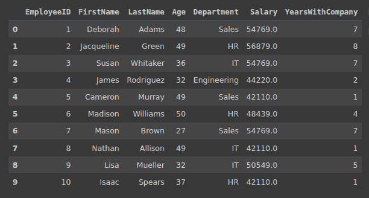
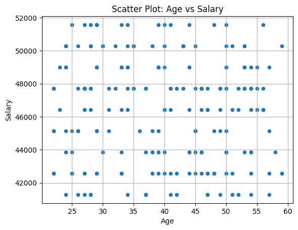
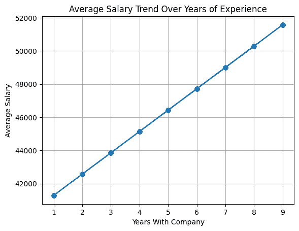
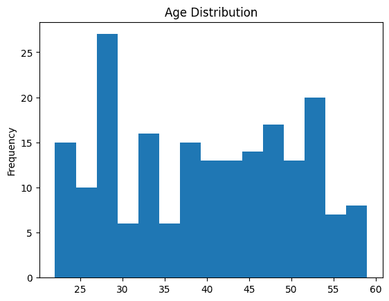
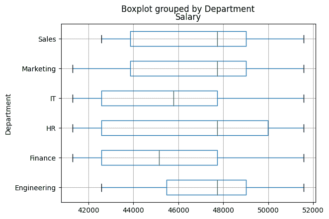
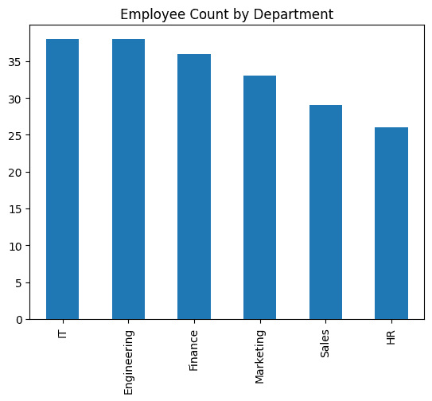
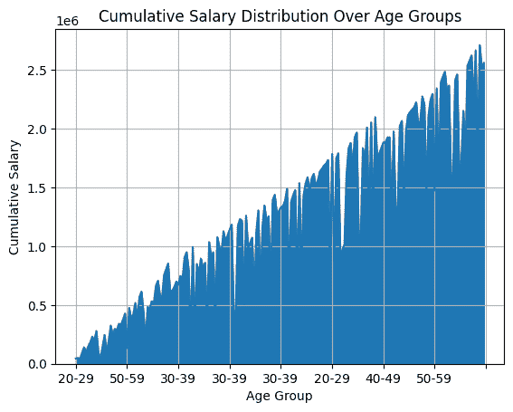

# 7 个 Pandas 绘图函数用于快速数据可视化

> 原文：[`www.kdnuggets.com/7-pandas-plotting-functions-for-quick-data-visualization`](https://www.kdnuggets.com/7-pandas-plotting-functions-for-quick-data-visualization)


使用 Segmind SSD-1B 模型生成的图像

当你使用 pandas 分析数据时，你会使用 pandas 函数来过滤和转换列、连接来自多个数据框的数据等。

* * *

## 我们的前三大课程推荐

 1\. [Google 网络安全证书](https://www.kdnuggets.com/google-cybersecurity) - 快速进入网络安全职业。

 2\. [Google 数据分析专业证书](https://www.kdnuggets.com/google-data-analytics) - 提升您的数据分析技能

 3\. [Google IT 支持专业证书](https://www.kdnuggets.com/google-itsupport) - 支持您的组织的 IT

* * *

但生成图表——以可视化数据框中的数据——通常会比仅仅查看数字更有帮助。

Pandas 提供了几种绘图函数，您可以用来快速而轻松地进行数据可视化。我们将在本教程中介绍它们。

🔗 [链接到 Google Colab 笔记本](https://github.com/balapriyac/python-data-analysis/blob/main/pandas-plotting-fns/pandas_plotting_functions.ipynb)（如果你想要一起编码）。

# 创建 Pandas 数据框

让我们创建一个用于分析的示例数据框。我们将创建一个名为 `df_employees` 的数据框，包含员工记录。

我们将使用 [Faker](https://pypi.org/project/Faker/) 和 NumPy 的 [random module](https://numpy.org/doc/stable/reference/random/index.html) 来填充数据框，生成 200 条记录。

**注意**：如果你的开发环境中没有安装 Faker，你可以通过 pip 安装它：`pip install Faker`。

运行以下代码段以创建并填充 `df_employees` 记录：

```py
import pandas as pd
from faker import Faker
import numpy as np

# Instantiate Faker object
fake = Faker()
Faker.seed(27)

# Create a DataFrame for employees
num_employees = 200
departments = ['Engineering', 'Finance', 'HR', 'Marketing', 'Sales', 'IT']

years_with_company = np.random.randint(1, 10, size=num_employees)
salary = 40000 + 2000 * years_with_company * np.random.randn()

employee_data = {
	'EmployeeID': np.arange(1, num_employees + 1),
	'FirstName': [fake.first_name() for _ in range(num_employees)],
	'LastName': [fake.last_name() for _ in range(num_employees)],
	'Age': np.random.randint(22, 60, size=num_employees),
	'Department': [fake.random_element(departments) for _ in range(num_employees)],
	'Salary': np.round(salary),
	'YearsWithCompany': years_with_company
}

df_employees = pd.DataFrame(employee_data)

# Display the head of the DataFrame
df_employees.head(10)
```

我们设置了种子以确保结果可重复。因此，每次运行此代码时，您将获得相同的记录。

这是数据框的前几条记录：



df_employees.head(10) 的输出

# 1\. 散点图

散点图通常用于理解数据集中任意两个变量之间的关系。

对于 `df_employees` 数据框，让我们创建一个散点图以可视化员工的年龄与薪资之间的关系。这将帮助我们了解员工的年龄与薪资之间是否存在任何相关性。

要创建散点图，我们可以使用 `plot.scatter()`，如下所示：

```py
# Scatter Plot: Age vs Salary
df_employees.plot.scatter(x='Age', y='Salary', title='Scatter Plot: Age vs Salary', xlabel='Age', ylabel='Salary', grid=True)
```



对于这个示例数据框，我们没有看到员工年龄与薪资之间的相关性。

# 2\. 折线图

折线图适用于识别连续变量上的趋势和模式，这通常是时间或类似的尺度。

在创建`df_employees`数据框时，我们定义了员工在公司工作年数与其薪资之间的线性关系。让我们查看显示平均薪资随年限变化的折线图。

我们找到按公司年限分组的平均薪资，然后使用`plot.line()`创建折线图：

```py
# Line Plot: Average Salary Trend Over Years of Experience
average_salary_by_experience = df_employees.groupby('YearsWithCompany')['Salary'].mean()
df_employees['AverageSalaryByExperience'] = df_employees['YearsWithCompany'].map(average_salary_by_experience)

df_employees.plot.line(x='YearsWithCompany', y='AverageSalaryByExperience', marker='o', linestyle='-', title='Average Salary Trend Over Years of Experience', xlabel='Years With Company', ylabel='Average Salary', legend=False, grid=True)
```



由于我们选择使用员工在公司工作的年数与薪资之间的线性关系来填充薪资字段，因此我们看到折线图反映了这一点。

# 3\. 直方图

你可以使用直方图来可视化连续变量的分布——通过将值划分为区间或箱，并显示每个箱中的数据点数量。

让我们使用`plot.hist()`来理解员工年龄的分布，如下所示：

```py
# Histogram: Distribution of Ages
df_employees['Age'].plot.hist(title='Age Distribution', bins=15)
```



# 4\. 箱线图

箱线图有助于理解变量的分布、其范围以及识别异常值。

让我们创建一个箱线图，以比较不同部门的薪资分布——为组织内的薪资分布提供一个高层次的比较。

箱线图还将帮助识别薪资范围以及每个部门的中位薪资和潜在的异常值等有用信息。

在这里，我们使用按‘部门’分组的‘薪资’列的`boxplot`：

```py
# Box Plot: Salary distribution by Department
df_employees.boxplot(column='Salary', by='Department', grid=True, vert=False)
```



从箱线图中，我们可以看到某些部门的薪资分布范围比其他部门更广。

# 5\. 条形图

当你想了解变量的分布以发生频率来衡量时，你可以使用条形图。

现在让我们使用`plot.bar()`创建条形图，以可视化员工数量：

```py
# Bar Plot: Department-wise employee count
df_employees['Department'].value_counts().plot.bar(title='Employee Count by Department')
```



# 6\. 面积图

面积图通常用于可视化变量在连续或分类轴上的累计分布。

对于员工数据框，我们可以绘制不同年龄组的累计薪资分布。为了将员工按年龄组分箱，我们使用`pd.cut()`。

然后我们计算薪资的累计和，将薪资按‘年龄组’分组。为了获得面积图，我们使用`plot.area()`：

```py
# Area Plot: Cumulative Salary Distribution Over Age Groups
df_employees['AgeGroup'] = pd.cut(df_employees['Age'], bins=[20, 30, 40, 50, 60], labels=['20-29', '30-39', '40-49', '50-59'])
cumulative_salary_by_age_group = df_employees.groupby('AgeGroup')['Salary'].cumsum()

df_employees['CumulativeSalaryByAgeGroup'] = cumulative_salary_by_age_group

df_employees.plot.area(x='AgeGroup', y='CumulativeSalaryByAgeGroup', title='Cumulative Salary Distribution Over Age Groups', xlabel='Age Group', ylabel='Cumulative Salary', legend=False, grid=True)
```



# 7\. 饼图

饼图在你想要可视化每个类别在整体中所占比例时非常有用。

对于我们的示例，创建一个饼图来显示组织中各部门工资的分布是有意义的。

我们计算按部门分组的员工总薪资，然后使用 `plot.pie()` 绘制饼图：

```py
# Pie Chart: Department-wise Salary distribution
df_employees.groupby('Department')['Salary'].sum().plot.pie(title='Department-wise Salary Distribution', autopct='%1.1f%%')
```


# 总结

希望你找到了一些在 pandas 中有用的绘图函数。

是的，你可以使用 matplotlib 和 seaborn 生成更漂亮的图表。但对于快速数据可视化，这些函数非常实用。

你经常使用哪些其他 pandas 绘图函数？请在评论中告诉我们。

**[](https://twitter.com/balawc27)**[Bala Priya C](https://www.kdnuggets.com/wp-content/uploads/bala-priya-author-image-update-230821.jpg)**** 是一位来自印度的开发者和技术作家。她喜欢在数学、编程、数据科学和内容创作的交汇点工作。她的兴趣和专长领域包括 DevOps、数据科学和自然语言处理。她喜欢阅读、写作、编码和咖啡！目前，她正在通过撰写教程、使用指南、意见文章等与开发者社区分享她的知识。Bala 还创建了引人入胜的资源概述和编码教程。

### 更多相关主题

+   [你可能不知道的 5 个 Pandas 绘图函数](https://www.kdnuggets.com/2023/02/5-pandas-plotting-functions-might-know.html)

+   [数据科学中的绘图与数据可视化](https://www.kdnuggets.com/2022/06/plotting-data-visualization-data-science.html)

+   [快速数据科学技巧与窍门以学习 SAS](https://www.kdnuggets.com/2022/05/sas-quick-data-science-tips-tricks-learn.html)

+   [快速指南：找到合适的注释人员](https://www.kdnuggets.com/2022/04/quick-guide-find-right-minds-annotation.html)

+   [Voronoi 图的快速概述](https://www.kdnuggets.com/2022/11/quick-overview-voronoi-diagrams.html)

+   [每个数据科学家都应该知道的 10 个 Pandas 必备函数](https://www.kdnuggets.com/10-essential-pandas-functions-every-data-scientist-should-know)
