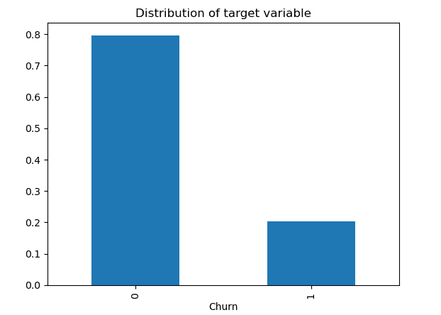

# 掌握数据清理和预处理技术的 7 个步骤

> 原文：[`www.kdnuggets.com/2023/08/7-steps-mastering-data-cleaning-preprocessing-techniques.html`](https://www.kdnuggets.com/2023/08/7-steps-mastering-data-cleaning-preprocessing-techniques.html)


插图作者。灵感来源于 Dr. Angshuman Ghosh 的 MEME

掌握数据清理和预处理技术对解决许多数据科学项目至关重要。一个简单的演示可以在 [meme](https://www.quora.com/Why-are-the-career-expectations-vs-the-reality-of-being-data-scientists) 中找到，该 meme 展示了学生在进入数据科学领域之前对工作的期望与数据科学家的实际工作的对比。

* * *

## 我们的前三个课程推荐

 1\. [Google 网络安全证书](https://www.kdnuggets.com/google-cybersecurity) - 快速进入网络安全职业。

 2\. [Google 数据分析专业证书](https://www.kdnuggets.com/google-data-analytics) - 提升你的数据分析技能

 3\. [Google IT 支持专业证书](https://www.kdnuggets.com/google-itsupport) - 支持你组织的 IT

* * *

我们往往会在没有具体经验之前对职位进行理想化，但现实总是与我们真正的期待不同。当处理实际问题时，数据没有文档，并且数据集非常脏乱。首先，你必须深入挖掘问题，理解你缺少了什么线索以及可以提取哪些信息。

在理解问题后，你需要为你的机器学习模型准备数据集，因为数据在初始状态下从来是不够的。在这篇文章中，我将展示七个步骤，这些步骤可以帮助你进行数据集的预处理和清理。

# 第一步：探索性数据分析

数据科学项目的第一步是探索性分析，这有助于理解问题并在下一步做出决策。这一步往往被跳过，但这是最糟糕的错误，因为你之后会花费很多时间去找出模型为何出现错误或未达到预期的原因。

根据我作为数据科学家的经验，我将探索性分析分为三个部分：

1.  检查数据集的结构、统计信息、缺失值、重复值以及分类变量的唯一值

1.  了解变量的含义和分布

1.  研究变量之间的关系

为了分析数据集的组织方式，可以使用以下 Pandas 方法：

```py
df.head()
df.info()
df.isnull().sum()
df.duplicated().sum()
df.describe([x*0.1 for x in range(10)])
 for c in list(df):
    print(df[c].value_counts())
```

在试图理解变量时，将分析分为两个部分：数值特征和分类特征是有用的。首先，我们可以关注那些可以通过直方图和箱线图可视化的数值特征。之后，轮到分类变量。如果这是一个二分类问题，最好先查看类别是否平衡。接下来，我们可以集中关注其余的分类变量，使用条形图进行分析。最后，我们可以检查每对数值变量之间的相关性。其他有用的数据可视化方法可以是散点图和箱线图，用于观察数值变量和分类变量之间的关系。

# 步骤 2：处理缺失值

在第一步中，我们已经检查了每个变量是否存在缺失值。如果存在缺失值，我们需要了解如何处理这些问题。最简单的方法是删除包含 NaN 值的变量或行，但我们最好避免这样做，因为我们可能会丢失有助于机器学习模型解决问题的有用信息。

如果我们处理的是数值变量，有几种方法可以填补这些空值。最常用的方法是用该特征的均值/中位数来填补缺失值：

```py
df['age'].fillna(df['age'].mean())
df['age'].fillna(df['age'].median())
```

另一种方法是用按组插补的方法来替代空值：

```py
df['price'].fillna(df.group('type_building')['price'].transform('mean'),
inplace=True)
```

如果数值特征和分类特征之间存在强关系，这可能是一个更好的选择。

同样，我们可以根据该变量的众数来填补分类特征的缺失值：

```py
df['type_building'].fillna(df['type_building'].mode()[0])
```

# 步骤 3：处理重复项和异常值

如果数据集中存在重复项，最好删除重复的行：

```py
df = df.drop_duplicates()
```

决定如何处理重复项比较简单，但处理异常值可能会具有挑战性。你需要问自己“是否删除异常值？”。

如果你确定异常值只提供噪声信息，则应该删除异常值。例如，数据集中包含两个人的年龄为 200 年，而年龄范围在 0 到 90 之间。在这种情况下，最好删除这两个数据点。

```py
df = df[df.Age<=90]
```

不幸的是，大多数时候，删除异常值可能会导致丢失重要的信息。最有效的方法是对数值特征应用对数变换。

我在最近的经验中发现的另一种技术是剪辑方法。在这种技术中，你选择上界和下界，这可以是第 0.1 百分位数和第 0.9 百分位数。低于下界的特征值将被替换为下界值，而高于上界的变量值将被替换为上界值。

```py
for c in columns_with_outliers:
   transform= 'clipped_'+ c
   lower_limit = df[c].quantile(0.10)
   upper_limit = df[c].quantile(0.90)
   df[transform] = df[c].clip(lower_limit, upper_limit, axis = 0)
```

# 步骤 4：对分类特征进行编码

下一阶段是将分类特征转换为数值特征。实际上，机器学习模型只能处理数字，不能处理字符串。

在进一步讨论之前，你应该区分两种类别变量：非序数变量和序数变量。

非序数变量的例子包括性别、婚姻状况、工作类型。因此，如果变量没有遵循顺序，则为非序数变量，与序数特征不同。序数变量的一个例子可以是教育水平，如“童年”、“小学”、“中学”和“大学”，以及收入水平，如“低”、“中”等“高”。

当我们处理非序数变量时，One-Hot 编码是最常用的技术，用于将这些变量转换为数值型。

在这种方法中，我们为每个类别特征的水平创建一个新的二进制变量。当水平名称与变量值相同时，该二进制变量的值为 1，否则为 0。

```py
from sklearn.preprocessing import OneHotEncoder

data_to_encode = df[cols_to_encode]
encoder = OneHotEncoder(dtype='int')
encoded_data = encoder.fit_transform(data_to_encode)
dummy_variables = encoder.get_feature_names_out(cols_to_encode)
encoded_df = pd.DataFrame(encoded_data.toarray(), columns=encoder.get_feature_names_out(cols_to_encode))

final_df = pd.concat([df.drop(cols_to_encode, axis=1), encoded_df], axis=1)
```

当变量是序数时，最常用的技术是序数编码，它将类别变量的唯一值转换为遵循顺序的整数。例如，收入的水平“低”、“中”和“高”将分别编码为 0、1 和 2。

```py
from sklearn.preprocessing import OrdinalEncoder

data_to_encode = df[cols_to_encode]
encoder = OrdinalEncoder(dtype='int')
encoded_data = encoder.fit_transform(data_to_encode)
encoded_df = pd.DataFrame(encoded_data.toarray(), columns=["Income"])

final_df = pd.concat([df.drop(cols_to_encode, axis=1), encoded_df], axis=1)
```

如果你想进一步探索其他可能的编码技术，可以查看[这里](https://towardsdatascience.com/all-about-categorical-variable-encoding-305f3361fd02)，以了解替代方案。

# 第五步：将数据集拆分为训练集和测试集

现在是时候将数据集划分为三个固定的子集：最常见的选择是将 60%用于训练，20%用于验证，20%用于测试。随着数据量的增长，训练集的比例增加，而验证集和测试集的比例减少。

拥有三个子集很重要，因为训练集用于训练模型，而验证集和测试集可以用来了解模型在新数据上的表现。

要拆分数据集，我们可以使用 scikit-learn 的 train_test_split：

```py
from sklearn.model_selection import train_test_split

X = final_df.drop(['y'],axis=1)
y = final_df['y']

train_idx, test_idx,_,_ = train_test_split(X.index,y,test_size=0.2,random_state=123)
train_idx, val_idx,_,_ = train_test_split(train_idx,y_train,test_size=0.2,random_state=123)

df_train = final_df[final_df.index.isin(train_idx)]
df_test = final_df[final_df.index.isin(test_idx)]
df_val = final_df[final_df.index.isin(val_idx)]
```

如果我们处理的是分类问题且类别不平衡，最好设置分层参数，以确保训练集、验证集和测试集中类别的比例相同。

```py
train_idx, test_idx,y_train,_ = train_test_split(X.index,y,test_size=0.2,stratify=y,random_state=123)
train_idx, val_idx,_,_ = train_test_split(train_idx,y_train,test_size=0.2,stratify=y_train,random_state=123)
```

这种分层交叉验证还帮助确保三个子集中的目标变量百分比相同，从而提供更准确的模型性能。

# 第六步：特征缩放

一些机器学习模型，如线性回归、逻辑回归、KNN、支持向量机和神经网络，需要特征缩放。特征缩放只是帮助变量处于相同范围内，并不改变分布。

最流行的三种特征缩放技术是归一化、标准化和鲁棒缩放。

**归一化**，也称为最小-最大缩放，将变量的值映射到 0 和 1 之间。这是通过从特征值中减去特征的最小值，然后除以该特征的最大值和最小值之间的差值来实现的。

```py
from sklearn.preprocessing import MinMaxScaler
sc=MinMaxScaler()
df_train[numeric_features]=sc.fit_transform(df_train[numeric_features])
df_test[numeric_features]=sc.transform(df_test[numeric_features])
df_val[numeric_features]=sc.transform(df_val[numeric_features])
```

另一种常见方法是**标准化**，它将列的值重新缩放以符合标准正态分布的特性，即均值为 0，方差为 1。

```py
from sklearn.preprocessing import StandardScaler
sc=StandardScaler()
df_train[numeric_features]=sc.fit_transform(df_train[numeric_features])
df_test[numeric_features]=sc.transform(df_test[numeric_features])
df_val[numeric_features]=sc.transform(df_val[numeric_features])
```

如果特征包含无法移除的离群值，建议使用**鲁棒缩放**方法，该方法根据鲁棒统计量（中位数、第一四分位数和第三四分位数）对特征值进行缩放。缩放值通过从原始值中减去中位数，然后除以四分位距（即特征的第 75 和第 25 四分位数之间的差异）来获得。

```py
from sklearn.preprocessing import RobustScaler
sc=RobustScaler()
df_train[numeric_features]=sc.fit_transform(df_train[numeric_features])
df_test[numeric_features]=sc.transform(df_test[numeric_features])
df_val[numeric_features]=sc.transform(df_val[numeric_features])
```

通常，最好基于训练集计算统计数据，然后用这些统计数据来缩放训练、验证和测试集上的值。这是因为我们假设只有训练数据，然后希望在新数据上测试我们的模型，新数据应具有与训练集相似的分布。

# 第 7 步：处理不平衡数据



这一步骤仅在我们处理分类问题并发现类别不平衡时才包含。

如果类别之间存在细微差异，例如类别 1 包含 40% 的观察数据，类别 2 包含剩余的 60%，我们无需应用过采样或欠采样技术来改变某一类别的样本数量。我们只需避免关注准确率，因为准确率只有在数据集平衡时才是一个良好的衡量指标，我们应该只关注评估指标，如**精确度**、**召回率**和**F1 分数**。

但有可能正类的数据点比例非常低（0.2），与负类（0.8）相比。机器学习可能在样本较少的类别上表现不佳，从而导致无法解决任务。

为了克服这个问题，有两种可能性：对多数类进行欠采样和对少数类进行过采样。欠采样通过随机移除一些数据点来减少样本数量，而过采样通过从较少出现的类别中随机添加数据点来增加少数类的观察数量。imblearn 可以用少量代码实现数据集平衡：

```py
# undersampling
from imblearn.over_sampling import RandomUnderSampler,RandomOverSampler
undersample = RandomUnderSampler(sampling_strategy='majority')
X_train, y_train = undersample.fit_resample(df_train.drop(['y'],axis=1),df_train['y'])
# oversampling
oversample = RandomOverSampler(sampling_strategy='minority')
X_train, y_train = oversample.fit_resample(df_train.drop(['y'],axis=1),df_train['y'])
```

然而，有时删除或重复一些观察可能在提高模型性能方面效果不佳。更好的方法是创建新的人工数据点在少数类中。为解决此问题，提出了一种技术 SMOTE，它以生成在代表性较少的类别中的合成记录而闻名。像 KNN 一样，其思路是基于特定距离 t 确定属于少数类的观察的 k 个最近邻。然后在这些 k 个最近邻之间的随机位置生成新点。这个过程将持续创建新点，直到数据集完全平衡。

```py
from imblearn.over_sampling import SMOTE
resampler = SMOTE(random_state=123)
X_train, y_train = resampler.fit_resample(df_train.drop(['y'],axis=1),df_train['y'])
```

我应该强调，这些方法应仅应用于重新采样训练集。我们希望我们的机器模型以稳健的方式学习，然后，我们可以将其应用于对新数据进行预测。

# 最终想法

我希望你发现这个全面的教程对你有帮助。开始我们的第一个数据科学项目时，如果不掌握所有这些技巧，可能会很困难。你可以在 [这里](https://www.kaggle.com/code/eugeniaanello/7-steps-to-mastering-preprocessing#7.-Deal-with-Imbalanced-Data) 找到我的所有代码。

当然，还有其他方法我在文章中没有涵盖，但我更愿意专注于最受欢迎和知名的方法。你还有其他建议吗？如果有有见地的建议，请在评论中留言。

**有用的资源：**

+   [探索性数据分析的实用指南](https://towardsdatascience.com/a-practical-guide-for-exploratory-data-analysis-5ab14d9a5f24)

+   [哪些模型需要规范化数据？](https://www.yourdatateacher.com/2022/06/13/which-models-require-normalized-data/)

+   [不平衡分类的随机过采样和欠采样](https://machinelearningmastery.com/random-oversampling-and-undersampling-for-imbalanced-classification/)

**[尤金尼亚·安内洛](https://www.linkedin.com/in/eugenia-anello/)** 目前是意大利帕多瓦大学信息工程系的研究员。她的研究项目集中在持续学习与异常检测的结合上。

### 更多相关主题

+   [通过这本免费电子书学习数据清理和预处理](https://www.kdnuggets.com/2023/08/learn-data-cleaning-preprocessing-data-science-free-ebook.html)

+   [利用 ChatGPT 进行自动化数据清理和预处理](https://www.kdnuggets.com/2023/08/harnessing-chatgpt-automated-data-cleaning-preprocessing.html)

+   [在 Pandas 中清理和预处理文本数据以用于 NLP 任务](https://www.kdnuggets.com/cleaning-and-preprocessing-text-data-in-pandas-for-nlp-tasks)

+   [掌握 Python 和 Pandas 数据清理的 7 个步骤](https://www.kdnuggets.com/7-steps-to-mastering-data-cleaning-with-python-and-pandas)

+   [掌握 SQL、Python、数据清理、数据处理等的指南合集](https://www.kdnuggets.com/collection-of-guides-on-mastering-sql-python-data-cleaning-data-wrangling-and-exploratory-data-analysis)

+   [探索使用 Python 的数据清洗技术](https://www.kdnuggets.com/2023/04/exploring-data-cleaning-techniques-python.html)
