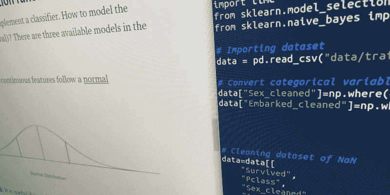

# 掌握 Python 中的中级机器学习的 7 个步骤 — 2019 年版

> 原文：[`www.kdnuggets.com/2019/06/7-steps-mastering-intermediate-machine-learning-python.html`](https://www.kdnuggets.com/2019/06/7-steps-mastering-intermediate-machine-learning-python.html)

 评论

你对使用 Python 学习更多关于机器学习的内容感兴趣吗？

我最近写了掌握基础机器学习的 7 个步骤（2019 年版），这是对我之前写的一对文章的更新尝试（掌握机器学习的 7 个步骤和掌握机器学习的 7 个额外步骤），这对文章现在已经有些过时了。是时候在“基础”文章的基础上添加一套步骤，用于学习 Python 中的“中级”机器学习了。

我们谈论的“中级”是相对而言的，因此不要期望在阅读完这篇文章后成为研究级别的机器学习工程师。学习路径旨在那些对编程、计算机科学概念和/或机器学习有一定理解的人，他们希望能够使用流行的 Python 库实现机器学习算法，以构建自己的机器学习模型。

这篇文章以及之前的文章，将利用现有的教程、视频和各种专家的工作，因此任何包含的感谢应当致敬于他们。

相较于为每个主题步骤（例如*降维*）提供大量资源，我尝试选择一两个高质量的教程，并附上一段初步描述相关理论、数学或直觉的可及视频（如适用）。

这些步骤涉及机器学习算法、特征选择与工程的重要性、模型训练、迁移学习等。

所以，拿上一杯饮料，坐下来阅读该系列的第二部分，并开始通过这 7 个步骤掌握 Python 中的中级机器学习。

### 1\. 入门

这可能不言而喻，但你的第一步应该是回顾该系列中的上一篇文章，掌握基础机器学习的 7 个步骤（2019 年版）。

保持谷歌的**[机器学习词汇表](https://developers.google.com/machine-learning/glossary/)**随手可用，或在之前快速查看一下，也许是个好主意。

每个以下 Python 库的官方文档中的快速入门指南也是很好的参考，这些库用于处理机器学习和其他数据分析任务：

+   **[使用 scikit-learn 进行机器学习简介](https://scikit-learn.org/stable/tutorial/basic/tutorial.html)**

+   **[Numpy - 快速入门教程](https://docs.scipy.org/doc/numpy/user/quickstart.html)**

+   **[10 分钟 pandas](https://pandas.pydata.org/pandas-docs/stable/getting_started/10min.html)**

现在，进入有趣的部分。

### 2\. 特征选择

特征是来自输入数据集的变量，可用于帮助进行预测。然而，并非所有特征都是平等的，有时需要使用原始特征来构造新的特征，这些新特征可能在预测中更有用。

阅读 Raheel Shaikh 的**[Python 机器学习中的特征选择技术](https://towardsdatascience.com/feature-selection-techniques-in-machine-learning-with-python-f24e7da3f36e)**，了解特征选择技术的方法，以及它们在 Python 中的应用。

接下来，阅读**[Beware Default Random Forest Importances](https://explained.ai/rf-importance/)**，作者为 Terence Parr、Kerem Turgutlu、Christopher Csiszar 和 Jeremy Howard，这篇文章深入探讨了“[t]scikit-learn 的随机森林特征重要性和 R 的默认随机森林特征重要性策略存在偏差”的原因。随机森林是一种常见的特征选择方法，基于其重要性进行预测，这篇文章提供了为什么盲目使用任何特定方法并不是一个好主意的见解。

最后，查看这篇文章，**逐步特征选择：Python 中的实际示例**，该文章展示了逐步特征选择的实现，这是一个有纪律的统计方法。

### 3\. 特征工程

有时，所有原始特征或其中的一些子集可以直接用于预测。其他时候，可以从现有特征中构造新的特征，以促进更好的预测。

以一个简单的日期为例。这个日期本身可能对预测没有用。然而，知道这个日期是工作日还是周末，或者是否是法定假日，可能会非常有帮助。利用这个原始日期来创建一个新的、更有用的特征是特征工程的一个简单例子。

首先，阅读**[Google 机器学习速成课程中的特征工程文章](https://developers.google.com/machine-learning/crash-course/representation/feature-engineering)**，以获取该主题的概述。

接着阅读 Will Koehrsen 的**[特征工程：推动机器学习的力量](https://towardsdatascience.com/feature-engineering-what-powers-machine-learning-93ab191bcc2d)**，获取更多关于此主题的信息，将 Python 引入其中。

最后，阅读**[Python 中的自动特征工程](https://towardsdatascience.com/automated-feature-engineering-in-python-99baf11cc219)**，这也是 Will Koehrsen 的作品，介绍了如何自动化和外包特征工程到算法中。

### 4. 进一步的分类

接下来，让我们转向一些分类算法。本系列的第一部分讨论了逻辑回归、决策树和支持向量机。这次我们将关注另一对常用且经过时间考验的技术：k-最近邻和朴素贝叶斯。

首先，观看这段来自 StatQuest 的短视频，了解什么是 k-最近邻（k-NN），以及它的分类方法。

然后阅读 Sam Grassi 的文章**[在 Python 中构建和改进 K-最近邻算法](https://towardsdatascience.com/building-improving-a-k-nearest-neighbors-algorithm-in-python-3b6b5320d2f8)**，首先使用 Scikit-learn 的 k-NN 实现进行分类，然后在 Python 中从头实现 k-NN 以进行比较。

在了解了 k-NN 之后，我们将注意力转向朴素贝叶斯。观看这段来自 StatQuest 的视频，以建立对该算法的直觉。

接下来是实际操作。通过马丁·穆勒的**[朴素贝叶斯分类与 Sklearn](https://blog.sicara.com/naive-bayes-classifier-sklearn-python-example-tips-42d100429e44)**教程，学习如何使用 Scikit-learn 的实现来构建分类器。

### 5. 模型训练与选择

继续进行模型训练和选择。

这里有两个主要点。首先，没有经过训练的模型，我们无法进行预测。其次，在多个模型中，我们需要选择“最佳”模型。

我们将首先查看训练、测试和验证集的概念。阅读 Tarang Shah 的文章**[关于机器学习中的训练、验证和测试集](https://towardsdatascience.com/train-validation-and-test-sets-72cb40cba9e7)**，介绍了这些概念。

然后观看这段来自 StatQuest 的视频，了解相关的交叉验证概念。

以上概念对模型训练至关重要。但当我们有多个模型时，如何选择它们之间的最佳模型呢？

首先，这段来自 StatQuest 的视频解释了混淆矩阵是什么，它如何帮助总结机器学习分类器的结果。

更深入地了解这个主题，请观看另一部关于模型敏感性和特异性的 StatQuest 视频。

之后，阅读有关机器学习分类指标的内容，并了解如何在 Python 中使用 Scikit-learn 实际实现这些指标。Andrew Long 的这篇文章**[每个人的数据科学性能指标](https://towardsdatascience.com/data-science-performance-metrics-for-everyone-4d68f4859eef)**介绍了这些指标，因此从这里开始。

然后，继续阅读 Andrew Long 的另一篇文章**[在 Python 中使用 Scikit-Learn 理解数据科学分类指标](https://towardsdatascience.com/understanding-data-science-classification-metrics-in-scikit-learn-in-python-3bc336865019)**，了解分类指标如何在 Python 中实现。

最后，通过阅读 Alvira Swalin 的**选择正确的评估机器学习模型的指标  –  第一部分**和**选择正确的评估机器学习模型的指标  –  第二部分**，了解如何在这些资源中选择评估指标的过程。

### 6\. 维度减少

什么是维度减少？既然你问了，可以看看斯坦福大学的 Jure Leskovec 解释这个问题的视频。

最常用的维度减少形式之一是主成分分析（PCA），这是一种将可能相关的变量数据集转换为线性无关变量的变换；这些线性无关变量被称为主成分。观看这个来自 StatQuest 的视频，更详细地了解 PCA。

现在看看 Zichen Wang 的这篇文章**[用 numpy 解释 PCA 和 SVD](https://towardsdatascience.com/pca-and-svd-explained-with-numpy-5d13b0d2a4d8)**，演示了如何在 Python 中使用 Numpy 从头实现 PCA——以及奇异值分解（SVD），另一种流行的维度减少技术。

最后，Jake VanderPlas 的书《[Python 数据科学手册](http://shop.oreilly.com/product/0636920034919.do)》中的**[深入分析：主成分分析](https://jakevdp.github.io/PythonDataScienceHandbook/05.09-principal-component-analysis.html)**章节详细讲解了如何使用 Scikit-learn 实现 PCA。

### 7\. 迁移学习

迁移学习是将模型用于与其最初训练任务不同的任务。当然，迁移学习远比这简单的一句话解释要复杂得多，但它传达了基本概念。

观看这个来自 Kaggle 的视频，更好地描述了迁移学习是什么以及它可以做什么。

然后阅读塞巴斯蒂安·鲁德（Sebastian Ruder）对迁移学习概念的概述，**[迁移学习 - 机器学习的下一个前沿](http://ruder.io/transfer-learning/)**。这篇文章已有几年历史，尽管迁移学习发展迅速，但所涵盖的概念今天仍然有效。

为了看到迁移学习的价值，我们来看一下如何使用 Keras 深度学习库创建的神经网络进行图像分类（这是其最大的成就之一）。如果您不熟悉 Keras，可以查看这份快速入门指南，**[Keras 深度学习简介](https://towardsdatascience.com/introduction-to-deep-learning-with-keras-17c09e4f0eb2)**，由吉尔伯特·坦纳（Gilbert Tanner）编写。

现在通过乔治·赛义夫（George Seif）编写的教程，将迁移学习应用于实际使用，**[使用 Keras 进行图像分类的迁移学习](https://towardsdatascience.com/transfer-learning-for-image-classification-using-keras-c47ccf09c8c8)**。这应该足以展示迁移学习的强大功能，不仅在图像分类中，而且在自然语言处理任务及其他领域也同样有效。

希望这些掌握中级机器学习的 7 个步骤对你有所帮助。请加入我们下一期，我们将讨论一些更高级的主题。

**相关**：

+   掌握基础机器学习的 7 个步骤 — 2019 版

+   掌握数据科学 SQL 的 7 个步骤 — 2019 版

+   掌握数据准备的 7 个步骤

* * *

## 我们的前三大课程推荐

 1\. [Google 网络安全证书](https://www.kdnuggets.com/google-cybersecurity) - 快速进入网络安全职业生涯。

 2\. [Google 数据分析专业证书](https://www.kdnuggets.com/google-data-analytics) - 提升您的数据分析技能

 3\. [Google IT 支持专业证书](https://www.kdnuggets.com/google-itsupport) - 支持您的组织进行 IT 工作

* * *

### 更多相关内容

+   [成为优秀数据科学家所需的 5 个关键技能](https://www.kdnuggets.com/2021/12/5-key-skills-needed-become-great-data-scientist.html)

+   [每个初学者数据科学家应掌握的 6 个预测模型](https://www.kdnuggets.com/2021/12/6-predictive-models-every-beginner-data-scientist-master.html)

+   [2021 年最佳 ETL 工具](https://www.kdnuggets.com/2021/12/mozart-best-etl-tools-2021.html)

+   [使用管道编写干净的 Python 代码](https://www.kdnuggets.com/2021/12/write-clean-python-code-pipes.html)

+   [是什么使 Python 成为初创公司的理想编程语言](https://www.kdnuggets.com/2021/12/makes-python-ideal-programming-language-startups.html)

+   [每个数据科学家都应该了解的三个 R 库（即使你使用 Python）](https://www.kdnuggets.com/2021/12/three-r-libraries-every-data-scientist-know-even-python.html)
