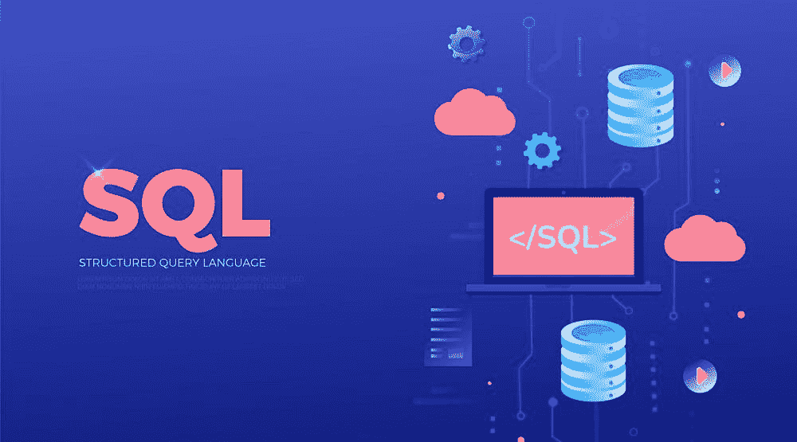

# 掌握数据科学所需的 SQL 的 7 个步骤

> 原文：[`www.kdnuggets.com/2022/04/7-steps-mastering-sql-data-science.html`](https://www.kdnuggets.com/2022/04/7-steps-mastering-sql-data-science.html)

# 为什么你应该学习 SQL 来成为一名数据科学家？

* * *

## 我们的三大课程推荐

 1\. [谷歌网络安全证书](https://www.kdnuggets.com/google-cybersecurity) - 快速进入网络安全职业生涯

 2\. [谷歌数据分析专业证书](https://www.kdnuggets.com/google-data-analytics) - 提升你的数据分析技能

 3\. [谷歌 IT 支持专业证书](https://www.kdnuggets.com/google-itsupport) - 支持你的组织的 IT 需求

* * *

掌握 SQL 是申请大多数数据科学职位的前提。事实上，根据[这篇](https://www.dataquest.io/blog/why-sql-is-the-most-important-language-to-learn/) 2021 年的分析，SQL 是数据岗位上需求最旺盛的技术技能，其次是 Python 和机器学习。

然而，数据科学课程和训练营并不强调教学生处理大量数据。大多数数据科学学习材料的重点是预测建模，完成这些程序的候选人往往没有查询和操作数据库的能力。

当我开始我的第一次数据科学实习时，我很兴奋地期待在第一天就开始构建机器学习算法。然而，我被分配的任务与我预期的完全不同。我必须从数据库中查询数据，清理数据，并进行分析以回答一个业务问题。

在公司工作的第一周后，我意识到许多组织中的业务用例根本不需要预测建模来解决。通常，一个简单的 SQL 查询就足以根据利益相关者的需求来筛选和汇总数据。

起初，我不能像我的同事一样迅速完成这些任务，因为我对 SQL 不熟悉，因此花了更多时间在数据提取和预处理上。幸运的是，由于这只是一次实习，期望值并不高，我能够随着时间的推移提高我的查询技能。

我能给有志于数据科学的人的最大建议就是学习 SQL。这是大多数数据科学学习提供者常常忽视的一项技能，但它的重要性不亚于机器学习建模。

即使是那些需要你构建复杂预测算法的任务，掌握 SQL 也是必须的。大多数组织中的数据管道以关系数据库的形式存储，你需要从这些数据库中提取数据并进行预处理，才能开始构建机器学习模型。

如果你缺乏 SQL 知识，即使你在机器学习方面非常专业，你也会在数据准备和分析上花费比预期更多的时间。

在这篇文章中，我将带你了解掌握 SQL 所需的 7 个步骤，以适用于任何数据科学或分析角色。

# 如何学习数据科学的 SQL

## 第 1 步：SQL 基础

作为一名数据科学家，你将从数据库中读取数据并进行分析以适应你的使用场景。通常，你不需要创建或操作现有的数据库 — 公司有专门的团队来完成这些任务。

如果你完全没有 SQL 知识，先从这个教程开始，了解什么是 RDBMS。

然后，观看 Lucidchart 的[这个](https://www.youtube.com/watch?v=QpdhBUYk7Kk)YouTube 视频，学习如何创建和读取 ER 图。ER 图是一种结构化图表，用于可视化数据库中的表以及它们之间的关系。作为数据科学家，当从不同的表中提取数据时，你通常需要参考 ER 图以理解表之间的互动关系。

之后，你可以立即开始学习如何在 SQL 中查询数据。我强烈推荐你按照 W3Schools 的这些教程来学习以下命令 — [SELECT](https://www.w3schools.com/sql/sql_select.asp)、[IN](https://www.w3schools.com/sql/sql_in.asp)、[WHERE](https://www.w3schools.com/sql/sql_where.asp)、[BETWEEN](https://www.w3schools.com/sql/sql_between.asp)、[AND](https://www.w3schools.com/sql/sql_and_or.asp)、[OR](https://www.w3schools.com/sql/sql_and_or.asp)、[NOT](https://www.w3schools.com/sql/sql_and_or.asp)、[LIKE](https://www.w3schools.com/sql/sql_like.asp)。

这些是一些最简单的 SQL 命令，用于查询和筛选数据库表。一旦你熟悉了这些命令，就可以开始学习[CASE](https://www.w3schools.com/sql/sql_case.asp)语句。它们与任何编程语言中的 if-else 命令非常相似。

## 第 2 步：聚合

SQL 聚合函数用于对多个表值执行计算并返回单一结果。SQL 有 5 个聚合函数 — [SUM](https://www.w3schools.com/mysql/mysql_count_avg_sum.asp)、[COUNT](https://www.w3schools.com/mysql/mysql_count_avg_sum.asp)、[AVG](https://www.w3schools.com/mysql/mysql_count_avg_sum.asp)、[MIN](https://www.w3schools.com/sql/sql_min_max.asp)、[MAX](https://www.w3schools.com/sql/sql_min_max.asp)。

## 第 3 步：分组和排序

接下来，了解[GROUPBY](https://www.w3schools.com/mysql/mysql_groupby.asp)和[ORDERBY](https://www.w3schools.com/mysql/mysql_orderby.asp)命令。这些命令在你需要以不同的分组查看数据或按特定顺序排序行时特别有用。

学习[HAVING](https://www.w3schools.com/mysql/mysql_having.asp)子句也是很有用的，因为它在上述命令中经常使用。

## 第 4 步：连接

上述所有查询只能用于从单个表中提取数据。如果你想要结合多个表中的数据，你需要学习 JOIN 命令。

这里是 SQL 连接的可视化表示：

图片来源：[CodeProject](https://www.codeproject.com/)

Edureka 在 YouTube 上发布了一个名为 [SQL Joins Tutorial For Beginners](https://www.youtube.com/watch?v=bLL5NbBEg2I) 的免费视频，你可以跟随它进行学习。你也可以选择在 [这个](https://www.w3schools.com/sql/sql_join.asp) W3Schools 关于不同连接的教程中进行编程练习。完成后，学习 SQL [UNION](https://www.w3schools.com/sql/sql_union.asp) 运算符也是很有用的。

## 步骤 5：子查询

子查询也称为 SQL 中的嵌套查询，用于当你想要的结果需要多个查询时。在嵌套查询中，内层命令的结果用作主查询的输入。

这开始可能看起来有些混乱，但一旦你习惯了，它实际上是一个相当直观的概念。

如果你想学习如何在 SQL 中使用子查询，可以阅读 [这篇](https://www.w3resource.com/sql/subqueries/understanding-sql-subqueries.php) W3Resources 的文章。

## 步骤 6：用 SQL 解决业务问题

作为数据科学家，你为组织带来的价值在于你使用数据解决业务问题的能力。当利益相关者给出用例时，你需要能够将这一需求转化为技术分析。

例如，你的经理要求提供一个客户列表，以根据他们的在线浏览行为来确定不同的行业目标。作为数据科学家，你需要将这个任务拆分为以下步骤：

1.  查看这些客户访问的网站，并根据他们的网站访问情况按行业进行分类。这可以通过 SQL 中的一些基本筛选和分组来完成。

1.  然后，你可以查看网站访问的最近性和频率，以识别这些行业中潜力大的客户。这可能需要一些额外的数据预处理、筛选以及可能的排名。

1.  最后，你可以将按行业分组的筛选后输出数据交给你的经理。如果你想丰富这些客户类别，你甚至可以在这些数据基础上构建一个聚类算法，以识别高潜力的个人。

上面的例子很简单，但它捕捉了数据科学家在面对业务问题陈述时的思维过程。这是一种随着时间和实践而发展的技能。

Udemy 有一门 [SQL Business Intelligence](https://www.udemy.com/course/sql-business-intelligence-with-sql-2-in-1/) 课程，旨在帮助学生使用 SQL 支持更好的决策。该课程的第一部分涵盖了 SQL 的基础知识（连接、运算符、子查询、聚合等），第二部分则重点讲解将所学知识应用于解决业务问题。

## 步骤 7：窗口函数

窗口函数是一个稍微高级的 SQL 话题。它们使用户能够对结果集的分区执行计算。要学习 SQL 窗口函数，请观看[这个](https://www.youtube.com/watch?v=lBcDSsgp0RU) YouTube 视频。

# 练习，练习，再练习

学习以上列出的所有概念将帮助你建立 SQL 编程的坚实基础。然而，要解决实际用例，你需要大量练习。

[HackerRank](https://www.hackerrank.com/) 和 [PGExercises](https://pgexercises.com/) 是两个可以帮助你实现这一点的平台。它们提供了一系列从初学者到高级的 SQL 问题，解决这些问题将使你对语言有更深入的理解。

像 HackerRank 这样的站点通常被招聘经理用来评估候选人在不同编程语言上的能力，解决它们的 SQL 问题将增加你在数据科学面试中脱颖而出的机会。

**[Natassha Selvaraj](https://www.natasshaselvaraj.com/)** 是一位自学成才的数据科学家，热衷于写作。你可以通过[LinkedIn](https://www.linkedin.com/in/natassha-selvaraj-33430717a/)与她联系。

### 更多相关话题

+   [掌握数据宇宙：成功数据科学职业的关键步骤](https://www.kdnuggets.com/mastering-the-data-universe-key-steps-to-a-thriving-data-science-career)

+   [KDnuggets™ 新闻 22:n05，2 月 2 日：掌握机器学习的 7 个步骤…](https://www.kdnuggets.com/2022/n05.html)

+   [掌握数据科学的 7 个步骤](https://www.kdnuggets.com/2022/06/7-steps-mastering-python-data-science.html)

+   [掌握数据科学项目管理的 7 个步骤（敏捷方法）](https://www.kdnuggets.com/2023/07/7-steps-mastering-data-science-project-management-agile.html)

+   [掌握 SQL、Python、数据清洗、数据…的指南集合](https://www.kdnuggets.com/collection-of-guides-on-mastering-sql-python-data-cleaning-data-wrangling-and-exploratory-data-analysis)

+   [掌握数据清洗和预处理技术的 7 个步骤](https://www.kdnuggets.com/2023/08/7-steps-mastering-data-cleaning-preprocessing-techniques.html)
