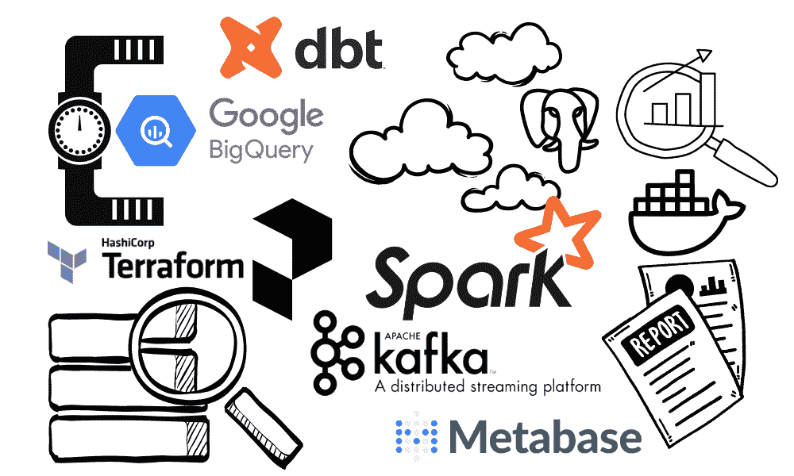

# 掌握数据工程的 7 个步骤

> 原文：[`www.kdnuggets.com/7-steps-to-mastering-data-engineering`](https://www.kdnuggets.com/7-steps-to-mastering-data-engineering)

作者提供的图片

数据工程指的是创建和维护结构和系统的过程，这些结构和系统收集、存储和转换数据，使其以易于数据科学家、分析师和业务相关人员分析和使用的格式存在。本路线图将指导你掌握各种概念和工具，使你能够有效地构建和执行不同类型的数据管道。

* * *

## 我们的前三大课程推荐

 1\. [谷歌网络安全证书](https://www.kdnuggets.com/google-cybersecurity) - 快速进入网络安全职业生涯。

 2\. [谷歌数据分析专业证书](https://www.kdnuggets.com/google-data-analytics) - 提升你的数据分析技能

 3\. [谷歌 IT 支持专业证书](https://www.kdnuggets.com/google-itsupport) - 支持你的组织 IT 需求

* * *

# 1\. 容器化和基础设施即代码

容器化允许开发人员将他们的应用程序和依赖项打包成轻量级的、可移植的容器，这些容器可以在不同的环境中一致地运行。另一方面，基础设施即代码是通过代码管理和配置基础设施的实践，使开发人员能够定义、版本化和自动化云基础设施。

在第一步中，你将了解 SQL 语法、Docker 容器和 Postgres 数据库的基本知识。你将学习如何在本地使用 Docker 启动数据库服务器，以及如何在 Docker 中创建数据管道。此外，你将了解 Google Cloud Provider (GCP)和 Terraform。Terraform 对于你在云端部署工具、数据库和框架特别有用。

# 2\. 工作流编排

工作流编排管理和自动化数据流经不同处理阶段的过程，如数据摄取、清理、转换和分析。这是一种更高效、更可靠和可扩展的工作方式。

在第二步中，你将学习关于数据编排工具的信息，例如 Airflow、Mage 或 Prefect。它们都是开源的，具有观察、管理、部署和执行数据管道的多个重要功能。你将学习如何使用 Docker 设置 Prefect，并利用 Postgres、Google Cloud Storage (GCS)和 BigQuery APIs 构建 ETL 管道。

查看 5 种 Airflow 替代方案，选择适合你的工具。

# 3\. 数据仓储

数据仓库是从各种来源收集、存储和管理大量数据的过程，将其集中在一个存储库中，从而使分析和提取有价值的见解变得更容易。

在第三步中，你将学习有关 Postgres（本地）或 BigQuery（云端）数据仓库的所有内容。你将学习分区和聚类的概念，并深入了解 BigQuery 的最佳实践。BigQuery 还提供机器学习集成功能，你可以在大数据上训练模型、调整超参数、预处理特征，并进行模型部署。这就像是机器学习的 SQL。

# 4\. 数据分析工程师

分析工程是一个专注于为商业智能和数据科学团队设计、开发和维护数据模型及分析管道的专业领域。

在第四步中，你将学习如何使用 dbt（数据构建工具）构建分析管道，使用现有的数据仓库，如 BigQuery 或 PostgreSQL。你将理解 ETL 与 ELT 等关键概念以及数据建模。你还将学习 dbt 的高级功能，如增量模型、标签、钩子和快照。

最终，你将学习使用 Google Data Studio 和 Metabase 等可视化工具来创建交互式仪表板和数据分析报告。

# 5\. 批处理

批处理是一种数据工程技术，涉及将大量数据按批次（每分钟、每小时甚至每天）处理，而不是实时或近实时地处理数据。

在你学习旅程的第五步中，你将接触到使用 Apache Spark 进行批处理。你将学习如何在各种操作系统上安装它，使用 Spark SQL 和 DataFrames，准备数据，执行 SQL 操作，并了解 Spark 的内部机制。在这一步的最后，你还将学习如何在云端启动 Spark 实例并将其与数据仓库 BigQuery 集成。

# 6\. 流处理

流处理指的是实时或近实时地收集、处理和分析数据。与传统的批处理不同，后者是在定时间隔内收集和处理数据，流处理允许对最新信息进行持续分析。

在第六步中，你将学习如何使用 Apache Kafka 进行数据流处理。从基础开始，然后深入了解与 Confluent Cloud 的集成以及涉及生产者和消费者的实际应用。此外，你还需要了解流连接、测试、窗口处理以及 Kafka ksqldb 和 Connect 的使用。

如果你希望探索用于各种数据工程过程的不同工具，可以参考 [2024 年必备的 14 种数据工程工具](https://www.datacamp.com/blog/top-data-engineer-tools)。

# 7\. 项目：构建一个端到端的数据管道

在最后一步，你将运用之前学到的所有概念和工具，创建一个全面的端到端数据工程项目。这将涉及构建数据处理管道，将数据存储在数据湖中，创建将处理后的数据从数据湖转移到数据仓库的管道，在数据仓库中转换数据，并为仪表盘做准备。最后，你将构建一个可视化呈现数据的仪表盘。

# 最后的思考

本指南中提到的所有步骤都可以在 数据工程 ZoomCamp 中找到。此 ZoomCamp 包含多个模块，每个模块都包括教程、视频、问题和项目，以帮助你学习和构建数据管道。

在这个数据工程路线图中，我们学习了学习、构建和执行数据管道以进行数据处理、分析和建模的各种步骤。我们还了解了云应用程序和工具以及本地工具。你可以选择在本地构建所有内容，也可以使用云以方便操作。我建议使用云，因为大多数公司倾向于此，并希望你在如 GCP 等云平台上获得经验。

****[Abid Ali Awan](https://www.polywork.com/kingabzpro)**** ([@1abidaliawan](https://www.linkedin.com/in/1abidaliawan)) 是一位认证的数据科学专业人士，热爱构建机器学习模型。目前，他专注于内容创作和撰写关于机器学习和数据科学技术的技术博客。Abid 拥有技术管理硕士学位和电信工程学士学位。他的愿景是利用图神经网络构建一款帮助心理疾病学生的人工智能产品。

### 更多相关话题

+   [掌握生成式 AI 和 Prompt Engineering：免费电子书](https://www.kdnuggets.com/2023/04/free-ebook-mastering-generative-ai-prompt-engineering.html)

+   [Prompt Engineering 101：掌握有效的 LLM 通信](https://www.kdnuggets.com/prompt-engineering-101-mastering-effective-llm-communication)

+   [掌握数据宇宙：蓬勃发展数据科学职业的关键步骤](https://www.kdnuggets.com/mastering-the-data-universe-key-steps-to-a-thriving-data-science-career)

+   [KDnuggets™ 新闻 22:n05，2 月 2 日：掌握机器学习的 7 个步骤](https://www.kdnuggets.com/2022/n05.html)

+   [掌握数据科学 SQL 的 7 个步骤](https://www.kdnuggets.com/2022/04/7-steps-mastering-sql-data-science.html)

+   [掌握数据科学的 Python 的 7 个步骤](https://www.kdnuggets.com/2022/06/7-steps-mastering-python-data-science.html)
