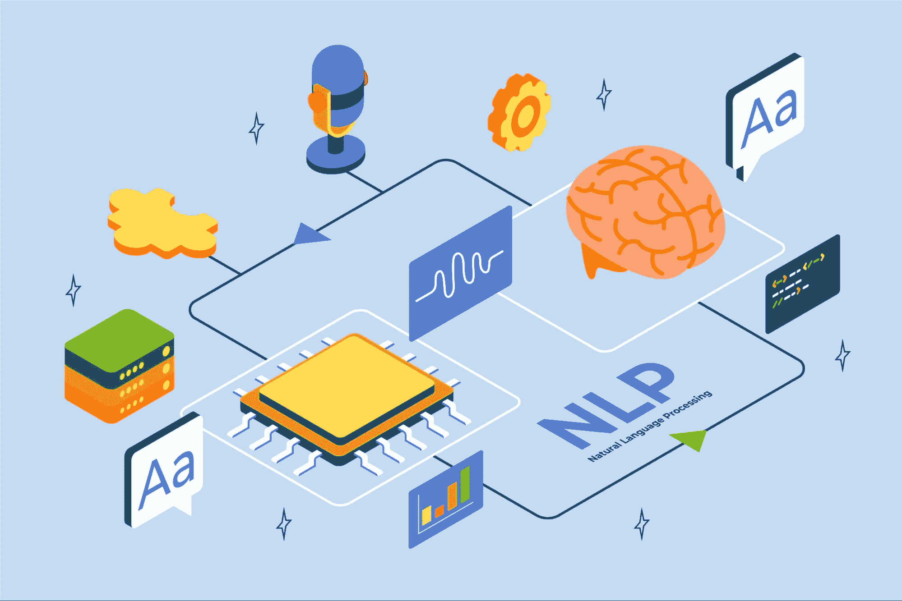
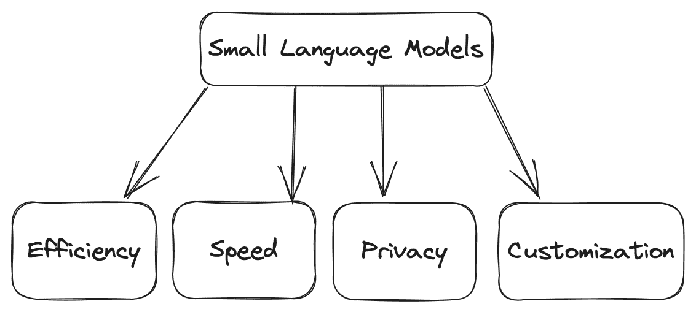
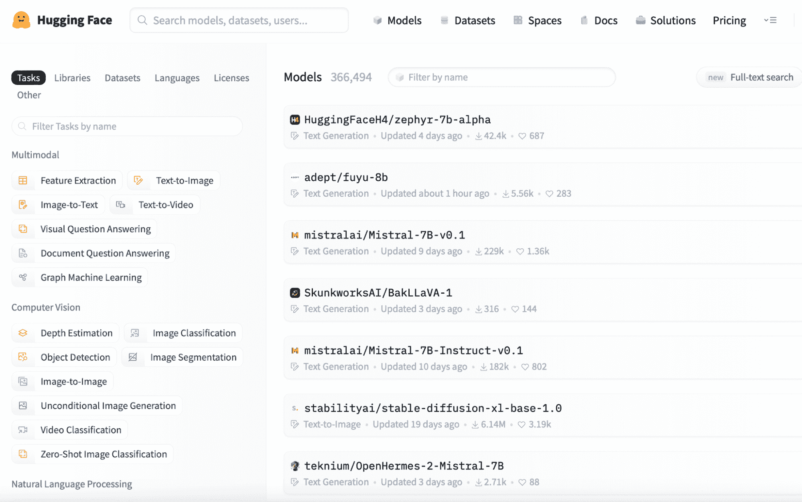
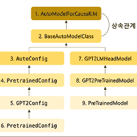

# 在本地 CPU 上运行小型语言模型的 7 个步骤

> 原文：[`www.kdnuggets.com/7-steps-to-running-a-small-language-model-on-a-local-cpu`](https://www.kdnuggets.com/7-steps-to-running-a-small-language-model-on-a-local-cpu)



图像由 [Freepik](https://www.freepik.com/free-vector/isometric-npl-illustration_22379496.htm#query=Small%20language%20models%20in%20Deep%20learning&position=1&from_view=search&track=ais) 提供

# 第 1 步：介绍

* * *

## 我们的前三个课程推荐

 1\. [Google 网络安全证书](https://www.kdnuggets.com/google-cybersecurity) - 快速进入网络安全职业生涯

 2\. [Google 数据分析专业证书](https://www.kdnuggets.com/google-data-analytics) - 提升您的数据分析技能

 3\. [Google IT 支持专业证书](https://www.kdnuggets.com/google-itsupport) - 支持您的组织在 IT 方面

* * *

语言模型已经彻底改变了自然语言处理领域。虽然像 GPT-3 这样的巨大模型常常成为新闻头条，但小型语言模型同样具有优势，适用于各种应用。在本文中，我们将详细探讨小型语言模型的重要性及其使用场景，并逐步讲解所有实施步骤。

小型语言模型是其大型对应模型的紧凑版本。它们提供了几个优点。以下是一些优点：

1.  **效率：** 与大型模型相比，小型模型需要的计算能力较少，使它们适合资源有限的环境。

1.  **速度：** 它们可以更快地进行计算，例如更快地生成基于给定输入的文本，使它们非常适合实时应用程序，这些应用程序可能会有高频次的日常流量。

1.  **定制：** 您可以根据领域特定任务的需求对小型模型进行微调。

1.  **隐私：** 小型模型可以在没有外部服务器的情况下使用，从而确保数据隐私和完整性。



作者提供的图像

小型语言模型的多个使用场景包括聊天机器人、内容生成、情感分析、问答等。

# 第 2 步：设置环境

在我们深入探讨小型语言模型的工作原理之前，您需要设置您的环境，包括安装必要的库和依赖项。选择合适的框架和库来在本地 CPU 上构建语言模型变得至关重要。常见的选择包括基于 Python 的库，如 TensorFlow 和 PyTorch。这些框架提供了许多用于机器学习和深度学习应用的预构建工具和资源。

**安装所需库**

在此步骤中，我们将安装 "llama-cpp-python" 和 ctransformers 库，以便向你介绍小型语言模型。你必须打开终端并运行以下命令来安装它。在运行以下命令时，请确保你的系统上已安装 Python 和 pip。

```py
pip install llama-cpp-python
pip install ctransformers -q
```

**输出：**


# 第三步：获取预训练的小型语言模型

现在我们的环境已经准备好，我们可以获取一个用于本地使用的预训练小型语言模型。对于小型语言模型，我们可以考虑像 LSTM 或 GRU 这样较简单的架构，这些架构在计算上比像 transformers 这样更复杂的模型要轻量。你还可以使用预训练的词嵌入来提高模型的性能，同时减少训练时间。但为了快速工作，我们将从网络上下载一个预训练模型。

### 下载预训练模型

你可以在像 Hugging Face ([`huggingface.co/models`](https://huggingface.co/models)) 这样的平台上找到预训练的小型语言模型。这里是一个快速浏览网站的指南，你可以轻松观察到提供的模型序列，并通过登录应用程序下载这些开源模型。



你可以通过这个链接轻松下载所需的模型，并将其保存到本地目录以备后续使用。

```py
from ctransformers import AutoModelForCausalLM
```

# 第四步：加载语言模型

在上一步中，我们已经确定了来自 Hugging Face 的预训练模型。现在，我们可以通过将其加载到我们的环境中来使用这个模型。我们在下面的代码中从 ctransformers 库中导入了 AutoModelForCausalLM 类。这个类可以用于加载和使用因果语言建模的模型。



图片来自 [Medium](https://medium.com/@cltkzl12)

```py
# Load the pretrained model
llm = AutoModelForCausalLM.from_pretrained('TheBloke/Llama-2-7B-Chat-GGML', model_file = 'llama-2-7b-chat.ggmlv3.q4_K_S.bin' )
```

**输出：**


# 第五步：模型配置

小型语言模型可以根据你的具体需求进行微调。如果你需要在实际应用中使用这些模型，主要需要记住的是效率和可扩展性。因此，为了使小型语言模型在性能上优于大型语言模型，你可以调整上下文大小和批处理（将数据划分为较小的批次以加快计算速度），这也有助于解决可扩展性问题。

### **修改上下文大小**

上下文大小决定了模型考虑多少文本。根据你的需求，你可以选择上下文大小的值。在这个示例中，我们将此超参数的值设置为 128 个标记。

```py
model.set_context_size(128)
```

### 提高效率的批处理

通过引入批处理技术，可以同时处理多个数据片段，这可以并行处理查询，并帮助扩展应用程序以支持大量用户。但在决定批量大小时，必须仔细检查系统的能力。否则，系统可能因负载过重而出现问题。

```py
model.set_batch_size(16)
```

# 第 6 步：生成文本

到目前为止，我们已经完成了模型的创建、调优和保存。现在，我们可以根据我们的使用情况快速测试模型，并检查它是否提供了我们期望的输出。因此，让我们输入一些查询并基于我们加载和配置的模型生成文本。

```py
for word in llm('Explain something about Kdnuggets', stream = True):
       print(word, end='')
```

**输出：**


# 第 7 步：优化和故障排除

为了获得适当的结果以满足大多数输入查询，您可以考虑以下事项。

1.  **微调：** 如果您的应用程序需要高性能，即查询的输出需要在显著更短的时间内解决，那么您需要在特定的数据集上对模型进行微调，即您正在训练模型的语料库。

1.  **缓存：** 通过使用缓存技术，您可以将基于用户的常用数据存储在内存中，以便当用户再次请求这些数据时，可以轻松提供，而不是从磁盘中重新提取，这样会花费相对更多的时间，从而有助于加快未来请求的处理速度。

1.  **常见问题：** 如果在创建、加载和配置模型时遇到问题，您可以参考文档和用户社区的故障排除提示。

# 总结

在本文中，我们讨论了如何通过遵循文章中概述的七个简单步骤，在本地 CPU 上创建和部署小型语言模型。这种经济高效的方法为各种语言处理或计算机视觉应用打开了大门，并为更高级的项目提供了一个踏脚石。但在进行项目时，您需要记住以下事项以克服任何问题：

1.  在训练过程中定期保存检查点，以确保您可以在中断时继续训练或恢复您的模型。

1.  优化您的代码和数据管道，以提高内存使用效率，特别是在使用本地 CPU 时。

1.  如果您将来需要扩展模型，考虑使用 GPU 加速或基于云的资源。

总之，小型语言模型为各种语言处理任务提供了多功能且高效的解决方案。通过正确的设置和优化，您可以有效地利用它们的强大功能。

**[](https://www.linkedin.com/in/aryan-garg-1bbb791a3/)**[Aryan Garg](https://www.linkedin.com/in/aryan-garg-1bbb791a3/)**** 是一名电气工程学的 B.Tech.学生，目前正在本科的最后一年。他的兴趣领域包括网页开发和机器学习。他已经追求了这一兴趣，并渴望在这些方向上做更多的工作。

### 了解更多相关话题

+   [Llama, Llama, Llama: 3 个简单步骤将本地 RAG 与你的内容结合](https://www.kdnuggets.com/3-simple-steps-to-local-rag-with-your-content)

+   [掌握大型语言模型微调的 7 个步骤](https://www.kdnuggets.com/7-steps-to-mastering-large-language-model-fine-tuning)

+   [有效的小型语言模型：微软的 13 亿参数 phi-1.5](https://www.kdnuggets.com/effective-small-language-models-microsoft-phi-15)

+   [GPT4All 是本地 ChatGPT，适用于你的文档，并且是免费的！](https://www.kdnuggets.com/2023/06/gpt4all-local-chatgpt-documents-free.html)

+   [LangChain + Streamlit + Llama: 将对话 AI 带入你的…](https://www.kdnuggets.com/2023/08/langchain-streamlit-llama-bringing-conversational-ai-local-machine.html)

+   [Octoparse 8.5: 增强本地抓取及更多功能](https://www.kdnuggets.com/2022/02/octoparse-85-empowering-local-scraping.html)
