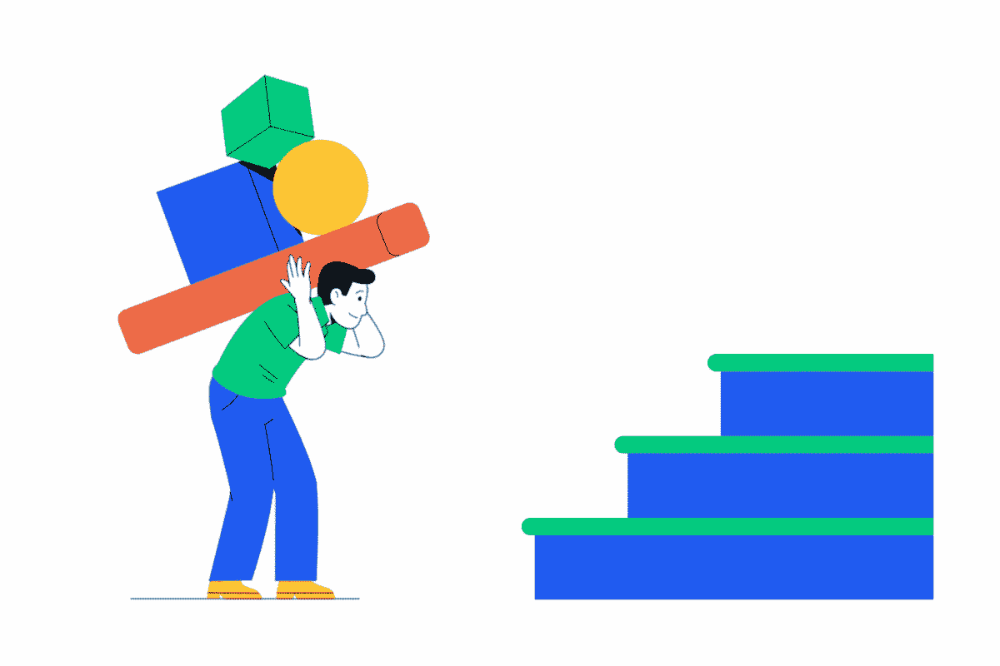
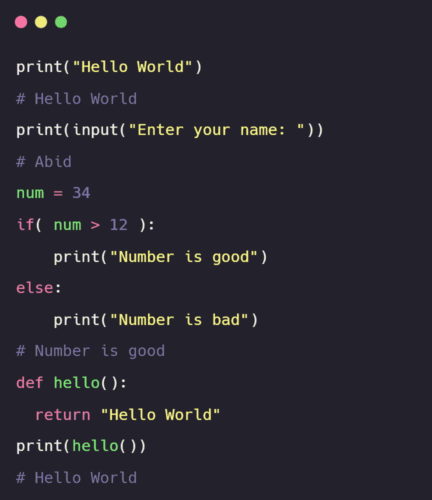
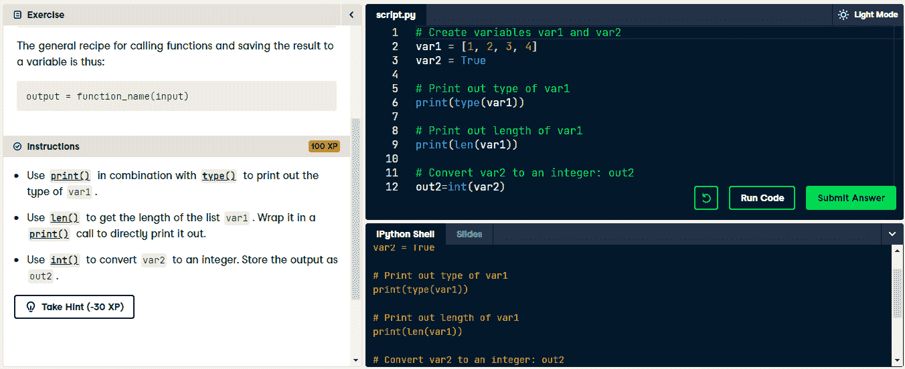
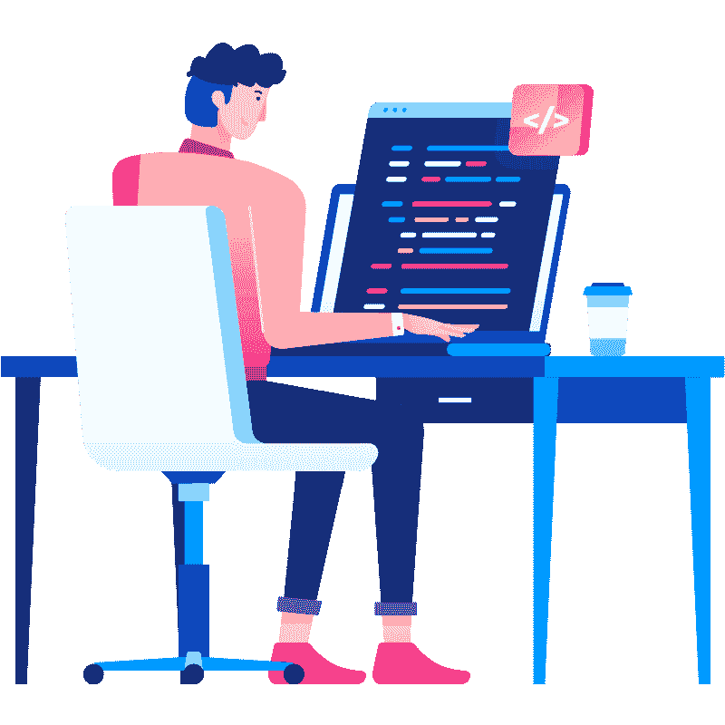
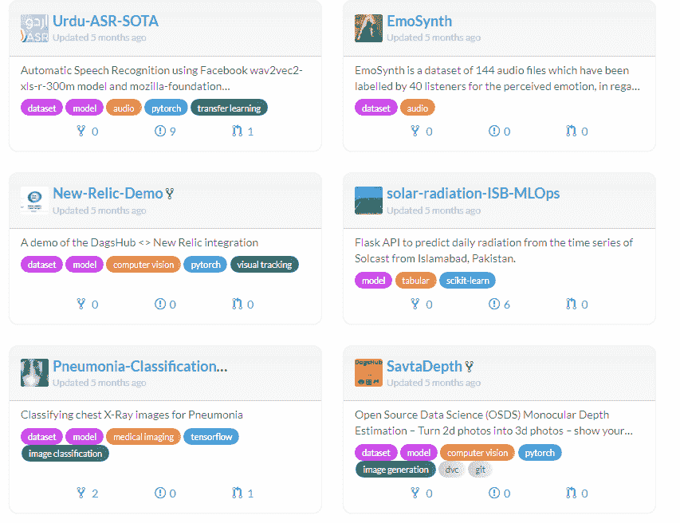
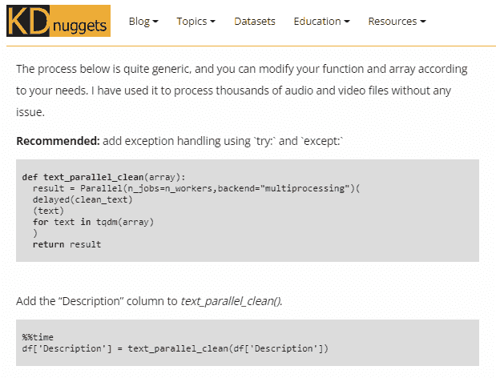
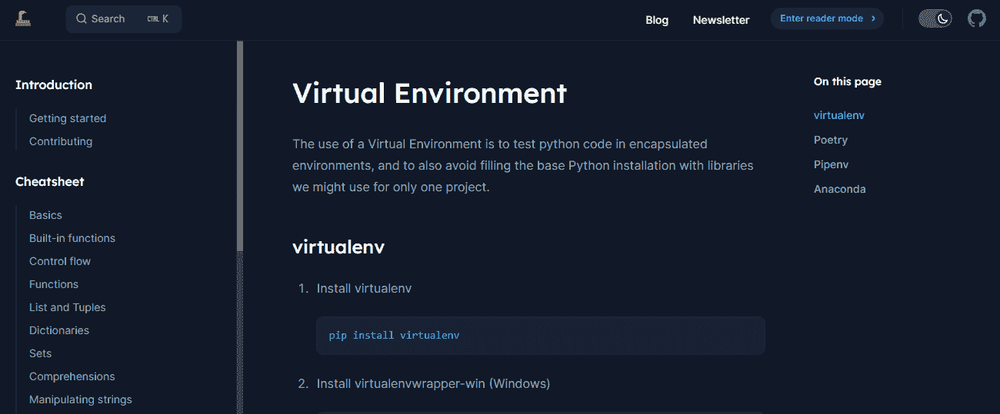

# 7 个 Python 初学者提示

> 原文：[`www.kdnuggets.com/2022/09/7-tips-python-beginners.html`](https://www.kdnuggets.com/2022/09/7-tips-python-beginners.html)

Gif 由作者提供

学习一门新语言可能会让人感到困惑和具有挑战性。你会被宣称在 10 分钟内教你 Python 的 YouTube 视频淹没。最后，你会变得更加困惑并放弃。

* * *

## 我们的前三个课程推荐

 1\. [谷歌网络安全证书](https://www.kdnuggets.com/google-cybersecurity) - 快速进入网络安全职业。

 2\. [谷歌数据分析专业证书](https://www.kdnuggets.com/google-data-analytics) - 提升你的数据分析技能

 3\. [谷歌 IT 支持专业证书](https://www.kdnuggets.com/google-itsupport) - 支持你组织的 IT

* * *

> "不要追逐炒作。找出适合你的方法。"

即使你理解了基础知识，你也会在选择和学习新工具时感到更困惑。此外，如果没有结构化的学习，你将无法通过任何编码面试或测试。

就像任何技能一样，你需要坚持和练习。在这篇博客中，我将我的 Python 学习经验转化为 7 个易于遵循的提示。

让我们开始成为专家 Python 程序员的旅程吧。

# 学习基础

学习 Python 的所有知识并不是必要的，但你需要建立基础。为此，你需要理解基础知识。

**学习：**

1.  数据类型

1.  数学和增强赋值运算符

1.  变量

1.  注释

1.  打印

1.  内置函数

1.  控制流

1.  函数

1.  列表、元组、字典和集合

1.  读取和写入文件

还有很多东西可以学习，但对于初学者来说，坚持基础并多加练习。

图片由作者提供

犯错误、忘记语法和在简单问题上卡住是没关系的。这些会自然地到来。不要强迫自己去记忆。最重要的是，一次学习一个知识点。

不要以为你知道所有的东西然后开始做项目。相信我，你会在谷歌上花费数小时来解决简单的问题。

# 互动学习

我坚信通过互动练习、测验、评估测试和项目来学习。

在互动学习环境中，你将看到一个描述部分、代码编辑器、ipython shell 和课程。你只有在成功输入正确的代码并运行后才能进入下一个任务。在描述部分，你将阅读指令并尝试将其转换为 Python 代码。

图片由 DataCamp 的 Python 课程作者提供

我使用过 DataCamp 和 Codecademy 学习 SQL、Python、R 和 JavaScript。这些平台具有游戏化和上瘾的特点。除了游戏化，它还迫使你通过实践学习，这与 YouTube 教程大相径庭。

按照视频教程并复现结果是学习 Python 的最糟糕方法。你最终会感到沮丧。另一方面，互动学习平台提供提示、描述、代码编辑器和课程幻灯片。

# 设置 IDE

设置你的开发环境对成功至关重要。你希望 IDE（集成开发环境）能为你服务，而不是阻碍你。

首先，在本地机器上安装并设置代码编辑器。然后，添加插件以增强用户体验，并更新终端。

图片由作者提供

首先，我安装了 Anaconda。它包含了所有必需的软件和库。

然后，我安装了 VSCode 作为我的主要工作空间。它快速、轻量、直观，并且配备了各种扩展和插件。

此后，我安装了一些扩展来提升我的 Python 开发体验，如 Pylance、GitHub Copilot、Gitlens、material icons、Python indent 和 Jupyter。

# 每天编程

每天编程。你会学到一些东西，但可能第二天就忘记了。为了巩固你的学习，你需要每天练习。你可以尝试编程挑战、互动练习、复习之前的课程并自行练习。

图片来自作者 | Canva Pro

我从实践和调试代码中学到了最多。我每天至少编程 1 小时。这对我实现目标和保持以前学到的概念帮助很大。

我建议你每天编程一个小时，并将其分成 30 分钟的时间段。尝试修改代码、实验新事物、学习新概念，并提高你的打字技能。

# 从事一个项目

在获得必要的实践后，*深入*项目。选择任何初学者项目，尝试从头开始创建或使用你的知识复现结果。

你还可以为开源项目做贡献，甚至自愿参与 NGO 项目。

通过从事一个项目，你将学会开发生命周期、必要的专业技能，并获得可以添加到简历中的经验。

图片来自作者 | [DAGsHub](https://dagshub.com/kingabzpro)

完成课程后，我进行了互动项目。其中大多数是有指导的。然后，我会阅读教程并尝试复现结果。最后，我开始参与竞赛，以深入了解 Python 和各种工具，从而提升数据处理和分析能力。

# 分享知识

在完成一个项目后，分享你的经验和所学到的教训。你通过写关于新话题的博客能学到的东西，比通过上课程学到的还要多。你可以从在 Medium 上写作开始，随着时间的推移，开始为像 Better programming 和 KDnuggets 这样的高级出版物写作。

作者提供的图片 | KDnuggets

我撰写了关于 Python 基础、多线程、数据科学、机器学习、MLOps 和 NLP 的博客和编码教程。我大多数的成功来自于教授复杂的工具和方法。在我的博客中，我分享了我的经验、技术概念、互动学习的代码以及改进工作的建议。

> “把自己展示出来，让世界教会你。”

# 持续学习

为了保持竞争力，你需要不断学习。即便公司也希望员工学习新的技能、工具和概念。

为了保持竞争力，你可以从以下渠道学习：

+   博客和基于代码的教程

+   书籍

+   Twitter、LinkedIn 和 Facebook

+   阅读新工具的文档

+   观看 Youtube 视频

+   参加研讨会和课程

+   参与编码挑战

+   与 Python 开发者保持联系

图片来自 [Python Cheatsheet](https://www.pythoncheatsheet.org/cheatsheet/virtual-environments)

我是一个终身学习者。我通常对学习新工具或概念感到兴奋。这挑战了我的大脑，我花费多个小时仅仅是调试和发现 API。

> “如果你把新的工具当作玩具来看待，你会开始享受学习的过程。你会打破并修复东西。”

# 结论

迈过最初的几个步骤是困难的，因为你会在投入更多时间和放弃之间犹豫不决。相信我，Python 是最受欢迎的语言，它正在推动机器人技术、人工智能、数据科学和金融科技等未来技术。它在技术行业中需求很高，如果你能通过编码挑战，你就足够好能被聘用。

持续学习和改进。没有捷径。犯错并调试你的程序。通过艰辛的努力，你会成为一颗闪亮的明星。

我希望你能从我的博客中学到一些东西，并且未来如果它对你有帮助，请用它来帮助他人。此外，如果你有任何问题，请在下面的评论中输入。

**[Abid Ali Awan](https://www.polywork.com/kingabzpro)** ([@1abidaliawan](https://twitter.com/1abidaliawan)) 是一位认证的数据科学专业人士，喜欢构建机器学习模型。目前，他专注于内容创作，并撰写关于机器学习和数据科学技术的技术博客。Abid 拥有技术管理硕士学位和电信工程学士学位。他的愿景是为那些在心理健康方面挣扎的学生构建一个使用图神经网络的 AI 产品。

### 相关话题

+   [7 个 Python 初学者项目](https://www.kdnuggets.com/2022/11/7-python-projects-beginners.html)

+   [如何编写高效的 Python 代码：初学者教程](https://www.kdnuggets.com/how-to-write-efficient-python-code-a-tutorial-for-beginners)

+   [将 Python 字典转换为 JSON：初学者教程](https://www.kdnuggets.com/convert-python-dict-to-json-a-tutorial-for-beginners)

+   [5 个免费的 Python 数据科学初学者课程](https://www.kdnuggets.com/5-free-python-courses-for-data-science-beginners)

+   [在 Python 中将字节转换为字符串：初学者教程](https://www.kdnuggets.com/convert-bytes-to-string-in-python-a-tutorial-for-beginners)

+   [免费的 MLOps 快速课程：初学者](https://www.kdnuggets.com/2022/08/free-mlops-crash-course.html)
