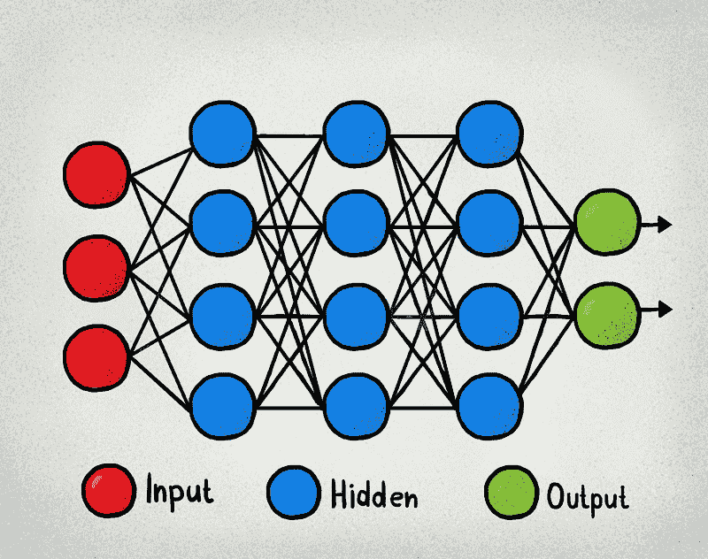
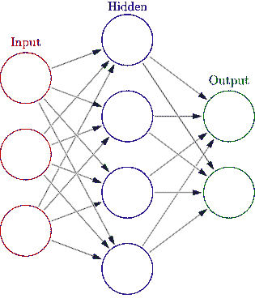
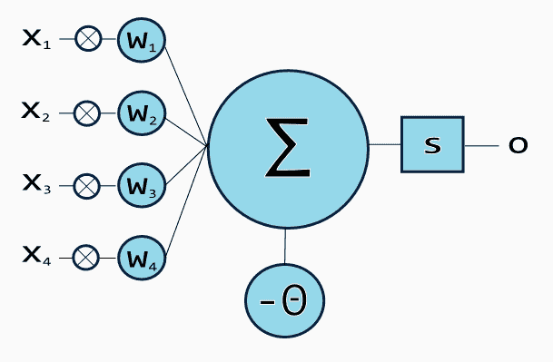
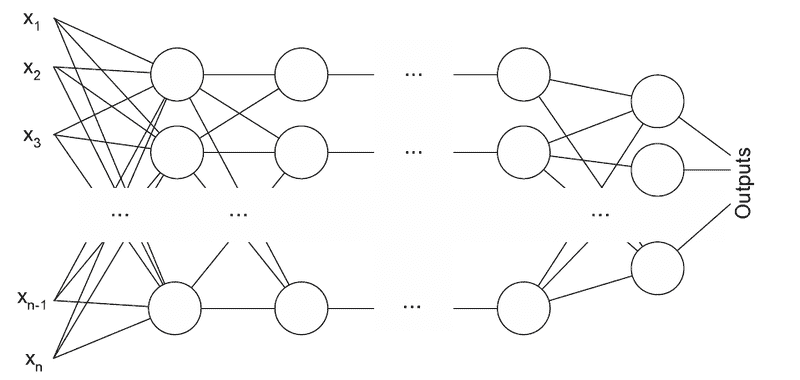

# 7 种用于自然语言处理的人工神经网络类型

> 原文：[`www.kdnuggets.com/2017/10/7-types-artificial-neural-networks-natural-language-processing.html`](https://www.kdnuggets.com/2017/10/7-types-artificial-neural-networks-natural-language-processing.html)

**作者：Olga Davydova，[数据怪兽](https://datamonsters.co/)。**

[人工神经网络（ANN）](https://en.wikipedia.org/wiki/Artificial_neural_network)是基于大脑神经结构的计算非线性模型，能够通过仅考虑示例来学习执行分类、预测、决策、可视化等任务。

人工神经网络由人工神经元或处理单元组成，并组织成三个互连的层次：输入层、可能包括多个层的隐藏层和输出层。

人工神经网络 ([`en.wikipedia.org/wiki/Artificial_neural_network#/media/File:Colored_neural_network.svg`](https://en.wikipedia.org/wiki/Artificial_neural_network#/media/File:Colored_neural_network.svg))

输入层包含将信息传递给隐藏层的输入神经元。隐藏层将数据传递给输出层。每个神经元具有加权输入（[突触](https://en.wikipedia.org/wiki/Synaptic_weight)），一个[激活函数](https://en.wikipedia.org/wiki/Activation_function)（定义给定输入的输出），以及一个输出。突触是将神经网络转换为参数化系统的可调参数。

带有四个输入的人工神经元 ([`en.citizendium.org/wiki/File:Artificialneuron.png`](http://en.citizendium.org/wiki/File:Artificialneuron.png))

输入的加权和产生激活信号，该信号传递到激活函数以从神经元获得一个输出。常用的激活函数包括线性、阶跃、 sigmoid、tanh 和修正线性单元（ReLu）函数。

**线性函数**

*f(x)=ax*

**阶跃函数**

**Logistic（Sigmoid）函数**

**Tanh 函数**

**修正线性单元（ReLu）函数**

训练是权重优化的过程，其中最小化预测的误差，使得网络达到指定的准确度水平。确定每个神经元误差贡献的方法称为 [反向传播](https://en.wikipedia.org/wiki/Backpropagation)，它计算损失函数的梯度。

通过使用额外的隐藏层，可以使系统更加灵活和强大。具有多个隐藏层的人工神经网络被称为 [深度神经网络 (DNNs)](https://en.wikipedia.org/wiki/Deep_learning#Deep_neural_networks)，它们可以建模复杂的非线性关系。

### 1\. 多层感知机 (MLP)

一个感知机 ([`upload.wikimedia.org/wikipedia/ru/d/de/Neuro.PNG`](https://upload.wikimedia.org/wikipedia/ru/d/de/Neuro.PNG))

多层感知机 (MLP) 具有三个或更多层。它使用非线性激活函数（主要是双曲正切或逻辑函数），使其能够分类不可线性分隔的数据。每一层的每个节点都连接到下一层的每个节点，使网络全连接。例如，多层感知机自然语言处理 (NLP) 应用包括语音识别和机器翻译。

### 2\. 卷积神经网络 (CNN)

典型的 CNN 架构 ([`en.wikipedia.org/wiki/Convolutional_neural_network#/media/File:Typical_cnn.png`](https://en.wikipedia.org/wiki/Convolutional_neural_network#/media/File:Typical_cnn.png))

卷积神经网络 (CNN) 包含一个或多个卷积层、池化层或全连接层，并使用了前面讨论的多层感知机的变体。卷积层对输入进行 [卷积操作](https://en.wikipedia.org/wiki/Convolution)，将结果传递到下一层。这种操作使得网络可以更深且参数更少。

卷积神经网络在图像和语音应用中表现出色。Yoon Kim 在 [卷积神经网络用于句子分类](http://www.aclweb.org/anthology/D14-1181) 中描述了使用 CNN 进行文本分类任务的过程和结果[[1]](http://www.aclweb.org/anthology/D14-1181)。他展示了一个基于 [word2vec](https://en.wikipedia.org/wiki/Word2vec)的模型，并进行了一系列实验，针对多个基准进行测试，表明该模型表现优异。

在 [从零开始理解文本](https://arxiv.org/pdf/1502.01710.pdf) 中，Xiang Zhang 和 Yann LeCun 证明了 CNN 在没有对单词、短语、句子以及任何其他句法或语义结构的了解的情况下，可以取得出色的表现[[2]](https://arxiv.org/pdf/1502.01710.pdf)。语义解析 [[3]](http://www.aclweb.org/anthology/P15-1128)，同义句检测 [[4]](https://www.aclweb.org/anthology/K15-1013)，语音识别 [[5]](https://www.microsoft.com/en-us/research/wp-content/uploads/2016/02/CNN_ASLPTrans2-14.pdf) 也是 CNN 的应用领域。

* * *

## 我们的三大课程推荐

 1\. [谷歌网络安全证书](https://www.kdnuggets.com/google-cybersecurity) - 快速进入网络安全职业生涯。

 2\. [谷歌数据分析专业证书](https://www.kdnuggets.com/google-data-analytics) - 提升你的数据分析能力

 3\. [谷歌 IT 支持专业证书](https://www.kdnuggets.com/google-itsupport) - 支持你的组织在 IT 领域

* * *

### 更多相关主题

+   [是什么使 Python 成为初创公司的理想编程语言](https://www.kdnuggets.com/2021/12/makes-python-ideal-programming-language-startups.html)

+   [停止学习数据科学以寻找目标，并通过找到目标来…](https://www.kdnuggets.com/2021/12/stop-learning-data-science-find-purpose.html)

+   [一项 90 亿美元的 AI 失败，解析](https://www.kdnuggets.com/2021/12/9b-ai-failure-examined.html)

+   [学习数据科学统计的顶级资源](https://www.kdnuggets.com/2021/12/springboard-top-resources-learn-data-science-statistics.html)

+   [成功数据科学家的 5 个特征](https://www.kdnuggets.com/2021/12/5-characteristics-successful-data-scientist.html)

+   [每个数据科学家都应该知道的三种 R 库（即使你使用 Python）](https://www.kdnuggets.com/2021/12/three-r-libraries-every-data-scientist-know-even-python.html)
b.org/anthology/K15-1013](https://www.aclweb.org/anthology/K15-1013)

1.  [`www.microsoft.com/en-us/research/wp-content/uploads/2016/02/CNN_ASLPTrans2-14.pdf`](https://www.microsoft.com/en-us/research/wp-content/uploads/2016/02/CNN_ASLPTrans2-14.pdf)

1.  [`en.wikipedia.org/wiki/Recursive_neural_network`](https://en.wikipedia.org/wiki/Recursive_neural_network)

1.  [`www.meanotek.ru/files/TarasovDS(2)2015-Dialogue.pdf`](http://www.meanotek.ru/files/TarasovDS%282%292015-Dialogue.pdf)

1.  [`www.aaai.org/ocs/index.php/AAAI/AAAI15/paper/view/9745/9552`](https://www.aaai.org/ocs/index.php/AAAI/AAAI15/paper/view/9745/9552)

1.  [`wiki.inf.ed.ac.uk/twiki/pub/CSTR/ListenTerm1201415/sak2.pdf`](https://wiki.inf.ed.ac.uk/twiki/pub/CSTR/ListenTerm1201415/sak2.pdf)

1.  [`arxiv.org/pdf/1510.06168.pdf`](https://arxiv.org/pdf/1510.06168.pdf)

1.  [`arxiv.org/pdf/1409.3215.pdf`](https://arxiv.org/pdf/1409.3215.pdf)

1.  [`nlp.stanford.edu/courses/cs224n/2011/reports/ehhuang.pdf`](https://nlp.stanford.edu/courses/cs224n/2011/reports/ehhuang.pdf)

1.  [`arxiv.org/pdf/1301.3781.pdf`](https://arxiv.org/pdf/1301.3781.pdf)

**[数据怪物](https://datamonsters.co/)** 帮助公司和获得资助的初创企业研究、设计和开发实时智能软件，以利用数据技术提升业务。

[原文](https://medium.com/@datamonsters/artificial-neural-networks-for-natural-language-processing-part-1-64ca9ebfa3b2)。已获许可转载。

**相关：**

+   机器学习翻译与谷歌翻译算法

+   5 个免费资源，帮助你入门深度学习自然语言处理

+   我如何在过去 2 个月开始学习 AI

* * *

## 我们的三大课程推荐

 1\. [谷歌网络安全证书](https://www.kdnuggets.com/google-cybersecurity) - 快速进入网络安全职业的快车道。

 2\. [谷歌数据分析专业证书](https://www.kdnuggets.com/google-data-analytics) - 提升你的数据分析技能

 3\. [谷歌 IT 支持专业证书](https://www.kdnuggets.com/google-itsupport) - 支持你的组织进行 IT 支持

* * *

### 更多相关话题

+   [是什么让 Python 成为初创企业理想的编程语言](https://www.kdnuggets.com/2021/12/makes-python-ideal-programming-language-startups.html)

+   [停止学习数据科学来寻找目标，找寻目标再……](https://www.kdnuggets.com/2021/12/stop-learning-data-science-find-purpose.html)

+   [一个 90 亿美元的 AI 失败案例分析](https://www.kdnuggets.com/2021/12/9b-ai-failure-examined.html)

+   [学习数据科学统计的顶级资源](https://www.kdnuggets.com/2021/12/springboard-top-resources-learn-data-science-statistics.html)

+   [成功数据科学家的 5 个特征](https://www.kdnuggets.com/2021/12/5-characteristics-successful-data-scientist.html)

+   [每位数据科学家都应该了解的三个 R 语言库（即使你使用 Python）](https://www.kdnuggets.com/2021/12/three-r-libraries-every-data-scientist-know-even-python.html)
